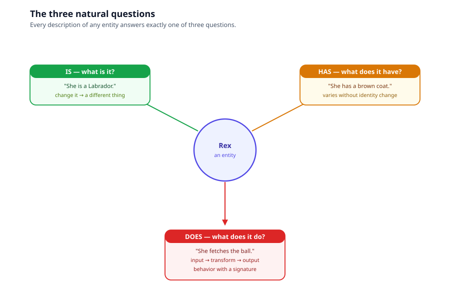
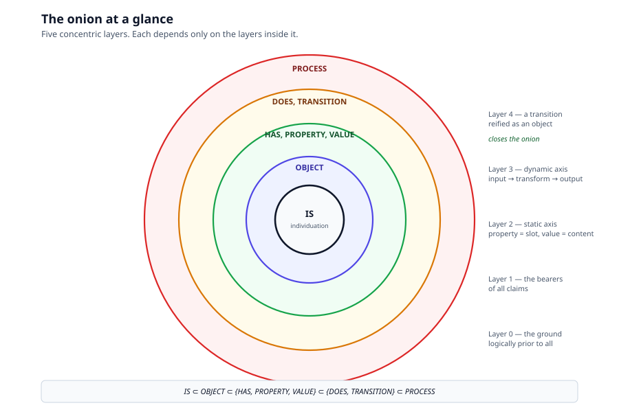
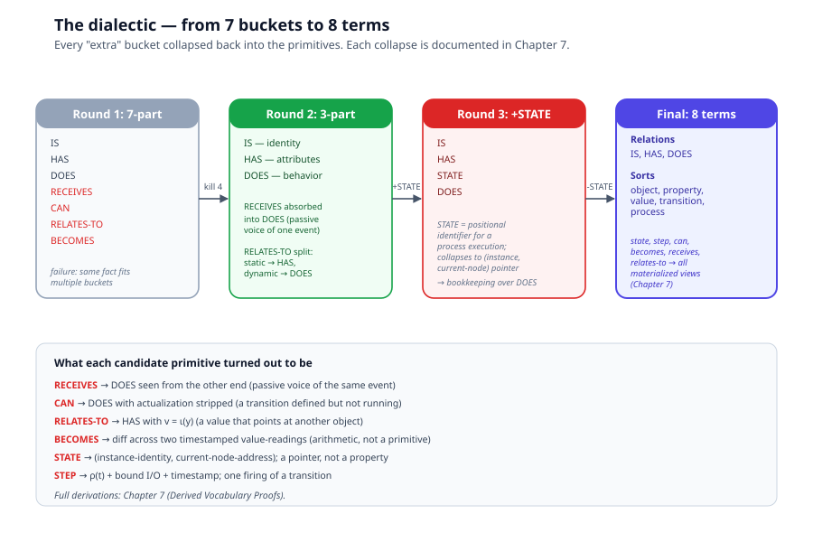

# Chapter 1 — Intuition

> *In this chapter:* the IS–HAS–DOES modelling system, without any
> math. We start with the three questions every description of anything
> must answer, walk through why every "fourth bucket" you might be
> tempted to add collapses back into three, and end with what the system
> promises — closure, completeness, extensibility — stated in plain
> language. The formal version of these arguments lives in
> [Chapter 4 (Proofs)](04-proofs.md); the rest of the volume builds on
> this chapter's intuitions.

---

## 1.1 The three natural questions

Imagine you are describing a dog. You can say any of these things:

- **She is a Labrador.** (She is a *kind* of thing.)
- **She has a brown coat.** (She *holds* a particular property.)
- **She fetches the ball.** (She *does* something — she transforms an
  input into an output.)

Three questions, three answers. Every description of every entity in
the world reduces to one of these three:



| Question | Level | Test |
|---|---|---|
| **IS** — what is it? | identity / kind | Change it and you have a *different thing*. |
| **HAS** — what does it have? | property / value | Can vary without changing identity. |
| **DOES** — what does it do? | behavior / process | Has inputs, a transformation, and outputs. |

These are not three buckets we picked for convenience. They are three
*levels of being* that any description must navigate. A door **is** a
door regardless of whether it is open or closed; whether it **has** a
red coat of paint doesn't change its identity; what it **does**
(swing on hinges, block a doorway) is a behavior that depends on its
structure but is not reducible to it.

The three questions cover everything you can truthfully say about a
door, a dog, a kettle, a country, an algorithm, a legal statute, a
running program.

---

## 1.2 The onion at a glance

The three questions are the surface. Below them, the system has five
layers, nested like an onion. Each layer depends only on the layers
inside it.



```
IS  ⊂  OBJECT  ⊂  {HAS, PROPERTY, VALUE}  ⊂  {DOES, TRANSITION}  ⊂  PROCESS
```

- **Layer 0 — IS.** Individuation: which thing we are talking about,
  and what counts as *the same thing* across time and change.
- **Layer 1 — OBJECT.** Anything IS can pick out (a dog, a door, a
  number, a kind, a program run).
- **Layer 2 — HAS, PROPERTY, VALUE.** The static axis. PROPERTY is
  the slot (color, mass, owner); VALUE is what fills it (red, 4 kg,
  Alice).
- **Layer 3 — DOES, TRANSITION.** The dynamic axis. A TRANSITION is a
  rule `input → transform → output`.
- **Layer 4 — PROCESS.** The bridge that folds the dynamic side back
  into the static side: a transition *reified as an object*, so it can
  bear IS and HAS facts like anything else.

The onion is not an accidental shape — its symmetry (three relations,
each with its nouns) is what lets us prove the system is closed and
complete. We will get to those proofs in [Chapter 4](04-proofs.md).

---

## 1.3 Why not more buckets? The dialectic

A natural objection: *surely* the world has more than three kinds of
fact. What about:

- **STATE** — a kettle is *currently boiling*
- **CAN** — a bird *can* fly (whether or not it is flying)
- **RECEIVES** — a door *is pushed* (someone else's action, viewed
  from the receiving end)
- **RELATES-TO** — a person *is part of* a team
- **BECOMES** — a caterpillar *becomes* a butterfly

These are intuitive categories. They feel like fourth, fifth, sixth
buckets. The honest question is: do they earn their place, or are they
re-packagings of the three primitives?



We walked through this carefully. Each candidate collapses:

- **STATE** collapses into HAS. "The kettle is currently at 100°C" is
  just a value (100°C) filling the temperature property at this
  moment. The fact that temperature changes fast doesn't make it a
  different *kind* of fact from a slow-changing property like mass.
- **CAN** collapses into DOES. "A bird can fly" is the same behavior
  as "a bird flies," just not currently actualized. Capability is
  behavior minus commitment to a particular execution.
- **RECEIVES** collapses into DOES seen from the other end. "The door
  is pushed" and "the wind pushes the door" describe the identical
  event; only the grammatical voice changed.
- **RELATES-TO** collapses into HAS with a reference value. "Alice is
  part of the team" is "Alice has a team-membership property whose
  value points at the team object."
- **BECOMES** collapses into a diff. "The door becomes closed" is
  nothing more than: at time *t₁* its state-property returned *open*;
  at time *t₂* it returned *closed*; we subtract the two readings and
  call the difference "became."

Every candidate primitive — STATE, CAN, RECEIVES, RELATES-TO,
BECOMES, STEP — turned out to be a *materialized view* of the three
primitives, kept around for convenience but owing nothing
ontologically. The full derivations are in
[Chapter 7 (Derived Vocabulary)](07-derived-vocabulary-proofs.md);
here we only need the conclusion.

---

## 1.4 What the system promises

Three promises, in plain language:

1. **Closure.** You cannot break the system by combining its parts.
   Compose two transitions, you get a transition. Reify a transition
   as an object, you get an object. Embed an object as a value, you
   get a value. No operation ever produces a ninth kind of thing. The
   list of primitives stops growing.

2. **Completeness.** Every claim you can make about an entity reduces
   to one of three forms — an identity claim, an attribution claim,
   or a transformation claim. Each of those forms has a primitive
   that catches it. So every claim the system can be asked to express
   *can* be expressed.

3. **Extensibility.** Adding new content (new kinds of object, new
   properties, new values, new transitions) never requires adding new
   primitives. You grow the system by enlarging its populations, not
   by adding to its vocabulary. New domains (legal metrology, software
   process, business workflow) all live inside the same eight terms.

These three promises are stated here as intuition.
[Chapter 4 (Proofs)](04-proofs.md) proves them as theorems, relative
to one philosophical axiom (the Claim-Form Axiom, see
[Chapter 2](02-claims-and-falsifiability.md)).

---

## 1.5 What this volume is and is not

**What it is:** the formal ground under everything else in this
documentation tree. Primmel (Volume I) is one language that
operationalizes this system. OIML SMART (Volumes II–III) is one
domain encoded in Primmel. The system itself is generic — it applies
to any modelling task, not just legal metrology.

**What it is not:**

- It is not a piece of pragmatics. You will not learn Primmel syntax
  here; that is Volume I.
- It is not a comparative survey. For how the system compares to OOP,
  UML, BPMN, EXPRESS, OPM, RDF/OWL, and Petri nets, see
  [Chapter 8 (Comparative Analysis)](08-comparative-analysis.md).
- It is not a closed set of opinions.
  [Chapter 11 (Open Questions)](11-open-questions.md) states what is
  *not* proven and where the system could be falsified.

---

## 1.6 How to read this volume

The volume is layered. Read what you need; stop when you've had
enough.

- **Novice track** — this chapter alone. You will walk away
  understanding what IS/HAS/DOES is, why it's three buckets and not
  seven, and what the system promises.
- **Professional track** — read through
  [Chapter 7 (Derived Vocabulary)](07-derived-vocabulary-proofs.md).
  You will be able to model with the system, argue for it, and
  recognize when something is being passed off as a new primitive
  that is actually a composite.
- **Expert track** — read the whole volume. You will be able to
  defend the system against methodological comparison, contribute to
  its extension, and locate the seams where it could break.

If a chapter ever seems to introduce a ninth modelling term, treat it
as a materialized view (Chapter 7) and check what composite it is
shorthand for.

---

*Next: [Chapter 2 — Claims and Falsifiability](02-claims-and-falsifiability.md):
what the system commits to, and what would refute it.*
