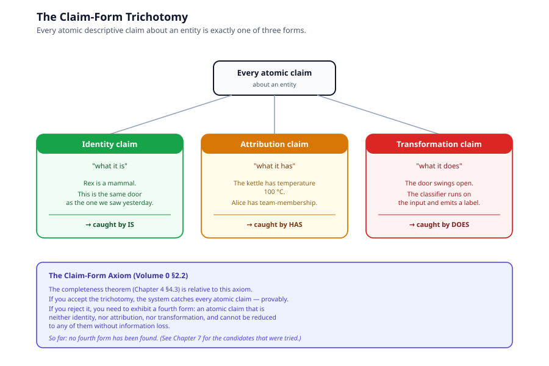
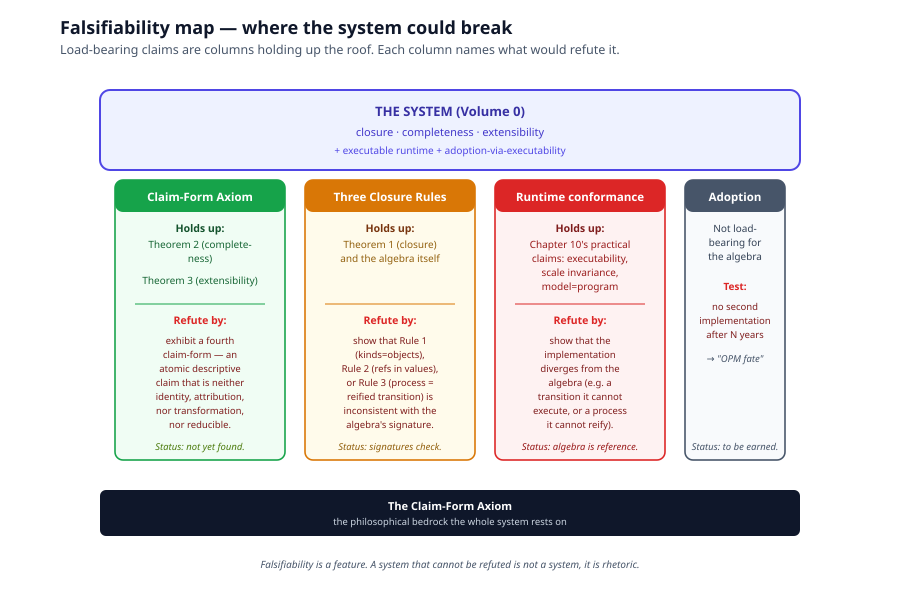

# Chapter 2, Claims and Falsifiability

> *In this chapter:* what the IS–HAS–DOES modelling system commits to,
> what it explicitly does not claim, and what would refute it. The
> honest on-ramp to the formal material, read this before
> [Chapter 4 (Proofs)](04-proofs.md), because the proofs are relative
> to one philosophical axiom that you should know you are accepting.

---

## 2.1 The kinds of claim

A modelling system can be sold as many things: a notation, a
convention, a philosophy, an aesthetic. The system in this volume is
sold as something stronger: a candidate universal *descriptive
algebra*, with closure, completeness, and extensibility theorems.

That is a load-bearing claim, and load-bearing claims deserve to be
stated in a way that can be falsified. Otherwise the system is just
language with aspirations. So this chapter sets out, plainly:

1. What the system asserts (the Claim-Form Axiom).
2. What the theorems do and do not prove, given the axiom.
3. What would refute the system, if anything.
4. What the system explicitly does not claim.

If you finish this chapter thinking "this is unfalsifiable," you have
caught a real problem and we have not done our work.

---

## 2.2 The Claim-Form Axiom

The completeness theorem (Chapter 4) depends on one philosophical
commitment. We name it upfront so it cannot hide inside a proof.

> **Claim-Form Axiom.** Every atomic descriptive claim about an
> entity is one of three forms:
>
> 1. an **identity claim**, what it is;
> 2. an **attribution claim**, what it has;
> 3. a **transformation claim**, what it does.

Three forms, three primitives: IS catches identity, HAS catches
attribution, DOES catches transformation. The map is one-to-one.

### Why this axiom is not arbitrary

The trichotomy is not a verbal convenience; it tracks a real
distinction in *what a claim does*. Identity claims individuate
(which thing we are talking about). Attribution claims ascribe
properties (what fills a slot on the thing). Transformation claims
describe behavior (what the thing does to inputs to produce outputs).

These are not three ways of saying the same thing. They are three
different *operations* a description can perform on the entity it
points at. If you doubt this, try restating each as one of the others
without losing information:

- "Rex is a mammal" → "Rex has mammal-hood"? You can rephrase, but you
  lose the kind-membership assertion and gain a property, the
  individuating work that IS was doing has to be re-encoded somewhere.
- "The kettle has temperature 100°C" → "The kettle is at-100°C"?
  Possible, but at the cost of inventing a kind ("at-100°C-things")
  for every value, which is not what we mean.
- "The door swings open" → "The door has a swings-open property"?
  Possible, but you lose the input-output structure of the behavior , 
  the wind pushes, the hinges rotate, the door moves. HAS doesn't
  carry that structure; DOES does.

The trichotomy earns its place by being the smallest set of claim
kinds that doesn't lose information when you move between them.

### Why we cannot prove the axiom

No finite vocabulary proves itself sufficient for all possible
discourse. This is a Gödel-style limit, not a flaw in the system. What
we *can* do is:

- state the axiom explicitly so it can be examined;
- show that every rival primitive proposed across the entire design
  dialogue (STATE, CAN, RECEIVES, RELATES-TO, BECOMES, STEP) reduces
  to one of the three forms (Chapter 7);
- show that any proposed fourth form would have to do descriptive work
  that IS/HAS/DOES cannot do, and watch for one to appear.

The empirical record so far: no fourth form has appeared. Every
candidate collapsed on inspection. A vocabulary that stops needing
patches has *probably* closed, but "probably" is the strongest claim
available.

---

## 2.3 What the theorems prove, and what they don't

The three theorems (Chapter 4) prove:

| Theorem | Claim | Caveat |
|---|---|---|
| **Closure** | The three operations (composition, reification, embedding) never produce a ninth sort. | Unconditional, this is a property of the algebra itself. |
| **Completeness** | Every atomic claim expressible under the Claim-Form Axiom has a primitive that catches it. | *Relative to the axiom.* If the axiom fails, the proof fails. |
| **Extensibility** | Adding content (new kinds, properties, values, transitions) never requires new primitives; any proposed ninth primitive is either redundant or violates the axiom. | *Relative to the axiom.* Same dependency. |

The phrase to remember: **completeness is axiom-relative**. We have
not proven the system can describe everything; we have proven that
*if* descriptive claims come in three forms, *then* the system catches
them all. That is the strongest honest claim available.

---

## 2.4 What would refute the system

Falsifiability is a feature, not a vulnerability. Here is the attack
surface:

1. **Find a genuine fourth claim-form.** An atomic descriptive claim
   about an entity that is neither identity, nor attribution, nor
   transformation, and that cannot be reduced to any of them
   without loss of information. This refutes Theorem 2's completeness
   and forces a ninth primitive.

2. **Show that one of the closure rules is inconsistent.** Closure
   Rule 1 (kinds are objects), Rule 2 (values hold references), or
   Rule 3 (process is reified transition). If any rule contradicts
   the algebra's other commitments, the closure proof collapses.

3. **Show that the runtime implementation diverges from the
   algebra.** The system's claims about executability, scale
   invariance, and reification (Chapter 10) are conditional on a
   conforming runtime. If the actual implementation contradicts the
   algebra, e.g., a transition that the runtime cannot execute, or
   a process instance the runtime cannot reify, the *practical*
   claims fall. (The algebra itself stands.)

4. **Show that the Claim-Form Axiom is not just unproven but
   incoherent.** If the trichotomy cannot be stated cleanly, e.g.,
   "transformation" turns out to depend on "attribution" in a way
   that makes the three forms not actually mutually exclusive, then
   the system's structural argument fails.

Anything else, "I don't find it useful," "I prefer UML," "the syntax
is ugly", is a preference, not a refutation.

---

## 2.5 What the system explicitly does not claim

For honesty, the things we are *not* claiming:

- **We do not claim decidability.** OWL's description logics have
  decidable reasoning; this system has no analogous result. Reasoning
  over an arbitrary model is not guaranteed to terminate.
- **We do not claim a tooling ecosystem.** The system is a candidate
  universal descriptive algebra, not a shipped product. Comparative
  adoption (vs SQL, RDF, BPMN) is discussed honestly in
  [Chapter 8](08-comparative-analysis.md); the foundation's adoption
  record is "to be earned."
- **We do not claim novelty for any individual primitive.** Object,
  property, value, transition, process, each has precedents in prior
  literature (Bunge–Wand–Weber ontology, RDF, π-calculus, OOP). The
  novelty is the *conjunction* under one closed algebra, with the
  type/instance split applied symmetrically across both axes.
- **We do not claim the runtime exists in finished form.** Primmel
  (Volume I) is a language that targets this algebra; the
  interchange format and runtime are described in the platform annex.
  Where the implementation falls short of the algebra, the algebra
  is the reference, not the implementation.
- **We do not claim the system is the only possible foundation.** It
  is one candidate. Others may exist; if one is closed, complete,
  and extensible in stronger senses than this one, we want to know.

---

## 2.6 How to read the rest of the volume

Now that the stakes are clear:

- [Chapter 3 (Eight Terms and Closure Rules)](03-eight-terms-and-closure-rules.md)
  defines the algebra 𝓜 and the three closure rules formally. This
  is the load-bearing technical content.
- [Chapter 4 (Proofs)](04-proofs.md) proves the three theorems
  relative to the Claim-Form Axiom.
- [Chapter 7 (Derived Vocabulary)](07-derived-vocabulary-proofs.md)
  shows the dialectical record: every rival primitive proposed, each
  one reduced to a composite.
- [Chapter 11 (Open Questions)](11-open-questions.md) returns to
  falsifiability, with the specific places the system could break.

If at any point you find yourself thinking "but what about X?", note
it, that is exactly the kind of pressure the system is designed to
be tested by. Either X collapses into a composite (and you will see
how), or X is a genuine fourth claim-form (and the system needs to
know).

---

*Next: [Chapter 3, The Eight Terms and Their Closure Rules](03-eight-terms-and-closure-rules.md):
the formal algebra 𝓜.*
