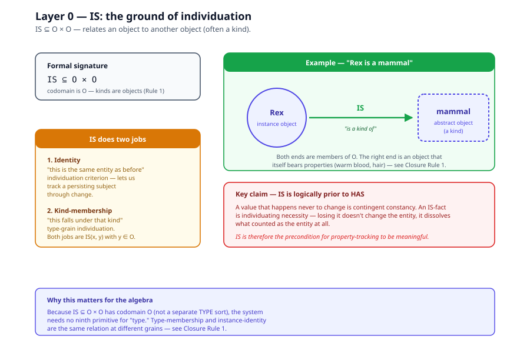
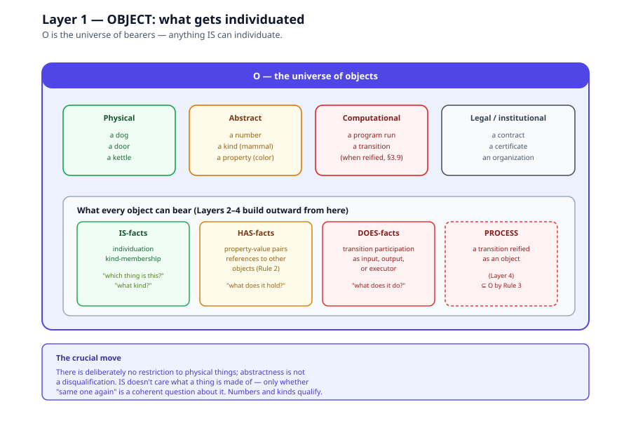
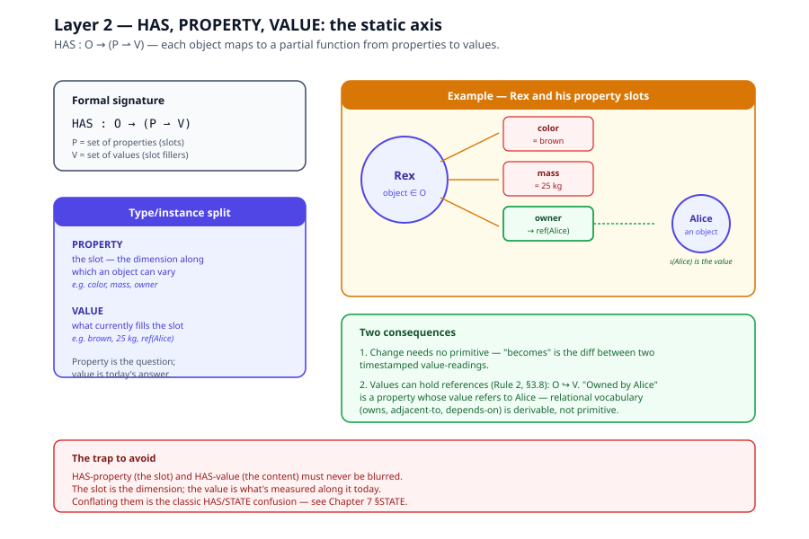
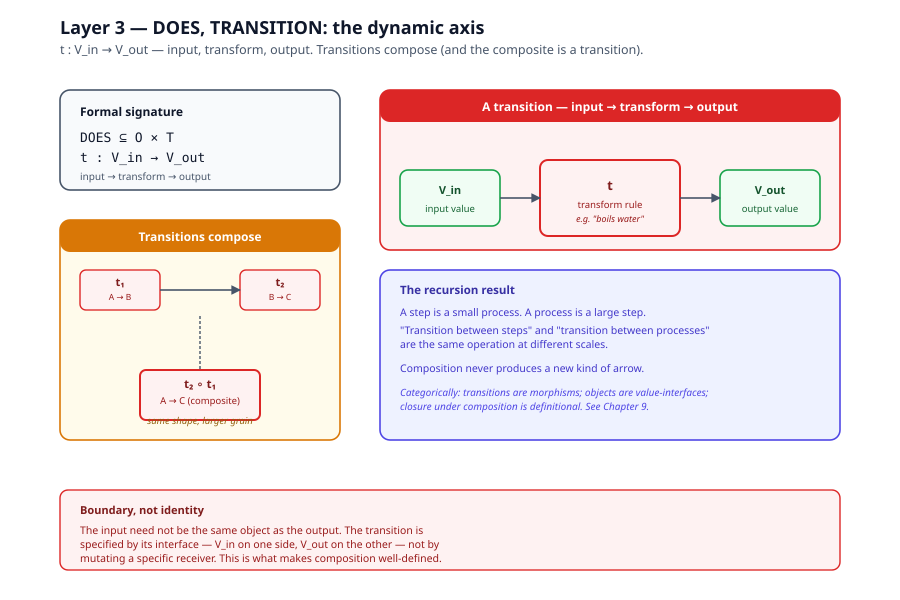
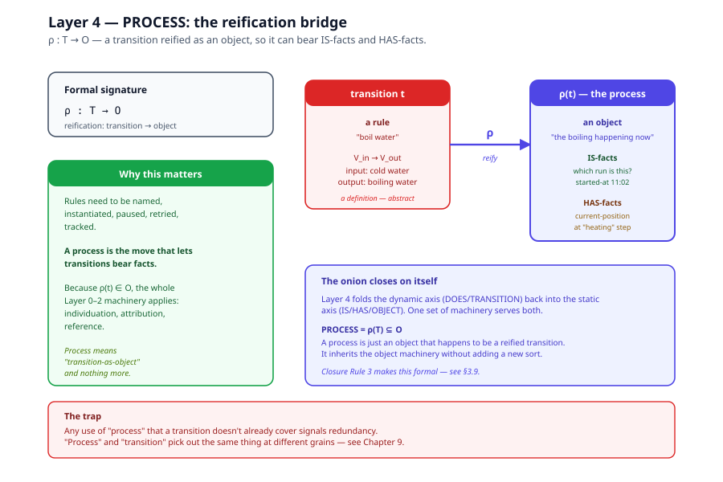
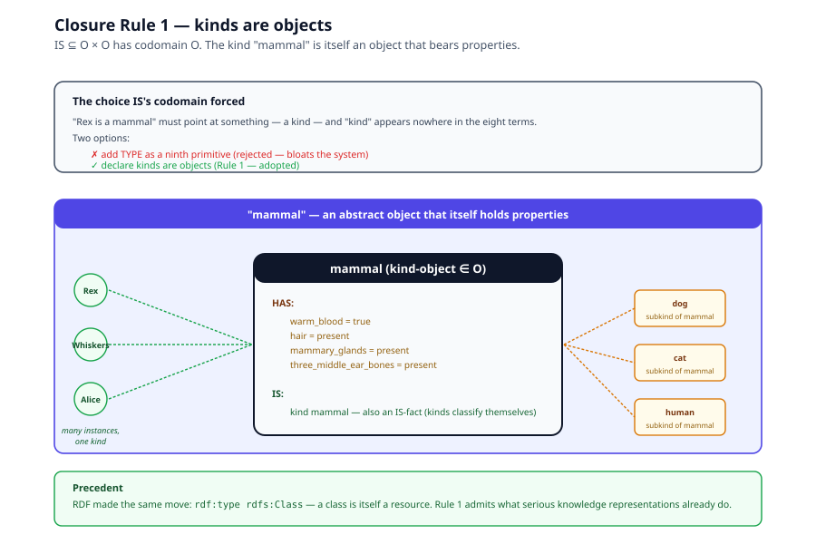
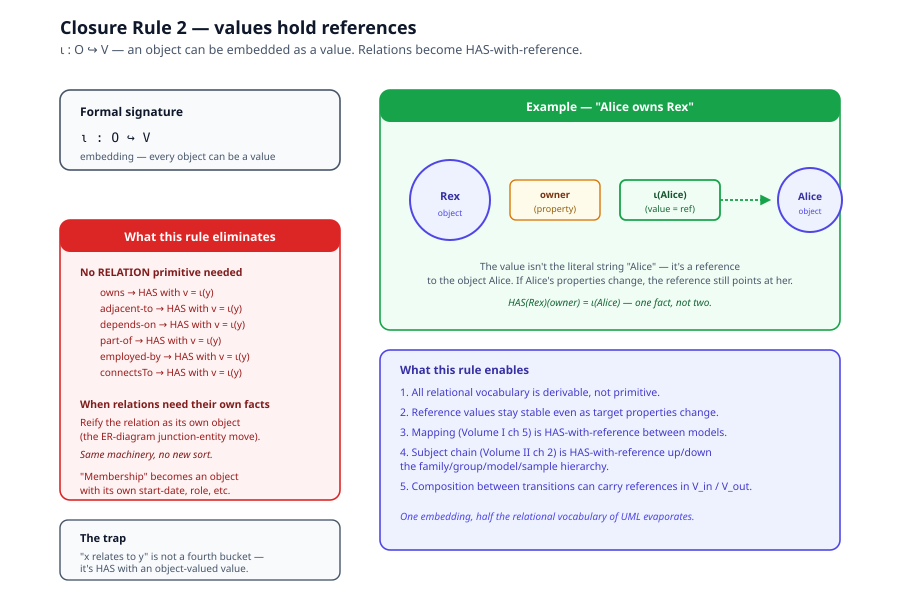
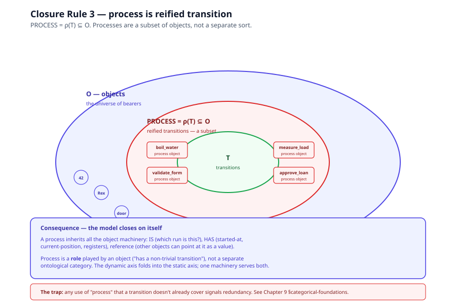

# Chapter 3 — The Eight Terms and Their Closure Rules

> *In this chapter:* the formal algebra 𝓜 that defines the IS–HAS–DOES
> modelling system. Eight terms (three relations, five sorts), arranged
> in five layers, sealed by three closure rules. Read this
> before [Chapter 4 (Proofs)](04-proofs.md) — the theorems reference
> every definition here. Math is in Unicode (no LaTeX rendering in
> Phase 1); [Chapter 4](04-proofs.md) is where the notation earns its
> keep.

---

## 3.1 The algebra at a glance

The system is the algebra

```text
𝓜  =  ⟨ O, P, V, T ;  IS, HAS, DOES ;  ∘, ρ, ι ⟩
```

Five **sorts** of thing:

| Sort | Meaning |
|---|---|
| `O` | objects — the bearers of all claims |
| `P` | properties — the slots along which objects can vary |
| `V` | values — what fills a property slot |
| `T` | transitions — input→transform→output rules |
| `PROCESS = ρ(T) ⊆ O` | reified transitions — transitions treated as objects |

Three **relations**:

```text
IS   ⊆  O × O              (individuation: "x is the same as y" / "x is a K")
HAS  :  O → (P ⇀ V)        (attribution: "x has value v along property p")
DOES ⊆  O × T              (dynamics: "x does transition t")
```

Three **operations**:

```text
∘  :  T × T ⇀ T            (composition: t₂ ∘ t₁ is a transition if interfaces match)
ρ  :  T → O                (reification: a transition becomes an object)
ι  :  O ↪ V                (embedding: an object can be a value)
```

Every claim the system can make is a truth-claim over these sorts,
using these relations. Every transformation the system can perform is
one of the three operations. There is nothing else.

The rest of this chapter unpacks each sort and relation layer by
layer, then states the three closure rules that seal the system.

---

## 3.2 Layer 0 — IS: the ground of individuation

Before you can say anything about a thing, you must be able to say
**which thing** you are talking about, and what counts as *the same
thing* across time and change. IS is that relation. It is not a
property among properties: it is the precondition for property-tracking
to be meaningful at all. You cannot record "this entity's temperature
at time 1 and time 2" unless something already tells you both readings
belong to *one* entity's timeline.

Formally:

```text
IS  ⊆  O × O
```



IS does two jobs:

- **Identity**: "this is the same entity as before" — the individuation
  criterion that lets us track a persisting subject through change.
- **Kind-membership**: "this entity falls under that kind" — *Rex is a
  mammal* relates the object Rex to the object *mammal*. (Closure
  Rule 1, §3.7, guarantees kinds live in `O`.)

Crucially, IS-facts are not zero-variance HAS-facts. A value that
happens never to change is *contingent constancy*; an IS-fact is
*individuating necessity* — losing it doesn't change the entity, it
dissolves what counted as the entity at all. IS is therefore logically
prior to everything outward of it.

---

## 3.3 Layer 1 — OBJECT: what gets individuated

An **object** is anything IS can individuate: a dog, a door, a number,
a kind, a specific run of a program. Objects are the bearers — the
things all other claims attach to.



There is deliberately no restriction to physical things; abstractness
is not a disqualification. IS doesn't care what a thing is made of,
only whether "same one again" is a coherent question about it. A
number is an object. A kind is an object (by Rule 1, §3.7). A program
run is an object (by Rule 3, §3.9). Everything outward from Layer 1
is either a claim *about* members of `O`, or something *foldable into*
`O`.

---

## 3.4 Layer 2 — HAS, PROPERTY, VALUE: the static axis

Objects hold things. HAS is the attribution relation, and it comes
with a type/instance split that must never be blurred:

- a **property** is the *slot* — the dimension along which an object
  can vary (color, mass, owner);
- a **value** is what currently *fills* the slot (red, 4 kg, Alice).

Property is the question; value is today's answer.

Formally, with `P` the set of properties and `V` the set of values:

```text
HAS  :  O → (P ⇀ V)
```

Each object maps to a partial function from properties to values.
Two consequences:

1. *Change* needs no primitive. "Becomes" is merely a difference
   between two value-readings indexed by time, and time itself is just
   a value attached via HAS.
2. Values may contain references to objects (Closure Rule 2, §3.8):
   `O ↪ V`. A value can be a pointer, not just raw data.



---

## 3.5 Layer 3 — DOES, TRANSITION: the dynamic axis

Objects act. DOES is the dynamic relation, and its noun is the
**transition**: a rule of the form

```text
t  :  V_in  →  V_out
```

**input, transform, output** — nothing more. Input and output are the
transition's boundary interface: they are what makes it a *function*
rather than a label, and they are where one entity's doing touches
another entity's holdings. The input need not be the same object as
the output; only the interface must be declared.



Transitions compose. If `t₁ : A → B` and `t₂ : B → C`, then

```text
t₂ ∘ t₁  :  A  →  C
```

and the composite is *itself a transition* — same shape, larger grain.
This is the recursion result: a step is a small process, a process is
a large step, and "transition between steps" and "transition between
processes" are one operation applied at different scales. Composition
never produces a new kind of arrow.

In categorical terms (developed in
[Chapter 9](09-categorical-foundations.md)), transitions form the
morphisms of a category whose objects are value-interfaces; closure
under composition is definitional.

---

## 3.6 Layer 4 — PROCESS: the reification bridge

A transition is a rule; but rules need to be named, instantiated,
paused, retried, and tracked — that is, they need to bear IS-facts
and HAS-facts. A **process** is exactly that move: a transition
reified as an object.

```text
ρ  :  T  →  O
```



The reification map `ρ` takes a transition and returns an object that
*represents* it, so the whole Layer 0–2 machinery applies to it: a
process has an identity (which run is this?), has properties
(started-at, current-position), has values filling them. Process means
*transition-as-object* and nothing more; any use of "process" that a
transition doesn't already cover signals redundancy.

This layer closes the model back on itself: the dynamic axis folds
into the static one, so one set of machinery serves both.

---

## 3.7 Closure Rule 1 — kinds are objects

The first seal. IS needs a codomain: "is a mammal" has to point at
something — a kind — and "kind" appears nowhere in the eight-term
list. We had two choices: add TYPE as a ninth primitive, or declare
that kinds are themselves objects (abstract ones). We chose the
latter.

```text
IS  ⊆  O × O       (codomain is O, not a separate TYPE sort)
```



This is how every serious knowledge representation already works — a
class is itself a resource you can make claims about (RDF made this
move with `rdf:type rdfs:Class`). Kinds have properties (mammals *have*
warm blood as a defining property), which means they were already
behaving like objects; the closure rule just admits it.

**Consequence.** Type-membership ("x is a K") and instance-identity
("x is the same entity as y") are both `IS(x, y)` with `y ∈ O`, just
at different grains. No ninth primitive is needed.

---

## 3.8 Closure Rule 2 — values hold references

The second seal. A value does not have to be raw data; it can be a
reference to another object.

```text
ι  :  O ↪ V        (every object can be embedded as a value)
```



This single embedding is what makes all relational vocabulary
(owns, adjacent-to, depends-on, part-of, employed-by) derivable
rather than primitive. "Owned by Alice" is a property whose value
refers to the object Alice. "Part of the team" is a property whose
value refers to the team object.

**Consequence.** No separate `RELATION` primitive is needed. Every
relation between objects is expressible as a property whose value
happens to be an object-reference. We do not need to reify the
relation as its own sort unless the relation itself needs to bear
further properties — at which point we reify it as an object, which
is the same move ER diagrams make with junction entities.

---

## 3.9 Closure Rule 3 — process is reified transition

The third seal. "Process" must not mean anything a transition doesn't
already cover, or it is a redundant ninth sort.

```text
PROCESS  =  ρ(T)  ⊆  O        (processes are a subset of objects)
```



A process is just a transition that has been pushed through the
reification map `ρ`. It inherits all the object machinery (IS, HAS)
without adding any new sort.

**Consequence.** The dynamic axis (Layer 3) folds cleanly into the
static axis (Layers 0–2). One set of machinery — IS, HAS, OBJECT,
PROPERTY, VALUE — serves both. Process is a role played by an object,
not a separate ontological category.

---

## 3.10 The algebra restated

With all three closure rules in place, the full system is:

```text
𝓜  =  ⟨ O, P, V, T ;  IS, HAS, DOES ;  ∘, ρ, ι ⟩
```

- **Sorts:** `O` objects, `P` properties, `V` values (with `O ↪ V`),
  `T` transitions, `PROCESS = ρ(T) ⊆ O`.
- **Relations:** `IS ⊆ O × O`, `HAS : O → (P ⇀ V)`, `DOES ⊆ O × T`.
- **Operations:** `∘ : T × T ⇀ T` (composition), `ρ : T → O`
  (reification), `ι : O ↪ V` (embedding).

Three operations, three relations, five sorts (one of which is a
derived subset). Nothing else. Every operation's codomain is one of
the four base sorts; no operation ever produces a ninth kind of thing.

That last claim is Theorem 1, and we prove it in
[Chapter 4](04-proofs.md).

---

## 3.11 Where each term shows up downstream

This algebra is not just a museum piece. Every term earns its keep
elsewhere in the documentation tree:

- **IS, OBJECT** → Volume I chapter 2 §2.3 (the IS aspect catalog:
  metadata, provenance, structure, design parameters, designed
  conditions, promises, artifact definitions).
- **HAS, PROPERTY, VALUE** → Volume I chapter 2 §2.4 (the HAS aspect
  catalog: attributes, dimensions, state, characteristics,
  environmental context, artifact instances).
- **DOES, TRANSITION** → Volume I chapter 4 (processes as recursive
  subjects; the step vocabulary; executors).
- **PROCESS** → Volume I chapter 4 §4.1 (a behavior is a Process;
  the recursion that keeps the language small).
- **Closure Rule 1** → Volume II chapter 2 (the subject chain:
  Family → Group → Model → Sample as four grains of kind-membership).
- **Closure Rule 2** → Volume I chapter 5 §5.6 (mapping as HAS with
  object-reference values).
- **Closure Rule 3** → Volume I chapter 14 (live twins: a served
  process instance is a reified transition, queryable by HAS).

If a chapter ever seems to introduce a ninth modelling term, treat it
as a materialized view (Chapter 7) and check what composite it is
shorthand for.

---

*Next: [Chapter 4 — Proofs](04-proofs.md): the three theorems
(closure, completeness, extensibility) in full rigor.*
