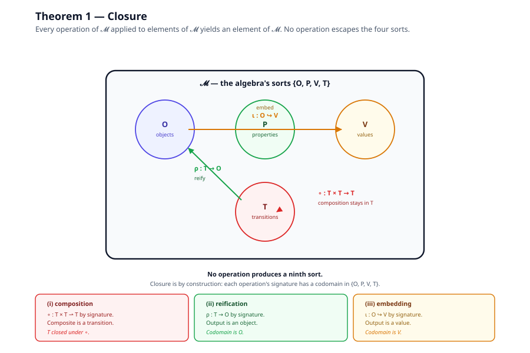
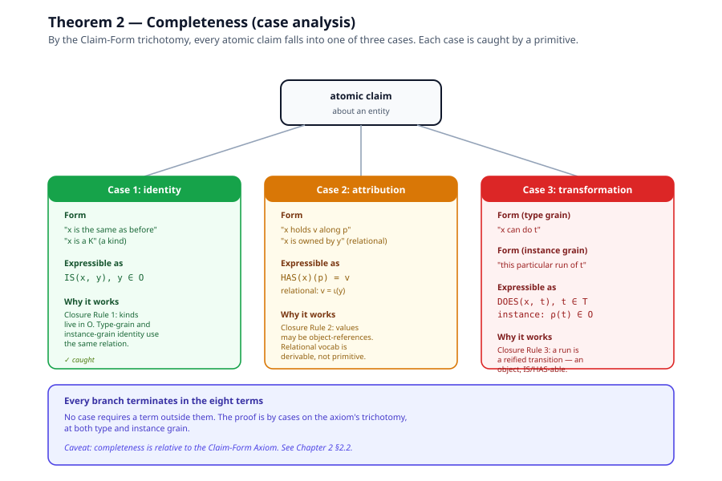
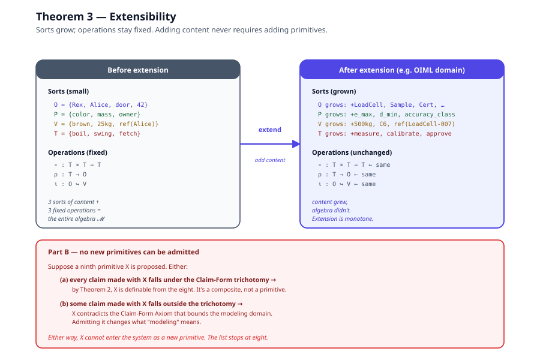

# Chapter 4, Proofs

> *In this chapter:* the three theorems that make the IS–HAS–DOES
> modelling system a candidate universal descriptive algebra:
> **closure** (no operation escapes the four sorts), **completeness**
> (every claim-form expressible under the Claim-Form Axiom has a
> primitive that catches it), **extensibility** (new content never
> requires new primitives). Each is stated as a theorem and proved.
> Read [Chapter 2 (Claims and Falsifiability)](02-claims-and-falsifiability.md)
> first, the completeness and extensibility proofs depend on the
> Claim-Form Axiom stated there.

---

## 4.1 What is being proved

Three properties, each stated precisely:

| Property | Informal claim |
|---|---|
| **Closure** | Every operation of 𝓜 applied to elements of 𝓜 yields an element of 𝓜. |
| **Completeness** | Under the Claim-Form Axiom, every atomic claim is expressible in 𝓜. |
| **Extensibility** | 𝓜 extends conservatively: new content is absorbed without new primitives; any proposed new primitive is either redundant or violates the axiom. |

Closure is unconditional, it is a property of the algebra itself.
Completeness and extensibility are *relative to the Claim-Form Axiom*.
That relativization is not a weakness; it is the strongest honest
claim available (see §4.5 below and
[Chapter 2 §2.2–2.3](02-claims-and-falsifiability.md)).

---

## 4.2 Theorem 1, Closure

> **Claim.** Every operation of 𝓜 applied to elements of 𝓜 yields an
> element of 𝓜.

> **Proof.** There are exactly three operations; check each.
>
> **(i) Composition.** `∘` has signature `T × T ⇀ T`. Given two
> transitions `t₁, t₂ ∈ T` with compatible interfaces, the composite
> `t₂ ∘ t₁ ∈ T` is a transition by the operation's signature. So `T`
> is closed under `∘`.
>
> **(ii) Reification.** `ρ` has signature `T → O`. Given a transition
> `t ∈ T`, the reification `ρ(t) ∈ O` is an object by the operation's
> signature. The output is a sort of 𝓜.
>
> **(iii) Embedding.** `ι` has signature `O ↪ V`. Given an object
> `o ∈ O`, the embedding `ι(o) ∈ V` is a value by the operation's
> signature. The output is a sort of 𝓜.
>
> The relations (`IS`, `HAS`, `DOES`) produce truth-claims over
> existing sorts and generate no new entities. No operation has a
> codomain outside `{O, P, V, T}`. Hence no use of the system ever
> manufactures a ninth sort. ∎

The proof is short because the closure is by construction: each
operation's *signature* says what it produces, and each signature's
codomain is one of the four base sorts. Closure is the absence of
escape hatches in the signature.

---

## 4.3 Theorem 2, Completeness

> **Claim-Form Axiom** (restated from Chapter 2 §2.2). Every atomic
> descriptive claim about an entity is one of three forms: an identity
> claim (what it is), an attribution claim (what it holds), or a
> transformation claim (what it does).

> **Claim.** Under the axiom, every atomic claim is expressible in 𝓜.
>
> **Proof.** By cases on the axiom's trichotomy, at both type and
> instance grain.
>
> **Case 1, Identity claims.** "x is the same as before" and "x is a
> K" are both `IS(x, y)` with `y ∈ O`. Closure Rule 1 (§3.7)
> guarantees that kinds live in `O`, so type-level identity is caught
> by the same relation that catches instance-level identity.
>
> **Case 2, Attribution claims.** "x holds value v along property p"
> is `HAS(x)(p) = v`. Relational attributions ("x is owned by y") are
> the case `v = ι(y)` by Closure Rule 2 (§3.8), the value carries an
> object-reference rather than raw data. Either way, HAS catches the
> claim.
>
> **Case 3, Transformation claims.**
>
> - *At type grain:* "x can do t" is `DOES(x, t)` with `t ∈ T`.
> - *At instance grain:* "this particular run of t" is `ρ(t) ∈ O` by
>   Closure Rule 3 (§3.9), the run is a reified transition, which is
>   an object, individuated by IS and described by HAS like any
>   object.
>
> Every branch of the case analysis terminates in the eight terms;
> no branch requires a term outside them. ∎

### Empirical corroboration

The proof is structural, but it is backed by an empirical record.
Across the entire design dialogue (reconstructed in
[Chapter 7](07-derived-vocabulary-proofs.md)), every candidate
primitive proposed and examined, STATE, STEP, CAN, RECEIVES,
RELATES-TO, BECOMES, TYPE, TIME, reconstructed as a composite of the
eight. A vocabulary that stops needing patches has probably closed;
"probably" is the strongest claim available, given the Gödel-style
limit on self-certification.

---

## 4.4 Theorem 3, Extensibility

> **Claim.** 𝓜 extends conservatively: any new domain content is
> absorbed without new primitives, and any proposed new primitive is
> either redundant or violates the Claim-Form Axiom.

> **Proof.**
>
> ***Part A, Conservative growth.*** Extension means enlarging the
> sorts: new kinds and instances enter `O`, new dimensions enter `P`,
> new data enter `V`, new rules enter `T`. The operations `∘, ρ, ι`
> and the relations `IS, HAS, DOES` are defined *schematically* over
> the sorts, they don't enumerate members, they prescribe shape. So
> enlarging a sort changes no definition and invalidates no prior
> claim. Extension is monotone: every theorem that held before the
> extension still holds after.
>
> ***Part B, No new primitives.*** Suppose a ninth primitive `X` is
> proposed. Either:
>
> - **(a)** Every claim made with `X` falls under the Claim-Form
>   trichotomy (identity, attribution, transformation). Then by
>   Theorem 2, `X` is definable from the eight primitives and is a
>   *composite*, not a primitive. Adding it as a primitive would be
>   redundant.
>
> - **(b)** Some claim made with `X` falls outside the trichotomy.
>   Then `X` is making a descriptive claim of a kind the Claim-Form
>   Axiom says does not exist, which contradicts the axiom that
>   bounds the modeling domain. `X` is inadmissible as a primitive
>   because admitting it would change what "modeling" means.
>
> Either way, `X` cannot enter the system as a new primitive. ∎

### What extensibility buys in practice

Because the algebra is schematic over its sorts, a new domain (legal
metrology, business process, software build pipelines) enters the
system by populating `O`, `P`, `V`, `T` with domain content, not by
adding to the algebra. Primmel (Volume I) is one such population; the
OIML metamodel (Volume II) is a further specialization of that
population; an OIML Recommendation (Volume III) is an instance-level
enrichment. The algebra never changes; the content grows.

This is the property that lets the documentation tree claim "the
generic basis for Primmel" without overreach: Primmel is one domain
encoding; the algebra accepts any number of others.

---

## 4.5 What the theorems do not prove

For honesty (see [Chapter 2](02-claims-and-falsifiability.md)):

- **Closure** is unconditional, but it is closure *of the algebra* , 
  it says nothing about whether a runtime that implements the algebra
  is itself closed under those operations. A buggy runtime can
  violate closure in practice while the algebra stands.
- **Completeness** is relative to the Claim-Form Axiom. If you reject
  the axiom, the proof falls. We argue (Chapter 2 §2.2) that the
  axiom is well-motivated, but we cannot prove it.
- **Extensibility** is monotonicity of the algebra under sort
  enlargement. It does not say the runtime accepts arbitrary new
  content at runtime; that is a separate claim about the
  implementation, treated in [Chapter 10](10-executable-ground.md).
- **No decidability result.** Reasoning over an arbitrary model is
  not guaranteed to terminate. OWL's description logics have
  decidability proofs this system lacks (see
  [Chapter 8 §RDF/OWL](08-comparative-analysis.md)).

The honest summary: the algebra is closed, complete (relative to a
stated axiom), and extensible. It is not decidability-complete, not
shipped, and not the only possible foundation. The next chapter that
matters is [Chapter 7 (Derived Vocabulary)](07-derived-vocabulary-proofs.md),
which shows the dialectical record of rival primitives being reduced
to composites, the empirical backing for Theorem 2.

---

*Next: [Chapter 5, Kernel/Surface Architecture](05-kernel-surface-architecture.md):
the deeper result that all eight primitives desugar to a kernel with
only entities, transitions, and composition.*
