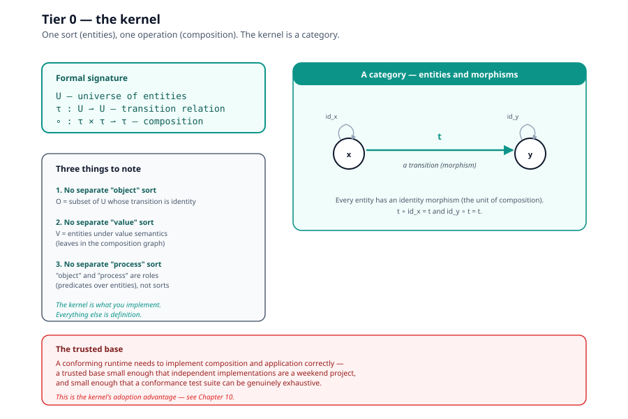
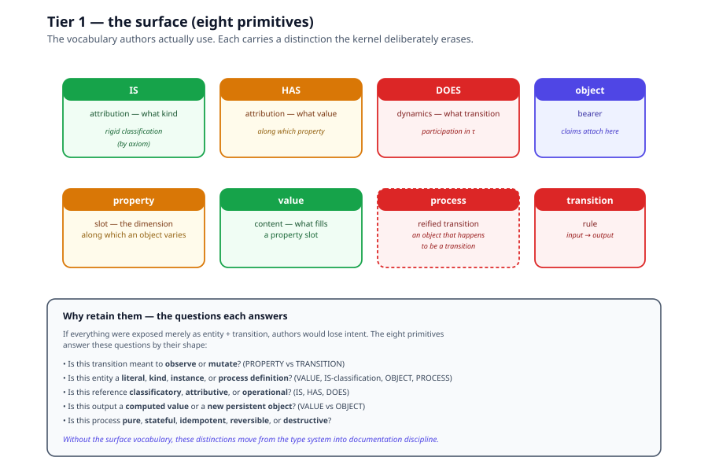
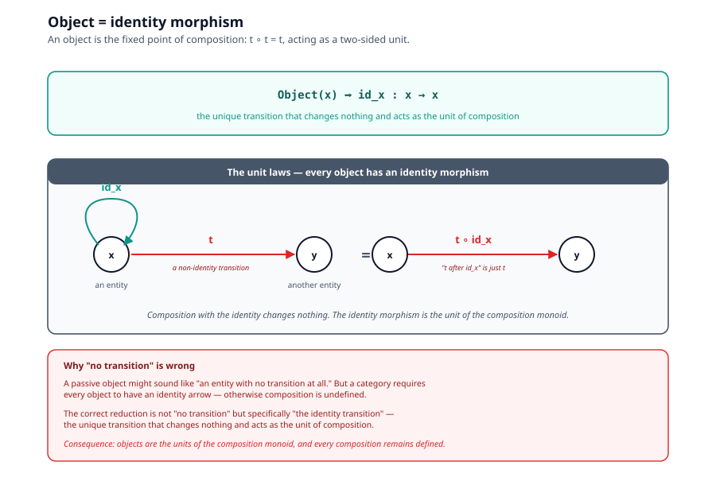
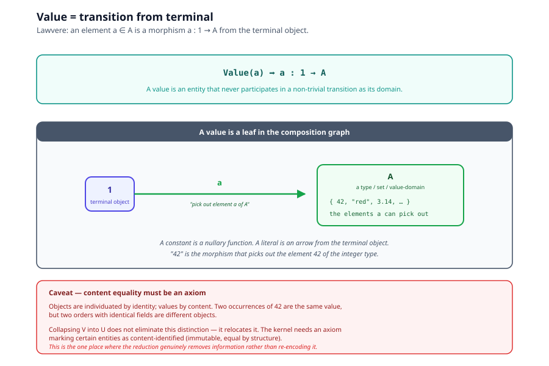
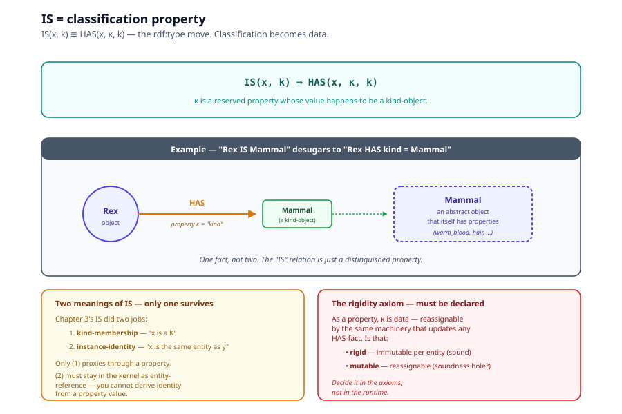
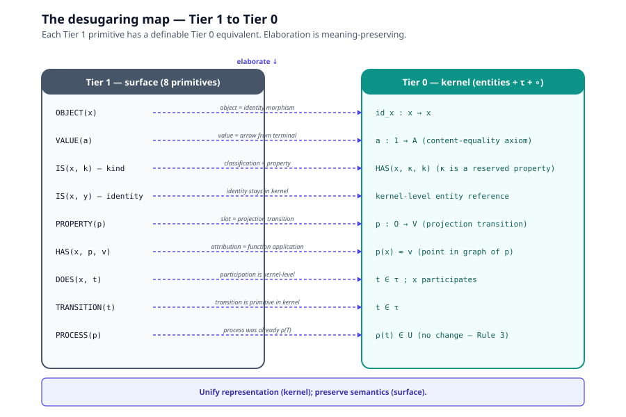

# Chapter 5, Kernel/Surface Architecture

> *In this chapter:* the deeper result that the eight primitives of
> [Chapter 3](03-eight-terms-and-closure-rules.md) are not
> irreducible. They desugar to a **Tier 0 kernel** with only entities,
> transitions, and composition, a category in the mathematical sense.
> The eight primitives remain useful as a **Tier 1 surface vocabulary**
> that elaborates into the kernel. This two-tier architecture is the
> same one SysML v2 / KerML arrived at independently
> (see [Chapter 8](08-comparative-analysis.md)); the foundation is
> operational where KerML is declarative.

---

## 5.1 The two-tier architecture

Chapter 3 proved the eight-term system is closed, complete, and
extensible. So why go deeper?

Because the eight terms are not equally fundamental. Three of them
(OBJECT, VALUE, IS) are *special shapes* that the other five already
produce on their own. Pushing the reductions through yields a kernel
with one sort (entities) and one operation (composition of transitions)
,  a category. The eight-term surface then becomes syntactic sugar
that elaborates into the kernel without residue.

This is the same move mathematics made when category theorists invented
the arrows-only formulation: objects are not a separate sort, they are
identity morphisms. The reduction is mathematically equivalent,
strictly smaller in primitive count, and practically unused in daily
work, because human reasoning wants to say "this is an object" and
"this is a map" as different thoughts, even when the math doesn't
require the distinction.

The right architecture is therefore two-tier: a small kernel that
*proves* closure, completeness, and extensibility once, and a richer
surface that *carries* the distinctions human authors rely on.
Elaboration is the formal seam between them.

---

## 5.2 Tier 0, the kernel

The kernel has one sort and one operation:

```text
U                    — a universe of individuated entities
τ : U ⇀ U           — a (partial) transition relation
∘  : τ × τ ⇀ τ      — composition (when interfaces match)
```



That is the whole kernel. Three things to note:

1. **No separate "object" sort.** What Chapter 3 called `O` is just the
   subset of `U` whose transition is the identity (see §5.4).
2. **No separate "value" sort.** What Chapter 3 called `V` is just
   entities interpreted under value semantics, leaves in the
   composition graph (see §5.5).
3. **No separate "process" sort.** What Chapter 3 called `T` and
   `PROCESS` are roles played by entities ("has a non-trivial
   transition" vs "has the identity transition").

The kernel is a **category**: entities are objects, transitions are
morphisms, composition is categorical composition, and identity
morphisms exist for every entity by definition (see
[Chapter 9](09-categorical-foundations.md)).

---

## 5.3 Tier 1, the surface (the eight primitives)

The eight primitives of Chapter 3 are the surface vocabulary authors
actually use:



| Primitive | Surface role |
|---|---|
| `IS` | attribution, what kind |
| `HAS` | attribution, what value along which property |
| `DOES` | dynamics, what transition |
| `object` | bearer, the thing claims attach to |
| `property` | slot, the dimension along which an object varies |
| `value` | content, what fills a property slot |
| `process` | reified transition, a transition treated as an object |
| `transition` | rule, input → transform → output |

These are not redundant; each carries a distinction the kernel
deliberately erases (identity vs. content equality, rigid vs. mutable
classification, bearer vs. borne). Authors write in Tier 1; the
compiler lowers to Tier 0.

---

## 5.4 Object as identity morphism

The first reduction. Chapter 3 treated OBJECT as a sort. The kernel
identifies it with the **identity morphism** on the entity:

```text
Object(x)  ⟹  id_x  :  x → x         (where id_x ∘ id_x = id_x)
```



This is the standard arrows-only formulation of category theory. An
"object" is whatever morphism acts as a two-sided unit for
composition: `t ∘ id = t` and `id ∘ t = t` for every transition `t`
that touches it.

**Why "no transition" is wrong.** You might think a passive object is
an entity with no transition at all. But a category requires every
object to have an identity arrow, otherwise composition is undefined.
The correct reduction is not "no transition" but specifically "the
identity transition", the unique transition that changes nothing and
acts as the unit of composition.

**What this buys.** Objects no longer need a separate sort. They are
the fixed points of composition. Every categorical theorem about
identity morphisms applies.

---

## 5.5 Value as transition from terminal

The second reduction. Chapter 3 treated VALUE as a sort `V` with an
embedding `ι : O ↪ V`. The kernel identifies a value with a transition
from the terminal object:

```text
Value(a)  ⟹  a  :  1 → A          (where 1 is the terminal object)
```



This is Lawvere's treatment of elements as arrows from a terminal
object, standard category theory.

**A value is an entity that never participates in a non-trivial
transition as its domain.** It's a leaf in the composition graph
rather than a hub. Constants are nullary functions; literals are
arrows from 1.

**Caveat, content equality.** Objects are individuated by identity;
values by content. Two occurrences of `42` are the same value, but two
orders with identical fields are different objects. Collapsing `V`
into `O` does not eliminate this distinction, it relocates it. The
kernel needs an axiom marking certain entities as content-identified
(immutable, equal by structure). This is the one place where the
reduction genuinely removes information rather than re-encoding it.

---

## 5.6 IS as classification property

The third reduction. Chapter 3 treated IS as a primitive relation
`IS ⊆ O × O`. The kernel replaces it with a distinguished property:

```text
IS(x, k)  ⟹  HAS(x, κ, k)         (where κ is a reserved property)
```



This is the RDF move: `rdf:type` is not structural machinery, it is
an ordinary predicate that happens to be distinguished by convention.
Classification becomes data.

**Two meanings of IS, only one survives the reduction.** Chapter 3's
IS did two jobs: identity (which entity is this?) and kind-membership
(what kind?). Only the second proxies through a property. The first ,
individuation, must remain in the kernel as entity-reference. You
cannot derive identity from a property value without presupposing the
very identity you're trying to derive.

**The rigidity axiom.** As a property, `κ` is data, reassignable by
the same machinery that updates any HAS-fact. That is either a feature
(dynamic reclassification, which OO handles badly) or a soundness hole
(a transition typed against kind `k` executing on something no longer
of kind `k`). The reduction forces you to declare whether `κ` is
**rigid** (immutable per entity) or **mutable** (reassignable). Decide
it in the axioms, not in the runtime.

---

## 5.7 PROPERTY as projection transition

The fourth reduction (going one step further than Chapter 3 stated
explicitly). A property `p` can be read as an accessor transition:

```text
p  :  O → V           (the function that takes a bearer to its value)
```

So `car HAS color = red` becomes `color(car) = red`, applying the
`color` transition to the `car` entity yields the `red` entity.

This creates a deep symmetry: **reading a property is executing a
transition.** A stored property is a lookup transition; a computed
property is an ordinary calculation. Both share the same interface.

But properties may need relational semantics, not every property is
a total, single-valued function. The general form is:

```text
p  :  U → P(U)         (a transition into the powerset — multivalued)
```

A functional property is the constrained special case `|p(x)| ≤ 1` for
all x.

---

## 5.8 The desugaring map (full)

Putting all four reductions together, each Tier 1 primitive has a
definable Tier 0 equivalent:

| Tier 1 (surface) | Tier 0 (kernel) |
|---|---|
| `OBJECT(x)` | `id_x : x → x` |
| `VALUE(a)` | `a : 1 → A` (with content-identity axiom) |
| `IS(x, k)` (kind-membership) | `HAS(x, κ, k)` |
| `IS(x, y)` (instance identity) | kernel-level entity reference |
| `PROPERTY(p)` | projection transition `p : O → V` |
| `HAS(x, p, v)` | `p(x) = v` (a point in the graph of p) |
| `DOES(x, t)` | `t` is a transition in the kernel; x participates |
| `TRANSITION(t)` | `t ∈ τ` |
| `PROCESS(p)` | `ρ(t) ∈ U` (already Rule 3, no change) |



The kernel is strictly smaller (one sort, one operation) while the
surface retains all eight primitives. The seam between them is
elaboration (Tier 1 → Tier 0) and resugaring (Tier 0 → Tier 1).
[Chapter 6](06-algorithms.md) treats both as first-class algorithms.

---

## 5.9 Three hidden costs (resolved explicitly)

The reduction is sound and well-precedented, but it forces three
decisions the eight-term formulation left implicit. State them in the
axioms, not in the runtime.

### Value identity

Objects are individuated by identity; values by content. The kernel
needs an axiom marking certain entities as content-identified
(immutable, equal by structure). Without it, two `42`s could be
different entities, which contradicts what "value" means.

### Rigidity of kind

If `κ` (the classification property) is mutable, a running model could
reclassify itself mid-execution. Declare whether `κ` is rigid
(immutable per entity, sound but inflexible) or mutable (flexible
but a potential soundness hole). The eight-term formulation decided
this silently by making IS structural.

### Circularity of the mutual embedding

Chapter 3 had two embeddings running in opposite directions:
`ρ : T → O` (reification) and `ι : O ↪ V` (embedding). With OBJECT
and VALUE collapsed into `U`, these embeddings dissolve, there is
one sort, and "object" and "process" are *roles* (predicates over
entities: "has identity transition only" vs "has non-trivial
transition"), not categories requiring maps between them. The `ρ` map
becomes trivial: it was only needed because the sorts were separate.

---

## 5.10 Why retain the eight primitives

Reduction at the kernel level does not imply reduction at the human
level. If everything were exposed merely as an entity and a transition,
authors would lose important intent:

- Is this transition meant to **observe** or **mutate**?
- Is this entity a **literal**, **kind**, **instance**, or **process
  definition**?
- Is this reference **classificatory**, **attributive**, or
  **operational**?
- Is this output a **computed value** or a **new persistent object**?
- Is this process **pure**, **stateful**, **idempotent**,
  **reversible**, or **destructive**?

The eight primitives answer these questions by their *shape*, saving
authors from re-stating them in comments. They are **derived but
valuable abstractions**, like variables and classes in a language that
compiles to a tiny instruction set.

---

## 5.11 The right principle

> **Unify representation; preserve semantics.**
>
> Not: because two things can be represented alike, they mean the same
> thing.

The kernel unifies representation (one sort, one operation). The
surface preserves semantics (eight primitives carrying distinctions
authors rely on). Elaboration is meaning-preserving. The runtime
executes only the kernel; the interchange format can be defined at
either level (kernel for minimality, surface for readability, or both
with elaboration as the bridge).

---

## 5.12 What this changes about Chapters 3 and 4

The eight-term algebra 𝓜 (Chapter 3) and its three theorems (Chapter
4) are still valid, but they are now **surface-level** results.
They hold because the kernel holds, and the kernel is simpler:

- Closure (Chapter 4 Theorem 1) holds because the kernel's one
  operation `∘` is closed under composition by definition.
- Completeness (Chapter 4 Theorem 2) holds relative to the Claim-Form
  Axiom, which is a surface-level statement about how humans describe
  entities.
- Extensibility (Chapter 4 Theorem 3) holds because the kernel is
  schematic over its universe `U`, adding entities changes nothing
  about the operations.

The kernel is the trusted base. A conforming runtime needs to
implement composition and application correctly; everything else is
definition rather than implementation.

---

*Next: [Chapter 6, Algorithms](06-algorithms.md): elaboration,
resugaring, reification, evaluation, and state-location as
first-class content.*
