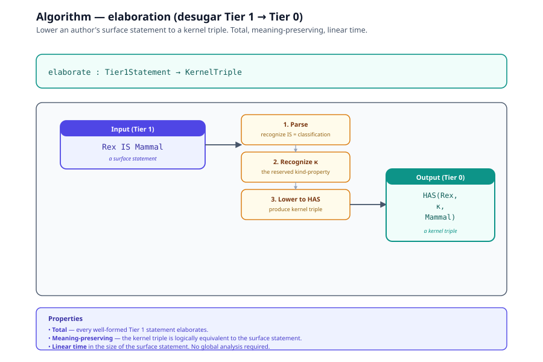
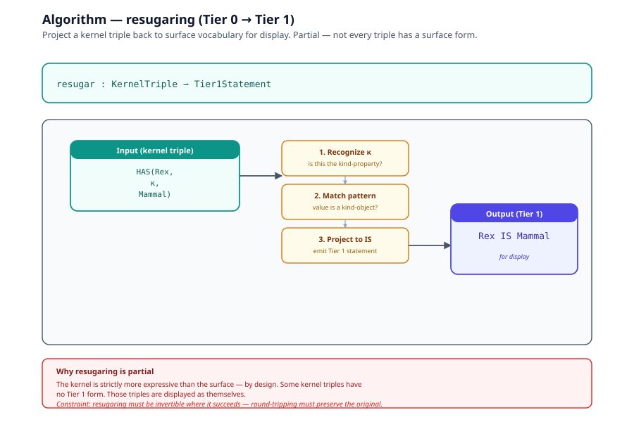
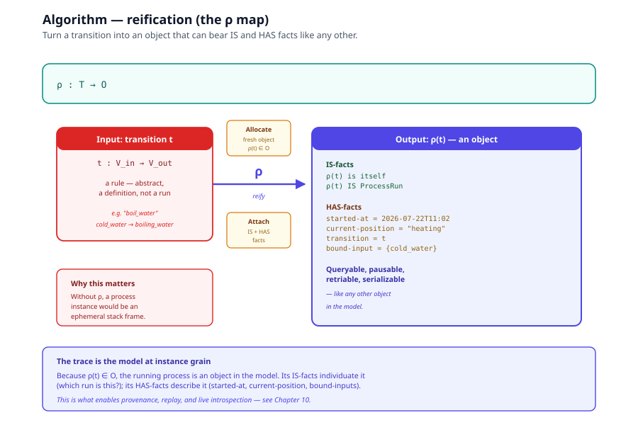
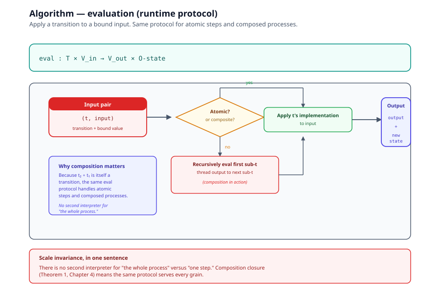
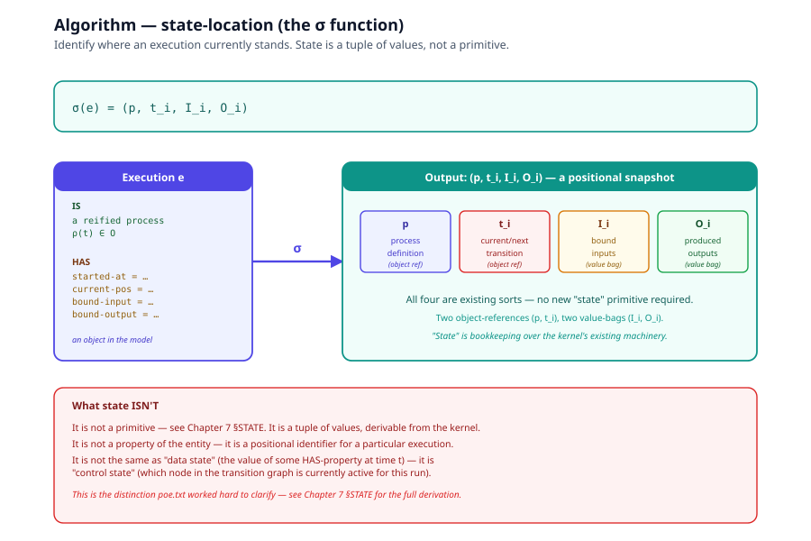

# Chapter 6 — Algorithms

> *In this chapter:* the five algorithms that bridge the Tier 0 kernel
> and the Tier 1 surface of
> [Chapter 5](05-kernel-surface-architecture.md).
> **Elaboration** desugars Tier 1 statements into kernel triples.
> **Resugaring** projects kernel triples back to surface vocabulary
> for display. **Reification** (ρ) turns a transition into an object.
> **Evaluation** is the runtime protocol that applies a transition to
> an input. **State-location** (σ) identifies where an execution
> currently stands in a composed process.

These are first-class content, not implementation details. The
runtime executes them; the interchange format must preserve enough
information for each to be invertible or replayable.

---

## 6.1 The five algorithms at a glance

| Algorithm | Signature | Purpose |
|---|---|---|
| **elaboration** | Tier 1 statement → kernel triple | Lower author intent to the executable substrate |
| **resugaring** | kernel triple → Tier 1 statement | Display kernel state in surface vocabulary |
| **reification** (ρ) | transition `t` → object `ρ(t)` | Make a rule bearable as an object |
| **evaluation** | `(t, input)` → `(new state, output)` | Apply a transition to its input |
| **state-location** (σ) | execution `e` → `(process, current-node, I, O)` | Locate where an execution currently is |

Each algorithm has a formal signature, a prose description, and a
diagram. Together they form the operational contract between the
surface language and the kernel runtime.

---

## 6.2 Elaboration — Tier 1 to Tier 0

The lowering pass. Takes a surface statement in the eight-primitive
vocabulary and produces the equivalent kernel triple.

```
elaborate :  Tier1Statement  →  KernelTriple
```



**Input (Tier 1):**
```
Rex IS Mammal
```

**Steps:**
1. Parse — recognize `IS` as the classification relation.
2. Recognize the reserved property `κ` (kind).
3. Lower to a HAS-fact in the kernel.

**Output (Tier 0):**
```
HAS(Rex, κ, Mammal)
```

**Properties:**
- *Total* — every well-formed Tier 1 statement elaborates.
- *Meaning-preserving* — the kernel triple is logically equivalent to
  the surface statement.
- *Linear time* in the size of the surface statement.

The desugaring rules are tabulated in
[Chapter 5 §5.8](05-kernel-surface-architecture.md). Each rule is a
local rewrite; no global analysis is required.

---

## 6.3 Resugaring — Tier 0 to Tier 1

The inverse projection for display. Takes a kernel triple and, if it
matches a known desugaring pattern, projects it back to surface
vocabulary.

```
resugar :  KernelTriple  ⇀  Tier1Statement
```



**Input (kernel triple):**
```
HAS(Rex, κ, Mammal)
```

**Steps:**
1. Recognize `κ` as the reserved kind-property.
2. Recognize the value `Mammal` as a kind-object.
3. Project to the surface form.

**Output (Tier 1, for display):**
```
Rex IS Mammal
```

**Why this matters:**
- Error messages should speak the user's vocabulary. "identity morphism
  incompatible with composition unit" is a failure of the architecture;
  it should say "this object cannot bear that property."
- Introspection (queries against the running model) should return
  Tier 1 statements, not raw kernel triples.
- Round-tripping (serialize → deserialize → display) requires the
  projection to be invertible.

**Constraint:** resugaring is *partial* — not every kernel triple has
a surface form. The kernel is strictly more expressive than the
surface (by design — the kernel is the trusted base; the surface is
sugar). Triples with no surface form are displayed as themselves.

---

## 6.4 Reification — the ρ map

The move that turns a transition (a rule) into an object (a thing
that can bear facts).

```
ρ :  T  →  O
```



**Input:** a transition `t` with signature `V_in → V_out`.

**Steps:**
1. Allocate a fresh object `ρ(t)` in `O`.
2. Attach an IS-fact: `ρ(t)` is itself (the identity claim).
3. Attach HAS-facts: `started-at = <timestamp>`, `current-position =
   <initial-node>`, `transition = t`.

**Output:** an object `ρ(t)` that represents the transition `t` and
can be queried, paused, retried, serialized like any other object.

**Why this matters:** without reification, a "process instance" would
be an ephemeral stack frame that only the runtime can observe. With
reification, *the running process is an object in the model*, and the
trace is the model at instance grain. This is what enables provenance,
replay, and live introspection — see
[Chapter 10 §10.3](10-executable-ground.md).

---

## 6.5 Evaluation — the runtime protocol

How a transition fires. Takes a transition and a bound input,
produces a new state and an output.

```
eval :  T × V_in  →  V_out × O-state
```



**Input:** `(t, input)` where `t : V_in → V_out` is a transition and
`input ∈ V_in` is a bound input value.

**Steps:**
1. Validate the input against `t`'s declared interface (`V_in`).
2. If `t` is atomic, apply `t`'s implementation to the input.
3. If `t` is composite, recursively evaluate the first sub-transition
   with the input, then thread the output into the next
   sub-transition (composition in action).
4. Bind the result to the output interface (`V_out`).
5. Update the reified process's `current-position` HAS-fact (if any).

**Output:** `(output, new-state)` where `output ∈ V_out` and
`new-state` reflects the new position in the composition.

**Why composition matters here:** because `t₂ ∘ t₁` is itself a
transition, the same `eval` protocol handles both atomic steps and
composed processes. There is no second interpreter for "the whole
process" versus "one step." This is the scale-invariance result
(Chapter 10 §10.4).

---

## 6.6 State-location — the σ function

Identifies where a particular execution currently stands in a composed
process.

```
σ :  Execution  →  (process, current-node, bound-inputs, bound-outputs)
```

Often abbreviated:

```
σ(e)  =  (p, t_i, I_i, O_i)
```



**Input:** an execution instance `e` (a reified process plus its
runtime context).

**Steps:**
1. Read the process definition `p` from `e`'s IS-facts.
2. Read the `current-position` HAS-fact — this is `t_i`, the currently
   active (or next) transition.
3. Read the bound input values `I_i` for the current transition.
4. Read the bound output values `O_i` produced so far.

**Output:** `(p, t_i, I_i, O_i)` — a full positional snapshot.

**Why this matters:** this is what "state" means in this system. It
is *not* a separate primitive; it is a tuple of values, two of which
are object-references (the process `p` and the current transition
`t_i`), and two of which are value-bags (`I_i`, `O_i`). The whole
"state" is bookkeeping over the kernel's existing sorts — see
[Chapter 7 §STATE](07-derived-vocabulary-proofs.md) for the full
derivation.

---

## 6.7 The contract these algorithms form

The five algorithms form the operational contract between the surface
language (Primmel, Volume I) and the kernel runtime (the platform
annex). For the foundation's claims to hold in practice:

1. **Elaboration must be total and meaning-preserving.** Every
   well-formed Tier 1 statement lowers; the lowering preserves
   semantics.

2. **Resugaring must be invertible where it succeeds.** Triples that
   came from a Tier 1 statement must round-trip back to that
   statement.

3. **Reification must produce objects that bear IS and HAS like any
   other.** No special-casing — a process instance is an object,
   subject to the same machinery.

4. **Evaluation must respect composition.** The same protocol handles
   atomic transitions and composed processes; no second interpreter
   for "the whole."

5. **State-location must be a tuple of values.** No special "state"
   primitive — the location is `(p, t_i, I_i, O_i)`, all of which are
   existing sorts.

A conforming runtime implements these five algorithms correctly and
nothing more. Everything else is definition rather than
implementation. This is the *small trusted base* property — see
[Chapter 10 §10.6](10-executable-ground.md).

---

## 6.8 Where these algorithms live downstream

- **Elaboration** is the Primmel compiler's lowering pass (Volume I,
  chapter 11 — validation).
- **Resugaring** is the platform's query layer (platform annex).
- **Reification** is the process-instance factory (Volume I, chapter
  4 — processes).
- **Evaluation** is the runtime executor (platform annex).
- **State-location** is the live-twin introspection API (Volume I,
  chapter 14 — live twins).

Each of these is one concrete implementation of an algorithm defined
here. The definitions in this chapter are the contract; the
implementations are downstream.

---

*Next: [Chapter 7 — Derived Vocabulary Proofs](07-derived-vocabulary-proofs.md):
the six retired terms (STATE, STEP, CAN, RECEIVES, RELATES-TO,
BECOMES) reconstructed as materialized views.*
