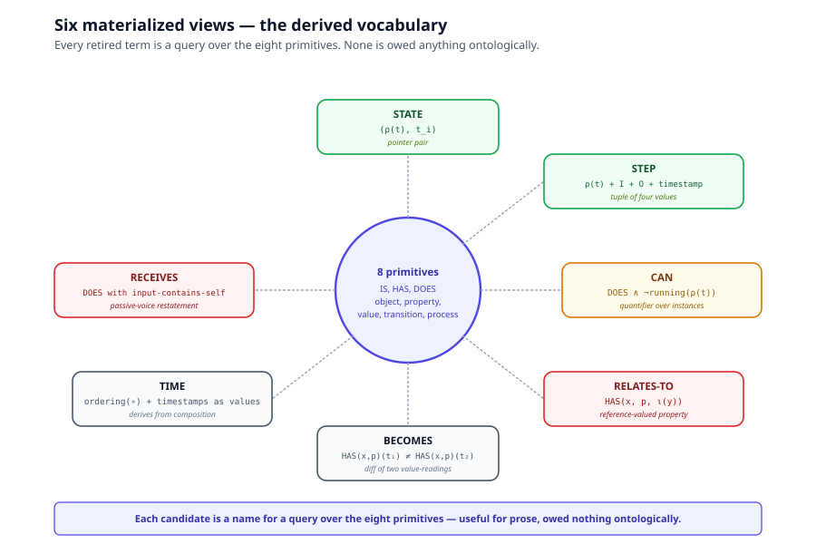
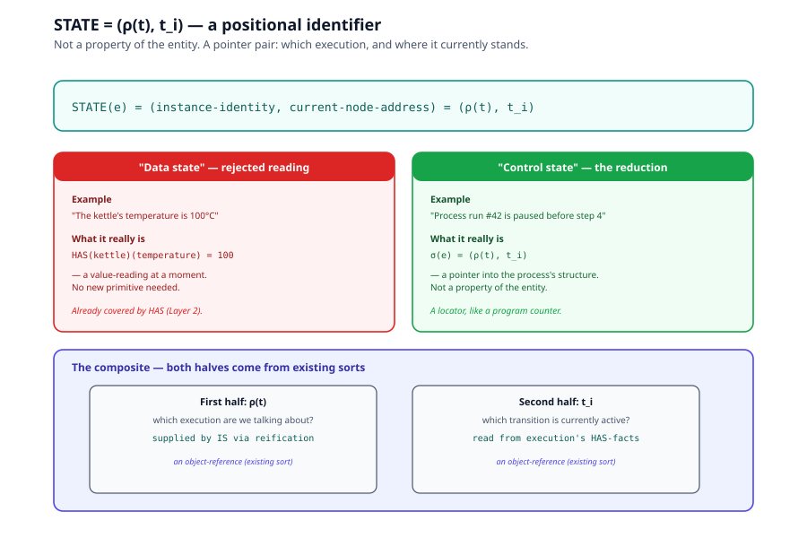
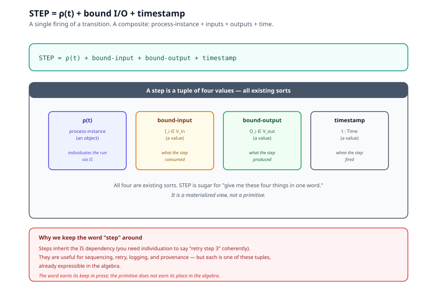
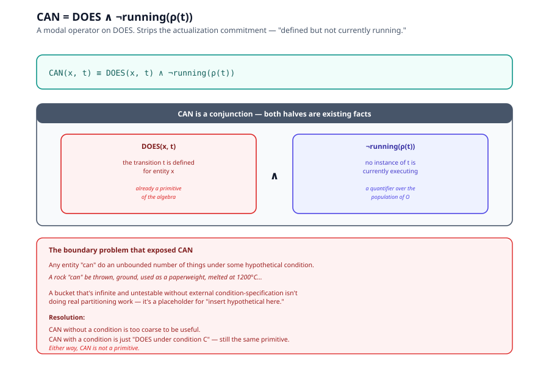
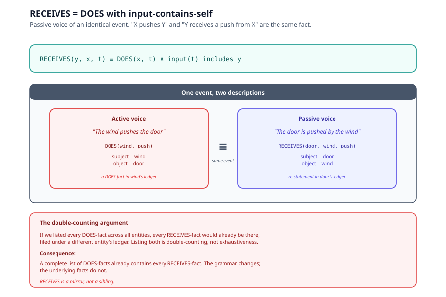
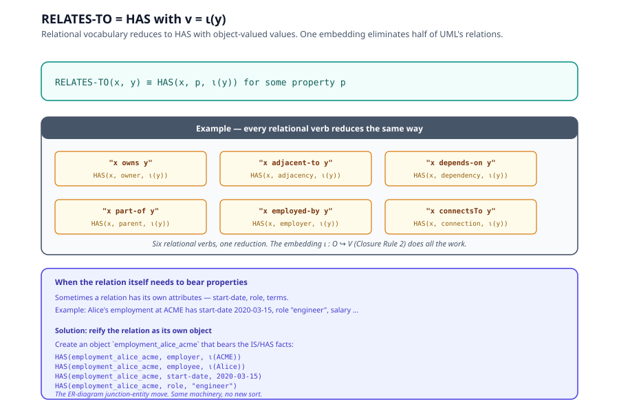
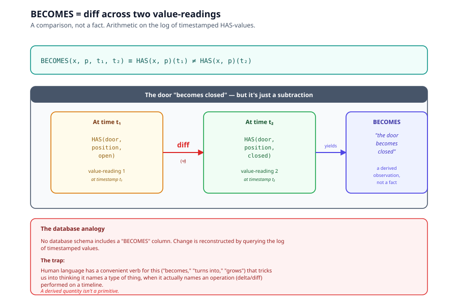
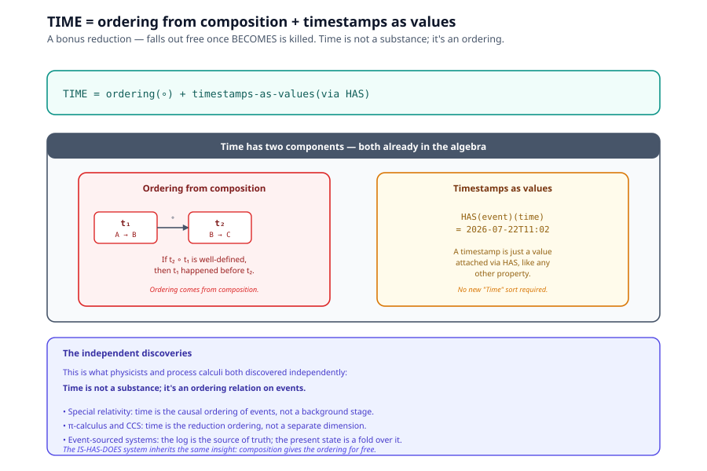

# Chapter 7, Derived Vocabulary Proofs

> *In this chapter:* the dialectical record. Six candidate primitives
> were proposed during the system's design, STATE, STEP, CAN,
> RECEIVES, RELATES-TO, BECOMES. Each was examined, reduced to a
> composite of the eight primitives of
> [Chapter 3](03-eight-terms-and-closure-rules.md), and retired. This
> chapter is the formal reconstruction of those reductions, the
> empirical backing for
> [Chapter 4 §4.3 Theorem 2](04-proofs.md)'s completeness proof.

Each section follows the same structure: (1) the proposal as
originally stated, (2) the counterexample or reduction, (3) the
materialized-view reconstruction as a composite, (4) the argument
that retires the candidate.

---

## 7.1 The pattern

Every candidate primitive turned out to be the same finding,
restated in a new location: it was a *materialized view* of the
primitives, kept around for convenience but owing nothing
ontologically.



The pattern: someone proposes a new bucket. We test it by asking
"could this be restated using only the eight primitives?" If yes, the
new bucket is sugar, not a primitive. So far, every candidate has
been sugar. The empirical record is the strongest argument for the
system's completeness (Gödel-style: we cannot prove completeness
from inside, but we can show every attack so far has failed).

---

## 7.2 STATE, a positional identifier, not a property

### The proposal

> "What about STATE? A kettle is *currently boiling*. Surely that's
> a different kind of fact from a slow-changing property like mass."

### The reduction

The word "state" was doing two different jobs, conflated:

1. **Data state**, the current value of a property (temperature =
   100°C). This is just `HAS(x)(temperature) = 100`, a value-reading
   at a moment. No new primitive needed.

2. **Control state**, which node in the transition graph is currently
   active for a particular run (e.g. "paused before step 4"). This is
   a *pointer into the process's structure*, not a property of the
   entity.

Only the second reading was the live contender. And even it reduces:

### The materialized view

```text
STATE(e)  =  (instance-identity, current-node-address)
           =  (ρ(t), t_i)
```



A state is a pair of values: the instance-identity (which execution
are we talking about, supplied by IS via reification `ρ(t)`) and the
current-node-address (which transition is currently active, supplied
by reading the execution's HAS-facts). Both are existing sorts. STATE
adds no new content of its own.

**Why this is bookkeeping, not ontology.** A state is a *positional
identifier* for an execution, like a program counter. It tells you
where to resume. It does not describe the entity, it locates a run
within a graph of transitions.

**The argument that retires it.** "State is therefore not an
independent substance or behavior. It is a secondary execution
locator." The phrasing "secondary" is precise, STATE exists
because we surface it for querying, not because it carries new
content.

---

## 7.3 STEP, a single firing of a transition

### The proposal

> "A transition is a rule. But each individual firing of that rule , 
> with specific inputs and outputs, at a specific time, is a *step*.
> Don't we need a STEP primitive?"

### The reduction

A step is exactly a transition *materialized as one countable,
addressable instance*. Same shape as STATE, both are "internal to
DOES, surfaced for addressability."

### The materialized view

```text
STEP  =  ρ(t) + bound-input + bound-output + timestamp
       =  (process-instance, I_i, O_i, t)
```



A step is a composite: a reified transition (an object), plus the
input value it consumed, plus the output value it produced, plus the
time it fired. All four are existing sorts. STEP is sugar for "give
me a tuple of these four things in one word."

**Why this matters operationally.** "Retry step 3" requires
individuating step 3 across attempts, which is the same individuation
problem objects have, solved by IS. Steps inherit the IS dependency;
they don't introduce a new sort.

**The argument that retires it.** "STEP is to DOES what STATE
was to DOES, an internal unit promoted to an addressable field, for
engineering convenience, not ontological necessity."

---

## 7.4 CAN, a transition defined but not instantiated

### The proposal

> "A bird *can* fly, whether or not it is currently flying. That
> sounds like a distinct category from DOES."

### The reduction

CAN is a *modal operator* on DOES: it strips the actualization
commitment. "Can fly" is "flies" minus the tense. Same verb, no
particular firing.

### The materialized view

```text
CAN(x, t)  ≡  DOES(x, t) ∧ ¬running(ρ(t))
            (i.e., transition t is defined for x, but no instance of
             ρ(t) is currently executing)
```



CAN is not a new primitive, it's a quantifier over reifications of
`t`. The transition is in the model (`DOES(x, t)`); no instance of
it is currently running (`¬running(ρ(t))`). That's a fact about the
population of `O`, not a new sort.

**The boundary problem that exposed it.** "Any entity 'can' do an
unbounded number of things under some hypothetical condition (a rock
'can' be thrown, ground, used as a paperweight, melted at 1200°C...).
A bucket that's infinite and untestable without external
condition-specification isn't doing real partitioning work."

CAN without a condition is too coarse to be useful; CAN with a
condition is just "DOES under condition C", still the same primitive.

---

## 7.5 RECEIVES, DOES from the other end

### The proposal

> "The door *is pushed* by the wind. That's RECEIVES, passive
> reception of an action. Different from DOES, surely?"

### The reduction

RECEIVES is DOES with the grammatical voice flipped. "X pushes Y" and
"Y receives a push from X" describe the identical event, only the
subject/object assignment changed.

### The materialized view

```text
RECEIVES(y, x, t)  ≡  DOES(x, t) ∧ input(t) includes y
                   (i.e., x does t, and y is in the input of t)
```



RECEIVES adds no new content, it's a re-statement of an existing
DOES-fact from a different viewpoint. If we listed every DOES-fact
across all entities, every RECEIVES-fact would already be there,
filed under a different entity's ledger. Listing both is
double-counting, not exhaustiveness.

**The double-counting argument that retires it.** "If RECEIVES
statements are just DOES statements with the subject and object
swapped, then RECEIVES doesn't add new content to a MECE tree, it's
a mirror, not a sibling."

---

## 7.6 RELATES-TO, HAS with an object-valued value

### The proposal

> "Things stand in relations to other things. Alice is *part of* the
> team. The door is *adjacent to* the wall. That's a different kind
> of fact from HAS."

### The reduction

RELATES-TO is HAS where the value happens to be a reference to
another object. Closure Rule 2 (§3.8) already permits this, `ι : O ↪ V`.

### The materialized view

```text
RELATES-TO(x, y)  ≡  HAS(x, p, ι(y))   for some property p
                  (i.e., x has a property whose value refers to y)
```



Specific instances:

- "owns" → `HAS(x, owner, ι(y))`
- "adjacent to" → `HAS(x, adjacency, ι(y))`
- "depends on" → `HAS(x, dependency, ι(y))`
- "part of" → `HAS(x, parent, ι(y))`
- "employed by" → `HAS(x, employer, ι(y))`

All relational vocabulary reduces to HAS with an object-valued value.
One embedding (`O ↪ V`) eliminates half the relational vocabulary of
UML.

**When relations need their own facts.** If the relation itself needs
to bear properties (start-date, role, terms), reify it as its own
object, the ER-diagram junction-entity move. Same machinery, no new
sort.

**The argument that retires it.** "RELATES-TO just generalizes
the relation's direction and kind (adjacency, dependency, membership)
,  a difference of degree, not of logical kind."

---

## 7.7 BECOMES, a diff across two value-readings

### The proposal

> "Things change over time. A caterpillar *becomes* a butterfly. The
> door *becomes* closed. That's BECOMES, the temporal delta."

### The reduction

BECOMES is not a fact about an entity at all. It is a *comparison*
across two facts: the entity's state at time *t₁* and its state at
time *t₂*. You get it free the instant you have timestamped
value-readings and a subtraction operation.

### The materialized view

```text
BECOMES(x, p, t₁, t₂)  ≡  HAS(x, p)(t₁) ≠ HAS(x, p)(t₂)
                       (i.e., the value of x's property p differs
                        between two timestamps)
```



**The database analogy.** No database schema includes a "BECOMES"
column. Change is reconstructed by querying the log of timestamped
values. The fact that human language has a convenient verb for this
("becomes," "turns into," "grows") tricks us into thinking it names
a type of thing, when it actually names an operation (delta/diff)
performed on a timeline.

**The "becomes-different-kind" objection.** What about a caterpillar
becoming a butterfly, where the entity's very classification shifts?
Two cases:

1. *Identity persists* (it's one organism whose life-stage changes):
   "life stage" is a HAS-property with STATE. Not BECOMES.
2. *Identity changes* (the old IS-claim expires, a new one holds):
   this is a DOES-event whose effect is the IS-claim replacement.
   Still no BECOMES primitive.

Either way, BECOMES is not needed.

**The argument that retires it.** "There is no third fact hiding
between the two snapshots that needs its own category. Calling BECOMES
'the delta operator on STATE' is an admission of this: a derived
quantity isn't a primitive."

---

## 7.8 TIME, ordering from composition

### The bonus reduction. TIME was not one of the original candidates

but it falls out for free once BECOMES is killed.

```text
TIME  =  ordering imposed by transition composition
       + timestamps as values attached via HAS
```



Time is not a separate sort. If `t₂ ∘ t₁` is the composite of two
transitions, then `t₁` happened before `t₂`, the ordering comes from
composition. Timestamps are just values attached via HAS, like any
other property.

This is what physicists and process calculi both discovered
independently: time is not a substance, it's an ordering relation on
events.

---

## 7.9 The general pattern

Looking across all six reductions:

| Candidate | What it tried to be | What it actually is |
|---|---|---|
| STATE | a fourth primitive | `(ρ(t), t_i)`, a pointer pair |
| STEP | a fifth primitive | `ρ(t) + I_i + O_i + timestamp`, a tuple |
| CAN | a modal primitive | DOES with `¬running(ρ(t))`, a quantifier |
| RECEIVES | a passive primitive | DOES with input-contains-self, a voice flip |
| RELATES-TO | a relational primitive | HAS with `v = ι(y)`, an object-valued value |
| BECOMES | a temporal primitive | `HAS(x, p)(t₁) ≠ HAS(x, p)(t₂)`, a diff |
| TIME | a temporal substrate | ordering from composition + timestamps as values |

Every candidate is a *materialized view*, a name for a query over
the eight primitives. Each is useful for prose; none is owed anything
ontologically.

---

## 7.10 What this means for the algebra

The eight-term algebra of
[Chapter 3](03-eight-terms-and-closure-rules.md) is *empirically
complete* in a sense stronger than its proof of Theorem 2: across
the entire design dialogue, every proposed ninth primitive was
reduced. The dialogue did not select for "easy" candidates, the
hardest ones (STATE, BECOMES) got the most attention and still
collapsed.

This is the empirical evidence for
[Chapter 2 §2.2](02-claims-and-falsifiability.md)'s Claim-Form Axiom.
We cannot prove the axiom, but we can exhibit the record of every
attempt to violate it.

The next attack surface, if any, is the discovery of a *genuine*
fourth claim-form: an atomic descriptive claim that is neither
identity, nor attribution, nor transformation, and cannot be reduced
to any of them. So far, no such claim has been found.

---

*Next: [Chapter 8, Comparative Analysis](08-comparative-analysis.md)
(Phase 3): how the system compares to OPM, OOP, UML, BPMN, EXPRESS,
RDF/OWL, Petri nets, and SysML v2 / KerML.*
