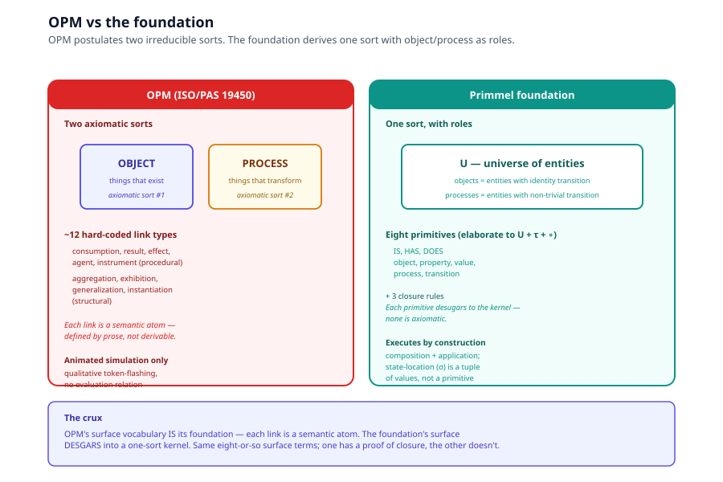
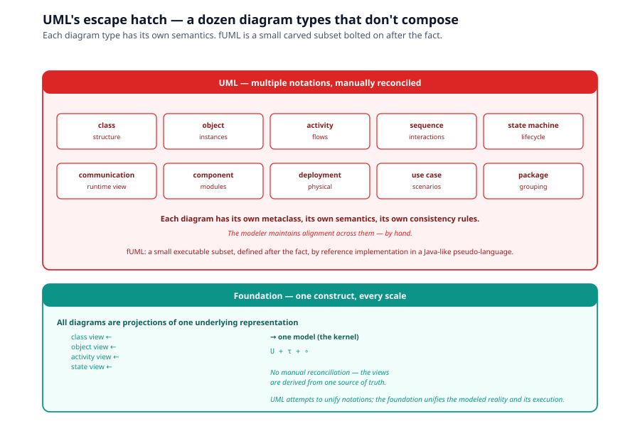
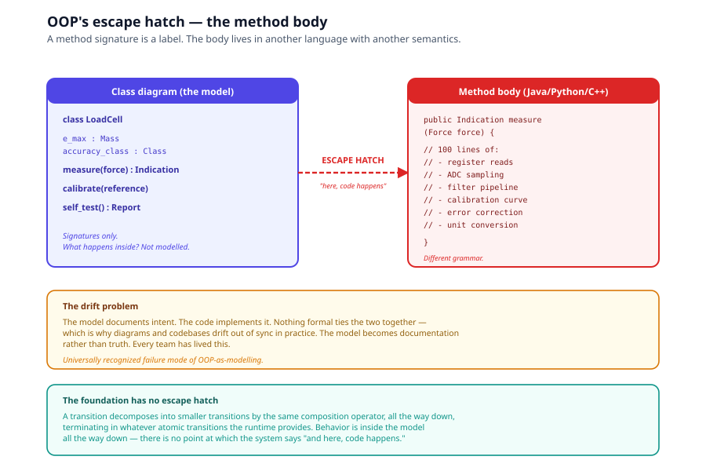
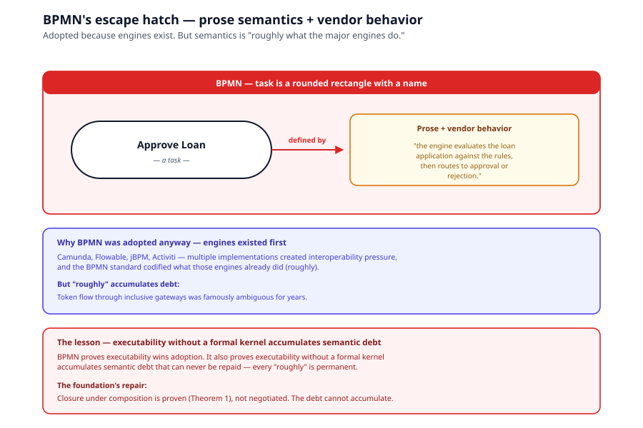
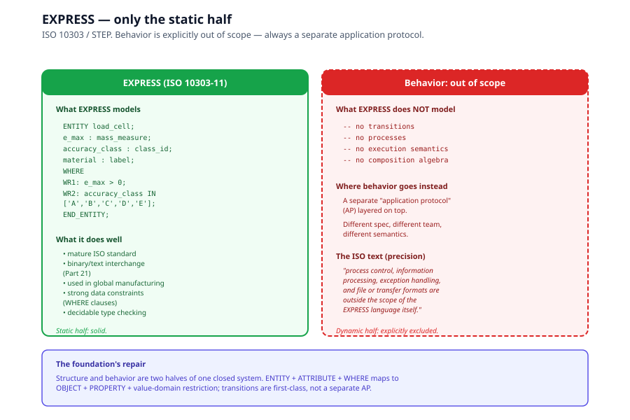
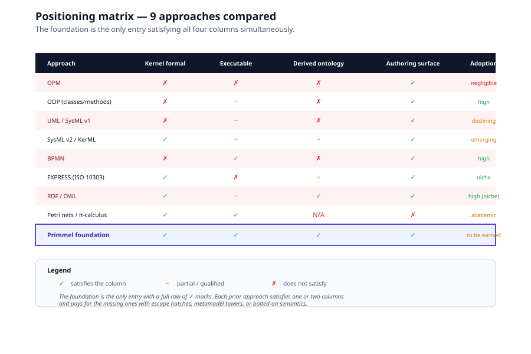
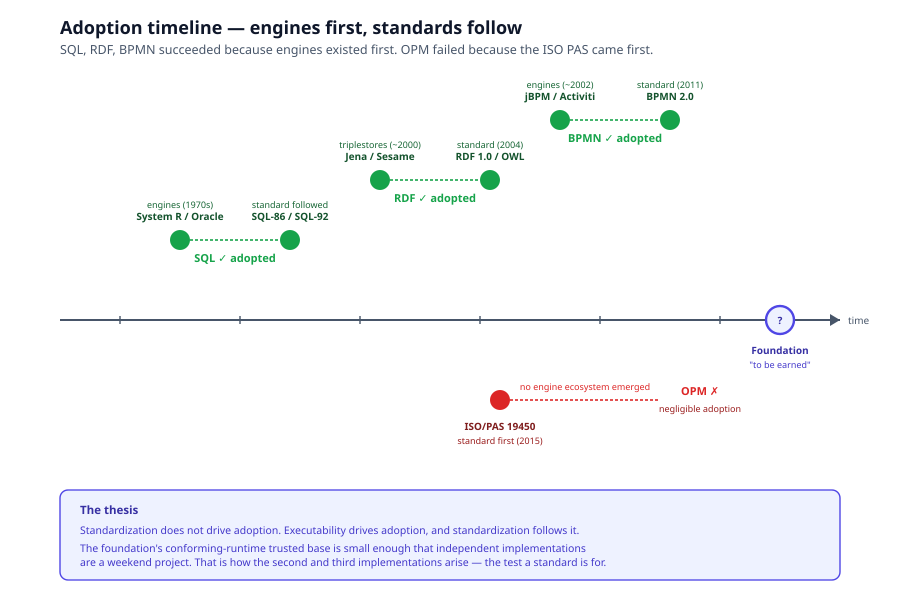

# Chapter 8, Comparative Analysis

> *In this chapter:* how the IS–HAS–DOES foundation compares to the
> major modelling methodologies, OPM, OOP, UML/fUML, SysML v2/KerML,
> BPMN, EXPRESS, RDF/OWL, and Petri nets/process calculi. Each is
> examined for what it gets right, where it stops or fragments, and
> what the foundation repairs. The chapter ends with a positioning
> matrix and the adoption-via-executability thesis.

This is the longest chapter in the volume because the comparative
argument is the strongest external validation: every individual
fragment of the foundation has precedents, and the foundation's claim
is the *conjunction* under one closed algebra.

---

## 8.1 The escape hatch problem

Every mainstream modelling methodology has a point where the model
ends and opaque text begins. In OOP, that point is the method body.
In UML, it is the action label. In BPMN, it is the task name. In
EXPRESS, behavior is explicitly out of scope. In RDF/OWL, inference
replaces execution.

Call this the **escape hatch**: the place where every existing
methodology stops modelling and starts trusting prose or code. The
consequence is universal and expensive, the model and the
implementation become two artifacts, they drift, and the model
becomes documentation rather than truth.

The foundation has no escape hatch. A transition is $t : V_{in} \to V_{out}$,
and the transform is not an opaque body, it decomposes
into smaller transitions, by the same composition operator, all the
way down. Behavior is inside the model all the way down.

We will examine eight methodologies through this lens.

---

## 8.2 OPM (ISO/PAS 19450:2015), the near miss

**OPM** (Object-Process Methodology, Dori's framework) is the closest
intellectual relative. Its core thesis: the universe of a model
contains exactly two things, objects and processes, where objects
exist and processes transform objects. Dori's polemic against UML was
the same polemic implicit here: nine diagram types and hundreds of
metaclasses are a symptom of missing foundations.

### What OPM gets right

- A unified object/process ontology (most methodologies split these).
- A single diagram kind (OPD) instead of UML's dozen.
- A controlled-natural-language rendering (OPL) paired with the
  graphical view, superficially resembles the kernel/surface split
  of [Chapter 5](05-kernel-surface-architecture.md).

### Where OPM stops

Three failure points, each instructive:

1. **The object/process duality is axiomatic, not derived.** OPM
   postulates two sorts and never asks whether one reduces to the
   other. The foundation proves the unification (object = identity
   transition, [Chapter 5 §5.4](05-kernel-surface-architecture.md)).
   Because OPM has two irreducible sorts, every cross-sort
   relationship requires dedicated link machinery, about a dozen
   hard-coded link types: consumption, result, effect, agent,
   instrument on the procedural side; aggregation, exhibition,
   generalization, instantiation on the structural side. These are
   the foundation's eight surface primitives *with no kernel
   underneath to elaborate into*.

2. **OPM is not executable.** OPCAT offers "animated simulation" , 
   qualitative token-flashing over the diagram, not computation.
   There is no evaluation relation, no composition algebra. OPL looks
   formal but is actually a paraphrase generator. Both modalities are
   surface; there is no kernel.

3. **States are structural in OPM, positional in the foundation.**
   OPM places states inside objects as sub-shapes, and processes move
   objects between them. This conflates the definition of a process
   with the trajectory of an execution. The foundation's treatment
   (state as a locator within a composed process instance) keeps
   definitions and executions as distinct entities.

### What the foundation repairs

All three. Object/process is unified by the kernel (§5.4). The kernel
is *only* execution (composition + application, Chapter 6). State is
a positional identifier, not a structural sub-shape
([Chapter 7 §7.2](07-derived-vocabulary-proofs.md)).

### Document status (for precision)

ISO/PAS 19450:2015 is a *Publicly Available Specification*, not a
full International Standard, not a Technical Report. A PAS is a
fast-track deliverable approved by simple technical-committee vote;
it skips the DIS/FDIS enquiry and formal ballot stages. Adoption
record: academic courses at MIT/Technion, a handful of aerospace
research projects, two tools from the same lineage (OPCAT, OPCloud).
No ecosystem of independent implementations, which is the real test
of a modelling standard.

---

## 8.3 SysML v2 / KerML, the strongest precedent

The SysML v2 effort concluded, after two decades of living with UML's
foundationless metamodel, exactly what the foundation concludes: it
built KerML (Kernel Modeling Language), a small kernel language with
declarative formal semantics, and defined SysML v2 as a surface layer
that elaborates into it.

### What SysML v2 / KerML gets right

- The two-level architecture (kernel + surface) is precisely
  [Chapter 5](05-kernel-surface-architecture.md)'s structure.
- The kernel is small and has declarative formal semantics (a
  mapping to formal logic).
- Surface SysML is defined by elaboration into the kernel, exactly
  the elaboration algorithm of
  [Chapter 6 §6.2](06-algorithms.md).

This is powerful external validation: the largest standards body in
the field arrived at the same architecture independently, as a
*correction* to their previous approach.

### Where SysML v2 / KerML stops (or differs)

- KerML's semantics is **declarative/logical**, specifications to be
  checked, model-theoretic. The foundation's is **operational** , 
  processes to be run, evaluation-based. KerML models are checked
  for consistency; foundation models are executed.
- KerML's kernel is **far larger than eight terms**. It carries more
  of the surface ontology into the kernel, trading minimality for
  expressiveness in the base layer.

### What the foundation repairs (or does differently)

The foundation's kernel is strictly smaller (one sort, one operation
,  [Chapter 5 §5.2](05-kernel-surface-architecture.md)). The cost is
that more of the work is in elaboration; the benefit is a smaller
trusted base (see adoption thesis, §8.12).

---

## 8.4 UML / fUML, the cost of retrofitting

UML includes behavioral notations, activities, state machines,
interactions, but UML as a general modelling language does not make
every ordinary UML model directly executable. The existence of the
separate Foundational UML (fUML) specification is the evidence: OMG
created a defined executable subset and supplied it with a separate
execution semantics.

### What UML gets right

- Readable by humans across specialties (architects, developers,
  business analysts). Its multiplicity of diagram types is a feature
  for communication, not just a bug.
- Mature tooling, certification programs, training materials.

### Where UML stops

- A class diagram may declare an operation; an activity diagram may
  claim to describe that operation; a sequence diagram may show one
  interaction involving it; a state machine may show the affected
  lifecycle; and implementation code may perform something different.
  The modeler must maintain semantic alignment across these artifacts
  by hand.
- fUML and PSCS attempted to bolt execution semantics onto a UML
  subset after the fact. The executable subset is small, awkwardly
  carved, and semantically defined by a reference implementation in
  a Java-like pseudo-language rather than by an algebra.

### What the foundation repairs

When the surface comes first, the kernel you can extract is whatever
happens to be consistent, not what you would have designed. The
foundation's kernel came first, by construction.

---

## 8.5 OOP (classes/methods), the original escape hatch

Object-oriented modelling gives us class, object, attribute,
operation, inheritance, association, composition. These are
predominantly structural concepts.

### What OOP gets right

- Decades of compiler, type-system, and runtime tooling.
- A working ontology of object/attribute/method that maps to the
  foundation's static half.

### Where OOP stops

A method signature in a class diagram is a name, a parameter list,
and a return type. That's it. The behavior, what actually happens
between input and output, lives in a separate artifact (Java,
Python, C++) governed by a separate grammar, compiler, and
semantics that OOP-as-modelling-notation never specifies.

The diagram is a label for a black box; the box's contents are
defined by a different language entirely. That's the translation
gap: the model documents intent, the code implements it, and nothing
formal ties the two together, which is why diagrams and codebases
drift out of sync in practice.

### What the foundation repairs

The foundation has no escape hatch, a transition decomposes into
smaller transitions by the same composition operator, terminating in
whatever atomic transitions the runtime provides. Behavior is inside
the model all the way down.

---

## 8.6 BPMN, the inverse failure mode from OPM

BPMN is much closer to process modelling than OOP or ordinary UML. It
defines tasks, events, gateways, flows, participants, messages, and
process execution concepts.

### What BPMN gets right

- Execution semantics and interchange machinery in the spec.
- Widely adopted, Camunda, Flowable, jBPM, and others.

### Where BPMN stops

- Its semantics is defined by prose plus vendor behavior. Token flow
  through inclusive gateways was famously ambiguous for years.
- Conformance means "roughly what the major engines do", not a
  mathematical invariant.
- BPMN's task is a rounded rectangle with a name. What an action does
  is a string a human interprets.

### What BPMN proves (and what the foundation repairs)

BPMN proves executability wins adoption; it also proves that
executability *without* a formal kernel accumulates semantic debt
that can never be repaid. The foundation's kernel is closed under
composition (Theorem 1, [Chapter 4](04-proofs.md)) by construction;
the debt cannot accumulate.

---

## 8.7 EXPRESS (ISO 10303 / STEP), only the static half

EXPRESS is explicitly a data-specification language. ISO identifies
data types and constraints as within its scope, while process
control, information processing, exception handling, and file or
transfer formats are outside the scope of the EXPRESS language
itself. ISO also explicitly states that EXPRESS is not a programming
language.

### What EXPRESS gets right

- Mature ISO standard with real binary/text interchange (Part 21)
  used in global manufacturing pipelines.
- ENTITY + ATTRIBUTE + WHERE-clause maps cleanly to OBJECT + PROPERTY + value-domain
  restriction.
- Decades of interoperability testing.

### Where EXPRESS stops

EXPRESS has no native behavior/transition layer, it's a pure
data-schema language. Behavior is always handled by a separate
application protocol layered on top.

### What the foundation repairs

The foundation treats structure and behavior as two halves of one
closed system. EXPRESS only ever formalized the structure half.

---

## 8.8 RDF / OWL, closest formal relative, missing dynamic half

ER's entities/attributes and RDF's subject-predicate-object triples
both map directly onto OBJECT/PROPERTY/VALUE. OWL's class/subclass
hierarchy is IS. The foundation's IS-as-property move
([Chapter 5 §5.6](05-kernel-surface-architecture.md)) is exactly the
`rdf:type` move.

### What RDF / OWL gets right

- Decidable reasoning, OWL's description-logics reasoners give you
  decidability results, provably terminating inference over
  class/property assertions.
- Mature serializations (Turtle, JSON-LD, RDF/XML) and a global
  identifier scheme (IRIs).
- Kinds-as-objects: `rdf:type rdfs:Class`, the same move as
  Closure Rule 1.

### Where RDF / OWL stops

RDF's kernel operation is **entailment**, not evaluation. Description
logics infer; they do not transition. RDF can say what is true of a
process; it cannot run one. Like EXPRESS, standard OWL has weak
native support for behavior/process (hence separate efforts like
OWL-S or SHACL rules bolted on for dynamics), again, only the
static half.

### What the foundation repairs

The foundation is RDF's structural minimalism married to an
operational semantics, a cell in the design space that is genuinely
unoccupied. The cost: the foundation lacks OWL's decidability
results (see [Chapter 11](11-open-questions.md)).

---

## 8.9 Petri nets / π-calculus / process calculi, the opposite corner

Plain Petri nets, finite-state machines, the π-calculus, CCS, and the
process calculi occupy the corner opposite from OPM.

### What process calculi get right

- Rigorous executable kernels with sixty years of metatheory:
  reachability analysis, deadlock/boundedness detection, model
  checking.
- Closure under composition (the same property the foundation
  proves in Theorem 1).
- Mature semantics for concurrency, channels, and synchronization.

### Where process calculi stop

- No object model, no properties, no notion of a thing that persists
  and bears attributes. Data must be encoded (colored tokens in
  Petri nets; channel-passing tricks in π-calculus).
- The static half is missing, there is no HAS.

### What they prove (and where the foundation differs)

They confirm that the foundation's kernel ambitions are formally
realizable while showing why a kernel alone, without the surface's
ontological vocabulary, never became a general modelling language.
The foundation's contribution is *not* the kernel, it is the
two-tier architecture with the elaboration seam.

---

## 8.10 The positioning matrix

| Approach | Kernel with formal semantics | Executable | Derived (not axiomatic) ontology | Authoring surface | Adoption |
|---|---|---|---|---|---|
| OPM (ISO/PAS 19450) | No | No (animation only) | No, two sorts, ~12 link atoms | Yes (OPD/OPL) | Negligible; PAS, single toolchain |
| OOP (classes/methods) | No | Partial (via host language) | No | Yes | High |
| UML/SysML v1 | No (MOF is structural only) | Partially (fUML retrofit) | No | Yes, sprawling | High, declining |
| SysML v2/KerML | Yes (declarative) | Specification-checking, not running | Partially | Yes | Emerging |
| BPMN | No (prose semantics) | Yes | No | Yes | High |
| EXPRESS (ISO 10303) | Yes (data-spec only) | No (out of scope) | Partially | Yes | High in niche |
| RDF/OWL | Yes (model-theoretic) | Inference, not execution | Yes (`rdf:type` as data) | Layered vocabularies | High in its niche |
| Petri nets / π-calculus | Yes (operational) | Yes | N/A, no object ontology | No | Academic + niches |
| **Primmel foundation** | **Yes (operational)** | **Yes** | **Yes, objects, values, IS all derived** | **Yes (eight primitives via elaboration)** | **To be earned** |

The foundation is the only entry that satisfies all four columns
simultaneously. Each prior approach satisfies one or two and pays
for the missing ones with escape hatches, metamodel towers, or
bolted-on semantics.

---

## 8.11 The synthesis

Three lessons from the comparative record:

1. **OPM proves the demand.** A unified object/process ontology is
   wanted. But OPM also proves such an ontology without an executable
   kernel dies regardless of standards paperwork.

2. **The process calculi prove the kernel is viable.** Rigorous
   executable kernels with sixty years of metatheory exist. But a
   kernel without ontological surface never reaches modelers.

3. **KerML proves the two-level architecture is where mature
   standards efforts converge.** Independent arrival at the same
   structure, after decades of attempting the alternative.

The foundation is the intersection, and the OPM comparison is the
cleanest way to articulate why the intersection was empty until now:
everyone before either had the ontology or had the algebra, and the
elaboration seam between them is the thing nobody built.

---

## 8.12 The adoption-via-executability thesis

Standardization does not drive adoption. Executability drives
adoption, and standardization follows it.

- **SQL** was adopted because engines existed, IBM System R, Oracle,
  Ingres, and the standard codified interoperability among them.
- **RDF** was adopted because triplestores existed, Jena, Sesame,
  Stardog, and the standard codified interchange.
- **BPMN** was adopted because engines existed, Camunda, Flowable,
  jBPM, and the standard codified execution semantics (loosely).

In every case, the engines came first. The standard followed.

OPM went the other way: it acquired the ISO document first (and only
a PAS) with no executable semantics and a single-vendor toolchain.
Adoption never came, because there was nothing to run and no second
implementation to interoperate with.

### What this means for the foundation

The foundation's conforming-runtime trusted base (composition +
application, [Chapter 6](06-algorithms.md)) is small enough that
independent implementations are a weekend project rather than a
consortium effort, and small enough that a conformance test suite
can be genuinely exhaustive. That is how the second and third
implementations arise, and their existence is what a standard is
*for*.

This is the adoption strategy: ship the kernel, ship a reference
runtime, ship a conformance suite. Standardization follows.

---

## 8.13 What this chapter does not claim

- **We do not claim the foundation is adopted.** Its adoption record
  is "to be earned", the matrix above says so explicitly.
- **We do not claim individual primitives are novel.** Object,
  property, value, transition, process, each has precedents. The
  novelty is the conjunction under one closed algebra with the
  type/instance split applied symmetrically.
- **We do not claim the foundation is the only possible foundation.**
  It is one candidate. Others may exist; if one is closed, complete,
  and extensible in stronger senses, we want to know.

The honest positioning: the foundation is a candidate universal
*executable* metamodel, with closure and completeness proofs
relative to a stated axiom, and a comparative record against eight
alternatives. The next chapter
([Chapter 9](09-categorical-foundations.md)) deepens the formal
treatment; the chapter after
([Chapter 10](10-executable-ground.md)) makes the positive case for
the executable ground.

---

*Next: [Chapter 9, Categorical Foundations](09-categorical-foundations.md):
the kernel as a category; Curry–Howard–Lambek; objects as identity
morphisms.*
