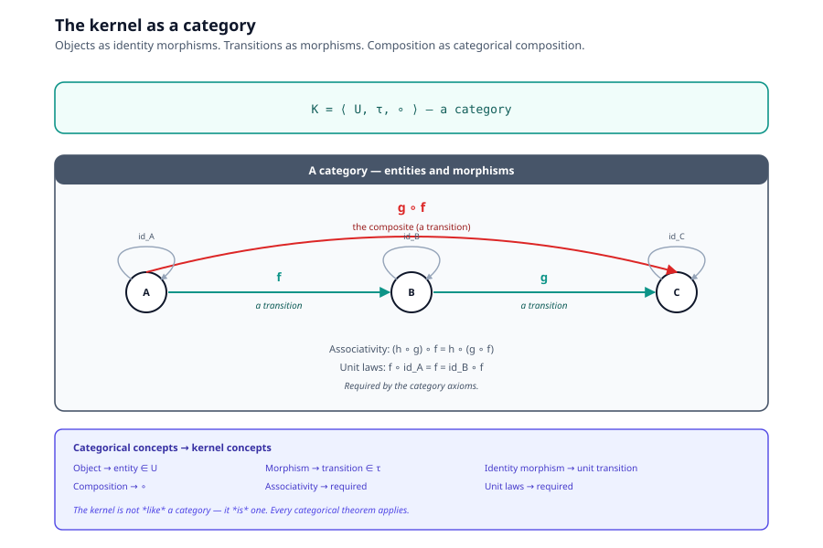
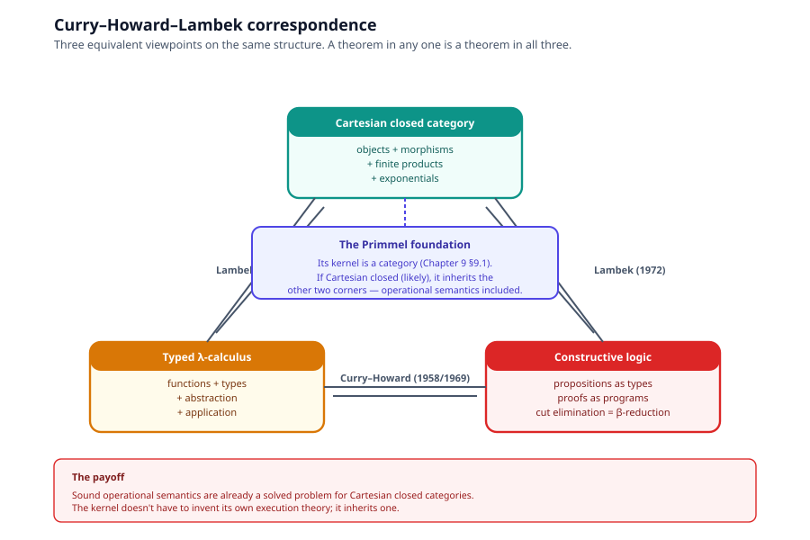
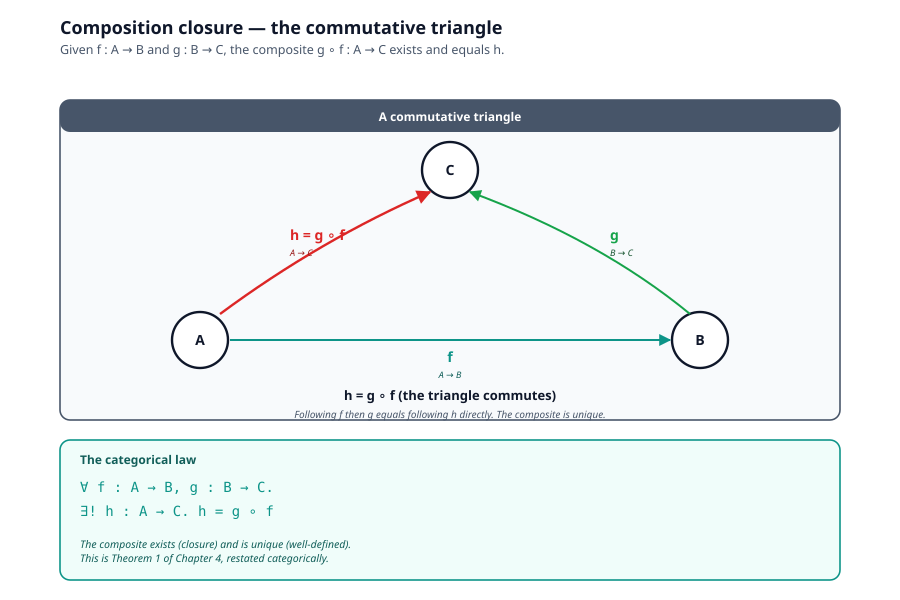
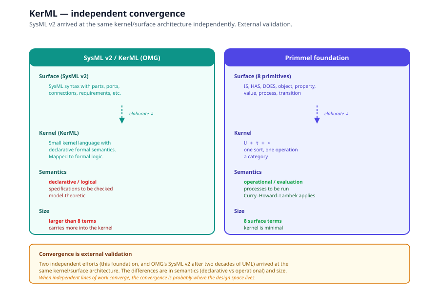

# Chapter 9 — Categorical Foundations

> *In this chapter:* the kernel of
> [Chapter 5](05-kernel-surface-architecture.md) recognized as a
> **category** in the mathematical sense. Objects as identity
> morphisms, transitions as morphisms, composition as categorical
> composition. The Curry–Howard–Lambek correspondence positions the
> kernel inside a sixty-year-old family of structures for which
> sound operational semantics are already a solved problem. SysML
> v2's KerML arrives at the same architecture independently —
> powerful external validation.

This is the most formal chapter in the volume. KaTeX renders the
math; the prose stays grounded.

---

## 9.1 The kernel is a category

Recall the kernel from
[Chapter 5 §5.2](05-kernel-surface-architecture.md):

$$
\mathcal{K} = \langle U, \tau, \circ \rangle
$$

with sorts $U$ (a universe of entities), a partial transition
relation $\tau \subseteq U \times U$, and composition
$\circ : \tau \times \tau \rightharpoonup \tau$ defined when
interfaces match.

This is precisely the data of a **category** in the mathematical
sense (Mac Lane, 1971):

| Categorical concept | In the kernel |
|---|---|
| **Object** | An entity $x \in U$ |
| **Morphism** $f : A \to B$ | A transition $t : A \to B$ in $\tau$ |
| **Identity morphism** $\mathrm{id}_A : A \to A$ | The unit transition, guaranteed to exist |
| **Composition** $g \circ f$ | The kernel's $\circ$ operation |
| **Associativity** $(h \circ g) \circ f = h \circ (g \circ f)$ | Required by the kernel |
| **Unit laws** $f \circ \mathrm{id} = f = \mathrm{id} \circ f$ | Required by the kernel |

The kernel is not *like* a category — it *is* one. Every categorical
theorem applies.

---

## 9.2 Why this matters — sixty years of metatheory for free

A category with the structure above inherits a vast body of
existing results:

- **Functors** (maps between categories preserving structure) — the
  foundation's elaboration and resugaring algorithms
  ([Chapter 6](06-algorithms.md)) are functors between the surface
  category and the kernel category.
- **Natural transformations** (maps between functors) — the
  foundation's projections (different views of one model) are
  natural transformations.
- **Adjunctions** (pairs of functors with a universal property) —
  reification $\rho$ and its inverse form an adjunction between
  $T$ and $O$.
- **Limits and colimits** (universal constructions) — products
  model conjunction of facts; coproducts model alternative branches
  in a process.

The Curry–Howard–Lambek correspondence, described next, makes this
inheritance concrete for execution.

---

## 9.3 The Curry–Howard–Lambek correspondence

The **Curry–Howard–Lambek correspondence** is a decades-old,
extremely well-established equivalence between three things:

$$
\text{Cartesian closed categories} \;\;\longleftrightarrow\;\; \text{typed $\lambda$-calculus} \;\;\longleftrightarrow\;\; \text{constructive logic}
$$

| Side | What it studies |
|---|---|
| **Cartesian closed category** | Objects and morphisms with finite products and exponentials |
| **Typed $\lambda$-calculus** | Functions, abstraction, application, types |
| **Constructive logic** | Proofs as programs, propositions as types |

The correspondence says: a theorem in any one of these is a theorem
in all three. A Cartesian closed category *is* a model of typed
$\lambda$-calculus *is* a model of constructive logic.

### What this means for the foundation

The foundation's kernel is a category. If it has finite products
(it does — products of value-interfaces are well-defined) and
exponentials (it does — transitions between interfaces form an
exponential), then it is a Cartesian closed category. By
Curry–Howard–Lambek:

$$
\text{the kernel} \;\;\models\;\; \text{typed $\lambda$-calculus} \;\;\models\;\; \text{constructive logic}
$$

This is not metaphor. Anything with the algebraic signature of a
Cartesian closed category sits inside a family of structures for
which **sound operational semantics are already a solved problem**
in programming language theory.

UML and OOP were never built to satisfy those preconditions. They
were built as human documentation conventions first, with execution
retrofitted (Executable UML, UML state machine code-gen) as an
afterthought that never achieved full fidelity to the diagrams.

---

## 9.4 Composition closure, restated

Theorem 1 of [Chapter 4](04-proofs.md) said the kernel is closed
under its three operations. Categorically, this is the closure of a
category under composition:

Given morphisms $f : A \to B$ and $g : B \to C$, the composite
$g \circ f : A \to C$ exists, and the diagram commutes:

$$
g \circ f \;=\; h
$$

where $h$ is the unique morphism making the triangle commute. The
composition law of a category is exactly this closure. Theorem 1 is
categorical closure, restated for the foundation's vocabulary.

---

## 9.5 Reification as an adjunction

Closure Rule 3 (§3.9) reifies a transition into an object:

$$
\rho : T \to O
$$

Categorically, $\rho$ is the action of a functor from the category
of transitions to the category of objects. The right adjoint
$\rho^{\dagger} : O \to T$ goes the other way — given an object, it
returns the identity transition.

The adjunction $\rho \dashv \rho^{\dagger}$ satisfies:

$$
\mathrm{Hom}_O(\rho(t), o) \;\cong\;\mathrm{Hom}_T(t, \rho^{\dagger}(o))
$$

which says: maps from a reified transition to an object correspond
naturally to maps from the transition to the identity-of-the-object.
This is the categorical statement of "an object is the unit of
composition."

---

## 9.6 KerML — independent convergence

The SysML v2 effort concluded, after two decades of UML's
foundationless metamodel, exactly what the foundation concludes. It
built KerML — Kernel Modeling Language — a small kernel language
with declarative formal semantics, with SysML v2 as a surface that
elaborates into it.

This is the two-level architecture of
[Chapter 5](05-kernel-surface-architecture.md) arrived at
independently by the largest standards body in the field.

### Where KerML and the foundation agree

- Both have a kernel + surface split.
- Both define the surface by elaboration into the kernel.
- Both treat the kernel as the trusted base for proof.

### Where they differ

- KerML's kernel is **declarative/logical** (model-theoretic,
  specifications to be checked). The foundation's kernel is
  **operational** (evaluation-based, processes to be run).
- KerML's kernel is larger — it carries more of the surface ontology
  into the kernel, trading minimality for expressiveness in the
  base layer.

### Why the convergence matters

It is external validation. The foundation is not idiosyncratic.
When independent efforts (this one and SysML v2) converge on the
same architecture, that architecture is probably where the design
space lives.

---

## 9.7 The honest limits

What the categorical foundation does *not* give us:

- **It does not give decidability.** The kernel being a category
  does not mean reasoning over it terminates. OWL's description
  logics have decidability proofs; the foundation does not.
- **It does not give a tooling ecosystem.** Categorical
  metatheory is rich, but the practical tooling (compilers,
  debuggers, IDE integrations) still has to be built.
- **It does not give a unique foundation.** Other categorical
  formulations are possible (different choices of products,
  exponentials, functor categories). The kernel is *one* candidate.

The categorical reading strengthens the foundation's claims but
does not make them absolute. The next chapter
([Chapter 10](10-executable-ground.md)) turns the categorical
formalism into practical claims about executability and adoption.

---

## 9.8 Where this chapter leaves us

- The kernel is a category — Mac Lane's textbook applies.
- The Curry–Howard–Lambek correspondence gives the kernel
  operational semantics "for free" (relative to being a Cartesian
  closed category, which we believe it is).
- KerML's independent arrival at the same architecture is external
  validation.
- The honest limits (no decidability, no tooling) are stated.

The next chapter turns this formal foundation into the practical
argument: no escape hatch, reification, scale invariance, model =
program.

---

### Further reading

- Mac Lane, S. (1971). *Categories for the Working Mathematician*.
  Springer-Verlag, New York.
- Lambek, J. & Scott, P. J. (1986). *Introduction to Higher Order
  Categorical Logic*. Cambridge University Press.
- Pierce, B. C. (1991). *Basic Category Theory for Computer
  Scientists*. MIT Press.
- OMG (2024). *Kernel Modeling Language (KerML)*. SysML v2
  specification, Object Management Group.

---

*Next: [Chapter 10 — The Executable Ground](10-executable-ground.md):
the practical case — no escape hatch, reification, scale invariance,
model = program.*
