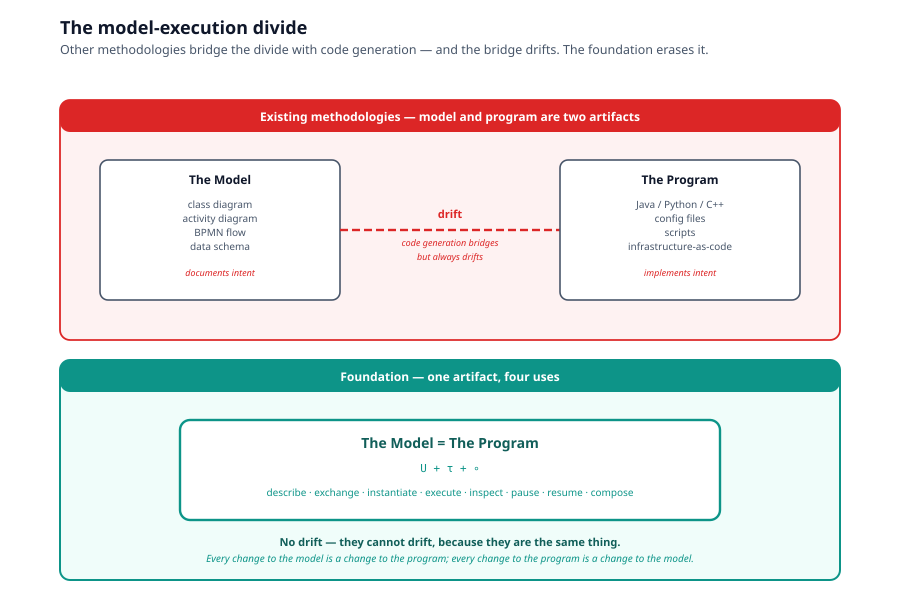
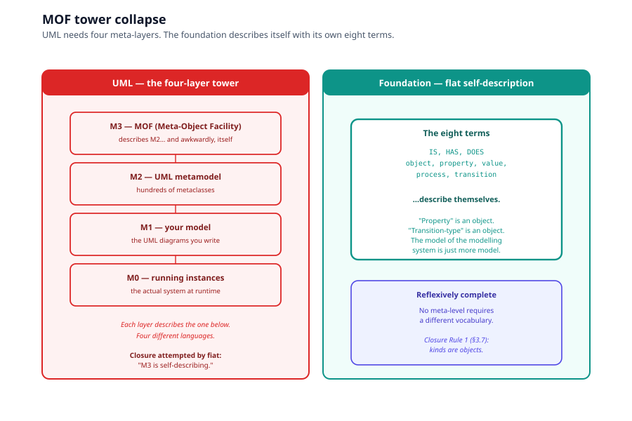
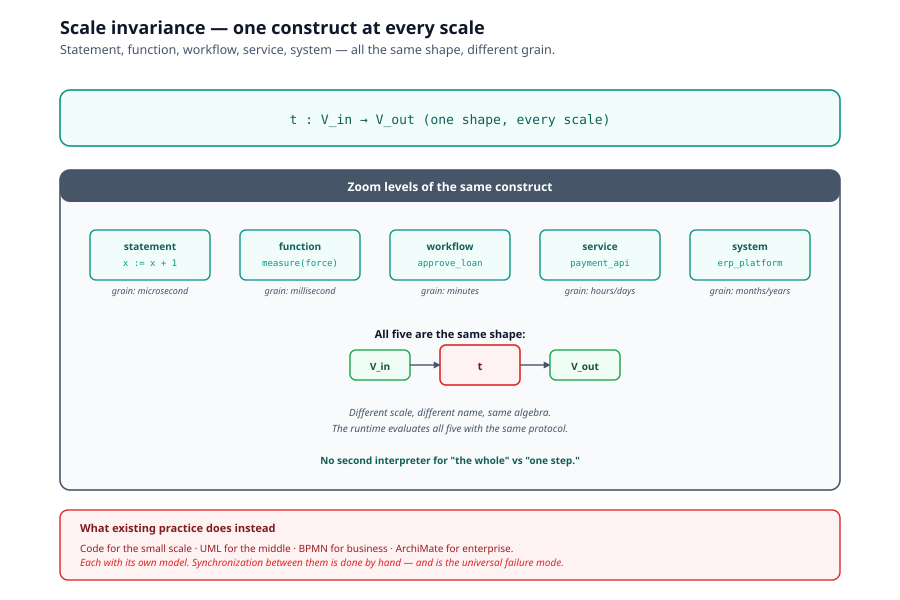
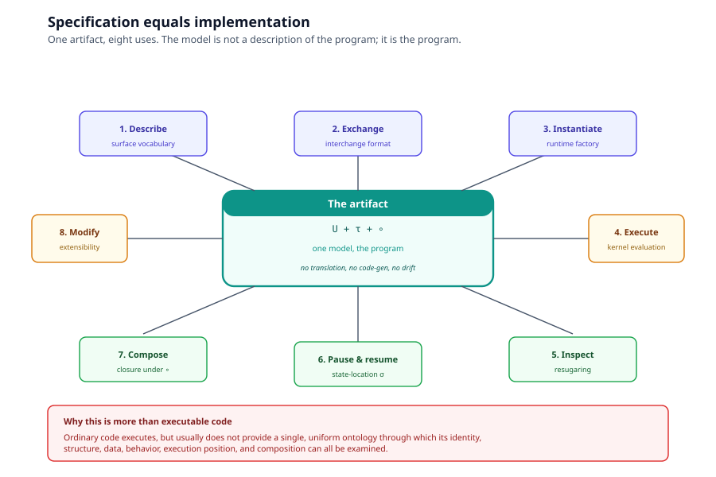
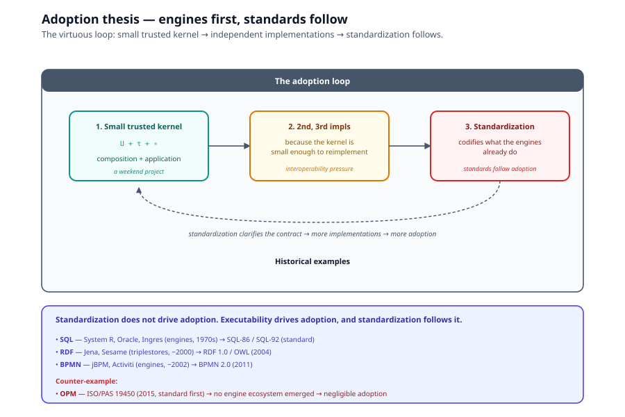

# Chapter 10, The Executable Ground

> *In this chapter:* the positive case for the foundation. After
> [Chapter 8](08-comparative-analysis.md) surveyed how every other
> methodology stops, this chapter shows what becomes possible when
> nothing stops. Four properties: (1) no escape hatch, behavior is
> inside the model all the way down; (2) reification collapses the
> meta/object distinction; (3) scale invariance, one construct at
> every scale; (4) specification equals implementation. The chapter
> closes with the adoption lesson that ties it together.

These are the practical claims. They are conditional on a conforming
runtime (see [Chapter 6](06-algorithms.md) for the contract); where
the implementation falls short, the algebra is the reference.

---

## 10.1 No escape hatch

Every mainstream methodology has a place where the model ends and
opaque text begins. In OO that place is the method body. In UML it
is the action label. In BPMN it is the task name. The foundation has
no such place.

A transition $t : V_{in} \to V_{out}$ has a transform that is not an
opaque body, it decomposes into smaller transitions, by the same
composition operator, terminating in whatever atomic transitions the
runtime provides. There is no point at which the system says "and
here, code happens."

### Why this matters

The model and the implementation become one artifact. They cannot
drift out of sync because they are the same thing. Every change to
the model is a change to the program; every change to the program is
a change to the model.

This is the dream that Model-Driven Architecture (MDA) chased for
twenty years and lost. MDA's answer was code generation: transform
the model into a second artifact (Java, C#) which then becomes the
real system and immediately begins to drift. Code generation
concedes the model/implementation gap and tries to bridge it. A
direct runtime erases it.

---

## 10.2 Reification, the meta/object distinction collapses

Closure Rule 3 (§3.9) reifies a transition as an object:

$$
\rho : T \to O
$$

This does something no mainstream methodology does natively: it
makes every process instance a first-class object that bears IS-facts
and HAS-facts with the same machinery as any other object.

### The industries that exist because others lack this

Consider what industries exist because other systems lack reification:

- **Reflection APIs**, to inspect a running program's structure
  from inside the program.
- **Aspect-oriented programming**, to inject behavior at join points
  without modifying source.
- **Distributed tracing** (Jaeger, OpenTelemetry), to reconstruct
  what happened across a distributed system after the fact.
- **Process mining**, to discover processes from event logs.
- **Application performance monitoring** (APM), to observe running
  behavior.

All of these are multi-billion-dollar efforts to reconstruct after
the fact what $\rho$ provides by construction: the ability to point
at a running behavior and ask what it is, what it holds, where it
stands.

### In OO vs in the foundation

In OO, a method invocation is *not* an object in the model, it is
an ephemeral stack frame you can only observe by instrumenting the
runtime from outside.

In the foundation, "this particular run of this particular process"
is an object the moment it exists, individuated by IS, queryable by
HAS, with no instrumentation layer, because the model never
distinguished between the description of behavior and the record of
behavior. **The trace is the model at instance grain.**

---

## 10.3 The MOF tower collapses

UML rests on a four-layer tower:

- **M0**, running instances
- **M1**, models (the UML diagrams you write)
- **M2**, the UML metamodel (hundreds of metaclasses)
- **M3**, MOF (Meta-Object Facility), which describes M2, and then
  awkwardly, describes itself.

This tower exists because UML's kinds are not UML's objects, you
need a separate language level to talk about the language.

### How the foundation dissolves the tower

Closure Rule 1 (§3.7), kinds are objects, demolishes the tower.
The system describes itself with its own eight terms. A property is
an object. A transition-type is an object. The model of the modelling
system is just more model.

### Precedent

Smalltalk gestured at this with metaclasses. RDF gestured at it with
`rdf:type rdfs:Class`. But both did it as a local trick within one
layer. In the foundation it is a closure rule of the whole algebra,
which means the system is **reflexively complete**: there is no
meta-level left over that requires a different vocabulary.

This is a property MOF explicitly tried to achieve and only achieved
by fiat (declaring M3 self-describing) rather than by construction.

---

## 10.4 Scale invariance, one construct at every scale

Because $t_2 \circ t_1$ is itself a transition, the same construct
serves as statement, function, workflow, service, and enterprise
process, differing only in grain.

### What existing practice does instead

Existing practice fragments scale:

- **Code** for the small scale (statements, functions)
- **UML** for the middle scale (classes, components)
- **BPMN** for the business scale (tasks, flows)
- **ArchiMate** for the enterprise scale (capabilities, value streams)

Each with its own notation, its own tooling, and, critically, its
own model that must be kept consistent with the others by hand. The
synchronization problem between a company's BPMN diagrams and its
actual codebase is not a tooling gap; it is a structural consequence
of using different formalisms at different scales.

### What scale invariance dissolves

Scale invariance dissolves the problem at its root: zooming in on a
process reveals transitions in the same algebra, so there is nothing
to synchronize. There is **one artifact viewed at different
magnifications**.

---

## 10.5 Specification equals implementation

If a runtime executes this algebra directly, evaluation as function
application over $V$, sequencing as $\circ$, instantiation as $\rho$
,  then the model is not a description of the program. **The model is
the program.**

### The four uses that become one

The same object, property, value, process, and transition definitions
are used to:

1. **Describe** the system (surface vocabulary)
2. **Serialize and exchange** the system (interchange format)
3. **Instantiate** the system (runtime)
4. **Execute** the system (kernel evaluation)
5. **Inspect** the running system (resugaring)
6. **Pause and resume** processes (state-location σ)
7. **Compose** larger processes (closure under ∘)
8. **Modify** the system (extensibility, Chapter 4 Theorem 3)

That is more than executable code. Ordinary code executes, but
usually does not provide a single, uniform ontology through which
its identity, structure, data, behavior, execution position, and
composition can all be examined.

### Every theorem acquires operational force

- **Closure** (Theorem 1) means the runtime can never encounter an
  entity it cannot represent.
- **Completeness** (Theorem 2) means anything describable is
  buildable.
- **Extensibility** (Theorem 3) means the deployed system grows by
  adding content to $O$, $P$, $V$, $T$ without redeploying primitives.
  Schema evolution and behavior evolution become the same monotone
  operation.

---

## 10.6 The adoption lesson

Standardization does not drive adoption. Executability drives
adoption, and standardization follows it.

- **SQL** was adopted because engines existed (System R, Oracle,
  Ingres), and the standard codified interoperability among them.
- **RDF** was adopted because triplestores existed (Jena, Sesame,
  Stardog), and the standard codified interchange.
- **BPMN** was adopted because engines existed (Camunda, Flowable,
  jBPM), and the standard codified execution semantics (loosely).

In every case, the engines came first. The standard followed.

### OPM went the other way

OPM acquired the ISO document first (and only a PAS) with no
executable semantics and a single-vendor toolchain. Adoption never
came, because there was nothing to run and no second implementation
to interoperate with.

### The foundation's path

The foundation's conforming-runtime trusted base is small enough that
independent implementations are a weekend project rather than a
consortium effort. A conformance test suite can be genuinely
exhaustive. That is how the second and third implementations arise ,
and their existence is what a standard is *for*.

The adoption strategy: ship the kernel, ship a reference runtime,
ship a conformance suite. Standardization follows.

---

## 10.7 The honest position, what is not yet earned

For all the positive case above, the foundation is not yet:

- **Adopted.** Its adoption record is "to be earned" (see positioning
  matrix in [Chapter 8 §8.10](08-comparative-analysis.md)).
- **Standardized.** There is no ISO/IEC/OMG standard for the
  foundation.
- **Widely implemented.** The Primmel language and platform annex
  are one implementation; we need second and third implementations
  from independent parties to test the algebra's claims.
- **Tooling-rich.** Compilers, debuggers, IDE integrations, profilers
 , all the things OOP and UML built over thirty years, remain to
  be built.

These are not weaknesses of the *algebra*, they are properties of
the *project's current state*. The algebra is closed, complete
(relative to the axiom), and extensible. Whether the project earns
adoption depends on execution from here.

---

## 10.8 What this chapter established

- The foundation has no escape hatch (behavior is inside the model
  all the way down).
- Reification collapses the meta/object distinction, no MOF tower.
- Scale invariance gives one construct at every scale.
- Specification equals implementation.
- Adoption-via-executability: engines first, standards follow.

The next chapter ([Chapter 11](11-open-questions.md)) returns to
falsifiability, what is not proven, where the system could break,
and what future work remains.

---

*Next: [Chapter 11, Open Questions](11-open-questions.md).*
