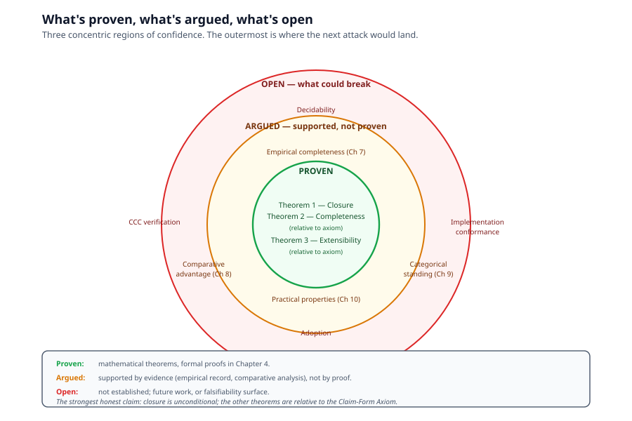
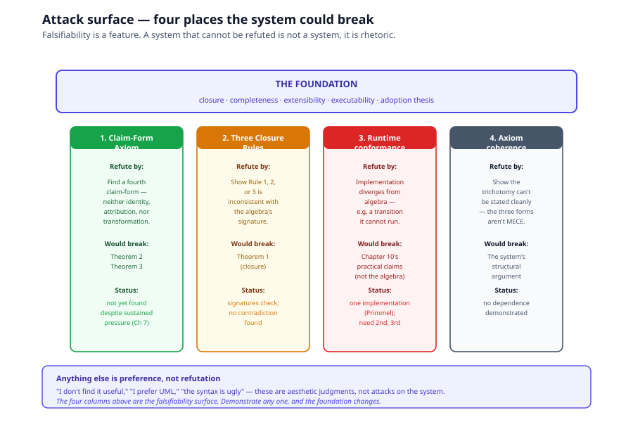

# Chapter 11, Open Questions

> *In this chapter:* what the foundation does *not* claim, where it
> could be falsified, and what future work remains. The honest close
> of the volume, falsifiability is a feature, not a vulnerability.

This chapter returns to the stakes set in
[Chapter 2 (Claims and Falsifiability)](02-claims-and-falsifiability.md)
and asks: what would change our minds?

---

## 11.1 What's proven, what's argued, what's open

### What is formally proven

- **Closure** (Theorem 1, [Chapter 4](04-proofs.md)): every operation
  of $\mathcal{M}$ applied to elements of $\mathcal{M}$ yields an
  element of $\mathcal{M}$. Unconditional.
- **Completeness relative to the Claim-Form Axiom** (Theorem 2):
  every atomic claim under the axiom has a primitive that catches
  it. Conditional on the axiom.
- **Extensibility** (Theorem 3): the system grows by enlarging
  sorts, never by adding primitives. Conditional on the axiom.

### What is argued (not proven, but supported)

- **Empirical completeness**: every candidate ninth primitive
  proposed and examined (STATE, STEP, CAN, RECEIVES, RELATES-TO,
  BECOMES) reduced to a composite
  ([Chapter 7](07-derived-vocabulary-proofs.md)). Strong evidence,
  not proof.
- **Comparative advantage**: the foundation satisfies all four
  columns of the positioning matrix
  ([Chapter 8 §8.10](08-comparative-analysis.md)) while no other
  methodology does. Strong external validation.
- **Categorical standing**: the kernel is a category, with
  Curry–Howard–Lambek giving operational semantics "for free"
  ([Chapter 9](09-categorical-foundations.md)). Conditional on the
  kernel being Cartesian closed (which we believe but have not
  formally verified).

### What is open

- **Decidability**: reasoning over an arbitrary model is not
  guaranteed to terminate.
- **Cartesian-closed verification**: we believe the kernel is a CCC,
  but have not written the proof.
- **Implementation conformance**: the runtime contract
  ([Chapter 6](06-algorithms.md)) is a specification, not (yet) a
  widely-implemented and tested runtime.
- **Adoption**: the foundation's adoption record is "to be earned."

---

## 11.2 The attack surface

Four places the system could break:

### 1. The Claim-Form Axiom

The strongest attack. Find a genuine fourth claim-form: an atomic
descriptive claim about an entity that is neither identity, nor
attribution, nor transformation, and cannot be reduced to any of
them without information loss.

- **If found**: refutes Theorem 2's completeness and forces a ninth
  primitive.
- **Status**: not yet found, despite sustained pressure during the
  design dialogue.

### 2. The Closure Rules

Show that one of Closure Rule 1 (kinds are objects), Rule 2 (values
hold references), or Rule 3 (process is reified transition) is
inconsistent with the rest of the algebra.

- **If found**: the closure proof collapses.
- **Status**: signatures check. No contradiction found.

### 3. The runtime implementation

Show that the implementation diverges from the algebra, e.g., a
transition that the runtime cannot execute, or a process instance
the runtime cannot reify.

- **If found**: the *practical* claims of
  [Chapter 10](10-executable-ground.md) fall. The algebra itself
  stands.
- **Status**: implementation is one (Primmel); we need second and
  third implementations to test.

### 4. The Claim-Form Axiom's coherence

Show that the trichotomy cannot be stated cleanly, e.g., that
"transformation" depends on "attribution" in a way that makes the
three forms not actually mutually exclusive.

- **If found**: the system's structural argument fails.
- **Status**: no such dependence has been demonstrated.

Anything else, "I don't find it useful," "I prefer UML," "the
syntax is ugly", is preference, not refutation.

---

## 11.3 What the system explicitly does not claim

For honesty, restated from
[Chapter 2 §2.5](02-claims-and-falsifiability.md):

- **We do not claim decidability.** OWL's description logics have
  decidable reasoning; this system has no analogous result.
- **We do not claim a tooling ecosystem.** The foundation is a
  candidate universal descriptive algebra, not a shipped product.
- **We do not claim novelty for any individual primitive.** Each
  has precedents. The novelty is the conjunction under one closed
  algebra.
- **We do not claim the runtime exists in finished form.** Where
  the implementation falls short of the algebra, the algebra is the
  reference, not the implementation.
- **We do not claim the system is the only possible foundation.**
  It is one candidate. Others may exist.

---

## 11.4 Future work

The volume establishes the foundation. Much remains to build on it.

### Near-term

- **Implement the runtime contract** ([Chapter 6](06-algorithms.md))
  as an independent reference, separate from the Primmel compiler.
- **Write the Cartesian-closed proof** for the kernel category.
- **Build a conformance test suite** that any kernel implementation
  must pass.
- **Specify the interchange format**, what a serialized model
  looks like, and how elaboration/resugaring round-trip.

### Medium-term

- **Apply the foundation to a second domain** outside legal
  metrology (e.g., software build pipelines, business workflows,
  scientific data provenance). Tests the extensibility claim.
- **Develop tooling**, compilers, debuggers, profilers, IDE
  integration, comparable to what OOP built over thirty years.
- **Engage with OMG / ISO** on standardization. The KerML
  convergence suggests the time is right.

### Long-term

- **Pursue decidability results** for restricted fragments of the
  algebra, the analogue of OWL's description-logics stratification.
- **Explore the meta-theory**, what can be proven about models in
  the foundation? What kind of model-checking is possible?
- **Build the adoption case**, second and third implementations,
  real-world deployments, the test that any standard is for.

---

## 11.5 The volume's thesis, restated

The IS–HAS–DOES foundation is a candidate universal *executable*
descriptive algebra, with:

- closure under three operations, proven;
- completeness relative to a stated axiom, proven;
- extensibility, proven;
- a kernel that is a category, recognized;
- a two-tier architecture with elaboration as the formal seam,
  defined;
- a comparative record against eight alternative methodologies,
  surveyed;
- practical properties (no escape hatch, reification, scale
  invariance, model = program) that follow from the algebra;
- and explicit honest limits, no decidability, no tooling, no
  adoption yet.

It is a candidate, not a final answer. The strongest claim
available is Gödel-style: we cannot prove completeness from inside,
but we can exhibit the record of every attack so far. If a fourth
claim-form exists, it has not yet been found.

---

## 11.6 How to read this volume's claim

If you finish this volume thinking "this is unfalsifiable," you have
caught a real problem and we have not done our work. The four attack
points in §11.2 are the falsifiability surface. Any one of them,
demonstrated, would change the foundation.

If you finish thinking "I want to use this", good. The foundation
is for building with. Primmel (Volume I) is one language that
targets it; the platform annex describes one runtime. The OIML
metamodel (Volume II) is one domain encoding. Pick a domain of your
own and try the algebra on it. Either it works (extensibility
theorem holds, and the foundation earns another data point), or it
breaks (you have found the next attack, and the foundation gets
stronger from the repair).

Either outcome is a contribution.

---

*This is the end of Volume 0's numbered chapters. The annexes
([FAQ](faq.md) and [Notation Reference](notation.md)) provide
supporting material. Volume I
([Primmel Kernel](../primmel/README.md)) picks up where this volume
leaves off, showing how one language operationalizes the algebra.*
