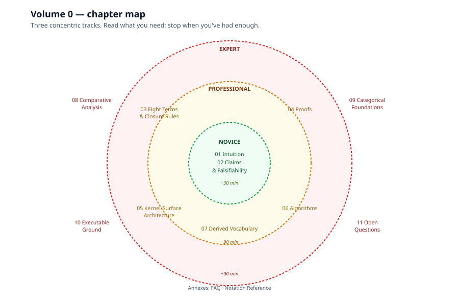
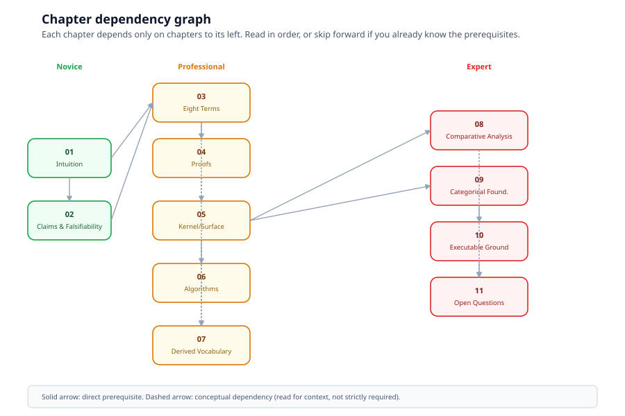

# Volume 0 — The IS–HAS–DOES Modelling System

> *The formal ground on which every other volume stands. Eight terms,
> three closure rules, three theorems, and the deeper kernel/surface
> architecture that proves the eight primitives desugar to a kernel
> with only entities, transitions, and composition.*

This is the academic foundation. Volume I chapter 2
([Subjects](../primmel/02-subjects.md)) operationalizes this system
as Primmel's subject anatomy; this volume proves why that anatomy is
exhaustive rather than heuristic, and how it relates to the broader
landscape of modelling methodologies.

---

## Why this volume exists

Most modelling systems are *notations* — UML, BPMN, EXPRESS, OPM,
RDF/OWL — each with its own vocabulary, its own diagram conventions,
its own meta-model, its own escape hatches where the notation stops
and code begins. None of them prove themselves closed under their own
operations.

This volume does. It defines a minimal algebra 𝓜, proves the algebra
is closed, complete (relative to a stated axiom), and extensible, and
then shows that the algebra can be reduced further — to a kernel with
only entities, transitions, and composition — while the eight
primitives remain useful as a *surface vocabulary* that desugars to
the kernel. That two-tier architecture, arrived at independently by
SysML v2 / KerML for different reasons, is the load-bearing result.

If you only read one chapter, read
[Chapter 1 (Intuition)](01-intuition.md). If you read three, add
[Chapter 3 (Eight Terms and Closure Rules)](03-eight-terms-and-closure-rules.md)
and [Chapter 4 (Proofs)](04-proofs.md).

---

## Reading tracks

The volume is layered by depth. Read what you need; stop when you've
had enough.

### Novice track — chapters 1–2 (~30 minutes)

Goal: understand what IS/HAS/DOES is, why it's three buckets and not
seven, what it claims, and what would refute it.

- [Chapter 1 — Intuition](01-intuition.md) — the three natural
  questions, the onion at a glance, the dialectic that killed off
  candidate primitives (STATE, CAN, RECEIVES, RELATES-TO, BECOMES).
- [Chapter 2 — Claims and Falsifiability](02-claims-and-falsifiability.md)
  — the Claim-Form Axiom stated upfront; what we claim; what would
  refute us.

### Professional track — chapters 3–7 (+90 minutes)

Goal: model with the system, argue for it, recognize when something
is being passed off as a new primitive that is actually a composite.

- [Chapter 3 — Eight Terms and Closure Rules](03-eight-terms-and-closure-rules.md)
  — the formal algebra 𝓜.
- [Chapter 4 — Proofs](04-proofs.md) — closure, completeness,
  extensibility, full rigor.
- [Chapter 5 — Kernel/Surface Architecture](05-kernel-surface-architecture.md)
  — Tier 0 (entities + transitions + composition) and Tier 1 (the
  eight primitives) with the desugaring map.
- [Chapter 6 — Algorithms](06-algorithms.md) — elaboration,
  resugaring, reification, evaluation, state-location.
- [Chapter 7 — Derived Vocabulary Proofs](07-derived-vocabulary-proofs.md)
  — six retired terms (STATE, STEP, CAN, RECEIVES, RELATES-TO,
  BECOMES), each with a full derivation.

### Expert track — chapters 8–11 (+90 minutes)

Goal: defend the system against methodological comparison, contribute
to its extension, locate the seams where it could break.

- [Chapter 8 — Comparative Analysis](08-comparative-analysis.md) —
  vs OPM, OOP, UML/fUML, SysML v2/KerML, BPMN, EXPRESS, RDF/OWL,
  Petri nets; the positioning matrix; the adoption-via-executability
  thesis.
- [Chapter 9 — Categorical Foundations](09-categorical-foundations.md)
  — arrows-only category; identity morphisms; Curry–Howard–Lambek;
  KerML as independent precedent.
- [Chapter 10 — The Executable Ground](10-executable-ground.md) — no
  escape hatch; reification; scale invariance; model=program;
  adoption lesson.
- [Chapter 11 — Open Questions](11-open-questions.md) — what is not
  proven; falsifiability; future work.

### Annexes

- [FAQ](faq.md) — anticipated objections, Q&A format.
- [Notation Reference](notation.md) — every math symbol and LaTeX
  equivalent used in the volume.

---

## The one-sentence summary

> Peel the onion outward: IS individuates; objects bear; properties
> and values describe; transitions transform; processes fold
> transformation back into objecthood. Three closure rules seal the
> seams. Eight terms — not because eight is a lucky count, but
> because type and instance were finally separated on both axes, and
> once that joint is cut correctly, the list stops growing.

---

## Conventions

This volume follows the documentation tree's conventions
([`docs/README.md`](../README.md) §Conventions), with two extensions
specific to formal/math content.

### Math notation

Phases 1–2 of this volume use Unicode math symbols (⊆, →, ∘, ⇀, ↪,
×, ∈, ⊂, ι, ρ, σ). Phase 3 (chapters 8–11) introduces LaTeX-style
rendering via KaTeX for diagrams that demand it (commutative diagrams,
proof-rule inference bars, fractions). The Unicode symbols continue
to render in raw markdown views; KaTeX only kicks in inside `$…$` /
`$$…$$` delimiters.

See [Notation Reference](notation.md) for the full symbol list with
LaTeX equivalents.

### Status markers

Following the tree convention:

- ● exists in the running system
- ◐ partial
- ○ planned

Most claims in this volume are mathematical, not implementation,
claims; status markers apply only where a claim depends on the
runtime actually existing (Chapter 10).

### Diagram palette

The volume extends the tree's standard palette
(indigo/green/amber/red/slate/violet for IS/HAS/DOES-specific content)
with a **formal/math palette** for kernel-and-category diagrams:

| Use | Color tokens |
|---|---|
| Kernel / Tier 0 constructs | teal `#0d9488`, dark `#115e59`, light `#f0fdfa` |
| Surface / Tier 1 constructs | gray `#475569`, dark `#1e293b`, light `#f8fafc` |
| Elaboration / desugaring arrows | dashed lines (1.6px stroke) |
| Reification (`ρ`) | double-stroke lines |
| Math notation | monospace font (system stack) |

All diagrams are hand-authored SVG, 900×600 viewBox default, system
font stack (`ui-sans-serif, system-ui, sans-serif`).

---

## How to cite this volume

When extending or critiquing the modelling system in another volume,
cite specific chapters and sections. For example:

> "Volume I chapter 2 §2.2's IS/HAS/DOES trichotomy is exhaustive
> under the Claim-Form Axiom (Volume 0 chapter 2 §2.2); the closure
> of the algebra under composition, reification, and embedding is
> proven in Volume 0 chapter 4 §4.2."

If a chapter in Volumes I–III ever seems to introduce a ninth
modelling term, treat it as a materialized view (Volume 0 chapter 7)
and check what composite it is shorthand for.

---

## Source

This volume is the formal reconstruction of a multi-model design
dialogue consolidated in `poe.txt` (the `oimlsmart/smart` repository,
3,442 lines). The dialogue is the negotiation record; this volume is
the developed form. Where prose here and the dialogue disagree, this
volume is canonical.

---

*Next: [Chapter 1 — Intuition](01-intuition.md).*
