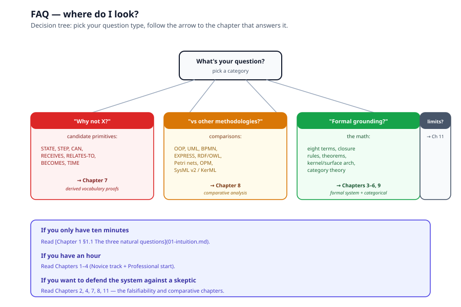

# FAQ, Anticipated Objections

> *A Q&A annex. Each question links to the chapter that answers it
> in depth. If your question isn't here, consult the
> [chapter dependency graph](README.md#annexes) or
> the [open questions](11-open-questions.md).*

---

## Q1. Why not STATE as a fourth primitive?

Because STATE is a positional identifier for an execution, not a
property of an entity. The word conflates two things:

- **Data state** (the current value of a property, e.g. temperature
  100°C), covered by HAS, no new primitive.
- **Control state** (which node in the transition graph is active
  for a particular run), a pointer pair `(ρ(t), t_i)`, derivable
  from the kernel.

Full derivation in
[Chapter 7 §7.2 STATE](07-derived-vocabulary-proofs.md#72-state-a-positional-identifier-not-a-property).

---

## Q2. Why not CAN as a fourth primitive?

CAN is a modal operator on DOES, it strips the actualization
commitment. "A bird can fly" is "a bird flies" minus the tense. As
a quantifier over reifications:

$$
\mathrm{CAN}(x, t) \;\equiv\; \mathrm{DOES}(x, t) \;\wedge\; \neg\mathrm{running}(\rho(t))
$$

CAN without a condition is too coarse; CAN with a condition is just
"DOES under condition C." Either way, not a primitive. Full
derivation in [Chapter 7 §7.4 CAN](07-derived-vocabulary-proofs.md).

---

## Q3. Why not BECOMES? Things change over time

BECOMES is not a fact about an entity, it is a *comparison* across
two facts. "The door becomes closed" is the diff of two timestamped
value-readings:

$$
\mathrm{BECOMES}(x, p, t_1, t_2) \;\equiv\; \mathrm{HAS}(x, p)(t_1) \neq \mathrm{HAS}(x, p)(t_2)
$$

No database has a "BECOMES" column. The verb is convenient; the
ontology isn't. Full derivation (including the caterpillar-butterfly
case) in
[Chapter 7 §7.7 BECOMES](07-derived-vocabulary-proofs.md).

---

## Q4. What about relations? Things stand in relation to each other

Relations are HAS with object-valued values. Closure Rule 2
(`ι : O ↪ V`) permits a value to be a reference to another object:

$$
\mathrm{RELATES\text{-}TO}(x, y) \;\equiv\; \mathrm{HAS}(x, p, \iota(y))
$$

"owns," "adjacent-to," "depends-on," "part-of," "employed-by", all
reduce the same way. When the relation itself needs properties (e.g.
start-date), reify it as its own object (the ER junction-entity
move). Full derivation in
[Chapter 7 §7.6 RELATES-TO](07-derived-vocabulary-proofs.md).

---

## Q5. What about TIME?

Time is ordering from composition, plus timestamps as values. If
$t_2 \circ t_1$ is well-defined, $t_1$ happened before $t_2$. No
"Time" sort is needed. This is what physicists and process calculi
both discovered independently. Full derivation in
[Chapter 7 §7.8 TIME](07-derived-vocabulary-proofs.md).

---

## Q6. How is this different from OOP?

OOP's escape hatch is the method body. A method signature is a
label (name, parameter list, return type); the behavior lives in a
separate language (Java, Python, C++) with separate grammar and
semantics. The model documents intent; the code implements it;
nothing formal ties them together.

The foundation has no escape hatch. A transition decomposes into
smaller transitions by the same composition operator, terminating in
atomic transitions the runtime provides. Behavior is inside the
model all the way down. See
[Chapter 8 §8.5 OOP](08-comparative-analysis.md) and
[Chapter 10 §10.1 No escape hatch](10-executable-ground.md).

---

## Q7. How is this different from UML?

UML has roughly a dozen distinct diagram types (class, object,
activity, sequence, state machine, communication, component,
deployment, use case, package) because it never unifies structure
and behavior under one recursive operator. Each diagram type has
its own metaclass and its own semantics; alignment across diagrams
is maintained by hand.

The foundation's claim, composition of transitions is itself a
transition, so "step," "process," and "system" are the same
primitive at different scale, is precisely the unification UML
never attempts. See
[Chapter 8 §8.4 UML/fUML](08-comparative-analysis.md).

---

## Q8. How is this different from BPMN?

BPMN is widely adopted because engines exist (Camunda, Flowable,
jBPM). But its semantics is defined by prose plus vendor behavior;
token flow through inclusive gateways was famously ambiguous for
years; conformance means "roughly what the major engines do."

BPMN proves executability wins adoption; it also proves
executability *without* a formal kernel accumulates semantic debt
that can never be repaid. The foundation's kernel is closed under
composition by construction (Theorem 1, [Chapter 4](04-proofs.md));
the debt cannot accumulate. See
[Chapter 8 §8.6 BPMN](08-comparative-analysis.md).

---

## Q9. How is this different from OPM?

OPM (ISO/PAS 19450:2015) is the closest intellectual relative ,
unified object/process ontology, one diagram kind. But OPM
postulates two irreducible sorts where the foundation derives one
sort with object/process as roles. OPM has ~12 hard-coded link
types where the foundation's surface vocabulary desugars to a
one-sort kernel. OPM is animated but not executable; the
foundation's kernel *is* execution.

See [Chapter 8 §8.2 OPM](08-comparative-analysis.md) for the full
comparison.

---

## Q10. What is the Claim-Form Axiom, and why does it matter?

The axiom (stated in
[Chapter 2 §2.2](02-claims-and-falsifiability.md)):

> Every atomic descriptive claim about an entity is one of three
> forms: an identity claim (what it is), an attribution claim (what
> it has), or a transformation claim (what it does).

It matters because the completeness theorem (Theorem 2,
[Chapter 4](04-proofs.md)) is *relative to* this axiom. We cannot
prove the axiom, that would be a Gödel-style impossibility. What
we can do is state it explicitly so it can be examined.

If you can exhibit a fourth claim-form, an atomic claim that is
neither identity, nor attribution, nor transformation, and cannot
be reduced to any of them, the system breaks there.

---

## Q11. Is the system falsifiable?

Yes, with four attack points
([Chapter 11 §11.2](11-open-questions.md)):

1. Find a genuine fourth claim-form (attacks Theorem 2).
2. Show one of the three closure rules is inconsistent (attacks
   Theorem 1).
3. Show the runtime implementation diverges from the algebra
   (attacks Chapter 10's practical claims, not the algebra).
4. Show the trichotomy isn't actually MECE (attacks the system's
   structural argument).

Anything else, "I prefer UML," "the syntax is ugly", is
preference, not refutation.

---

## Q12. Why eight terms, specifically?

Because type and instance were finally separated on both axes.
Once you separate:

- the **static** axis into PROPERTY (the slot) and VALUE (the
  content), and
- the **dynamic** axis into TRANSITION (the rule) and PROCESS (the
  reified transition, an object),

the list stops growing. Eight is not a lucky count; it is the
consequence of cutting the type/instance joint correctly. See
[Chapter 1 §1.4](01-intuition.md) and
[Chapter 3](03-eight-terms-and-closure-rules.md).

---

## Q13. Can I extend the system with my own primitives?

No, by design. Theorem 3 (extensibility,
[Chapter 4](04-proofs.md)) says:

- Adding content (new kinds, properties, values, transitions) is
  always fine, the algebra grows monotonically.
- Adding *primitives* is not. A proposed ninth primitive is either
  reducible to the eight (in which case it's a composite, not a
  primitive) or it violates the Claim-Form Axiom (in which case it
  changes what "modelling" means).

If you find yourself wanting a new primitive, write it as a
materialized view (see Chapter 7 for six examples) instead.

---

## Q14. Why a kernel/surface split?

Because the eight primitives are useful for authoring but not
irreducible. Pushing the reductions through (Chapter 5) yields a
kernel with one sort and one operation, a category. The
eight-term surface remains as syntactic sugar that elaborates into
the kernel.

Two benefits:

1. **Minimality**: the trusted base (what a conforming runtime
   implements) is tiny.
2. **Legibility**: authors use the surface vocabulary that matches
   their mental model.

This is the same architecture SysML v2 / KerML arrived at
independently. See [Chapter 5](05-kernel-surface-architecture.md)
and [Chapter 9 §9.6 KerML](09-categorical-foundations.md).

---

## Q15. What does "executable" mean, concretely?

A conforming runtime implements five algorithms
([Chapter 6](06-algorithms.md)):

- **Elaboration**, desugar Tier 1 statements to kernel triples.
- **Resugaring**, project kernel triples back to Tier 1 for
  display.
- **Reification** ($\rho$), turn a transition into an object.
- **Evaluation**, apply a transition to its input.
- **State-location** ($\sigma$), locate where an execution is.

Anything beyond these five is definition, not implementation. See
[Chapter 10 §10.5 Specification=implementation](10-executable-ground.md).

---

## Q16. What's not proven?

- **Decidability.** No guarantee that reasoning over an arbitrary
  model terminates.
- **Cartesian-closed verification.** We believe the kernel is a
  CCC (which would give operational semantics via
  Curry–Howard–Lambek), but have not written the proof.
- **Implementation conformance.** The runtime contract is a spec;
  we need second and third implementations to test it.
- **Adoption.** The foundation's adoption record is "to be earned."

See [Chapter 11](11-open-questions.md) for the full honest list.

---

## Q17. Where do I start reading?

- **Novice**, [Chapter 1](01-intuition.md) alone.
- **Professional**, [Chapters 1–7](README.md#reading-tracks).
- **Expert**, the whole volume.

If you only have ten minutes, read
[Chapter 1 §1.1 The three natural questions](01-intuition.md).

---

## Q18. How does this connect to Primmel (Volume I) and OIML SMART (Volumes II–III)?

- **Primmel** operationalizes the eight primitives as a subject
  anatomy (Volume I, chapter 2).
- **Processes** in Primmel are reified transitions (Volume I,
  chapter 4, see Closure Rule 3).
- **Mapping** between reference and implementation models is
  HAS-with-reference (Volume I, chapter 5, Closure Rule 2).
- **The OIML subject chain** (Family → Group → Model → Sample) is
  the IS relation at four grains (Volume II, chapter 2, Closure
  Rule 1).

If a chapter in Volumes I–III ever seems to introduce a ninth
modelling term, treat it as a materialized view
([Chapter 7](07-derived-vocabulary-proofs.md)) and check what
composite it is shorthand for.

---

*Back to [Volume 0 README](README.md).*
