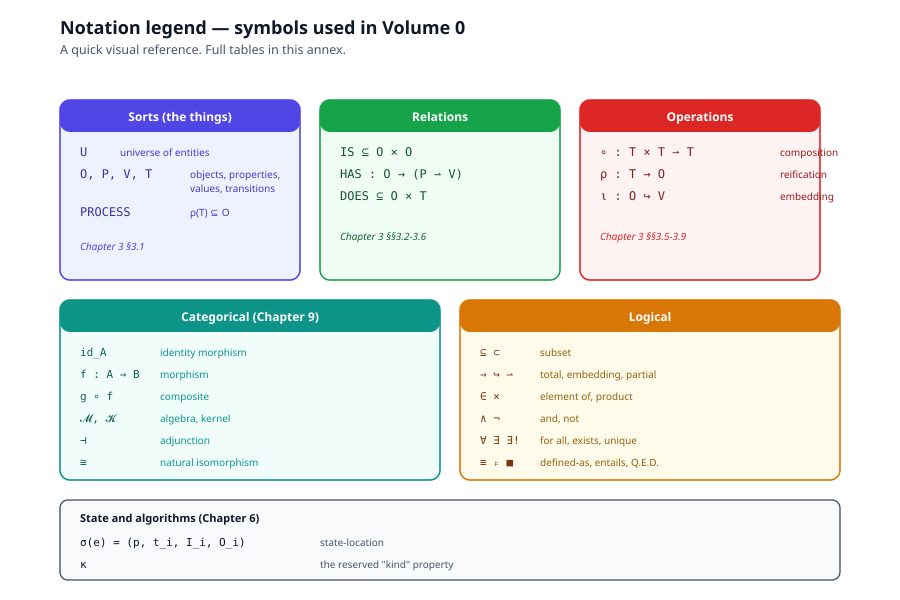

# Notation Reference

> *Every math symbol used in Volume 0, with one-line meaning. Unicode
> forms are used in Phases 1–2; LaTeX forms (rendered via KaTeX) are
> used in Phase 3 (chapters 8–11).*

---

## Sorts

| Symbol | LaTeX | Meaning |
|---|---|---|
| $U$ | `U` | the universe of entities (kernel) |
| $O$ | `O` | the set of objects |
| $P$ | `P` | the set of properties |
| $V$ | `V` | the set of values |
| $T$ | `T` | the set of transitions |
| $\mathrm{PROCESS}$ | `\mathrm{PROCESS}` | reified transitions, $\rho(T) \subseteq O$ |

---

## Relations

| Symbol | LaTeX | Signature | Meaning |
|---|---|---|---|
| $\mathrm{IS}$ | `\mathrm{IS}` | $\mathrm{IS} \subseteq O \times O$ | individuation: identity and kind-membership |
| $\mathrm{HAS}$ | `\mathrm{HAS}` | $\mathrm{HAS} : O \to (P \rightharpoonup V)$ | attribution: maps object to its property-value partial function |
| $\mathrm{DOES}$ | `\mathrm{DOES}` | $\mathrm{DOES} \subseteq O \times T$ | dynamics: relates object to its transitions |

---

## Operations

| Symbol | LaTeX | Signature | Meaning |
|---|---|---|---|
| $\circ$ | `\circ` | $\circ : T \times T \rightharpoonup T$ | composition (when interfaces match) |
| $\rho$ | `\rho` | $\rho : T \to O$ | reification: a transition becomes an object |
| $\iota$ | `\iota` | $\iota : O \hookrightarrow V$ | embedding: an object can be a value |

---

## Categorical notation

| Symbol | LaTeX | Meaning |
|---|---|---|
| $\mathrm{id}_A$ | `\mathrm{id}_A` | identity morphism on object $A$ |
| $f : A \to B$ | `f : A \to B` | morphism from $A$ to $B$ |
| $g \circ f$ | `g \circ f` | composite: $A \xrightarrow{f} B \xrightarrow{g} C$ |
| $\mathcal{K}$ | `\mathcal{K}` | the kernel: $\langle U, \tau, \circ \rangle$ |
| $\mathcal{M}$ | `\mathcal{M}` | the eight-term algebra |
| $\mathrm{Hom}_O$ | `\mathrm{Hom}_O` | hom-set in category of objects |
| $\cong$ | `\cong` | natural isomorphism |
| $\dashv$ | `\dashv` | adjunction (left adjoint $\dashv$ right adjoint) |

---

## Set-theoretic and logical symbols

| Symbol | LaTeX | Meaning |
|---|---|---|
| $\subseteq$ | `\subseteq` | subset or equal |
| $\subset$ | `\subset` | proper subset |
| $\hookrightarrow$ | `\hookrightarrow` | embedding (injective map) |
| $\rightharpoonup$ | `\rightharpoonup` | partial function |
| $\to$ | `\to` | total function or morphism |
| $\times$ | `\times` | Cartesian product |
| $\in$ | `\in` | element of |
| $\wedge$ | `\wedge` | logical and |
| $\neg$ | `\neg` | logical not |
| $\forall$ | `\forall` | for all |
| $\exists$ | `\exists` | there exists |
| $\exists!$ | `\exists!` | there exists a unique |
| $\equiv$ | `\equiv` | definitional equivalence |
| $\models$ | `\models` | semantic entailment / models |
| $\blacksquare$ | `\blacksquare` | Q.E.D. (end of proof) |

---

## State and algorithms

| Symbol | LaTeX | Meaning |
|---|---|---|
| $\sigma$ | `\sigma` | state-location function: $\sigma(e) = (p, t_i, I_i, O_i)$ |
| $\kappa$ | `\kappa` | the reserved "kind" property (used to desugar IS) |
| $V_{in}$, $V_{out}$ | `V_{in}`, `V_{out}` | input and output value-interfaces of a transition |
| $t_i$ | `t_i` | the currently-active (or next) transition in an execution |
| $I_i$, $O_i$ | `I_i`, `O_i` | bound inputs / produced outputs at the current step |

---

## Conventions

### Math in this volume

- **Phases 1–2** (chapters 1–7, README): Unicode math symbols
  (⊆, →, ∘, ⇀, ↪, ×, ∈, ⊂, ι, ρ, σ). Renders in any markdown viewer.
- **Phase 3** (chapters 8–11): LaTeX math inside `$…$` (inline) and
  `$$…$$` (display), rendered by KaTeX. The Unicode symbols continue
  to render in raw markdown views; KaTeX only kicks in inside math
  delimiters.

### Color palette for diagrams

| Use | Color tokens |
|---|---|
| IS aspect (identity) | green `#16a34a`, dark `#14532d`, light `#f0fdf4` |
| HAS aspect (attribution) | amber `#d97706`, dark `#78350f`, light `#fffbeb` |
| DOES aspect (dynamics) | red `#dc2626`, dark `#7f1d1d`, light `#fef2f2` |
| Subject / brand | indigo `#4f46e5`, dark `#3730a3`, light `#eef2ff` |
| Structure / connectors | slate `#0f172a`, mid `#475569`, light `#f8fafc` |
| Kernel / Tier 0 (formal) | teal `#0d9488`, dark `#115e59`, light `#f0fdfa` |
| Elaboration / desugaring | dashed lines, 1.6px stroke |
| Reification ($\rho$) | double-stroke lines |

All SVGs hand-authored, 900×600 viewBox default, system font stack
(`ui-sans-serif, system-ui, sans-serif`).

### Status markers

Following the documentation tree convention:

- ● exists in the running system
- ◐ partial
- ○ planned

Most claims in Volume 0 are mathematical, not implementation;
markers apply only where a claim depends on a runtime.

---

*Back to [Volume 0 README](README.md).*
