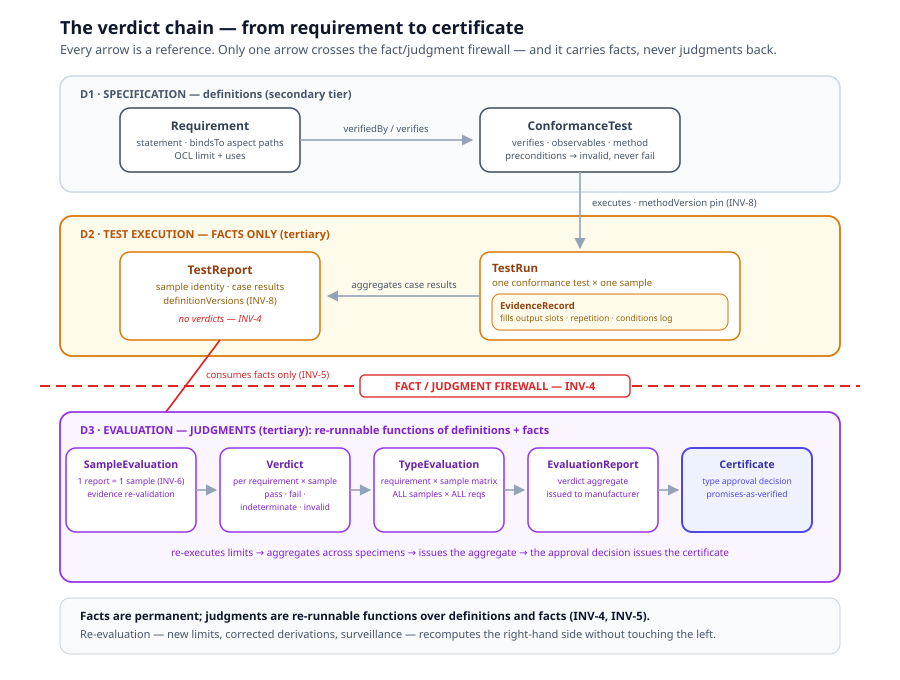
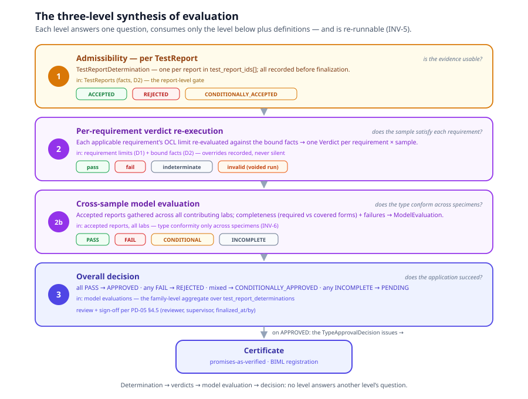

# Chapter 7 — Evaluation

> *In this chapter:* Module D3 of the metamodel — judgment as a re-runnable
> function. Sample evaluations, verdicts, type evaluations, evaluation
> reports, and the approval decision: how permanent facts become legal
> conclusions, and why the computation can always be run again.

---

## 7.1 Module D3: judgments are functions, not records

Module D3 (`evaluation` in
`ontology-remix/OIML Core Models/Ontology/oiml-core-ontology.yaml`) consumes
D1 definitions and D2 reports — **and nothing else**. Its dependency rule
is the sharpest in the metamodel: *evaluation depends on D1 and D2 only; it
touches nothing physical.* A verdict cannot change a sample, a run, or an
evidence record. It is a pure function:

```text
verdict = f( requirement definition , bound facts , limit snapshot )
```

The payoff is INV-5: **re-evaluation requires no re-testing.** New class
limits, a corrected derivation, a surveillance re-assessment — each is a
re-run of the function over the same permanent facts. A judgment in this
architecture is never an event that happened once in someone's head; it is
a computation whose inputs are all on record, so it can be recomputed,
audited, and — when an evaluator lawfully intervenes — overridden with the
override itself on record.



The full chain — requirement → test → run → report → evaluation → verdict
→ type evaluation → certificate — with the fact/judgment firewall between
D2 and D3. Everything left of the firewall is fact; everything right of it
is re-computable judgment.

## 7.2 SampleEvaluation — one report, one sample

A **SampleEvaluation** is the judgment pass over **exactly one TestReport
(= one Sample)** — INV-6's correspondence made executable. Its first act is
not to judge but to **validate evidence** (`evidenceValidation`):

- `formulaRechecks` — re-run every Formula derivation over the recorded
  inputs; each `{ formula, consistent }` confirms the report's derived
  values are what the definition computes (a lab that hand-edited a
  derived value is caught here, not by a reviewer squinting);
- `constraintRechecks` — re-run the ConstraintChecks against the recorded
  values; a constraint now violated re-flags the run;
- `allRunsAdmissible` — confirm every contributing run passed the
  admissibility gate of Chapter 6.

Only then does evaluation judge comparisons. Evidence validation is itself
re-execution — the same OCL statements, evaluated again over the same
facts (INV-9: the statement executes identically in D2 and D3). ◐ in the
running system: run-time constraint checks and admissibility are ●
(test-run service); the evaluation-time re-validation pass is wired where
verdicts re-execute (below) and is being consolidated into a single
declared gate.

## 7.3 Verdict — one requirement, one sample

The **Verdict** is the atomic judgment: one requirement × one Sample. Its
fields make the function's inputs explicit:

- `factUnderJudgment` — `{ name, value: QuantityValue }`: the observed
  fact the limit ran against — resolved from the requirement's primary
  `binds_to` path on the entity graph (e.g. `sample.test_context.d_max`)
  or from the computed value realizing an observable symbol (e.g. `e_l`);
- `limit` — the **limit snapshot**: the OCL expression and every input
  value it was evaluated with. The verdict carries its own reproducibility;
- `uncertaintyConsidered` — whether measurement uncertainty entered the
  comparison (the acceptance decision rule of §5.4);
- `outcome` — one of four:

| Outcome | Meaning |
|---|---|
| `pass` | the fact satisfies the limit |
| `fail` | the fact violates the limit |
| `indeterminate` | no judgment possible — a **real metrological outcome**, not an error |
| `invalid` | a violated run-validity precondition voids the evidence |

The four outcomes are a deliberate epistemology:

- **`indeterminate` is real.** Metrologically, an uncertainty interval
  overlapping the limit is a genuine third answer, not a malfunction —
  and, operationally, missing evidence or an unevaluable expression lands
  here too, with the reason recorded in `notes`. A system with only
  pass/fail forces these cases into a lie in one direction or the other.
- **`invalid` comes only from violated preconditions** (§5.6) — it voids
  the **run**, never the instrument. An invalid verdict is not a failure;
  it is the absence of a usable test, routing the sample back to the
  bench. `preconditionViolations` lists the violated precondition ids.

Two more fields discipline the judgment's legal force:

- **`modality`** — `shall` (default) or `should`, inherited from the
  requirement limit. A failed *should*-verdict is an **observation** in
  the evaluation report, never a pass/fail blocker; the decision rule
  reads only shall-verdicts. (The ISO/IEC Directives modality catalog,
  enforced at computation time.)
- **`criterion`** — the R 91-2 §6.1 taxonomy stamped on the verdict:
  `I/MPE` (limit during the influence factor), `D/NSFa` (no significant
  fault *after* the disturbance — recorded manual intervention allowed),
  `D/NSFd` (no significant fault *during*), `n/a` (observational).

And the human override: an evaluator may replace a computed outcome — the
override is **recorded, never silent**: `overridden`, `override_note`
(mandatory justification), `override_by`. The function re-runs; the
override is data over its result, so the record always shows both what the
machine computed and what the human decided. ●
(`browser/src/services/verdict.service.ts`, `VerdictMatrix.vue`;
`data/r60/entities/workflow.yaml` — Verdict.)

## 7.4 Verdicts re-execute the canonical chain

Where does the limit come from? From the one home declared in D1: the
requirement's `limit.expression`, or — for shared acceptance quantities —
the VerdictQuantity registry (`data/r60/specification/verdicts.yaml`),
referenced via `limit.accepts: { verdict, op, limit }`. The registry
parses each derivation once per standard load; the requirement-level
verdict service and the form-level calculation engine evaluate the same
cached AST, so the lab's on-form indication and the authority's verdict
cannot diverge by construction. The historical defect this kills is the
restatement: one acceptance quantity computed three slightly different
ways at three layers (the MDLO case — requirement, form, and report once
disagreed on normalization *and* on the v→v_min conversion; the single
registry derivation `mdlo_normalized` replaced all three).

This is the executable meaning of "derived once, referenced everywhere"
from Chapter 5 — and the reason evaluation is a *re*-execution rather than
a first execution of anything.

## 7.5 TypeEvaluation — conformity is established across samples

A **TypeEvaluation** is conformity assessment on **one or more specimens**
of an identified type (OIML V 1:2022, 2.04). It exists because type
conformity is a property of the *type*, and a type is only ever observed
through its specimens — INV-6: type conformity is established **only** by
TypeEvaluation across Samples.

- `sampleEvaluations` — the per-sample judgment passes;
- `crossSampleChecks` — checks that only make sense across specimens:
  declared parameters identical across samples, family criteria holding,
  no sample silently re-specified between labs;
- `perRequirementMatrix` — the requirement × sample → outcome matrix (the
  VerdictMatrix view: every applicable requirement, every specimen, one
  cell each);
- `typeVerdict` — the synthesis rule: **ALL samples, ALL requirements**.
  One specimen passing is a fact about that specimen; the type passes when
  every cell of the matrix is pass (should-observations and invalids
  handled by their rules above).

◐ in the running system: the cross-lab/cross-sample synthesis runs as
`ModelEvaluation` on the EvaluationReport (required vs covered forms,
contributing reports and labs, decision `PASS | FAIL | CONDITIONAL |
INCOMPLETE`), with the per-requirement matrix re-executed by the verdict
service; the metamodel's single `TypeEvaluation` class with its declared
matrix and rule is the v3 consolidation. ● for the matrix itself.

## 7.6 EvaluationReport and TypeApprovalDecision

The **EvaluationReport** is the verdict aggregate the TypeEvaluation
issues: subject (the Model), typeVerdict, the basis Recommendation, the
recipient (`issuedTo` the Manufacturer), issue date. It is a judgment
artifact — it restates no evidence, only references it.

The **TypeApprovalDecision** is the act of legal relevance *based on
review of the evaluation report* (OIML V 1:2022, 2.05): an authority
reviews the computed aggregate and decides `approved | rejected`. On
approval it **issues the Certificate** — the conformity artifact of Module
B, whose characteristic list is the subject's **promises-as-verified**
(Volume I, Chapter 2). The chain closes: manufacturer promises (IS) →
requirements constrain → tests observe → runs record → verdicts judge →
the certificate prints the promises, now verified.

## 7.7 The three-level synthesis

Evaluation in the running system is not a single checkbox aggregation but
a layered synthesis (`docs/oiml-smart-modelling-methodology.md` §7):



- **Level 1 — admissibility, per TestReport.** Each report receives a
  `TestReportDetermination`: `ACCEPTED | REJECTED |
  CONDITIONALLY_ACCEPTED`. One per entry in `test_report_ids[]`;
  finalization requires all of them. This is the report-level gate:
  is this evidence package usable at all?
- **Level 2 — per-requirement verdict re-execution.** Each applicable
  requirement's OCL limit is re-evaluated against the bound evidence →
  one Verdict per requirement × sample (§7.3).
- **Level 2b — cross-sample model evaluation.** Per model, evidence is
  gathered across the accepted reports of all contributing labs;
  completeness (required vs covered forms) plus failures derive the
  `ModelEvaluation.decision`: `PASS` (all required forms covered, no
  failures), `FAIL` (any FormInstance result FAIL), `CONDITIONAL`
  (covered with non-passing evidence), `INCOMPLETE` (forms missing).
- **Level 3 — the overall decision.** `overall_decision`: all PASS →
  `APPROVED`; any FAIL → `REJECTED`; mixed/indeterminate →
  `CONDITIONALLY_APPROVED`; any INCOMPLETE → `PENDING` (cannot finalize).
  On APPROVED the authority issues the Certificate (Chapter 8).

Each level consumes only the level below plus definitions; each is
re-runnable. The levels answer different questions — *is the evidence
usable? does the sample satisfy each requirement? does the type conform
across specimens? does the application succeed?* — and the architecture
refuses to let one level answer another's question.

## 7.8 Continuous verdicts — the same judgment, on a new rhythm ○

Nothing in this chapter changes when the evidence arrives continuously. A
verdict was never an event; it is a function (§7.1), and the twin
direction (Volume I, Chapter 14 ○) only calls that function on a new
rhythm: monitors evaluate the same requirement OCL over served live
evidence, and each outcome is a Verdict in exactly this chapter's sense —
one requirement × one subject, fact under judgment, limit snapshot, four
outcomes.

Two of this chapter's disciplines carry the live case without
modification:

- **`indeterminate` absorbs staleness.** A stale served value is not a
  metrological event, and silence is not evidence: the verdict degrades
  to `indeterminate` with the reason recorded (§7.3). No fifth outcome is
  needed.
- **INV-5 is the audit story.** Continuous verdicts remain re-runnable
  functions over the accumulated evidence stream: a later engine
  re-judges any time window against new limits without asking the
  instrument anything.

And one boundary holds: continuous verdicts feed surveillance and the
certificate's post-issue life (Chapter 8); they do not replace
TypeEvaluation. Type conformity is still established across Samples
(INV-6) — a fleet of passing monitors is evidence about units, not a type
verdict.

## 7.9 Grammar sketch *(illustrative v3 syntax)*

```prl
sample_evaluation SE-0091 {
  report  TR-2026-0091                        # exactly one (INV-6: = one sample)
  sample  sample:ACME-LC-500-SN0047
  evidence_validation {
    formula_rechecks    [{ formula: loadCellError, consistent: true }]
    constraint_rechecks [{ constraint: constr:r60:fig3-2b, result: satisfied }]
    all_runs_admissible true
  }

  verdict /req/metrological/mpe × sample:ACME-LC-500-SN0047 {
    fact_under_judgment { name: observable:e_l, value: 0.12 v }
    limit_snapshot { accepts: mdlo_normalized, op: lte,
                     inputs: { mpe: 0.5 v, accuracy_class: C } }
    uncertainty_considered true
    modality shall
    outcome pass                               # computed; re-runnable
  }

  verdict /req/metrological/creep × sample:ACME-LC-500-SN0047 {
    fact_under_judgment { name: observable:c_c, value: 0.41 v }
    outcome indeterminate                      # real outcome; reason recorded:
    notes "uncertainty interval overlaps 0.7·MPE limit"
  }
}

type_evaluation TE-0007 {
  model             model:ACME-LC-500
  sample_evaluations [SE-0091, SE-0092]        # one or more specimens
  cross_sample_checks [declared-parameters-identical, family-criteria-hold]
  per_requirement_matrix { mpe: [pass, pass], creep: [indeterminate, pass], … }
  type_verdict = ALL(samples, ALL(requirements))
}

evaluation_report ER-2026-003 {
  type_evaluation TE-0007
  subject model:ACME-LC-500
  basis   R60:2021
  issued_to manufacturer:ACME
}

type_approval_decision {
  based_on_report ER-2026-003                  # review of the report (VIML 2.05)
  authority "NMI Issuing Authority"
  decision  approved
  issues_certificate cert:R60-2026-…
}
```

## 7.10 Validation rules

- a SampleEvaluation references exactly one TestReport and its Sample
  (INV-6); `evidenceValidation` must precede verdict computation;
- every Verdict names one requirement and one sample, and carries the
  limit snapshot it was computed with;
- `outcome = invalid` requires non-empty `preconditionViolations`;
  `outcome = indeterminate` requires a recorded reason;
- `modality: should` verdicts never enter the pass/fail decision rule;
- an override requires `override_note` and `override_by`; the computed
  outcome remains on record alongside it;
- a TypeEvaluation covers one or more SampleEvaluations of one Model;
  `typeVerdict` is derived by the ALL/ALL rule, never hand-set;
- a TypeApprovalDecision references an issued EvaluationReport; the
  Certificate it issues references the decision (Module B), closing the
  chain;
- D3 references D1 and D2 only — a verdict touching a physical entity
  (sample, equipment) is a dependency-rule violation.

## 7.11 Summary

- Evaluation is a pure function over D1 definitions and D2 facts:
  re-runnable by construction, re-evaluation without re-testing (INV-5).
- A SampleEvaluation validates evidence (formula/constraint re-checks,
  admissibility) over exactly one TestReport, then judges.
- A Verdict is one requirement × one sample: fact under judgment, limit
  snapshot, and four honest outcomes — `pass`, `fail`, `indeterminate`
  (real metrological answer), `invalid` (voided run, never a failed
  instrument). Modality shades limits (a failed *should* is an
  observation); overrides are recorded, never silent.
- Verdicts re-execute the canonical verdict chain: one derivation, one
  cached AST, referenced by forms and requirements alike.
- TypeEvaluation establishes type conformity only across specimens
  (INV-6): cross-sample checks, the requirement × sample matrix, the
  ALL/ALL rule.
- The three-level synthesis — report admissibility → per-requirement
  verdicts → cross-sample model evaluation → overall decision — ends in
  the TypeApprovalDecision that issues the Certificate.

*Next: [Chapter 8 — Parties and Workflow](08-parties-and-workflow.md): who
acts, and the process machinery that moves the artifacts.*
