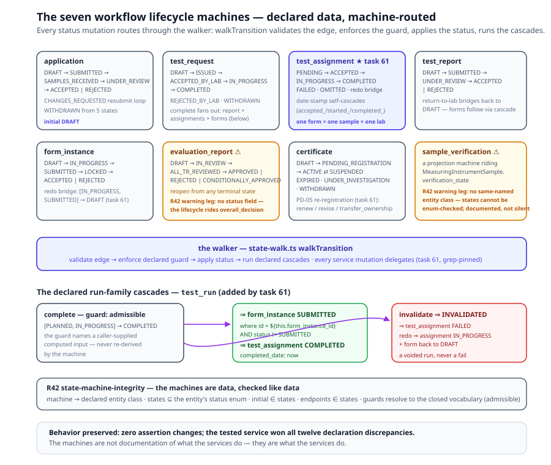

# Chapter 8 — Parties and Workflow

> *In this chapter:* who acts, and the machinery that moves the artifacts.
> The party model, the eleven roles, the certification workflow entities,
> the lifecycle state machines, gateways, and approvals — the OIML-CS
> certification process as an implementation model of the scheme.

---

## 8.1 The workflow is an implementation model

Everything in Chapters 5–7 is *reference content*: what the Recommendation
says. This chapter is different in kind: the certification workflow —
application, dispatch, report, evaluation, certificate — is the **operation
of organizations**, an **implementation model** whose reference model is
the OIML Certification System (OIML-CS, PD-05) itself.

The compliance relation between the two is **mapping** (A ⇒ B: fulfilling
the implementation fulfils the scheme clause). In the running system the
mappings are still embryonic: each approval step carries its PD-05 clause
reference (`data/r60/evaluation/approvals.yaml` — `reference: "PD-05
§4.5"`), a hand-written pointer where v3 will carry a typed `.prm` mapping
with coverage calculus ◐. Every entity below is an implementation component
that *maps to* a PD-05 provision, not a restatement of it.

A workflow is itself a subject, and the universal anatomy organizes the
chapter: a workflow **IS** its phase model (parties, roles, phases),
**HAS** lifecycle state per object (the state machines), **DOES** its
dispatch/evaluate/issue processes (gateways, approvals, cascades). Note
throughout: lifecycle state is the state of a *process artifact* (an
application, a report, a certificate) — never the subject's operational
state (`off → warming → … → fault`), a HAS aspect of the instrument.

## 8.2 Workflow IS: the party model

Parties are Foundations-tier content — referenced by everything, anchored
to nothing in the subject. Four party classes cover the certification
world (`data/r60/entities/parties.yaml`) ●; the BIML in the table is a
role (`data/r60/evaluation/roles.yaml`), not a party class:

| Party | What it is | Key fields |
|---|---|---|
| **Manufacturer** | the organization responsible for the instrument (Module B) | legal identity, address, contact |
| **IssuingAuthority (IA)** | OIML Issuing Authority: conducts type evaluation, issues certificates | `oiml_code`, country, `utilized_laboratory_ids`, declarations |
| **TestLaboratory (TL)** | performs the tests on an IA's behalf | `oiml_id`, `lab_kind`, declared `capabilities` |
| **Expert** | registered individual expert | `kind: lm-expert \| ms-expert`, registration status |
| **BIML** | the Bureau — registers certificates (a role; the registration record lives on the Certificate) | registration machinery (§8.7) |

Two modelling decisions deserve note:

- **IA and TL share one store.** Both extend a common `Organization` base
  (identity, address, OIML scope, accreditation), discriminated by `kind:
  issuing-authority | test-laboratory` — one `organizations` store, two
  concrete parties; `kind` is single-valued, so the same legal entity may
  register once per kind.
- **Labs declare capabilities, not equipment.** A TestLaboratory carries an
  abstract capability list (`humidity-testing`, `emax-up-to-50000kg`, …)
  that dispatch matching consumes (`evaluation/lab-selection-criteria.yaml`
  maps parameter values to required capabilities — `humidity_class = CH`
  requires `humidity-testing`). A `manufacturer_test_lab` (the MTL of PD-05
  §5.3.1 b, Scheme A) must reference its parent manufacturer (§8.6).

## 8.3 Workflow IS: the role model

Parties are organizations; **roles are functions in the process**. The
role model (`data/r60/evaluation/roles.yaml`) declares exactly eleven ●:

```text
applicant            manufacturer          issuing_authority
test_laboratory      manufacturer_test_laboratory
evaluator            supervisor            test_operator
responsible_person_ia  responsible_person_tl
biml
```

The granularity is deliberate: *who may act* is answered per transition,
per approval, per console — and the answers differ. The `applicant` drafts
and resubmits; the `evaluator` performs tests and evaluations; the
`supervisor` reviews them; the `responsible_person_*` signs at each
organization. The platform's access layer resolves the same model: role
homes and section rules in `browser/src/auth/roles.ts`, consoles per role
— the applicant portal, the IA console (review → dispatch → evaluate →
issue), the TL workbench — all reading the one role declaration.

**Two roles wait in the twin direction** (Volume I, Chapter 14 §14.8 ○),
and they are deliberately not among the eleven. The **twin provider** —
the manufacturer, or the owner-operator of a deployed unit — serves the
live instance and speaks for the product. The **engine operator** — an
IA, regulator or market-surveillance body running continuous evaluation —
runs the monitors and speaks for the standard. They belong to the
continuous-compliance loop that runs *after* issuance, not to the
certification loop this chapter models; when v3 admits them, they enter
the role declaration the same way the eleven did — resolved per
transition, per console.

## 8.4 Workflow IS: the phase model and entity chain

The workflow runs five phases with actor handoffs
(`data/r60/evaluation/workflow.yaml`): **intake** (applicant),
**dispatch** (IA), **testing** (TL), **evaluation** (IA), **issuance**
(IA → BIML). Each step declares actor, inputs, outputs, and **gates** —
preconditions that must hold before the next step begins. The entity chain:

```text
Application ──< TestRequest (one per lab) ──< TestAssignment (form × sample × lab)
                                    TestReport (per lab × group) ──< FormInstance / TestRun
EvaluationReport ──< TestReportDetermination ──< ModelEvaluation
Certificate ──► BIML registration
```

The entities, in order of life:

- **Application** — the type evaluation request: references the model
  family matrix (`model_family_id`, `model_ids[]`) and samples on the
  subject chain (the instrument definition is *not* duplicated onto the
  application — it lives on the chain), plus scheme (A/B), ANR countries,
  documentation, and the IA review result (PD-05 §4.2).
- **TestRequest** — the IA's dispatch to **one** laboratory
  (`assigned_laboratory_id`), one per lab: the explicit work tuples
  (`assignments`), test conditions, scheme/MTL flags, and
  `parent_request_ids` for re-tests and amended requests.
- **TestAssignment** — the atomic unit of work: one form × one sample ×
  one model × one lab. The IA chooses precisely which (form, sample)
  pairs each lab performs — a high-capacity lab and a humidity lab split
  one family between them.
- **TestReport** — the lab's submission, one per lab × model group,
  bundling its FormInstances (cascade) and declaring justified
  `form_omissions`; signed by evaluator and authorizing person (PD-05
  §4.4.3 r). Inside it, the **FormInstance** (one per form × sample:
  recorded values + OCL-computed values) and the **TestRun** of Chapter 6.
- **EvaluationReport** — the IA's aggregate over `test_report_ids[]`:
  per-form determinations, one **TestReportDetermination** per report
  (the admissibility gate with its re-executed verdicts), one
  **ModelEvaluation** per model (the cross-lab synthesis), and the
  `overall_decision` (Chapter 7's three levels).
- **Certificate** — issued on APPROVED; scope mirrors the application's
  matrix (or the amended outcome); its `biml_registration` record closes
  the chain at the BIML ● (registration service + public register at
  `/app/register`; true web publication ○).

## 8.5 Workflow HAS: lifecycle state machines

Every process artifact carries its lifecycle as data
(`data/r60/evaluation/state-machines.yaml`) — seven machines ●. Three
representative shapes:

- **application**: `DRAFT → SUBMITTED → SAMPLES_REQUESTED →
  SAMPLES_RECEIVED → UNDER_REVIEW → ACCEPTED | REJECTED`, with the
  edit-and-resubmit loop `CHANGES_REQUESTED → UNDER_REVIEW` and
  `WITHDRAWN` reachable from five states.
- **test_request**: `DRAFT → ISSUED → ACCEPTED_BY_LAB → IN_PROGRESS →
  COMPLETED` (plus `REJECTED_BY_LAB`, `WITHDRAWN`).
- **certificate**: `DRAFT → PENDING_REGISTRATION → ACTIVE`, then the
  post-issue life: `EXPIRED`, `SUSPENDED ⇄ ACTIVE`, `UNDER_INVESTIGATION`,
  `WITHDRAWN` from three sources — plus the PD-05 re-registration edges
  (`renew` / `revise` / `transfer_ownership` from `[ACTIVE, EXPIRED]`).



Three mechanics make the machines executable rather than decorative:

1. **Guarded transitions.** Each transition is a triple `{ from, to,
   action }`; only the declared action fires it, and only the role the
   action names may fire it. A transition may also name a **guard** from
   the closed vocabulary — today exactly one: `admissible`, the test-run
   service's computed admissibility, required by the test_run machine's
   `complete` transition. A guard names a caller-supplied computed input
   the walker *requires* at walk time; the machine never re-derives it
   (the R 144 `state: ready` gate precedent).
2. **Cascades.** A transition may declare side effects on other entities:
   `set` (field writes, `'now'` timestamps), `where` (a filter selecting
   the affected rows), `create` (new records — e.g. the audit event on
   issue). Completing a TestRequest timestamps it, submits its TestReport,
   completes its assignments, and locks its FormInstances — one atomic
   act:

   ```yaml
   - from: IN_PROGRESS
     to: COMPLETED
     action: lab_issues_test_report
     cascade:
     - entity: test_request
       set: { status: 'COMPLETED', completed_date: 'now' }
     - entity: test_report
       where: 'test_request_id = ${this.id}'
       set: { status: 'SUBMITTED', submitted_date: 'now' }
     - entity: test_assignment
       where: 'test_request_id = ${this.id} AND status != OMITTED'
       set: { status: 'COMPLETED', completed_date: 'now' }
     - entity: form_instance
       where: 'test_report_id = ${testReport.id} AND status != LOCKED'
       set: { status: 'LOCKED', locked_at: 'now' }
   ```

3. **Multi-source transitions.** `from` may be a list: the applicant
   withdraws from any of five pre-decision states; the IA reopens a
   finalized evaluation report from any of its three terminal states
   (`[APPROVED, REJECTED, CONDITIONALLY_APPROVED] → IN_REVIEW`). The
   machine states the real policy — "withdrawable until decision" — as
   one transition, not five.

### 8.5.1 All mutation is machine-routed (task 61) ●

The machines above are not documentation of what the services do — they
*are* what the services do. Phase 9 (task 61, ● smart 6a9484b) completed
the machine-routing: the state walker (`browser/src/data/state-walk.ts`)
exports `walkTransition` — validate the edge, enforce the declared
guard, apply the status, run the declared cascades — and **every
mutation site delegates to it**: all ten `test-run.service` status
writes, `useTestAssignment.setStatus`, `useApplication.updateStatus`,
`useTestReport.submit`, and all eleven `useCertificate` lifecycle
methods. The delegation is behavior-preserving by construction: zero
assertion changes in the test suite, and a pinned grep leg
(`lifecycle-machines.test.ts`) proves no `.status =` write survives in
the seven-entity surface outside the walker.

The task also closed the declaration gaps it found. Six of the seven
machines were already declared; the task **added TestAssignment** (with
date-stamp self-cascades) and **TestRun** — the run-family cascades now
declared, not coded: `COMPLETED` ⇒ the form goes SUBMITTED and the
assignment COMPLETED; `INVALIDATED` ⇒ the assignment FAILED; `redo` ⇒
the assignment back to IN_PROGRESS and the form to DRAFT. FormInstance
gained the service-tested `DRAFT → SUBMITTED` hop and the redo bridge;
Certificate gained the re-registration edges named above. One premise
the task corrected honestly: twelve viewer-table/service discrepancies
surfaced in the merge, and the *tested* service won every one — the
machines were authored from observed behavior, and where the two
disagreed the disagreement is recorded (e.g. EvaluationReport carries
no `status` field; its machine is declared data riding
`overall_decision`).

### 8.5.2 R42 — the machines' own integrity ●

The machines are data, so they are checked like data. Linker rule **R42
state-machine-integrity** resolves every machine to its declared entity
class, requires its states to be values of the entity's `status` enum
(`initial ∈ states`, every transition endpoint ∈ states), and resolves
every declared guard against the closed vocabulary. Two **documented
warning legs** stay visible rather than silent: `evaluation_report`
(its entity declares no status enum — the lifecycle rides
`overall_decision`) and `sample_verification` (a projection machine
riding `MeasuringInstrumentSample.verification_state` — its states
cannot be enum-checked, and R42 says so). The discipline is §9's
crosswalk applied to workflow: a machine that cannot be checked against
its carrier is a finding, never an assumption.

## 8.6 Workflow DOES: gateways

Branching is declared as **gateways** — exclusive splits with condition
edges (`data/r60/evaluation/gateways.yaml`) ●, in two families:

- **Static gateways** route on classification dimensions — the subject's
  exhibited classification decides the path before any test runs:
  `test_runs_gateway` (`[accuracy_class] in ['A','B']` → 5 load
  applications; `['C','D']` → 3), `humidity_test_gateway` (`CH` → cyclic,
  `SH` → steady-state), `electronic_tests_gateway` (technology).
- **Runtime gateways** route on recorded results: `test_result_gateway`
  (`every([within_mpe]) = true` → compile passing report), `mtl_gateway`
  (`[lab_kind] = 'manufacturer_test_lab' and [scheme] = 'A'` → accept MTL
  results; default → independent TL required).

Every edge has a condition, every gateway a `default` edge — no
computation hides in a connector. (In the kernel: the gateway step kind,
conditions on edges, in OCL.)

## 8.7 Workflow DOES: approvals

The legally significant acts are declared as **approval steps**
(`data/r60/evaluation/approvals.yaml`) ●: actor, signatory
(`approve_by`), the record approved, and the PD-05 clause it implements:

| Approval | Signatory | Record | PD-05 |
|---|---|---|---|
| IA accepts application | responsible_person_ia | applications | §4.2 |
| TL authorizes test report | responsible_person_tl | testReports | §4.4.3 r |
| IA approves evaluation report | responsible_person_ia | evaluationReports | §4.5 |
| IA signs OIML certificate | responsible_person_ia | certificates | §4.6 |
| BIML registers certificate | biml | certificates | §4.7 |
| IA approves certificate revision | responsible_person_ia | certificateAnnexes | §8.1 |

The `reference` column is the embryonic mapping of §8.1: each approval is
an implementation component claiming "performing this act fulfils that
clause." In v3 each row becomes a `.prm` entry — `from` the approval step,
`to` the PD-05 provision, carrying description and justification, counted
in the coverage calculus over the OIML-CS reference package ◐.

## 8.8 Grammar sketch *(illustrative v3 syntax)*

```prl
party TestLaboratory extends Organization {
  kind       test-laboratory
  oiml_id    42
  lab_kind   manufacturer_test_lab        # PD-05 §5.3.1 b (Scheme A)
  parent     manufacturer:ACME            # required when lab_kind = mtl
  capabilities [humidity-testing, emax-up-to-50000kg]
}

role responsible_person_tl "Authorized signatory at the Test Laboratory"

workflow oiml_type_evaluation {           # implementation model of OIML-CS PD-05
  phases [intake, dispatch, testing, evaluation, issuance]

  entity TestRequest {
    states  [DRAFT, ISSUED, ACCEPTED_BY_LAB, IN_PROGRESS, COMPLETED, WITHDRAWN, REJECTED_BY_LAB]
    initial DRAFT
    transition lab_issues_test_report {
      from IN_PROGRESS to COMPLETED
      cascade [
        set  test_report  where 'test_request_id = ${this.id}' { status: SUBMITTED, submitted_date: now }
        set  form_instance where 'test_report_id = ${testReport.id} AND status != LOCKED' { status: LOCKED, locked_at: now }
        create audit_event { entity_type: testRequests, action: completed }
      ]
    }
    transition ia_cancels { from [DRAFT, ISSUED] to WITHDRAWN }   # multi-source
  }

  gateway test_runs_gateway {             # static: classification-driven
    edge "5 load applications" when ocl{self.classification.accuracy_class->includes('A') or …} -> conduct_mdlo_5runs
    edge "3 load applications" default -> conduct_mdlo_tests
  }

  approval ia_sign_certificate {
    actor issuing_authority
    approve_by responsible_person_ia
    record certificates
    maps_to "PD-05 §4.6"                  # embryonic mapping — .prm in v3
  }
}
```

## 8.9 Validation rules

- every `reference(X)` target resolves; `on_delete` semantics (cascade /
  restrict / nullify) declared per FK;
- every state machine has exactly one `initial` state; every transition's
  `from`/`to` states are declared and every `action` unique; every cascade
  `entity`/`where`/`create` references declared entities and fields;
- every state machine resolves to its declared entity class, its states
  are values of the entity's `status` enum, and every declared guard is in
  the closed vocabulary (R42 state-machine-integrity); every status
  mutation at runtime routes through the walker — a `.status =` write
  outside `walkTransition` in the seven-entity surface is a pinned test
  failure;
- every role referenced by a transition, approval, or console is one of
  the eleven declared roles;
- every gateway has a `default` edge; every edge condition's identifiers
  resolve (dimension ids, lab fields);
- every approval names a declared record store and a signatory role;
- a manufacturer test lab (`lab_kind`) must reference its parent
  manufacturer; `includes_mtl` requests must match the lab's kind;
- every TestAssignment's form id is a declared R 60-3 form and its sample
  belongs to the dispatched model set.

## 8.10 Summary

- The certification workflow is an **implementation model** of the OIML-CS
  reference scheme; today's PD-05 clause refs are embryonic mappings,
  v3's `.prm` files make them a coverage-checked calculus.
- Parties (manufacturer, IA, TL, expert — plus the BIML as a role, not a
  party class) are Foundations-tier organizations; the eleven roles are
  process functions resolved per transition, approval, and console. Labs
  declare capabilities, not equipment.
- The entity chain — Application → TestRequest (one per lab) →
  TestAssignment (form × sample × lab) → TestReport → FormInstance/TestRun
  → EvaluationReport → determinations → model evaluations → decision →
  Certificate → BIML registration — is the gated five-phase workflow.
- Lifecycle state machines carry guarded transitions, `set`/`where`/
  `create` cascades, and multi-source `from` lists; lifecycle state is the
  state of process artifacts, never the subject's operational state.
  Since task 61 the machines are not descriptive but *operative*: every
  service mutation routes through the walker (`walkTransition` — validate
  edge, enforce guard, apply status, run cascades), behavior-preserving
  and grep-pinned; R42 keeps the declarations honest against their entity
  classes.
- Gateways branch on classification (static) or on results (runtime);
  approvals are recorded acts by declared signatories, each mapped to its
  PD-05 clause.

*Next: [Chapter 9 — Invariants](09-invariants.md): INV-1..10 and beyond —
the metamodel's laws, each with rationale and checks.*
