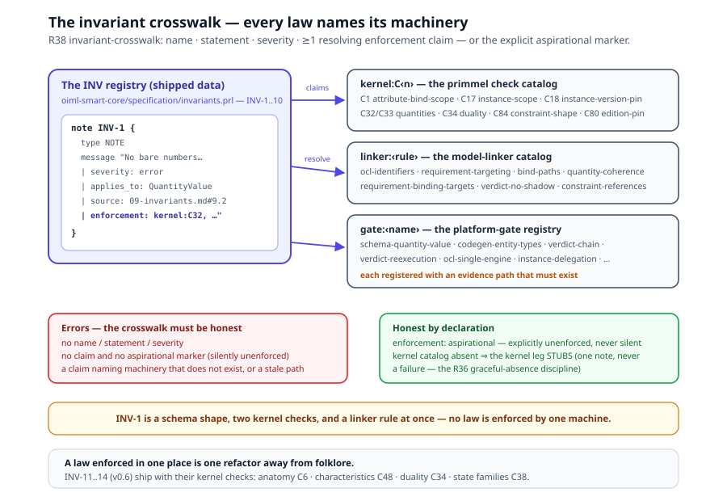

# Chapter 9 — Invariants

> *In this chapter:* INV-1..10 — the metamodel's laws, each with its statement,
> the rot it prevents, the enforcing check, and the R 60 evidence; then the
> shipped registry with its enforcement crosswalk (R38), the v0.6 additions
> INV-11..14, and the twin-direction candidates the frame adds.

---

## 9.1 Laws, not rules

Three kinds of "rule" live in an OIML SMART model, and the first discipline is
not confusing them: a **requirement** judges an instrument (Module D1); a
**constraint** checks the coherence of instrument facts (Module C); an
**invariant** constrains what may be *modelled at all* — a law of the metamodel
itself.

Invariants exist because each was learned from a failure mode: a model that
violated it once, and rotted. They have two homes, one truth: declared at the
head of the metamodel (`ontology-remix/OIML Core Models/Ontology/
oiml-core-ontology.yaml` — invariants, INV-1..14 as of v0.6) and registered as
first-class typed data in the core package (`primmel-packages/oiml-smart-core/
specification/invariants.prl`, INV-1..10 — §9.12). They are enforced by the
schema validators, the model linker, the kernel checks, and the code
generators — not by reviewer vigilance. Each entry below gives the statement
verbatim, the rationale, the check, and the R 60 example.

## 9.2 INV-1 — No bare numbers

> "INV-1  No bare numbers: every physical quantity is a QuantityValue (value +
> unit [+ uncertainty])."

**Rationale.** A number without a unit is an ambiguity with a decimal point;
bare numbers also make comparisons silently incoherent — `d_max <= e_max` in
grams vs tonnes.

**Check.** The JSON Schemas type every value field as a QuantityValue object;
the linker checks comparison coherence on *quantity kinds* (closed registry,
`data/schemas/quantity-kinds.yaml`), not on unit strings.

**R 60 example.** `model.parameters.e_max` = `{ value: 500, unit: kg }`; test
forms record indications in `counts`, converted through `conversion_factor_f`
(counts/v). The historical violation — `v_min` misused as a *unit* on eight
form fields — is in the pitfalls catalog (Volume III, chapter 1).

## 9.3 INV-2 — Schema/instance split

> "INV-2  Schema/instance split: an attribute is DEFINED once
> (AttributeDefinition: symbol, clause, IRDI) and VALUED per Model or Sample
> (Parameter)."

**Rationale.** Two definitions of the same attribute are two attributes that
happen to share a name; they drift. Definition never carries a value, value
never carries a definition — Volume I, chapter 3's duality, applied to the
attribute register.

**Check.** Every attribute id resolves to exactly one entry in
`data/<rec>/model/attributes.yaml`; every `binds_to` path, form `bind:` path,
and OCL identifier resolves at a scope-appropriate level (model linker).

**R 60 example.** `e_max` is defined once in `data/r60/model/attributes.yaml`
(symbol `E_max`, R 60-1 §3.5.5, `origin: design-fixed`, `scope: model`), valued
per model in `model.parameters.e_max`; `d_max` is defined once (`origin:
test-dependent`, `scope: sample`), valued per unit in
`sample.test_context.d_max`.

## 9.4 INV-3 — Binding, never restating

> "INV-3  Every D1 element references attribute paths into
> instrument-description; nothing physical is defined in
> conformity-specification."

**Rationale.** This is the anchoring rule of the tier system (Volume I, chapter 1)
stated as metamodel law: a secondary model owns no subject facts. A
requirement that restates an instrument fact forks the truth — the copies
drift, and the requirement stops surviving a revised subject model.

**Check.** The linker resolves every OCL identifier in `limit` expressions,
every `binds_to` entry, and every form `bind:` root against the primary model
(`model|family|group.parameters.<attr>`, `*.classification.<dim>`,
`sample.test_context.<attr>`, `observable:`, `formula:`, `table:`); an
instrument number inside a requirement is an error.

**R 60 example.** `/req/metrological/measuring-range-max` (R 60-1, clause 5.2):

```yaml
binds_to: [sample.test_context.d_max, model.parameters.e_max]
limit:
  expression: "ocl{sample.test_context.d_max <= model.parameters.e_max}"
  uses: [sample.test_context.d_max, model.parameters.e_max]
```

## 9.5 INV-4 — Reports contain no verdicts

> "INV-4  D2 contains no verdicts. If a TestReport says 'pass', the schema is
> broken."

**Rationale.** This is the fact/judgment firewall of the tier system, stated
for the report schema: a report that records "pass" freezes a judgment into the
evidence, and re-evaluation inherits a conclusion instead of computing one.
Nuance: a form's `pass_fail` block is the lab's recorded *determination* — a
fact about what the lab concluded; INV-4 forbids the judgment in the report
schema, not the lab's recorded observation.

**Check.** The TestReport schema carries sample identity, case results (derived
values + constraint checks), equipment traceability, and definition version
pins — there is no outcome field to fill.

**R 60 example.** `creep-dr.yaml` (r60-3/table-6.8) closes with a `pass_fail`
display — the lab's determination. The IA's verdict on
`/req/metrological/creep` is re-executed at evaluation from the same evidence,
and may disagree (overrides recorded, never silent).

## 9.6 INV-5 — Re-evaluation without re-testing

> "INV-5  D3 consumes only definitions and reports; re-evaluation (new class
> limits, surveillance) requires no re-testing."

**Rationale.** Evaluation is a pure function: verdicts = f(definitions,
evidence). If it consumed anything else, re-judging would require the lab
again; surveillance, amended limits, and changed classifications would be
impossible to re-judge.

**Check.** The dependency rules make it structural — evaluation depends on D1
and D2 only ("touches nothing physical"); the verdict service
(`browser/src/services/verdict.service.ts`) re-executes limits against stored
evidence, preserving recorded overrides.

**R 60 example.** A sample tested against class C3 whose application is amended
to C6: the verdicts are re-computed against the C6 MPE tiers from the same test
report — no instrument touched. (Verdict re-execution: TODO.new-paradigm/08.)

## 9.7 INV-6 — One sample, one report, one evaluation

> "INV-6  One Sample = one TestReport = one SampleEvaluation. Type conformity
> is established ONLY by TypeEvaluation across Samples."

**Rationale.** Two failure modes die here. Cherry-picking: test three samples,
report the good one. Judgment inflation: one good sample carries the type.
Tests run on samples; certificates issue to models; the only bridge is
cross-sample synthesis.

**Check.** Cardinality in the entity graph — TestReport names exactly one
Sample; SampleEvaluation consumes one sample's evidence; TypeEvaluation alone
holds a `typeVerdict`, ruled ALL samples × ALL requirements.

**R 60 example.** Work splits at (form × sample × lab) granularity, so one
sample's complete evidence may arrive as several per-lab reports
(`test_report_ids [1..*]`, PD-05 §4.5.1 k). The sample is still judged as a
whole, and the decision exists only across contributing samples — no single
report yields a type verdict; the certificate issues to the Model.

## 9.8 INV-7 — Values, facts, judgments

> "INV-7  Formula outputs are VALUES (instrument-description), Constraint
> results are FACTS (test-execution), Verdicts are JUDGMENTS (evaluation)."

**Rationale.** Three things every standards tool eventually confuses — a
computed number, a checked condition, a regulatory judgment. Fused, they make
re-execution impossible; each has one home: OCL `derive` → typed value; OCL
`inv` → Boolean fact; the Verdict entity → judgment.

**Check.** Formula declares `stereotype: derive` and a typed output
(QuantityValue); Constraint declares `inv`, executed in D2 as a ConstraintCheck
(`satisfied | violated`); Verdict is a D3 class (requirement,
factUnderJudgment, limit snapshot, outcome).

**R 60 example**, one of each: `v_min` is a *value* — `ocl{(self.e_max -
self.e_min) / self.y}` (`model/attributes.yaml`); `constr:r60:fig3-2b` yields a
*fact* — the geometry `0.9 * E_max <= D_max <= E_max`, whose violation
invalidates the run *as a test*; the verdict on `/req/metrological/creep` is a
*judgment* — pass / fail / indeterminate, computed at evaluation.

## 9.9 INV-8 — Version pinning

> "INV-8  Every definition executed in D2 is version-pinned in the TestReport."

**Rationale.** Re-execution against "the requirement" is meaningless if the
requirement changed since the test. Pinning makes every judgment reproducible:
which method, which edition, which limits were in force at the bench.

**Check.** TestReport carries `definitionVersions` (`{ recommendation, tests
}`); TestRun records `method_version`
(`data/r60/entities/test-execution.yaml`); a report without pins fails
validation.

**R 60 example.** Reports pin the R 60-1:2021 / R 60-2:2021 edition URNs and
the executed conformance-test ids — the same URNs every element carries as
`source:` provenance.

## 9.10 INV-9 — OCL only

> "INV-9  All derivations and rules are expressed in OCL (OMG Object Constraint
> Language, formal/2014-02-03)… The same statement executes identically in D2
> (fact checks) and D3 (re-validation)."

**Rationale.** Two dialects, two semantics, and the lab and the office diverge:
the limit the lab applies differs subtly from the one the IA re-executes, and
nobody can say which is normative. One language for constraints (`inv`),
derivations (`derive`), guards, conditions — one parse, one evaluation,
everywhere. (The 2021 mini expression language is superseded.)

**Check.** The metamodel's `ExpressionLanguage` enumeration has exactly one
member; data files wrap every rule as `ocl{...}`; the verdict registry parses
each derivation once at load, and both evaluators consume the same cached AST.

**R 60 example.** The creep limit, `ocl{abs(c_c) <= 0.7 *
abs(lookupMPE(sample.test_context.d_max, group.classification.accuracy_class,
0.7)) and …}`, runs identically in the form's acceptance display and in verdict
re-execution.

## 9.11 INV-10 — Delegation never copies down

> "INV-10  Encapsulation by delegation: a Sample resolves attributes through
> its Model, a Model through its Family; a value set at a lower level overrides
> the inherited one. Attribute values are never copied downward."

**Rationale.** A copied-down value is a fork: the family value changes, the
thirty model copies don't — the classic data-rot move, and it is forbidden.

**Check.** Scope discipline — every attribute declares its scope, and the
linter rejects a value stated at the wrong level; sample-scope values live only
in `test_context`, "values under test, never inherited downward"
(`data/r60/entities/instrument.yaml`).

**R 60 example.** `e_min`, `p_lc`, `rated_output` are family scope;
`accuracy_class`, `n_lc`, `y`, `z` group scope; `e_max` model scope; `d_min`,
`d_max`, `v`, `n` sample test_context. Ask a sample for `E_max` and you receive
its model's value — by delegation, not by copy.

## 9.12 The shipped registry and the enforcement crosswalk ●

Sections 9.2–9.11 are the normative prose. Phase 9 (task 57, ● smart
f51c5a9) gave the laws their second home: the core package ships INV-1..10
as **first-class typed data** —
`primmel-packages/oiml-smart-core/specification/invariants.prl`, authored
with the kernel's note-family construct:

```prl
note INV-1 {
  type NOTE
  message "No bare numbers: every physical quantity is a QuantityValue
           (value + unit [+ uncertainty]). | severity: error |
           applies_to: QuantityValue |
           source: docs/oiml-core/09-invariants.md#9.2 |
           enforcement: kernel:C32, kernel:C33, linker:quantity-coherence,
                        linker:pair-list-components, gate:schema-quantity-value"
}
```

Each entry carries the canonical statement, a severity, the metamodel
classes it applies to, a `source` pointer back to this chapter's
normative section, and — the point of the registry — an **enforcement
crosswalk**: the named checks that enforce it, or the explicit marker
`aspirational`. What an invariant may *not* be is silently unenforced.

Linker rule **R38 invariant-crosswalk** proves the crosswalk honest.
Every claim must resolve against real machinery, in one of three
namespaces:

- `kernel:C<n>` — a `primmel check` rule of the C-catalog (chapter 11 of
  Volume I); catalog absent ⇒ the kernel leg **stubs** — one
  informational note, never a failure (the R36 graceful-absence
  discipline);
- `linker:<rule>` — a rule of the model linker's own catalog;
- `gate:<name>` — a registered platform gate (schema, codegen, service,
  or test-suite machinery), each registered **with a repo-relative
  evidence path that must exist** — a gate whose proof is gone is a
  stale claim, and an error.

The shipped crosswalk (INV-1..10 — every row enforced, none
aspirational):

| INV | Enforcing machinery |
|---|---|
| INV-1 no bare numbers | kernel C32/C33 · linker quantity-coherence, pair-list-components · gate schema-quantity-value |
| INV-2 schema/instance split | kernel C1 · linker requirement-binding-targets, bind-paths · gate codegen-entity-types |
| INV-3 binding, never restating | linker ocl-identifiers, requirement-targeting, bind-paths, requirement-binding-targets |
| INV-4 reports contain no verdicts | gate testreport-no-outcome, verdict-chain |
| INV-5 re-evaluation without re-testing | gate verdict-reexecution |
| INV-6 one sample, one report, one evaluation | gate testrun-sample-cardinality, evaluation-aggregator |
| INV-7 values, facts, judgments | kernel C84 · linker constraint-references, verdict-no-shadow · gate codegen-entity-types |
| INV-8 version pinning | kernel C18/C80 · gate testrun-method-version |
| INV-9 OCL only | linker ocl-identifiers · gate ocl-single-engine, verdict-registry-cache |
| INV-10 delegation never copies down | kernel C1/C17 · gate instance-delegation |



Read the table once, horizontally: no invariant is enforced by *one*
check. INV-1 is a schema shape, a linker coherence rule, and two kernel
checks at once — the law holds because four machines independently
refuse its violation. That redundancy is the design: a law enforced in
one place is one refactor away from folklore.

## 9.13 INV-11..14 — the v0.6 additions ●

The metamodel v0.6 re-home (task 12) added four laws, each shipping with
its named enforcing checks in the kernel catalog:

- **INV-11 — Anatomy families.** Every aspect of a subject is declared
  under *exactly one* anatomy family: IS (identity/design — metadata,
  provenance, structure, design parameters, designed condition tiers,
  promises, artifact definitions), HAS (exhibition — attributes,
  dimensions, operational state, characteristics, environmental context,
  artifact instances), DOES (process — behaviors). A misplaced aspect
  silently changes meaning: an exhibited value authored as a design
  parameter freezes instance data into the type definition. Enforced by
  **C6 anatomy-family** (wrong-family and undeclared aspects are
  parse-time captures), completed by C7/C8.
- **INV-12 — Characteristics have one home.** A characteristic — the
  symbol'd quantity derived from behavior I/O — is DEFINED once in
  instrument-description and only REFERENCED elsewhere; restated
  derivations drift (the R 60 MDLO defect class: one quantity computed
  three ways at three layers, diverging silently). Enforced by **C48
  characteristic-one-home** (with C49/C50) and the linker VerdictQuantity
  discipline (verdict-inputs-resolve, verdict-no-shadow,
  verdict-restatement).
- **INV-13 — Duality coherence.** A designed/exhibited dual is ONE value
  structure in two roles: the designed role carries tolerance, never
  uncertainty; the exhibited role carries uncertainty, never tolerance;
  both share one quantity kind with coherent units. Without it, as-found
  verification compares unlike quantities. Enforced by **C34
  duality-coherence** (with C33 quantity-coherence).
- **INV-14 — State-family separation.** The subject's OPERATIONAL state
  machine (HAS — the instrument's own modes: off/warming/ready/
  measuring/fault) and the workflow LIFECYCLE machines (chapter 8's
  artifact states) are disjoint families: no lifecycle transition
  cascades into an operational machine, no operational transition
  mutates workflow state. Enforced by **C38 state-family-separation**
  (with C40 anatomy-state-resolves).

Note the numbering discipline: these four are the metamodel's canonical
INV-11..14 — the earlier ○-candidate numbering of this chapter (which
had characteristics as INV-11 and duality as INV-12) is superseded by
the shipped ontology, and the registry's `source` pointers follow the
sections, not the numbers.

## 9.14 Twin-direction candidates ○

The twin direction (Volume I, Chapter 14) adds two candidate laws the
metamodel has not yet numbered, both arising the moment evidence is
*served* rather than recorded:

- **Freshness is semantics ○.** Every served value carries a validity
  window; a stale value degrades the verdict to `indeterminate` — never
  a silent pass, never a metrological fail. The live-binding checks
  (freshness-required on live bindings, C63) already enforce the
  declaration half; the law itself awaits the twin program's full
  adoption.
- **The firewall holds in streams ○.** Evidence streams carry facts
  only; no verdict travels on the wire. INV-4 and INV-7 restated for
  continuous evidence: a stream record with an outcome field is the same
  schema defect as a TestReport that says 'pass'.

## 9.15 Grammar sketch — the construct as shipped

The registry is data, declared with the package it governs; the
crosswalk grammar is `kernel:C<n> | linker:<rule-name> | gate:<gate-name>`
— or the single token `aspirational`:

```prl
note INV-3 {
  type NOTE
  message "Binding, never restating: every D1 element references
           attribute paths into instrument-description; nothing physical
           is defined in conformity-specification. | severity: error |
           applies_to: Requirement, ConformanceTest, FormSchema |
           source: docs/oiml-core/09-invariants.md#9.4 |
           enforcement: linker:ocl-identifiers, linker:requirement-targeting,
                        linker:bind-paths, linker:requirement-binding-targets"
}
```

The running system states INV-1..14 as normative prose (the metamodel
head), registers INV-1..10 as typed data (the core package), and
enforces them through schema + linker + kernel checks + codegen. A
fully *executable* `check:` per invariant — the invariant running its
own OCL against the model graph — remains the v3 elevation ○; the
crosswalk is what makes the registry honest today.

## 9.16 Validation rules

- **Schema validation** (`npm run validate`): INV-1 (QuantityValue shape),
  INV-2 (no values in definitions), INV-4 (no outcome fields in reports), INV-8
  (version pins required).
- **Model linker** (static cross-reference resolution): INV-2/INV-3 (bind paths
  and OCL identifiers resolve at scope-appropriate levels), INV-9 (`ocl{...}`
  and `table:`/`lookupMPE` targets exist); **R38 invariant-crosswalk** — every
  registry entry carries name/statement/severity and ≥1 resolving enforcement
  claim (or the explicit `aspirational` marker).
- **Kernel checks** (`primmel check`, the C-catalog of Volume I chapter 11):
  INV-1 (C32/C33), INV-2 (C1), INV-7 (C84), INV-8 (C18/C80), INV-10 (C1/C17),
  INV-11 (C6–C8), INV-12 (C48–C50), INV-13 (C34), INV-14 (C38/C40).
- **Codegen + unit tests** (`npm run build`, `npx vitest run`): INV-2 (one
  generated type), INV-7 (distinct value/fact/judgment types), INV-10
  (delegation over the generated graph).
- **Platform gates with evidence paths** (the R38 gate registry): schema,
  codegen, service and test-suite machinery — each claim's evidence path must
  exist, or the claim is stale.

## 9.17 Summary

- Invariants are laws about models — what may be modelled at all. Requirements
  judge instruments; constraints check facts; invariants keep models from
  rotting.
- INV-1/2/7 discipline values (no bare numbers; schema/instance split; values ≠
  facts ≠ judgments); INV-3/4/5/6 are the tier firewalls (bind, never restate;
  no verdicts in reports; re-evaluation without re-testing; type conformity
  only across samples); INV-8/9/10 discipline execution (pin versions; one rule
  language; delegate, never copy).
- The registry is shipped data (INV-1..10, the core package's
  `invariants.prl`), and the **R38 crosswalk** makes it honest: every
  invariant names its enforcing machinery — kernel checks, linker rules,
  platform gates with evidence paths — or declares itself `aspirational`.
  Silently unenforced is an error; a claim naming machinery that does not
  exist is an error.
- The v0.6 re-home added INV-11..14 with their checks: anatomy families
  (C6), characteristics one home (C48), duality coherence (C34),
  state-family separation (C38).
- Every invariant has an enforcing check in schema, linker, kernel, or
  codegen — a law that depends on reviewer vigilance is already broken.
- The twin direction adds two un-numbered candidates ○: freshness as
  semantics (stale ⇒ `indeterminate`, never a silent pass) and the
  fact/judgment firewall extended to live streams.

*Next: [Chapter 10 — Shared modules](10-shared-modules.md): the seven
parameterized test/form families between core and Recommendations.*
