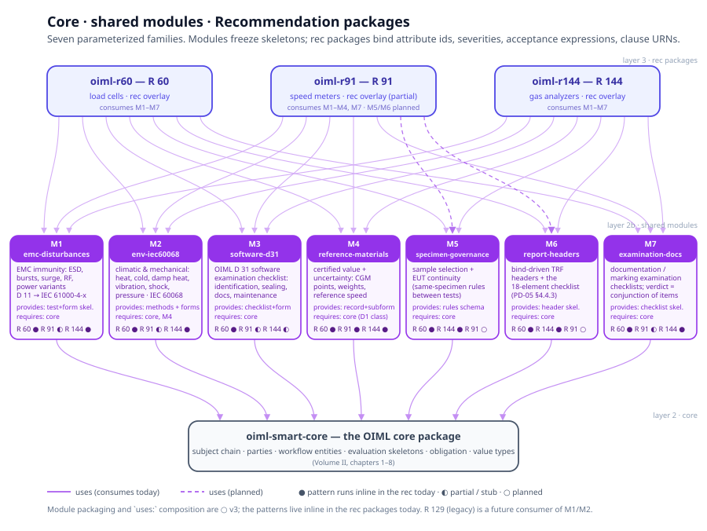

# Chapter 10 — Shared Modules

> *In this chapter:* the seven shared modules — parameterized test and form
> families between the OIML core and the Recommendation packages — what each
> provides, what each requires, who consumes it, and the per-rec delta
> mechanism that replaced copying.

---

## 10.1 The problem: between "copy" and "restate from scratch"

The cross-standard census (`analysis/cross-standard-layering.md`) measured the
three re-architected Recommendation trees — R 60 (111 YAML files), R 91 (34), R
144 (76) — and found two kinds of sharing:

- **Verbatim sharing.** 12 R 91 files are byte-identical to R 60. Some are
  genuinely shareable (parties, workflow entities, state machines, obligation);
  some are *wrong for R 91* (certificate template, gateways, notes, checklist —
  the audit's R2 residue). The census' verdict: the copy mechanism and the bug
  mechanism are the same mechanism.
- **Pattern sharing.** Every rec re-implements the same EMC immunity family,
  the same IEC 60068 climatic family, the same D 31 software examination, the
  same report headers — with different observables, severities, acceptance
  quantities, and clause URNs. Byte-level sharing cannot express this;
  restating from scratch loses the skeleton.

The first kind is core content (chapters 1–8 of this volume). The second kind
is neither core (the content is not identical) nor rec content (the *pattern*
is not the rec's law). The seven shared modules are the missing mechanism:
**layer 2b** in the language stack — parameterized packages that freeze a
skeleton and let each Recommendation bind its own content.

Status honesty: the patterns run today, inline in the rec packages (●); the
packaged modules and the `uses:` composition are ○ v3. Each module entry below
marks both.

## 10.2 The module contract



A module is a package (Volume I, chapter 8) with a three-part contract:

- **provides** — the frozen skeletons: test patterns, form skeletons, verdict
  variants, checklist structures;
- **requires** — what a consumer must supply: core entities, attribute ids,
  dimensions, capabilities;
- **consumers** — the Recommendations known to bind it.

The per-rec delta mechanism has exactly four binding slots:

1. **attribute ids** — the rec's own observable and parameter names
   (`indication` in counts vs `e_x` in ppm);
2. **severities** — the test levels (discharge voltages, temperatures,
   durations, drop heights);
3. **acceptance expressions** — the OCL limit, targeting the rec's own
   requirement ids and verdict quantities;
4. **clause URNs** — provenance into the rec's own edition.

The parameterization machinery exists in embryo: conformance tests declare
`variables[]` with `source: declared | measured | derived | computed`; forms
declare `bind:` paths and `conformance_test:` links. A module freezes the
skeleton; the rec's overlay binds the slots — it *references* module ids, never
*redefines* them.

## 10.3 M1 — emc-disturbances

**Scope.** The EMC immunity test family. The normative anchor chain is
identical in every rec: rec → OIML D 11 → IEC 61000-4-x (R 144 names the parts:
-4-2 ESD, -4-4 bursts, -4-5 surge, -4-3/-4-6 RF, -4-11 dips).

**The shared skeleton** (evidenced by the cross-rec ESD comparison):

```
kind: disturbance
steps: record baseline observable
     → apply disturbance at severity S
     → record observable under disturbance
verdict pattern (two rec variants):
  R 60:  ocl{not significant_fault}   — significant_fault := abs(difference) > v_min
  R 144: abs(e_x) <= abs(mpe_v) or fault_detected        (R 144-1, 4.5.4)
form skeleton: header ref → disturbance parameters (severity, network,
  polarity) → measurement rows (subform) → fault flag → verdict → remarks
```

**provides:** test patterns `esd`, `bursts`, `surge`, `rf-emf`, `conducted-rf`,
`power-voltage-variation`, `short-time-power-reduction`, `low-battery`;
parameterized form skeletons; the verdict variants. **requires:** core
entities; the rec's observable attributes; the electronic capability flags.
**consumers:** R 60 ● (`specification/conformance/electronic.yaml` — `esd` at R
60-2 §2.10.7.8: record reference indication → apply contact discharge → record
→ apply air discharge → record → check significant fault → determine
pass/fail), R 144 ● (per-part tests, verdict `within_limits_or_detected`), R 91
◐ (stubs — its audit condenses 33 normative rows to 11 stubs), R 129 legacy
(future; its forms map 1:1 onto the module). **deltas:** observable names and
units, severities, acceptance quantity, clause URNs, form ids.

## 10.4 M2 — env-iec60068

**Scope.** Climatic and mechanical influence tests, anchored to IEC 60068: -2-1
cold, -2-2 dry heat, -2-78 damp heat steady, -2-30 damp heat cyclic,
-2-47/-2-64 vibration, -2-31 shock (R 144 adds -2-17 leak).

**Shared skeleton:** `kind: influence`; stabilize at severity → measure against
reference → verdict `abs(error) <= mpe_operating` (or the rec's own influence
limit).

**provides:** dry-heat, cold, damp-heat (cyclic | steady), vibration, shock,
ambient-pressure method skeletons + form skeletons. **requires:** core;
reference-materials (the test-point subform). **consumers:** R 144 ● (dry heat
at 40 °C, cold at 5 °C, damp heat 30 °C / 85 % RH for 2 days, vibration, shock
as a 25 mm edge drop), R 60 ● — consumes the *method skeleton* and keeps its
own acceptance quantities (the temperature effect on MDLO; the humidity limits,
themselves carrying a source discrepancy the census records), R 91 ◐ (stubs), R
129 legacy (future). **deltas:** severities, stabilization rates, the
acceptance limit (MPE vs a rec-specific influence limit), condition-tier
bindings.

## 10.5 M3 — software-d31

**Scope.** The OIML D 31 software examination checklist pattern:
identification, sealing/protection, documentation, maintenance interfaces.

**provides:** the examination checklist skeleton + form. **requires:** core;
the rec's software identity attributes (legally relevant software, Module B).
**consumers:** R 60 ● (test `software`, R 60-2 §2.6, with the 10-field
`software-examination` form), R 91 ◐ (stub today; R 91-2 §8 requires the real
evaluation), R 144 ◐ (lightweight variant — software appears as
documentation-examination items), R 129 legacy (future). **deltas:** the
checklist items, bound to the rec's documentation requirements and software
attributes.

## 10.6 M4 — reference-materials

**Scope.** The traceable reference pattern: a certified reference entity —
certified value + uncertainty + traceability — bound into test runs, with
machine-checked normative constraints on its use.

**provides:** the reference-material record pattern; the test-point subform
skeleton (the CGM-point shape); the uncertainty-budget validity hook (the
census' language gap L7). **requires:** core — Module D1 `ReferenceMaterial` ●
already carries the shape: identity fields plus OCL constraints bound to
evidence fields via `evidence:` maps, with `on_violation: invalidate` voiding
the run. **consumers:** R 144 ● — the most complete instantiation:
`specification/reference-materials.yaml` declares the certified gas mixture
with identity fields (composition, certified value, expanded uncertainty k=2,
certification authority, certificate id, expiry, traceability) and constraints
(blend tolerance ≤ 10 %, Annex A.2.2; the U:MPE ≤ 1:3 rule with the
issuing-authority 1:2 override, R 144-1 §7.2.2.2), evaluated against run
evidence *before* the verdict; `execution/subforms/cgm-point.yaml` — one row
per CGM point: certified value, indications, mean, error, MPE-at-point —
consumed by fourteen forms. R 60 ● (weights / the force-generating system;
test-equipment declarations with calibration references). R 91 ●
(reference-speed variables). **deltas:** the material kind, identity fields,
the constraint set, the evidence binding.

## 10.7 M5 — specimen-governance

**Scope.** Sample selection plus EUT continuity: *which* specimens are tested,
and the rule that a test series keeps the same equipment under test.

**provides:** the sample-selection-rules schema (id / step / rule / rationale /
applicability / selector / test_kind — the IA auto-select walks these) and the
EUT-continuity contract (the `design.specimens` block: `count`,
`max_additional`, `continuity`, `rules`). **requires:** core — the TestRun →
sample linkage is the run-level face; the test-report checklist's
sample-selection row is the checklist face. **consumers:** R 60 ● (R 60-2 §2.4
+ Annex D: smallest `e_max` per group; the merit walk class → n_lc → v_min in
5–10× steps; same-capacity de-duplication; partial-evaluation flags), R 144 ●
(R 144-1 §7.1.2, definitive-type-per-model), R 91 ○ (when its evaluation layer
lands). **deltas:** the normative rules themselves — selection law is rec
content; the schema and consumption path are shared.

## 10.8 M6 — report-headers

**Scope.** Test-report header and identification blocks: the bind-driven
skeleton every report page carries, plus the OIML-CS 18-element report
checklist.

**provides:** header skeletons — an identification block bound to the subject
chain (`family.*`, `model.*`, `sample.*`) plus a test-conditions block — and
the 18-element checklist binding rules (PD-05 §4.4.3, elements a–r, each with a
`source` binding and a validation). **requires:** core (subject-chain and
workflow entities). **consumers:** R 60 ● (five headers: `header-a`,
`header-b`, `header-c`, `conditions`, `sh-humidity-header`), R 144 ● (three:
`header-a`, `header-b`, `conditions`), R 91 ○ (when its forms land), R 129
legacy (future). **deltas:** exactly the bound attributes and dimensions —
`model.parameters.e_max` in R 60's `header-a` vs
`model.classification.measurand_components` in R 144's. The two files are 57 %
structurally similar, and the difference *is* the binding set. R 60's
`header-c` and SH humidity header are rec-specific extensions that stay in the
rec.

## 10.9 M7 — examination-docs

**Scope.** Documentation, marking, and visual examination: checklist-style
examination of documents and inscriptions against technical-requirement
targets.

**provides:** the examination checklist skeleton; the verdict is the
conjunction of item booleans (`ocl{a and b and …}` — visible in both R 60 and R
144 forms). **requires:** core; the rec's documentation and marking
requirements. **consumers:** R 60 ● (`documentation`, `inscriptions`,
`suitability`, `software`), R 144 ● (`documentation`, `visual-examination`), R
91 ◐ (`documentation-inspection`, `vehicle-identification` stubs). **deltas:**
the item lists and their requirement targets; marking content is rec law and
stays in the rec.

## 10.10 What stays out of the modules

The census is equally clear in the other direction: requirements, MPE tables,
acceptance quantities, terminology, and the whole model layer are **normative
ownership** — the rec's own law, never shared by reference. R 91's conditions
file (R 60's 20 ± 2 °C reference tier where R 91 requires 23 ± 5 °C) is the
standing proof: anything allowed to drift via copies eventually does. Modules
take the skeletons; the rec keeps the law.

## 10.11 Grammar sketch *(illustrative v3 syntax)*

```prl
package emc-disturbances {
  kind: module
  provides {
    test_patterns: [esd, bursts, surge, rf-emf, conducted-rf,
                    power-voltage-variation, short-time-power-reduction,
                    low-battery]
    form_skeletons: [disturbance-test-form, influence-test-form]
  }
  requires {
    core: [entities/instrument, entities/test-execution]
    attributes: []        # the consuming rec declares the ids it binds
    dimensions: []
  }

  test_pattern esd {
    kind: disturbance
    steps: record_baseline -> apply_disturbance(severity)
         -> record_under_disturbance
    verdict_variants: [no_significant_fault, within_limits_or_detected]
  }
}

# the rec package binds the slots — reference, never redefine:
package oiml-r144 {
  uses: [core, emc-disturbances, env-iec60068, reference-materials,
         report-headers, examination-docs]

  overlay emc-disturbances.esd {
    observables: [e_x]                       # R 144 binds its observable
    acceptance:  ocl{abs(e_x) <= abs(mpe_v) or fault_detected}  # R 144-1, 4.5.4
    source:      "urn:oiml:pub:r:144-2:2013" # the rec's own edition
  }
}
```

## 10.12 Validation rules

Composition-time checks (the model linker extended across `uses:` boundaries):

- every module `requires` is satisfied by core, by previously composed modules,
  or by the rec itself;
- no id is defined twice across layers — an overlay references module and core
  ids, never redefines them;
- every module `provides` is consumed by the rec or explicitly waived — partial
  consumers (R 91 today) are legal, silent omission is not;
- overlay bindings type-check against the frozen skeleton: bound attribute ids
  exist in the rec's register, severities are QuantityValues (INV-1),
  acceptance OCL resolves (INV-3, INV-9), clause URNs match the rec's declared
  edition;
- module packages carry `kind: module` (and core `kind: core`), so registries,
  navigation, and search never list them as publishable Recommendations.

## 10.13 Summary

- The seven modules are layer 2b: parameterized test/form families between the
  OIML core and the rec packages — the mechanism between "copy" and "restate
  from scratch".
- Each module freezes skeletons and declares provides / requires / consumers;
  each rec binds exactly four slots: attribute ids, severities, acceptance
  expressions, clause URNs.
- The patterns run today inline in the recs (●); the packaged modules and
  `uses:` composition are ○ v3.
- Normative content — requirements, tables, acceptance quantities, terminology
  — never enters a module; R 91's copied conditions are the standing proof of
  why.

*Next: [Volume III — Authoring OIML Recommendations](../oiml-rec/README.md):
the methodology that turns a Recommendation text into a validated package.*
