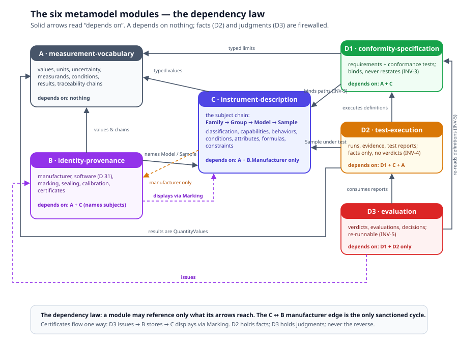

# Volume II — The OIML Core Metamodel

The Primmel kernel (Volume I) is domain-free: it knows what a Subject is,
what IS/HAS/DOES mean, what a requirement, a process and a verdict are —
and nothing about measuring instruments. This volume is the specialization:
**OIML Core**, the metamodel of legal metrology, centred on
`MeasuringInstrument` (OIML V 1:2022, 0.10) and built entirely from kernel
primitives.

The metamodel is one file: `oiml-core-ontology.yaml`
(`ontology-remix/OIML Core Models/Ontology/`, id `urn:ontology:mi:upper`,
v0.5.0). Its header states the contract: *schema only* — classes,
enumerations, invariants, dependency rules — containing **no
instrument-kind-specific terms** (no load cells, no R 60 symbols). Every
Recommendation instantiates it through a **domain profile** that is data,
not schema: "A new Recommendation = a new profile file; zero schema
changes" (`oiml-r60-loadcell-profile.yaml` — profile note).

The runtime endgame is the served instance: the instrument as a **live
twin**, its model and state queryable over a declared endpoint and judged
continuously by the same OCL (Volume I, [Chapter
14](../primmel/14-live-twins.md) ○).

## The 4-layer architecture

OIML Core sits at layer 1 of a four-layer stack. Each layer depends only
on the layers above it; the running system's R 60 realization is cited per
layer.

```text
Layer 0  Vocabularies    glossarist registers viml-2022 (OIML V 1:2022) and
                         vim-2012 (OIML V 2-200, the VIM) — terms are anchored,
                         never invented (vocab_ref → register + clause)
Layer 1  Metamodel       oiml-core-ontology.yaml (this volume) + one domain
                         profile per Recommendation (ontology-remix/OIML
                         Recommendation Models/Ontology/R 60/)
Layer 2  Domain data     data/r60/ — model/, entities/, specification/,
                         execution/, evaluation/ : the Recommendation as data
Layer 3  App instances   runtime entities in IndexedDB, seeded from
                         data/r60/sample-data.yaml
```

- **Vocabulary anchoring.** Subject classes carry VIML clause references
  (family 4.02, model 4.06, sample 4.09); data terms link into the
  registers (`data/r60/terminology.yaml`). The metamodel's own
  `references:` block names its four authorities: VIM, VIML, the GUM, and
  the IEC CDD.
- **The schema/instance split is the load-bearing wall.** An attribute is
  defined once in the profile (INV-2) and valued in domain data; a
  Recommendation's normative content lives entirely at layer 2. Adding a
  requirement, attribute or form is a data edit, never a schema edit.
- **OCL is the only rule language** at every layer (INV-9): constraints
  are OCL `inv`, derivations OCL `derive`, and the same statement executes
  identically in test execution and in evaluation.

## The six modules

The metamodel is organized in six modules with a strict dependency law
(`oiml-core-ontology.yaml` — dependencyRules). Three describe the subject
and its values (A, B, C); three describe conformity (D1, D2, D3).



| Module | Name | Contents | Depends on |
|---|---|---|---|
| **A** | measurement-vocabulary | QuantityKind, Unit, QuantityValue, uncertainty, Measurand, InfluenceQuantity, Conditions, MeasurementResult, TraceabilityChain | nothing |
| **B** | identity-provenance | Manufacturer, SoftwareComponent, Marking, Sealing, CalibrationRecord, Certificate | A, C |
| **C** | instrument-description | the subject chain Family → Model → Sample; Classification, Capability, Behavior, OperatingConditionSet, AttributeDefinition, Parameter, Formula, Constraint | A, B.Manufacturer only |
| **D1** | conformity-specification | Recommendation, Requirement, ReferenceMaterial, ConformanceTest, TestMethod, TestStep | A, C — binds, never restates |
| **D2** | test-execution | TestRun, EvidenceRecord, TestRunResult, ConstraintCheck, TestCaseResult, TestReport | D1, C, A — facts only |
| **D3** | evaluation | SampleEvaluation, Verdict, TypeEvaluation, EvaluationReport, TypeApprovalDecision | D1, D2 — touches nothing physical |

Three rules do the work:

- **B names subjects; C names its manufacturer — one sanctioned cycle.**
  Module B's artifacts reference the subject chain defined in C (a
  Certificate certifies a Model; a CalibrationRecord belongs to a Sample),
  while C's `Model.manufacturer` / `Family.manufacturer` point back into
  B. That C→B back-edge is the *only* cycle the metamodel permits.
- **The fact/judgment firewall.** D2 contains facts only (INV-4: a
  TestReport that says "pass" is a broken schema); D3 consumes only
  definitions and reports (INV-5: re-evaluation requires no re-testing).
- **Certificates flow one way:** D3 issues → B stores → C displays via
  Marking.

Chapters 1–4 of this volume cover A, C and B — the subject half. Chapters
5–7 cover the conformity half (D1, D2, D3).

## The chapter map

0. *This README* — volume overview; the 4-layer architecture; the six
   modules.
1. [Measurement vocabulary](01-measurement-vocabulary.md) — Module A:
   QuantityKind, Unit, QuantityValue, uncertainty, Measurand,
   InfluenceQuantity, Conditions, MeasurementResult, TraceabilityChain.
2. [The subject chain](02-subject-chain.md) — Module C core: Family →
   Group → Model → Sample; VIML anchoring; classification; scope and
   origin; delegation.
3. [Instrument aspects](03-instrument-aspects.md) — Module C aspects:
   attributes/parameters, capabilities, behaviors, condition sets,
   formulas, constraints — the IS/HAS/DOES instrument catalog.
4. [Identity and provenance](04-identity-and-provenance.md) — Module B:
   Manufacturer, SoftwareComponent, Marking, Sealing, CalibrationRecord,
   Certificate.
5. [Specification](05-specification.md) — Module D1: Recommendation,
   Requirement, ConformanceTest, TestMethod, TestStep.
6. [Test execution](06-test-execution.md) — Module D2: TestRun,
   EvidenceRecord, admissibility, ConstraintCheck, TestReport.
7. [Evaluation](07-evaluation.md) — Module D3: SampleEvaluation, Verdict,
   TypeEvaluation, EvaluationReport, TypeApprovalDecision.
8. [Parties and workflow](08-parties-and-workflow.md) — parties, roles,
   the certification workflow entities, lifecycle state machines.
9. [Invariants](09-invariants.md) — INV-1..10 and beyond: the metamodel's
   laws, each with rationale and checks.
10. [Shared modules](10-shared-modules.md) — emc-disturbances,
    env-iec60068, software-d31, reference-materials, specimen-governance,
    report-headers, examination-docs.

## The one-sentence summary

> OIML Core models a measuring instrument as a **subject chain** (Family →
> Group → Model → Sample) whose values are all **quantities** (Module A),
> whose aspects are **defined once and valued per level** (Module C,
> INV-2/INV-10), whose identity artifacts **name** it (Module B) — so that
> requirements **bind** to it (D1), tests record **facts** about it (D2),
> and verdicts **judge** it (D3) without any layer ever reaching into
> another's business.

*Next: [Chapter 1 — Measurement Vocabulary](01-measurement-vocabulary.md):
the shared value layer every number in the system passes through.*
