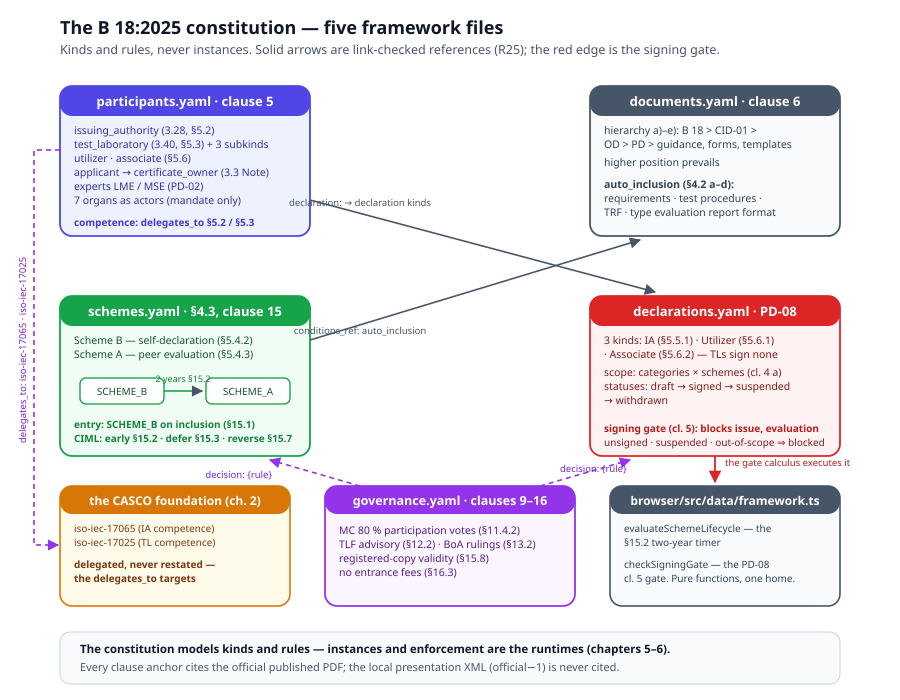

# Chapter 1 — The Scheme Architecture

> *In this chapter:* the B 18:2025 constitution as a model — participant
> kinds and organs, Schemes A and B with the two-year lifecycle,
> Declarations and the signing gate, the document hierarchy, and the
> organ decision rules — five framework files, clause-anchored to the
> official PDF.

---

## 1.1 Why the scheme has a constitution



Ask "what is the OIML-CS?" and PD-05 answers only the processing
question: how one application becomes one certificate. It does not say
who may apply to issue certificates, who decides, what a Declaration is,
which document outranks which, or how a whole instrument category moves
from self-declaration to peer-assessed certification. Those answers live
in **OIML B 18:2025, the Framework for the OIML Certification System** —
the scheme's constitution, and the document every other OIML-CS document
cites as its root.

A model of the scheme that starts at PD-05 therefore starts in the
middle. Before any process can run, the scheme's *statics* must exist:
the kinds of actors (who may act), the kinds of participation (on what
competence basis, admitted how), the instruments that bind them
(Declarations), the rules that decide (organs and their votes), and the
shelf of documents that govern it all. That is constitution content —
the scheme's IS — and it is what `data/oiml-cs/framework/` models, in
five files, each schema-validated, every clause anchor citing the
official published PDF (`reference-docs/cs/docs/b018-e25.pdf`):

| File | B 18:2025 | What it models |
|---|---|---|
| `framework/participants.yaml` | clause 5 | the participant kinds + the seven organs as actors (identity and mandate only) |
| `framework/schemes.yaml` | §4.3, clause 15 | Scheme A / Scheme B definitions + the per-category `category_scheme` lifecycle machine |
| `framework/declarations.yaml` | §5.5–5.6; PD-08 | the Declaration model — kinds, scope, statuses, the signing-gate invariant |
| `framework/documents.yaml` | clause 6; §4.2 | the governing-document hierarchy + the auto-inclusion conditions |
| `framework/governance.yaml` | clauses 9–16 | the organ decision rules — votes, rulings, registration, fees |

One discipline governs the whole directory: **the framework references,
never restates.** Competence is `delegates_to: iso-iec-17065` (IA,
§5.2) and `delegates_to: iso-iec-17025` (TL, §5.3) — a reference to the
CASCO packages of chapter 2, with no ISO text copied in. The MECE split
is grep-proven in `browser/src/__tests__/cs-framework.test.ts`.

## 1.2 Participants and organs

`participants.yaml` is a **type-level registry**: the kinds of who may
act, not the actual bodies (instances are app data — chapter 5). Every
kind carries its B 18 term number and clause anchor:

- **Conformity-assessment participants** — `issuing_authority` (3.28,
  §5.2: a certification or inspection body approved by the Management
  Committee) and `test_laboratory` (3.40, §5.3), with the three TL
  subkinds: internal, third-party, and the **manufacturer's test
  laboratory (MTL)** — flagged `data_flag`, acceptance voluntary
  (§5.6.3), the kind that makes Scheme A interesting (chapter 6).
- **Acceptance participants** — `utilizer` and `associate` (§5.6): the
  national authorities that accept (or decline) OIML certificates in
  their jurisdictions, bound by their own Declarations.
- **Workflow parties** — `applicant` (who `becomes:
  certificate_owner` on issuance, the 3.3 Note), `user`.
- **Experts** — the Legal Metrology Expert (LME) and Management System
  Expert (MSE) of PD-02, the assessors the approval pipelines consume.
- **The seven organs as actors** — CIML, the Management Committee (MC),
  the Review Committee (RC), the Test Laboratories Forum (TLF), the
  Board of Appeal (BoA), the BIML, the Executive Secretary.

Organs appear here with identity and mandate **only**. How they decide —
vote thresholds, quorum, casting votes — lives in `governance.yaml`. The
split is deliberate MECE inside the framework: a registry of actors and
a rulebook are different concerns, and the pipelines of chapter 3 bind
them independently (`organs:` for who acts, `decision:` for under which
rule).

## 1.3 Schemes A and B — and the two-year clock

The OIML-CS runs every instrument category under one of two schemes
(`schemes.yaml`; term definitions 3.37/3.38):

- **Scheme B** — the manufacturer's test results are evaluated on the
  basis of a **self-declaration** of competence (§5.4.2);
- **Scheme A** — competence is **peer-evaluated**, on the basis of
  accreditation or peer assessment (§5.4.3).

The load-bearing model is the **per-category lifecycle machine**
(`category_scheme`, clause 15): a category enters the OIML-CS at
SCHEME_B automatically when the §4.2 inclusion conditions are met
(`conditions_ref: auto_inclusion` — the machine's entry guard references
the documents model, never restates it), and **two years after
inclusion the category automatically transitions to Scheme A** (§15.2).
The timer is a declared trigger (`two-year-transition`, `window: {years:
2}`) firing the `transition_period_elapsed` action; the CIML may decide
variations — early transition (§15.2, second sentence), deferral
(§15.3), reversal A→B (§15.7) — modelled as further transitions on the
same machine.

The calendar arithmetic has exactly one home:
`browser/src/data/framework.ts` (`schemeTransitionDate`,
`evaluateSchemeLifecycle` — pure functions driving the declared machine
through the platform's `StateMachine` class; a window elapsed ⇒ the
bound action fires if the machine offers it from the current state, so
re-evaluating a category already in SCHEME_A is a no-op). The seeded
proof: a category included 2023-01-15 fires on 2025-01-15 — day-before
silence, on-the-day firing, persistence after the window. Chapter 5
shows the runtime driving this machine against real registry records.

Why model the clock at all? Because "Scheme A or B?" is not a fact a
clerk sets — it is a *consequence of time and governance*. Leave it to
prose and every workspace answers it differently; model it and the
answer computes identically everywhere, with the §15.3 deferral a
governance act on the model, not a hand-edit.

## 1.4 Declarations and the signing gate

The **Declaration** is the scheme's binding instrument (`declarations.yaml`,
modelling PD-08 Ed 3): a signed, scoped, statused record of what a
participant may do in the scheme.

- **Three kinds** — `issuing_authority_declaration` (§5.5.1),
  `utilizer_declaration` (§5.6.1), `associate_declaration` (§5.6.2).
  Test Laboratories sign none: a TL is registered *on* an IA's
  Declaration.
- **One scope model** — `categories_x_schemes`: a Declaration covers a
  matrix of instrument categories × schemes, nothing vaguer (PD-08
  cl. 4 a)).
- **Content slots for the acceptance participants** — additional
  national requirements (ANRs), accepted IA/TL lists, the MTL
  acceptance policy, MAA-certificate acceptance conditions (§5.6.3,
  PD-08 cl. 6) — the slots chapter 6's utilization calculus reads.
- **Four statuses** — `draft → signed → suspended → withdrawn`.

And the scheme's sharpest invariant, the **signing gate** (PD-08 cl. 5):

> an Issuing Authority issues nothing — no certificate, no evaluation
> report — before its Declaration covering that (category, scheme) is
> signed.

The gate is modelled as a first-class invariant record
(`declaration-signed-before-issuance`) whose `blocks: [issue,
evaluation]` reference the abstract process model of chapter 4 — a
constraint *over* the scheme's processes, not a new process. Its
calculus is `checkSigningGate` in `browser/src/data/framework.ts`:
declaration present → kind matches → status `signed` → scope covers the
category → scope covers the scheme. Any failure blocks. Chapter 5 shows
the gate enforced on every live issuance path, failing closed.

## 1.5 The document hierarchy

`documents.yaml` models two things:

- **The hierarchy** (clause 6 a)–e)): B 18 at the top, then CID-01
  (clarifications), then the OD documents, then the PD documents, then
  guidance/forms/templates — with the higher-position-prevails rule.
  When two documents conflict, the model already knows which wins.
- **The auto-inclusion conditions** (§4.2 a)–d)): what it takes for an
  instrument category to enter the OIML-CS — a Recommendation with
  requirements, test procedures (including family selection), a test
  report format, and a type evaluation report format. The lifecycle
  machine's entry guard references this block by id; the coverage map of
  chapter 7 cites it against ISO/IEC 17067's "scope" checklist item.

## 1.6 Governance — the decision rules

`governance.yaml` holds the rulebook (clauses 9–16), each rule a
first-class, referenceable record:

- **MC participation decisions** (`ia-tl-participation-decisions`):
  approval, re-approval or suspension of an IA or TL requires **at
  least 80 % of the MC Members from OIML Member States** (§11.4.2 —
  §11.4.3 for the by-correspondence variant), on RC recommendation
  (§11.6.2) — proxies ≤ 2, abstentions not voting. Other proposals pass at
  half (meeting) or two-thirds of votes cast (correspondence).
- **TLF** advisory tasks, including inter-laboratory comparisons
  (§12.2); **BoA** appeal rulings (§13.2).
- **BIML registration and the §15.8 registered-copy validity
  principle**: the only valid version of an OIML certificate is the
  issued one, and its validity is verified against the copy registered
  and published on the OIML website — the rule chapter 6 turns into a
  digest check.
- **Legacy instruments remain valid** (§15.10/§15.11 — MAA and Basic
  certificates); **no entrance fees** (§16.3).

Vote thresholds are schema-constrained to (0, 1] and every rule's organ
references are link-checked. Nothing here is prose: a threshold the
runtime needs is *read from this model* (chapter 5's tally), never
restated in TypeScript.

## 1.7 Kinds, not instances — and where the calculus lives

The framework models **kinds, declaration kinds, the lifecycle machine,
the decision rules** — never actual IAs, TLs or Declarations. Instances
are the platform runtime's concern (chapters 5–6). Two consequences:

- the framework files are **YAML-only content** — no PRL constructs yet
  (their `provides` tokens sit honestly in the emitter's
  `UNSHIPPED_PROVIDES`), consumed by the schema validator, the linker,
  and the calculi;
- the two calculi the constitution needs — the §15.2 timer and the
  PD-08 signing gate — are **pure functions over definitions plus
  caller-supplied instances** in `browser/src/data/framework.ts`, the
  same discipline as the verification calculi of Volume II.

The framework block composes into every Recommendation's effective tree
(the oiml-cs layer sits in every rec's `uses:`), and since the runtimes
landed it also rides the runtime standard meta (`std.framework`), where
the issuance gate and the registry calculi read it.

## 1.8 Grammar sketch *(illustrative v3 syntax)*

```prl
package oiml-cs {
  uses [iso-iec-17000, iso-iec-17065, iso-iec-17025, iso-iec-17067]
  scheme_type type_1a                    # B 18:2025 §1.3 — chapter 2

  framework {
    participant issuing_authority {
      term "3.28"  clause "5.2"
      competence { delegates_to iso-iec-17065 }   # reference, never restatement
      approval   { decided_by management_committee
                   on_recommendation_of review_committee  procedure "PD-03" }
      declaration issuing_authority_declaration
    }

    lifecycle category_scheme {          # B 18 clause 15
      initial SCHEME_B                   # §15.1 — on auto-inclusion
      transition two_year {              # §15.2
        window { years: 2 }
        action transition_period_elapsed -> SCHEME_A
      }
    }

    invariant declaration_signed_before_issuance {   # PD-08 cl. 5
      blocks [issue, evaluation]         # ids of the abstract process model
      scope_checked [category, scheme]
    }

    rule ia_tl_participation_decisions { # §11.4.2
      organ management_committee
      on_recommendation_of review_committee
      threshold { in_meeting: 0.8 of electorate, abstentions: not_voting }
    }
  }
}
```

## 1.9 Validation rules

- every participant kind, organ, declaration kind and decision rule
  carries its clause anchor — schema-required, seeded-rejection-proven;
- every cross-reference resolves (linker rule **R25
  `framework-references`**): declaration facets → declaration kinds,
  `designated_by`/`becomes` → participant kinds, approvals → organs,
  lifecycle triggers → declared transition actions, `conditions_ref` →
  the auto-inclusion block, signing-gate `blocks` → abstract processes,
  `no_entrance_fees_for` → participant kinds;
- timer triggers declare their window; vote thresholds lie in (0, 1];
- no ISO provision text inside the framework — the `delegates_to`
  facets are the only competence content (grep-level MECE proof);
- every clause anchor cites the official PDF — the local presentation
  XML (`data/oiml-b018-e25/`, numbered official−1) is never cited.

## 1.10 Summary

- B 18:2025 is the scheme's constitution; PD-05 is only one process of
  it. The framework model gives the constitution five files:
  participants, schemes, declarations, documents, governance.
- The framework references the CASCO packages, never restates them —
  competence is a `delegates_to` facet away.
- The Scheme B→A transition is a state machine with a two-year timer;
  the signing gate is a first-class invariant blocking `issue` and
  `evaluation`; both calculi live in one pure module,
  `browser/src/data/framework.ts`.
- The framework models kinds and rules; instances and enforcement are
  the runtimes of chapters 5–6.

*Next: [Chapter 2 — The CASCO foundation](02-casco-foundation.md): why
the scheme is defined by delegation, and the facet trio that makes the
delegation machine-checkable.*
