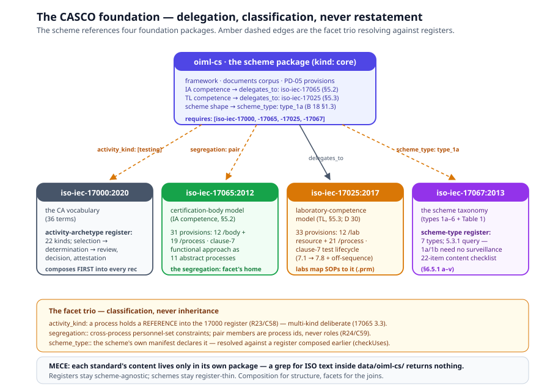

# Chapter 2 — The CASCO Foundation

> *In this chapter:* why the OIML-CS is defined by delegation to the
> ISO/IEC CASCO corpus — 17000's vocabulary, 17065's certification-body
> model, 17025's laboratory model, 17067's scheme taxonomy — and the
> facet trio that makes the delegation machine-checkable:
> `activity_kind`, `segregation:`, `scheme_type:`.

---

## 2.1 Why the scheme is defined by delegation

B 18:2025 does not define competence. It *points*: "OIML Issuing
Authorities are required to demonstrate their competence through
compliance with ISO/IEC 17065" (§5.2); "Test Laboratories … through
compliance [with] ISO/IEC 17025" (§5.3). The scheme's vocabulary is
ISO/IEC 17000's; its shape as a product certification scheme is ISO/IEC
17067's. The OIML-CS is what it delegates to.

A model of the scheme has two ways to honour that. The wrong way is
restating: copy the 17065 clause-7 process into the scheme package, copy
the 17025 equipment clauses into the TL pipeline. That is the
copy-residue failure mode — the cross-standard census found exactly this
anti-pattern between rec packages (byte-identical files, including
copies *wrong* for the copying rec), and it is what `uses` composition
exists to kill (Volume I, chapter 8). The right way is the one the
standard itself uses: the CASCO documents are modelled once, as their
own reference packages, and the scheme package **references** them —
composition for structure, facets for the joins.

So the foundation is four packages under `data/`, each `kind: core`,
each clause-referenced to its standard, each the *only* home of its
content (MECE, grep-proven):

| Package | Standard | What it contributes | Numbers |
|---|---|---|---|
| `data/iso-iec-17000/` | ISO/IEC 17000:2020 | the conformity-assessment vocabulary + the functional-approach activity taxonomy as a **register of classifiable kinds** | 36 terms; 22 activity archetypes |
| `data/iso-iec-17065/` | ISO/IEC 17065:2012 | the product-certification-body model the IA's competence delegates to (B 18 §5.2) | 13 terms; 31 provisions (12 `/body` + 19 `/process`); the clause-7 functional approach as 11 abstract processes |
| `data/iso-iec-17025/` | ISO/IEC 17025:2017 | the laboratory-competence model the TL delegates to (B 18 §5.3; application guidance in OIML D 30) | 9 terms; 33 provisions (12 `/lab` resource + 21 `/process`); the clause-7 test lifecycle as abstract processes |
| `data/iso-iec-17067/` | ISO/IEC 17067:2013 | the scheme taxonomy: types 1a–6 as a machine-queryable register + the §6.5.1 scheme-content checklist | 3 terms; 7 scheme types; 22 checklist provisions |

Composition order is load-bearing: 17000 composes **first** into every
rec (its register resolves everyone else's `activity_kind` tags), then
17065, 17025, 17067 (`requires: [iso-iec-17000]` each), then `oiml-cs`
(`requires:` all four), then `core`. A rec's `uses:` reads the whole
stack: `[iso-iec-17000, iso-iec-17065, iso-iec-17025, iso-iec-17067,
oiml-cs, core, module-…]`.

## 2.2 The facet trio

Delegation by reference answers "where does the content live?". Three
facets answer the follow-up questions a machine will ask — *what kind of
activity is this process? whose hands must stay off which case? what
kind of scheme is this?* — each against a register, each checked by a
linker rule (mirrored as a `primmel check` rule):

| Facet | Declared on | Resolves against | Doctrine | Linker / check |
|---|---|---|---|---|
| `activity_kind: […]` | abstract processes | the 17000 activity-archetype register (structure key `activity_archetypes`) | classification, never inheritance | R23 / C58 |
| `segregation: […]` | abstract processes | the process's own pipeline (pair members are process ids) | declared constraints, never prose | R24 / C59 |
| `scheme_type: <id>` | a scheme's own `layer.yaml` | the 17067 scheme-type register (structure key `scheme_types`) | a scheme classifies *itself* | `checkUses` |

The shared doctrine: **classification, never inheritance.** A process
tagged `activity_kind: [testing]` does not subclass a `testing` class;
it holds a *reference* into a register, resolvable when the register is
in scope and silent when it is not (classification is opt-in per
composition). Registers stay scheme-agnostic; schemes stay
register-thin. The sections below take the three facets in turn.

## 2.3 `activity_kind` — what kind of activity is this?

ISO/IEC 17000:2020's functional approach (its informative Annex A) names
the functions every conformity-assessment activity realizes: **selection
→ determination → review, decision and attestation**. The package turns
that taxonomy into a register — `evaluation/activity-archetypes.yaml`,
22 entries `{id, label, clause, definition, parent?}` — single-sourced
in the 17000 layer so every composed tree resolves the same ids.

Two register disciplines matter:

- **`parent` records only what the standard states.** Testing,
  inspection, audit, validation, verification and peer assessment are
  types of *determination* (A.3.2); declaration, certification and
  accreditation are types of *attestation* (A.4.3); representative
  sampling belongs to the *selection* function (A.2). Clause 8's title
  ("terms relating to surveillance") is a grouping, not a type-of
  relation — suspension, withdrawal, appeal, complaint stay top-level.
  The register is the standard's taxonomy, not an editor's.
- **Multi-kind is deliberate.** ISO/IEC 17065 3.3 defines *evaluation*
  as "combination of the selection and determination functions" — so
  the scheme's `evaluation` process is tagged `[selection,
  determination]`, and the register's job is to make that honest, not
  to force a single parent.

The consumer proof is the scheme's own process model (chapter 4):
`application` is `[selection]` (A.2 — the applicant collects the
information the determination needs), `testing` is `[testing]`,
`decision` is `[decision]`, `issue` is `[certification]` (7.6 — the
certificate is third-party attestation), `biml_registration` is
`[attestation]` (registration completes attestation; it issues no new
statement, so not certification). One deliberate non-tag is documented
in the file header. Every id resolves (R23); an unknown kind is an
error; the register's own `parent` references are resolved within the
register.

## 2.4 `segregation:` — whose hands must stay off this case?

ISO/IEC 17065's clause 7 carries the certification world's core
integrity rules: the reviewer shall not have been involved in the
evaluation (7.5.1); the decider shall not have been involved in the
evaluation (7.6.2); complaint resolution shall be independent of the
case's activities (7.13.5); consultancy creates a barred relation, for
two years where the standard fixes a period (7.13.6, 4.2.10). These are
**non-involvement constraints over personnel sets, per case** — and the
package models them as first-class structured declarations:

```yaml
segregation:
  - id: review_not_evaluation
    kind: case_personnel_disjoint
    clause: "7.5.1"
    pair: [review, evaluation]
    statement: >
      Within one certification case, the personnel assigned to the
      review share no member with the personnel assigned to evaluation.
```

Why a new facet instead of the existing `invariants:` block? Three
reasons, each disqualifying on its own:

1. **Invariant strings are never parsed.** The toolchain loads them as
   opaque documentation; no gate could ever fail on one. A segregation
   rule written as an invariant would be mechanically inert — and a
   rule that cannot fail is not a rule.
2. **The shape does not fit.** Invariants quantify over one process's
   own signature records at completion. Segregation is a *cross-process*
   relation over *personnel sets*, relative to one *case* — and 7.13.6
   is additionally temporal (a two-year bar after a relation ends).
3. **Roles are the wrong member type.** In the consuming scheme, one
   role (`issuing_authority`) legitimately binds evaluation, review
   *and* decision — role-level disjointness is unsatisfiable and
   unfaithful. The 17065 norms quantify over process *involvement*, so
   pair members are **abstract-process ids**, and the reserved token
   `case_personnel` names the case-relative personnel set of 7.13.5.

Two kinds cover the standard's shapes: `case_personnel_disjoint`
(exactly two distinct pair members — the reviewer/decider rules) and
`consultancy_bar` (barred relations, `period` only where the standard
fixes one). Declaration well-formedness is linker-checked (R24/C59);
per-assignment runtime enforcement is the platform's (chapter 5).

## 2.5 `scheme_type:` — the scheme classifies itself

ISO/IEC 17067's clause 5 defines the product-certification scheme types:
1a, 1b, 2, 3, 4, 5, 6 — differing in whether determination includes
sampling, what attestation issues (a type certificate, a batch
certificate, a mark licence), and whether surveillance applies. B
18:2025 §1.3 classifies the OIML-CS: **Scheme 1a per ISO/IEC 17067
(5.3.2)**.

The package models the taxonomy as a structured register
(`specification/scheme-types.yaml`): the seven named types with
verbatim-faithful descriptions, the type-specific sampling facets, the
`attestation_object` enum, and the Table-1 activity facets
(determination II a–e, attestation V a–d, surveillance VI a–d) — plus
the 5.3.1 surveillance-presence query: types 1a/1b require no
surveillance.

Then the doctrine: **a scheme classifies itself, in its own manifest.**
The oiml-cs layer declares

```yaml
# data/oiml-cs/layer.yaml
scheme_type: type_1a
```

— never a classification record inside the 17067 package. A foundation
package naming its consumer would invert the composition; the taxonomy
stays scheme-agnostic, and the consuming layer holds the one id.
`checkUses` resolves the declared id against a scheme-type register
composed *earlier* in the `uses` list and fails the composition
otherwise — the declaration is checkable, or it is nothing.

The declaration pays off mechanically: coverage gates read it to
discharge the type-conditioned provisions. Type 1a ⇒ the §6.5.1 o)
surveillance item and the Table-1 VI content are N/A, with 5.3.1 as the
justification — and the gate *re-checks* that justification against the
register: a surveillance named gap fails the moment the declared type
requires surveillance, a mark-ownership gap fails the moment the type
licenses marks (chapter 7). The scheme's self-knowledge is data, and
the audit consumes it.

## 2.6 What the delegation looks like composed



Composed into a rec, the foundation is invisible to the app — the
effective tree simply contains one copy of each register, and every
`activity_kind` id in the scheme's processes resolves. The visible edges
are the three delegation points the standard itself declares:

- **IA competence** — `framework/participants.yaml`:
  `delegates_to: iso-iec-17065` (§5.2). The 17065 package's clause-7
  functional approach (application 7.2 → application review 7.3 →
  evaluation 7.4 → review 7.5 → decision 7.6 → attestation 7.7/7.8 →
  surveillance 7.9, plus changes 7.10, termination 7.11, records 7.12,
  complaints 7.13) is the process taxonomy the scheme's pipelines are
  classified against; its `/body` provisions are verified by assessment
  of the body, its `/process` provisions bind the abstract processes.
- **TL competence** — `delegates_to: iso-iec-17025` (§5.3). The 17025
  package carries the clause-6 resource provisions (personnel 6.2,
  equipment 6.4 incl. the 6.4.13 a–h record items, metrological
  traceability 6.5 + Annex A) and the clause-7 test lifecycle (request
  review 7.1 through reporting 7.8, plus the off-sequence technical
  records, complaint handling, nonconforming work). Its two same-named
  `functional-approach.yaml` files union by id with 17065's in composed
  trees — the process ids are deliberately disjoint (17025's complaint
  process is `complaint_handling`). Two documented collisions live in
  the headers: 17025's *verification* (3.8, the VIM sense) vs 17000's
  6.6 (the conformity-assessment sense).
- **Scheme shape** — `scheme_type: type_1a` against the 17067 register,
  with the 22-item scheme-content checklist as the audit target of
  chapter 7.

And the delegation is *bidirectionally useful*: a laboratory maps its
own SOPs, equipment and personnel registers to the 17025 provisions in a
`.prm` (the `lab-to-17025.prm` pilot — Volume III, chapter 10), so the
same foundation package serves the scheme's competence delegation and
the lab's own conformity demonstration. One content, one home, many
references.

## 2.7 Grammar sketch *(illustrative v3 syntax)*

```prl
# ── the foundation registers classify, consumers reference ──
package iso-iec-17000 {
  register activity_archetypes {
    archetype testing      { clause "6.2"  parent determination }
    archetype certification{ clause "7.6"  parent attestation }
    archetype complaint    { clause "8.7" }   # top-level: clause 8 groups, not types
  }
}

package oiml-cs {
  uses [iso-iec-17000, iso-iec-17065, iso-iec-17025, iso-iec-17067]
  scheme_type type_1a                       # B 18:2025 §1.3 — self-classification

  process evaluation {
    activity_kind [selection, determination]    # 17065 3.3 — multi-kind deliberate
  }
  process review {
    activity_kind [review]
    segregation [{
      kind case_personnel_disjoint
      clause "17065:7.5.1"
      pair [review, evaluation]                 # process ids, never roles
    }]
  }
}
```

## 2.8 Validation rules

- every `activity_kind` id resolves against the composed register when
  one is in scope (R23/C58; silent when not — classification is opt-in);
  the register's `parent` references resolve within the register;
- every `segregation:` entry is well-formed (R24/C59): a known kind,
  `case_personnel_disjoint` naming exactly two distinct pair members,
  pair members resolving to abstract-process ids, `period` only where
  the standard fixes one;
- a `scheme_type:` id resolves against a scheme-type register composed
  earlier in the `uses` list (`checkUses` fails the composition
  otherwise);
- MECE: 17000/17065/17025/17067 content lives only in its own package —
  the scheme package references via facets and `delegates_to`, and a
  grep for ISO provision text inside `data/oiml-cs/` returns nothing;
- clause anchors follow the standards' own numbering (17000's Annex-A
  functions cited as A.2/A.3 — they are functional-approach concepts,
  not numbered terms).

## 2.9 Summary

- The OIML-CS is defined by delegation: competence to 17065/17025
  (B 18 §5.2/§5.3), vocabulary to 17000, scheme shape to 17067. The
  model mirrors the standard: four foundation packages, referenced
  never restated.
- `activity_kind` classifies processes against the 22-entry 17000
  register — multi-kind by design, `parent` only where the standard
  states a type-of.
- `segregation:` makes non-involvement machine-checkable — cross-process
  personnel-set constraints that invariant strings could never enforce;
  pair members are process ids, never roles.
- `scheme_type:` lets a scheme classify itself in its own manifest —
  `type_1a` for the OIML-CS — and the coverage gates consume the
  classification mechanically.

*Next: [Chapter 3 — The documents corpus](03-documents-corpus.md): the
twelve governing documents, eleven of them as per-document modules, and
what each contributes.*
