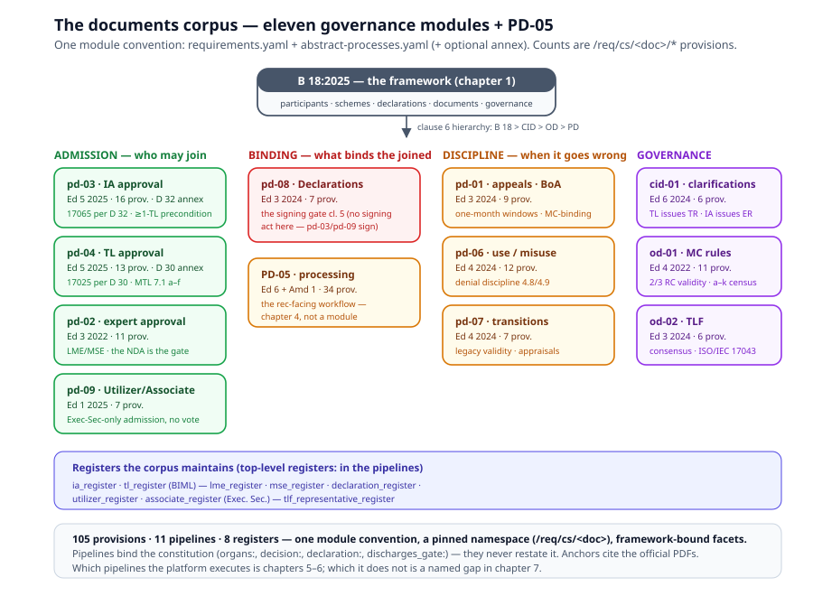

# Chapter 3 — The Documents Corpus

> *In this chapter:* the twelve governing documents of the OIML-CS,
> eleven of them as per-document modules (PD-05 is chapter 4's) — the
> module convention (provisions + pipeline + optional annex), what each
> PD/CID/OD contributes, and the clause-anchor discipline that keeps
> the corpus honest.

---

## 3.1 Why a corpus, not a document

PD-05 is the document everyone knows — it is the one the certification
workflow executes. But the *system* is governed by twelve: B 18's clause
6 hierarchy names the tiers (B 18 > CID-01 > OD > PD > guidance), and
the procedures split into families that answer different questions:

- **Who may join?** PD-03 (Issuing Authorities), PD-04 (Test
  Laboratories), PD-02 (experts), PD-09 (Utilizers and Associates) —
  the admission documents, each an approval pipeline ending in a
  Declaration or a register.
- **What binds the joined?** PD-08 — the Declarations themselves: their
  obligation, content, and the signing gate of chapter 1.
- **What happens when it goes wrong?** PD-01 (appeals, complaints,
  disputes, the Board of Appeal), PD-06 (use and misuse of
  certificates), PD-07 (transitions from the legacy systems).
- **How do the organs run?** OD-01 (the Management Committee's
  operational rules), OD-02 (the Test Laboratories Forum), CID-01 (the
  standing clarifications).

Modelling only PD-05 would leave the scheme without its admission,
discipline and governance content — precisely the content a PD-03/PD-04
assessment asks for. So the package carries a **per-document module**
for each: `data/oiml-cs/documents/<doc>/`.

## 3.2 The module convention

One fixed layout, eleven times:

```text
data/oiml-cs/documents/<doc>/
  requirements.yaml        — provisions /req/cs/<doc>/* (rc.yaml shape)
  abstract-processes.yaml  — the document's pipeline as abstract processes
  annex-<guide>.yaml       — optional informative application guide
```

Three rules make the convention load-bearing:

- **The namespace is pinned.** The package owns `/req/cs`; each module
  owns exactly `/req/cs/<doc>`. Composition enforces both directions
  (`assertNoLayerOwnedRequirementScopes` — a rec declaring at or under
  the scheme's scopes throws; `documentNamespaceViolations` — a module
  straying into a sibling's scope, or restating the layer root, throws).
  One ownership, one segregation, mechanical.
- **Pipelines bind the framework, never restate it.** The
  abstract-process schema carries the framework-facing facets:
  `organs:` / `participant_kinds:` (who acts — chapter 1's registry),
  `decision: {rule, clause}` (under which governance rule — the MC 80 %
  vote), `declaration: {kind, action: sign|update}` (which Declaration
  act the step performs), `discharges_gate:` (wiring the signing gate
  as the pipeline's terminal invariant), and top-level `registers:`
  (the lists the document maintains). Linker rule **R26** resolves
  every binding; the pipelines join the shared process checks
  (R18/R19/R23/R24) like any abstract process.
- **Annexes stay informative.** D 30 (17025 application guidance) and
  D 32 (17065 application guidance) ride as `annex-*.yaml` with their
  own schema — `applies_to` *references* the CASCO package, each
  guidance item naming its discharge. They guide assessments; they are
  never normative content.

What a module is *for* decides whether it exists: a document whose
content is **scheme governance** (who may issue/test/assess/join) gets
a module. PD-05's rec-facing certification workflow does not — it stays
in the package's own `specification/requirements/cs.yaml` +
`evaluation/abstract-processes.yaml`, and chapter 4 is its story.

## 3.3 The admission documents

**PD-03 — IA approval** (Ed 5, 2025; 16 provisions; D 32 annex).
Competence is ISO/IEC 17065 applied per D 32 — *delegated, never
restated* (`competence-basis`, 4.3). An IA application requires at
least one associated TL application (4.1 — an invariant on the
pipeline's first step). Two demonstration paths: accreditation (IAF
MLA + an MC-approved LME, 5.2.2) or peer assessment (MSE-led team, the
applicant arranges and bears the cost, 5.2.3). The pipeline runs
`ia_application → ia_assessment → ia_rc_review → ia_mc_decision →
ia_declaration_signing → ia_list_publication`; the decision binds the
framework's 80 % rule; the terminal `ia_declaration_signing` carries
`declaration: {kind: issuing_authority_declaration, action: sign}` +
`discharges_gate: declaration-signed-before-issuance`. Off-sequence:
Scheme-B self-declaration (6.1), periodic review (clause 10 — annual
summary, 4-yearly reassessment, LME participation), suspension,
scope change, withdrawal. Register: `ia_register` (maintainer: the
BIML).

**PD-04 — TL approval** (Ed 5, 2025; 13 provisions; D 30 annex).
Competence is ISO/IEC 17025 per D 30 (4.3). A TL applies endorsed by
an IA, in conjunction with the IA's application (5.1); the three TL
kinds are *referenced* from the framework registry. The pipeline
mirrors PD-03's but ends differently: `ia_declaration_update` —
the TL is registered on the IA's Declaration (TLs sign none) — then
`tl_list_publication`. The **MTL** gets the controlled-supervision
model (7.1 a–f): documented instructions, the EUT-failure procedure,
start/finish notification, witness visits, spot-check re-tests, no
subcontracting — the safeguards chapter 6's Scheme-A runtime enforces.
The TL's periodic review rides on the IA's cycle (PD-03 clause 10
covers "IAs and their associated Test Laboratories" — modelled once,
MECE).

**PD-02 — expert approval** (Ed 3, 2022; 11 provisions). The scheme's
assessors: Legal Metrology Experts and Management System Experts.
Competence criteria are *delegated to OD-01 13.2.1/13.2.2* (pinned,
landed in the od-01 module). Nomination (7.1/7.2) → RC review → MC
decision (an "other proposal", not the 80 % class) → the BIML
non-disclosure agreement (8.2) → publication on the ILAC-IAF-OIML
lists. **The expert gate is the NDA, not a Declaration** — the
pipeline carries no `declaration:` facet. Registers: `lme_register`,
`mse_register` (maintainer: the Executive Secretary).

**PD-09 — Utilizer/Associate admission** (Ed 1, 2025; 7 provisions).
Two parallel tracks, no assessment and no RC/MC vote — the Executive
Secretary reviews, the participant signs its Declaration, the list is
updated. The Utilizer application captures what chapter 6 consumes:
additional national requirements, accepted IA/TL lists, the MTL
policy, all stated in the Declaration. Registers: `utilizer_register`,
`associate_register`.

**PD-08 — the Declarations register** (Ed 3, 2024; 7 provisions). The
participation register itself: every IA/Utilizer/Associate signs
(cl. 4); the signing gate (cl. 5) plus its 5.2 proviso (evaluation and
testing before signature only after a positive, unconditional RC
recommendation — issuance always waits for the signature); MAA
acceptance conditions SHALL be
detailed, MTL acceptance is voluntary (cl. 6). The MECE split is
proven by test: the Declaration *kinds* live in
`framework/declarations.yaml`, the signing *acts* live in the
admitting pipelines (pd-03, pd-09), and pd-08 carries **no**
`discharges_gate` — it owns the register (`declaration_register`,
maintainer: the Executive Secretary) and the maintenance discipline.

## 3.4 The discipline documents

**PD-01 — appeals, complaints, disputes** (Ed 3, 2024; 9 provisions).
The BoA: CIML-appointed Chair + 4, MC members barred, own-country bar
(4.1/4.2). Three complaint kinds (clause 6): incorrect technical
conclusions (substantiated ⇒ Executive Secretary investigates; upheld
⇒ **the certificate is deregistered** and the IA corrects the report),
non-acceptance (the MC may amend scopes), dissatisfaction. Disputes
escalate CIML-Member mediation → written explanation → BoA (clause 7).
Appeals (clauses 8–9): the applicant must first exhaust the IA's own
procedure (8.1), then one month to lodge; the BoA circulates
information at least one month before considering; a written decision
within one month; **the ruling binds the MC and cannot be appealed
further**. The three one-month windows are structured `windows:`
facets on the pipeline — model content the operations runtime enforces
(chapter 6), never restated durations in TypeScript.

**PD-06 — use and misuse** (Ed 4, 2024; 12 provisions). What a
certificate is *for* (4.2: national type-approval support with
type-identity evidence, initial-verification support, buyer
information) and what it is *not* (4.1: no legal international
approval; 4.4: not proof an individual instrument conforms — and no
OIML logo on instruments, B 20 delegated). The denial discipline
chapter 6 executes: non-acceptance requires consultation and a written
justification addressed to the IA + the manufacturer + the Executive
Secretary (**4.8**), except MTL-grounded denials, which are voluntary
and justification-free (**4.9**). Misuse (clause 5): warning ⇒
corrective action ⇒ deregistration with the OIML Bulletin and website
notice. *Anchor note:* the local corpus audit had 4.8/4.9 off by one;
the module cites the official PDF and records the correction in its
header.

**PD-07 — transitions** (Ed 4, 2024; 7 provisions). Legacy Basic and
MAA certificates remain valid (clause 4, B 18 §15.10/§15.11); since
2018 no new or revised legacy certificates, and "Annex" changes only
for error correction or ownership transfer — never characteristics.
Previous test data enters the OIML-CS through documented appraisals:
Scheme B (5.2/5.3), MAA into Scheme A (6.1), Basic into Scheme A (6.2
with the 6.2.3 appraisal census), and the Scheme-B→A transition rules
(7.1/7.2).

## 3.5 The governance documents

**CID-01 — clarifications** (Ed 6, 2024; 6 provisions). The standing
interpretations as invariants: **an OIML test report is issued by an
OIML Test Laboratory** regardless of a Recommendation's structure, and
**the evaluation report by the Issuing Authority** (3.1, B 18:2025
3.40 Note 3); an IA's scope must be TL-supported "at all times" (3.3);
clarifications guide, never supersede (2.2 — `obligation: statement`).
Cross-corpus consistency is proven by test: the PD-05 process model's
`testing` step is `roles: [test_laboratory]`, its `evaluation`/`issue`
steps `roles: [issuing_authority]`.

**OD-01 — MC operational rules** (Ed 4, 2022; 11 provisions). The
committee machinery: composition (≤ 4 representatives per Member
State, one voting), RC recommendation discipline incl. the
assessed-member bar (5.6 — modelled as two `segregation:` entries
pairing the RC against the PD-03/PD-04 assessment processes), the
**two-thirds RC recommendation validity** (7.9), the annual report's
a–k content census (8.2), scheme monitoring (12.1/12.2), the expert
competence criteria (13.2.1/13.2.2 — the target of PD-02's pinned
delegation) and the 3-yearly expert-list review (13.4).

**OD-02 — the TLF** (Ed 3, 2024; 6 provisions). One representative per
TL per category (4.2); inter-laboratory comparisons encouraged per
ISO/IEC 17043 (5.1 — the provenance of PD-04 5.1 i)); consensus, else
referral to the MC or the TC/SC (6.4). Register:
`tlf_representative_register`.

## 3.6 The corpus at a glance



| Module | Edition | Provisions | Pipeline (main chain) | Registers |
|---|---|---|---|---|
| pd-01 | Ed 3, 2024 | 9 | appeal_to_boa → boa_adjudication | — |
| pd-02 | Ed 3, 2022 | 11 | nomination → RC → MC → NDA → publication | lme, mse |
| pd-03 | Ed 5, 2025 | 16 | application → assessment → RC → MC → signing → publication | ia |
| pd-04 | Ed 5, 2025 | 13 | application → assessment → RC → MC → Declaration update → publication | tl |
| pd-06 | Ed 4, 2024 | 12 | post-issuance flows (no sequence) | — |
| pd-07 | Ed 4, 2024 | 7 | legacy maintenance, previous-data acceptance | — |
| pd-08 | Ed 3, 2024 | 7 | recording, maintenance | declaration |
| pd-09 | Ed 1, 2025 | 7 | application → Declaration signing (×2 tracks) | utilizer, associate |
| cid-01 | Ed 6, 2024 | 6 | cross-cutting identity pins | — |
| od-01 | Ed 4, 2022 | 11 | RC governance, annual reporting, expert lists | — |
| od-02 | Ed 3, 2024 | 6 | representation, comparisons, recommendations | tlf |

105 provisions, 11 module pipelines (pd-09's carries two admission
tracks), 8 registers — all schema-valid, all composing into every
rec's effective tree with provenance `['oiml-cs']`, all link-checked
(R26). Which pipelines the platform *executes* is
chapters 5–6; which it does not is a named gap in chapter 7's report —
the model is complete even where the runtime is honest.

## 3.7 The clause-anchor discipline

A model of a corpus lives or dies by its references. The rule:
**official published numbering only.** Where the official PDF exists
locally (B 18:2025, PD-05 Ed 6 + Amd 1, PD-06 Ed 4, CID-01 Ed 6), every
anchor was verified against it with `pdftotext`. The local presentation
XMLs are numbered official−1 (their builds drop the front matter) and
are used for *text* only — never cited. Where no PDF exists locally,
anchors follow the corpus audit's granularity, confirmed by the XMLs'
surviving internal cross-references, and the module headers say so —
with the reconciliation queued as follow-up work (task 46). Two
source-level discrepancies are recorded rather than "fixed" — and since
task 54 they are first-class records, not header prose (● smart
8651182; the kernel construct is Volume I, chapter 9's
`discrepancy_record`). Authored in
`primmel-packages/oiml-cs/specification/discrepancies.prl` (regenerated
to `data/oiml-cs/specification/discrepancies.yaml`), the corpus's three
live records are the task-46 settlements:

- `pd-02-vs-od-01-expert-review-cycle` — PD-02, 11.1's four-year expert
  review vs OD-01, 13.4's 3-yearly: a genuine source disagreement, both
  official texts verified verbatim against the published PDFs.
  `resolution: annotated_only` — neither governs; both modules keep
  their own clause's cycle and both headers record both texts; a CID-01
  clarification candidate for the real scheme.
- `d-32-g711-4-numbering-gap` — the official printed D 32:2018 itself
  skips G.7.1.1-4 (an editorial gap in the source, not a local
  conversion drop). `resolution: follows_clause_x`, governing
  `urn:oiml:pub:d:32:2018` — the corpus cites the official body
  numbering; no G.7.1.1-4 citation exists or may be added.
- `od-01-toc-vs-body-numbering` — OD-01's own printed Contents skips
  7.2, so every TOC entry from 7.2 on reads body−1.
  `resolution: follows_clause_x`, governing the body's
  `urn:oiml:pub:cs:od-01:2022#clause-7.2` — the body numbering that
  every internal cross-reference uses wins.

(PD-06's 4.8/4.9 stays a module-header correction: the audit's
reconstruction was off by one and the PDF wins — a citation fix, not a
source-vs-source conflict.) Two registry extensions ride the records:
linker rule **R33 discrepancy-references** (every cited URN resolves;
the resolved / follows-clause-x / annotated-only / open discipline of
Volume I, chapter 9), and the URN grammar itself — the `cs` doctype
with its series-letter `cs-pub-number` form (`pd-02`, `od-01`,
`cid-01`) and the bare `#contents` front-matter element are registered
in `data/oiml-urn-specification.adoc` (mirrored in
`browser/src/data/urn.ts`), so CS documents are cited by URN, never by
bare label. Honest anchors beat confident ones — and now the honesty is
machine-checked.

## 3.8 Grammar sketch *(illustrative v3 syntax)*

```prl
# ── one document module ─────────────────────────────────────
package oiml-cs {
  documents {
    document pd-03 {                       # IA approval, Ed 5 (2025)
      provision /req/cs/pd-03/competence-basis {
        reference "PD-03, 4.3"
        statement "Competence per ISO/IEC 17065:2012, applied per OIML D 32"
        # delegated — no 17065 text here
      }
      process ia_declaration_signing {
        activity_kind [declaration]
        organs [executive_secretary]
        declaration { kind issuing_authority_declaration, action sign }
        discharges_gate declaration_signed_before_issuance
      }
      register ia_register { maintainer biml }
      annex d032 {
        role informative
        applies_to iso-iec-17065            # reference, never restatement
      }
    }
  }
}
```

## 3.9 Validation rules

- every module file validates against its schema (requirements → rc;
  pipelines → the extended abstract-process schema; annexes → the
  document-annex schema);
- namespace ownership and segregation: a rec declaring at/under
  `/req/cs` throws; a module declaring outside `/req/cs/<doc>` throws;
- every pipeline binding resolves (R26): organs, participant kinds,
  `decision:` rules against `framework/governance.yaml`, `declaration:`
  kinds and the gate against `framework/declarations.yaml`, register
  maintainers, sequence ids;
- MECE: no module declares framework keys (`participants:` /
  `governance:` / `declarations:` / `schemes:`) or ISO scopes
  (`/req/iso-*`); an annex's `applies_to` references a CASCO package
  and stays `informative`;
- clause anchors follow the official numbering where PDF-verified, the
  audit's granularity otherwise — the header records which.

## 3.10 Summary

- The scheme is governed by twelve documents; PD-05 is one of them.
  The eleven governance documents get per-document modules — provisions,
  a pipeline, an optional annex — under a pinned namespace.
- Pipelines bind the framework through facets (`organs:`, `decision:`,
  `declaration:`, `discharges_gate:`) — they never restate it; the
  signing gate is the admission pipelines' terminal invariant.
- The corpus splits into admission (PD-03/04/02/09), the binding
  register (PD-08), discipline (PD-01/06/07), and governance
  (CID-01, OD-01/02).
- Anchors cite official numbering; unverifiable granularity is
  disclosed in module headers, and source discrepancies are first-class
  `discrepancy_record`s checked by R33 — recorded, never silently
  reconciled.

*Next: [Chapter 4 — The certification workflow](04-certification-workflow.md):
PD-05 as abstract processes plus 34 provisions, bound by `realized_by`
to the concrete Core processes.*
