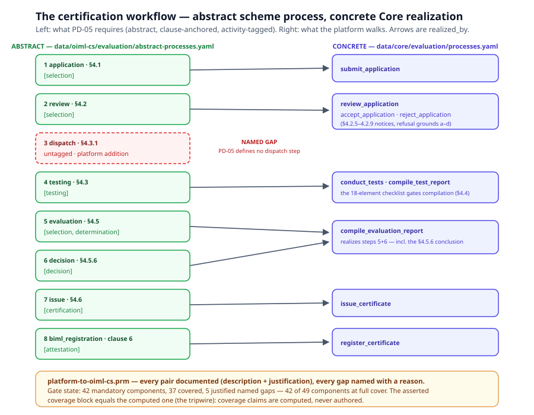

# Chapter 4 — The Certification Workflow

> *In this chapter:* PD-05 as a model — the 8-step scheme process plus
> the off-sequence flows as abstract processes, the 34 provisions with
> the full clause-coverage table, the 18-element test-report checklist,
> and `realized_by` binding the abstract to the concrete Core processes
> under the `.prm` coverage discipline.

---

## 4.1 Why abstract + concrete

Volume I's author's ladder (chapter 4) applies to the scheme itself.
PD-05 *requires* a process — application, review, testing, evaluation,
decision, issuance, registration — but a requirement for a process is
not an execution of one. The scheme package therefore holds the process
**abstract**: signature, roles, evidence requirements, invariants,
clause anchor, `activity_kind` — "a process is required to fulfil these
provisions". The platform holds the matching **concrete** processes in
the Core layer (`data/core/evaluation/processes.yaml`) — the ones the
app actually walks. The join between them is one declared facet:

```yaml
# data/oiml-cs/evaluation/abstract-processes.yaml
- id: testing
  reference: "PD-05 §4.3"
  activity_kind: [testing]
  realized_by: [conduct_tests, compile_test_report]
```

`realized_by` is the scheme's answer to "who runs you?": a list of
concrete Core process ids. An empty list is not an omission — it is a
**named gap**, and the coverage gate of chapter 7 holds it open until a
realization lands. The abstract process is always valid; the gap is
always honest.

## 4.2 The 8-step sequence

PD-05 §4 (Scheme B; clause 5 applies the same provisions under Scheme A)
defines the chain every OIML certificate travels. The model carries it
as eight abstract processes with per-step classification and
realization:



| # | Abstract step | PD-05 | `activity_kind` | `realized_by` (Core) |
|---|---|---|---|---|
| 1 | `application` | §4.1 | `[selection]` | `submit_application` |
| 2 | `review` | §4.2 | `[selection]` | `review_application`, `accept_application`, `reject_application` |
| 3 | `dispatch` | §4.3.1 | — (deliberate non-tag) | *named gap* |
| 4 | `testing` | §4.3 | `[testing]` | `conduct_tests`, `compile_test_report` |
| 5 | `evaluation` | §4.5 | `[selection, determination]` | `compile_evaluation_report` |
| 6 | `decision` | §4.5.6 | `[decision]` | `compile_evaluation_report` |
| 7 | `issue` | §4.6 | `[certification]` | `issue_certificate` |
| 8 | `biml_registration` | clause 6 | `[attestation]` | `register_certificate` |

Two steps deserve their footnotes:

- **`dispatch` is a documented platform addition.** PD-05 defines no
  dispatch step — the audit's flow analysis confirms it — yet every
  real operation splits work across laboratories. The model keeps the
  step (the platform's workflow needs it), leaves it untagged and
  unrealized, and carries the named gap with the reason: the clause
  binds the *performing* laboratory (§4.3.1), the platform binds at the
  test request created at dispatch, and no concrete Core process owns
  that binding point. Honesty over symmetry.
- **`decision` is not a separate app act.** The §4.5.6 failure/approval
  conclusion is reached inside evaluation compilation, so both steps 5
  and 6 realize to `compile_evaluation_report`. One concrete process may
  realize two abstract steps; the pair documentation says what each
  half contributes.

The concrete processes live in Core because every rec shares them:
recs overlay only gate criteria, requirement URNs and testing gateways,
and the concrete processes `validate_provision`-reference the scheme
package's `/req/cs/*` provisions — which is why `core` declares
`requires: [oiml-cs]`.

## 4.3 The off-sequence flows

The linear chain is not the whole document. PD-05's other flows are
modelled as **off-sequence** abstract processes — initiable any time
their precondition holds, never part of the 8-step order:

| Flow | PD-05 | `activity_kind` | Realization |
|---|---|---|---|
| `revision` | §8.1 | `[decision, certification]` | `handle_revision` ● |
| `re_application` | §4.5.7 | `[selection]` | *named gap* — no platform linkage of a new application to the failed evaluation |
| `registration_fee` | §6.2–6.3 | `[withdrawal]` | *named gap* — the 3-month listing-withdrawal timer is off-platform |
| `incorrect_conclusions` | §7.1 | `[complaint]` | `handle_complaint`, `deregister_certificate` ● (task 45 — chapter 6) |
| `parallel_certificates` | §8.2 | `[certification]` | `issue_certificate` ● (the §8.2.1 possession gate inside it) |
| `recommendation_update` | §8.3 | `[decision, certification]` | `handle_edition_change` ● |
| `scheme_a_certification` | clause 5 | `[selection, determination, certification]` | the five Core processes of the chain, under the Scheme-A gates ● (task 45) |

`registration_fee`'s tag is the taxonomy used honestly: invoicing has
no ISO/IEC 17000 counterpart, but the fee's *consequence* — listing
withdrawn if unpaid within 3 months (§6.2) — is a withdrawal act
(8.3). One tag, justified in the file.

## 4.4 The 34 provisions — full clause coverage

`specification/requirements/cs.yaml` holds the scheme's provisions,
`/req/cs/*`, PD-05 Ed 6 + Amd 1 clause-referenced — **34 provisions
covering every clause of the document**. The file header carries the
complete clause → provision/exclusion table: clauses 1–9 and Annexes
A–C, each row naming its provision or its documented exclusion reason.
The exclusions are adjudications, not oversights:

- **enabling clauses** (who *may* apply — 4.1.1/4.1.3/4.2.3/5.1.1) state
  no verifiable obligation;
- **transitional arrangements** (4.3.4/4.4.7/5.3.4/5.4.4) are PD-07
  content, modelled in the pd-07 module;
- **permissive clauses** (4.3.5/5.3.5 — results from outside the TL's
  permanent control MAY be used) are conditioned on the TL's ISO/IEC
  17025 scope — laboratory-competence content, delegated to the
  iso-iec-17025 package;
- **§4.6.7** (issuance start date = the category's inclusion date) is
  scheme governance, re-pointed to the chapter-1 framework model
  (auto-inclusion, scheme placement, the Declaration scope and signing
  gate);
- **Scheme-A sourcing** (5.1.3/5.2.2) conditions *which* previous
  reports Scheme A accepts — folded into the Scheme-A provisions.

Two stale cross-references in the published text itself (§4.5.7's "the
procedure in 7.1"; Annex B Note 4) are documented in the table — the
model records the document's own errata rather than silently repairing
them.

The provisions are process requirements — actors, documents, sign-offs
— so they carry no `binds_to`/`limit` against the instrument; they bind
to workflow outputs (applications, test requests, test reports,
evaluation reports, certificates) declared in the Core entity layer.

## 4.5 The 18-element test-report checklist

PD-05 §4.4.3 fixes the minimum content of every OIML test report as
elements (a)–(r). The package models them as data —
`execution/test-report-checklist.yaml` — one entry per element with
`obligation` and a `source` path into the entity graph, so report
completeness is *validated at compilation time*, not reviewed by eye.
The checklist is scheme-level content living in the scheme package;
**recs overlay** the rec-bound form strings of the four entries that
name Recommendation-specific forms (h — samples tested; m — test
facilities; n — instrument/simulation setup; o — adjustments).

Element (p) — results with uncertainty and traceability — is the single
`may` in the list; the rest are `shall`. The checklist's own coverage
is enforced in the evaluation process model: `compile_test_report`
validates the `/req/cs/test-report-18-elements` provision (§4.4), and
`compile_evaluation_report` refuses synthesis while checklist coverage
is below 1.0 (§4.5). The gate is mechanical: a report missing element
(d) does not reach evaluation.

## 4.6 `realized_by` and the `.prm` discipline

The abstract↔concrete join has a second, auditable serialization: the
map `data/core/evaluation/platform-to-oiml-cs.prm` — a standalone
Primmel mapping profile (Volume I, chapter 5) from the platform's
concrete processes to the scheme's abstract processes and provisions.
Every pair carries a **description** and a **justification** written
against real platform records — e.g. the application pair cites
`IAReviewResult.sample_count_required` and
`Application.previous_test_reports`; the language pairs cite the
English-by-construction renderings; the Scheme-A pairs cite
`TestReport.includes_mtl_results` and the §5.5.4 statement.

The `.prm` also carries what `realized_by` cannot: **named gaps with
reasons** (dispatch, test-laboratory eligibility, re-application, the
registration-fee pair) and the **asserted coverage block** — the
tripwire the gate recomputes. A pair dropped from the map fails the
gate even when inheritance would keep the cover full: the pair is the
fulfilment documentation, and coverage without documentation is an
assertion without evidence. Chapter 7 develops the calculus; the
current state of this map is the pd-05 section of the unified report —
42 mandatory components, 37 covered, 5 justified named gaps, 42 of 49
components at full cover.

## 4.7 Grammar sketch *(illustrative v3 syntax)*

```prl
package oiml-cs {
  process type_evaluation {              # abstract: required, not executed
    does {
      step application        { source "pd-05#clause-4.1" activity_kind [selection] }
      step review             { source "pd-05#clause-4.2" activity_kind [selection] }
      step testing            { source "pd-05#clause-4.3" activity_kind [testing]
                                executor actor TestLaboratory }
      step evaluation         { source "pd-05#clause-4.5" activity_kind [selection, determination] }
      step decision           { source "pd-05#clause-4.5.6" activity_kind [decision] }
      step issue              { source "pd-05#clause-4.6" activity_kind [certification] }
      step biml_registration  { source "pd-05#clause-6"   activity_kind [attestation] }
    }
  }
  provision test_report_18_elements {
    modality shall
    source "pd-05#clause-4.4.3"
    checklist elements a..r               # the 18-element model of §4.5
  }
}
```

And the implementation side, as a standalone `.prm` pair:

```json
{
  "@type": "Primmel_MAP",
  "id": "platform-to-oiml-cs",
  "mapSet": { "oiml-cs": { "mappings": {
    "core.compile_test_report": { "oiml-cs#testing": {
      "description": "Report composer with the 18-element checklist gate.",
      "justification": "Compilation validates /req/cs/test-report-18-elements; coverage < 1.0 blocks synthesis (PD-05 §4.5)."
    } }
  } } }
}
```

## 4.8 Validation rules

- every abstract step and provision carries clause-level provenance
  into PD-05 (`source: { doc, clause }`), citing the Ed 6 + Amd 1
  numbering;
- `realized_by` ids resolve to declared concrete Core processes;
  an unrealized mandatory component exists only as a `.prm` named gap
  with a reason;
- process-type provisions bind only `/req/cs/*` ids (the R19
  discipline); the scheme package owns no instrument facts and a rec
  owns no scheme facts;
- the 18-element checklist is enforced at compilation — evaluation
  synthesis refuses while coverage < 1.0;
- every `.prm` pair carries description + justification; the asserted
  coverage block equals the computed one (the tripwire) — coverage
  claims are computed, never authored;
- the header's clause-coverage table accounts for every PD-05 clause:
  provision, exclusion with reason, or re-point to the framework
  model.

## 4.9 Summary

- PD-05 is modelled twice by design: abstract (the scheme requires it)
  in the oiml-cs package, concrete (the platform walks it) in Core —
  joined by `realized_by`, audited by the `.prm`.
- The 8-step sequence plus seven off-sequence flows cover the whole
  document; the 34 provisions carry a complete clause-coverage table
  with adjudicated exclusions.
- `dispatch` stays a documented platform addition and a named gap —
  the model's honesty is part of the model.
- The 18-element checklist is data, enforced at report compilation.
- Pairs are the fulfilment documentation: description + justification
  against real records, or it is not coverage.

*Next: [Chapter 5 — The participant runtime](05-participant-runtime.md):
the registry, the approval pipeline with the MC 80 % vote, and the
issuance gate that fails closed.*
