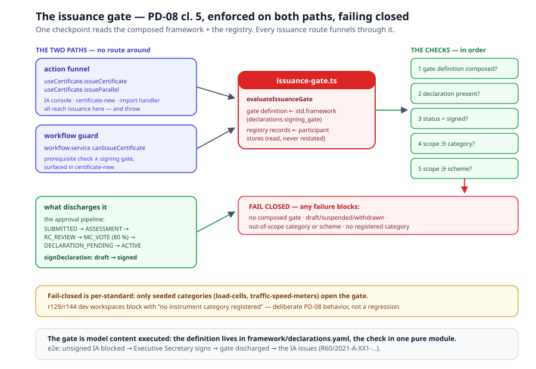

# Chapter 5 — The Participant Runtime

> *In this chapter:* the framework model executed — the participant
> registry and its records, the approval pipeline with the MC 80 %
> tally, the Declaration lifecycle, and the PD-08 issuance gate enforced
> on both paths, failing closed.

---

## 5.1 Why a runtime

Chapter 1's framework models *kinds*: the kind `issuing_authority`, the
kind `issuing_authority_declaration`, the lifecycle machine, the 80 %
rule. But a scheme does not run on kinds — it runs on bodies: this IA,
that TL, her Declaration, their vote. Someone must hold the instances,
walk them through the pipelines, and stop the pipeline's output from
being used before the gate allows it. That is the participant runtime —
and its first discipline is the framework's own: **the runtime executes
the model, it never restates it.** Thresholds are read from
`framework/governance.yaml`, the gate definition from the composed
framework block, the lifecycle machine from `framework/schemes.yaml`.
TypeScript holds calculi over the model, never copies of the model.

## 5.2 The registry records

The instances live in Core — `data/core/entities/cs-participants.yaml`
— because every rec's registry has the same shape:

| Record | What it is | Anchors |
|---|---|---|
| `Utilizer` / `Associate` | the acceptance participants — national **authorities**, deliberately new classes (MECE: never `Organization.kind` values; IAs/TLs stay `Organization`s, referenced by id) | B 18 §5.6 |
| `ParticipantDeclaration` | the PD-08 register record: participant ref, the categories × schemes scope matrix, ANRs, accepted IA/TL lists, MTL policy, MAA conditions, `signed_at`, status | PD-08 cl. 4–6 |
| `ParticipantApplication` | the PD-03/PD-04/PD-09 case file, with its `mc_electorate` | PD-03/04/09 |
| `CompetenceEvidence` | accreditation / peer assessment / self-declaration, per case | PD-03 5.2, PD-04 5.2 |
| `ApprovalVote` | the RC recommendation + the MC ballots | §11.4 |
| `CategorySchemeRecord` | the per-category scheme state with transition history | clause 15 |

The stores (`utilizers`, `associates`, `participantDeclarations`,
`participantApplications`, `competenceEvidence`, `approvalVotes`,
`categorySchemes`) come from the same entity-driven codegen as every
other store (migration v19). The two lifecycles are Core state machines:
`participant_application` — SUBMITTED → ASSESSMENT → RC_REVIEW →
MC_VOTE → DECLARATION_PENDING → ACTIVE, with REJECTED / SUSPENDED /
WITHDRAWN off-sequences — and `participant_declaration` — draft →
signed → suspended → withdrawn, with amendment returning to draft.
**Every status change walks the machines** — never a bare status write —
through the pure calculi of `browser/src/data/participant-registry.ts`
and the store operations of
`browser/src/composables/useParticipantRegistry.ts`.

## 5.3 The approval pipeline, executed

The PD-03/PD-04/PD-09 pipelines of chapter 3 run against the registry
as one case walk, with seven concrete Core processes declared for the
coverage map (`submit_participant_application`,
`assess_participant_competence`, `recommend_participation`,
`decide_participation`, `record_participant_declaration`,
`publish_participant_register`, `drive_scheme_lifecycle`):

1. **Evidence** — `recordCompetenceEvidence` walks SUBMITTED →
   ASSESSMENT (accreditation certificate, peer-assessment report, or
   the Scheme-B self-declaration).
2. **Referral** — `referToReviewCommittee` walks ASSESSMENT → RC_REVIEW.
3. **Recommendation** — `recordRcRecommendation` (one per case) walks
   RC_REVIEW → MC_VOTE.
4. **The MC vote** — `castMcBallot` (only at MC_VOTE; a reason is
   mandatory on against/abstain — the rule read from the governance
   model's `voting.reason_on_against_or_abstain`), then `decideMcVote`
   on a settled tally.
5. **Declaration** — approval opens a DRAFT Declaration carrying the
   applied scope; `signDeclaration` walks it draft → signed and the
   case DECLARATION_PENDING → ACTIVE. TLs sign no Declaration:
   `completeTlRegistration` is their terminal step.
6. **Suspension / reinstatement / withdrawal** — the MC pairs walk both
   the case and its linked Declaration together — a suspended
   Declaration stops discharging the gate the moment it suspends.

The tally is the §11.4.2 rule executed, not paraphrased: the base is the
case's `mc_electorate`, abstentions do not vote, `needed = ceil(0.8 ×
electorate)` — with the 0.8 **read from `framework/governance.yaml`**
(an absent rule or threshold throws; there is no hardcoded fallback).
Two vote-integrity properties are pinned by seeded tests: **one ballot
per member** (a second ballot from the same member state or the same
voter is rejected — the tally base is members, not ballot records), and
**no electorate, no decision** (a zero or unset electorate fails closed
— it throws rather than auto-approving at `ceil(0.8 × 0) = 0`).

The per-category scheme machine of chapter 1 is driven from the same
registry: `evaluateCategorySchemeTimers` walks the records through the
task-40 calculus — a category whose two-year window has elapsed fires
`transition_period_elapsed` into SCHEME_A, with the history appended;
a category already in SCHEME_A is a no-op; a day early is silence.

One honest gap, disclosed in the module header and the `.prm`:
`submit_participant_application` has **no runtime intake act** — cases
enter via the sample-data seeds at SUBMITTED, and the pipeline operates
them from there forward. A real "submit" operation (console or service)
is follow-up work; the expert variant additionally needs an expert case
kind on `ParticipantApplication` (chapter 7's pd-02 named gaps).

## 5.4 The Declaration lifecycle

A Declaration is a living record, and the machine keeps its states
coherent: signing requires the case's approval first (PD-08 5.2 — the
positive, unconditional RC recommendation precedes signature);
**amending a signed Declaration returns it to draft** and clears the
signature state (`signed_at` and `signed_by` together) — so an amended
Declaration immediately stops discharging the gate until re-signed;
suspension and withdrawal propagate from the MC's case acts. The
Declaration editor (`/app/cs/participants/:id/declaration`) surfaces
all of it: the scope matrix, ANRs, accepted lists, MTL policy, MAA
conditions — plus a live issuance-gate preview for IA Declarations.

## 5.5 The issuance gate — fail closed, on both paths

The PD-08 cl. 5 signing gate of chapter 1 is the scheme's sharpest
invariant, and the runtime enforces it where issuance actually happens.
One checkpoint — `browser/src/data/issuance-gate.ts`
(`evaluateIssuanceGate`: the composed gate definition from
`std.framework`, the registry records from the participant stores) —
reached from **both** issuance paths, so there is no route around it:

- **the action funnel** — `useCertificate.issueCertificate` and
  `issueParallel` await `assertIssuanceAllowed`, which throws. The IA
  console, certificate-new and the import handler all reach issuance
  through this composable; the IA console additionally renders the gate
  pre-flight per selected evaluation (banner + disabled action).
- **the workflow guard** — `services/workflow.service.ts
  canIssueCertificate` (the workflow prerequisite AND the signing
  gate), surfaced in certificate-new's async prerequisite check.

The gate **fails closed**: no composed gate definition, no registered
category, or no signed in-scope Declaration — all block. And
fail-closed is deliberately *per-standard*: only the seeded instrument
categories (load-cells in r60, traffic-speed-meters in r91) have
`categorySchemes` records, so issuance in an r129/r144 dev workspace
blocks with "no instrument category registered". That is PD-08 working
as written — no participation without a recorded Declaration — not a
regression: seed a `category_schemes` entry plus an in-scope signed IA
Declaration in the rec's `participants:` block and the gate opens.

## 5.6 The console and the organ roles

Three organ roles work the CS surfaces (`mc_member`, `rc_member`,
`executive_secretary`, alongside the existing `biml`):

- **`/app/cs/participants`** (Executive Secretary) — the registry:
  category scheme states with the §15.2 timer driver, IAs and TLs
  (incl. the MTL badge), Utilizers/Associates with their ANR/MTL
  summaries, Declaration state per participant.
- **`/app/cs/participants/:id/declaration`** — the Declaration editor
  of §5.4.
- **`/app/cs/approvals`** (MC/RC/Executive Secretary) — the pipeline
  board: cases by stage, evidence recording, RC referral and
  recommendation, ballot casting with the live §11.4.2 tally, decision
  recording, TL registration, suspension/reinstatement/withdrawal.

## 5.7 The seeded story

The registry seeds **once** per workspace from the `participants:`
block of `data/r60/sample-data.yaml` (registry records are live data —
reseeding never overwrites). The seed is a complete demonstration of
every mechanic in this chapter:

- **two IAs** — DE1 (signed Declaration, load-cells × Scheme A: the
  seeded flows' certificates stand) and **XX1, pre-signature** (DRAFT
  Declaration, an MC-approved case at DECLARATION_PENDING — 4 of 5 in
  favour with 1 abstention: exactly the 80 % threshold);
- **three TLs** — two third-party and **HBK-ML 990, the MTL**,
  peer-assessed under XX1's controlled supervision;
- **three divergent Utilizers** — one with an ANR accepting MTL reports
  (NL), one with no ANRs declining MTL reports, a restricted TL list
  and MAA conditions (ZA), and one whose only restriction is declining
  MTL reports (BR — the pure PD-06 4.9 case: every other acceptance
  criterion passes);
- **an in-flight Utilizer admission** at MC_VOTE for the live-vote
  board;
- **category states** — load-cells in SCHEME_A (transitioned 2020),
  traffic-speed-meters in SCHEME_B with its two-year window elapsed —
  so the timer demonstrably fires;
- **a 14th flow** — a finalized-but-unissued evaluation for XX1, so the
  gate is demonstrable end-to-end (the flow-level `certificate:` block
  is now optional precisely so an uncertified flow compiles).

The e2e suite walks the story: the unsigned IA is blocked in the IA
console → the Executive Secretary signs → the gate discharges and the
case goes ACTIVE → the IA issues (`R60/2021-A-XX1-…`); the §15.2 timer
fires from the registry page; the MC vote decides the in-flight case.

## 5.8 Validation rules

- every pipeline hop and Declaration status change walks the Core
  machines — a bare status write is a bug, not a shortcut;
- the tally base is the case electorate; one ballot per member; reason
  on against/abstain; unsettled tallies cannot be decided; zero
  electorate fails closed;
- thresholds and rules are read from the framework model — an absent
  governance rule or voting facet throws, never falls back;
- the gate is enforced on both issuance paths and fails closed — no
  gate definition, no registered category, or no signed in-scope
  Declaration all block;
- amending a signed Declaration returns it to draft with the signature
  state cleared — it stops discharging the gate until re-signed;
- the registry seeds once; reseeding never overwrites live records.

## 5.9 Summary

- The runtime executes the framework model against Core registry
  records — kinds from chapter 1, instances here, calculi pure and
  single-homed.
- The approval pipeline is a machine walk from evidence to ACTIVE; the
  MC 80 % tally is §11.4.2 executed, with vote integrity pinned:
  one ballot per member, no electorate no decision.
- The issuance gate stands on both issuance paths and fails closed —
  per standard, deliberately: no registered category, no issuance.
- The seed tells the whole story end-to-end; the e2e suite proves it.

*Next: [Chapter 6 — The operations runtime](06-operations-runtime.md):
Scheme A processing, utilization and the denial discipline, appeals
windows, post-issuance lifecycle, and the register as the validity
source.*
