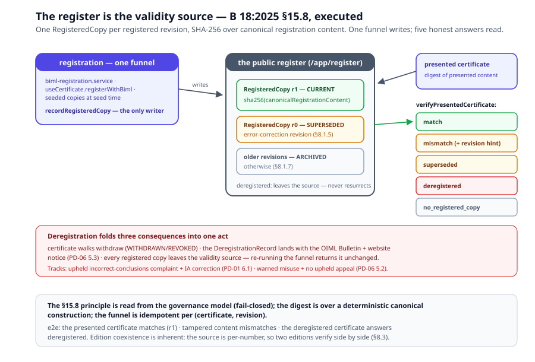

# Chapter 6 — The Operations Runtime

> *In this chapter:* the scheme's post-issuance life executed — Scheme A
> MTL/ANR processing, utilization with the PD-06 denial discipline,
> PD-01 appeals with the one-month windows as model content, complaints
> and misuse up to deregistration, revision and parallel issuance, and
> the public register as the B 18 §15.8 validity source.

---

## 6.1 Why operations

A certificate's issuance takes weeks; its life takes years. Most of what
the scheme *is* happens after §4.6: other jurisdictions accept or
decline the certificate, owners revise it, manufacturers run their own
labs under it, appellants challenge decisions, and anyone holding the
paper asks the one question that matters — *is this valid, right now?*
PD-01, PD-06, PD-07 and PD-05's own clauses 5 and 8 govern that life.
The operations runtime executes it, on the chapter-5 discipline: one
pure calculus home (`browser/src/data/cs-operations.ts`), store-level
operations that walk the Core machines
(`browser/src/composables/useCsOperations.ts`), records in Core
(`data/core/entities/cs-operations.yaml`, migration v20 —
`AcceptanceReview`, `AppealCase`, `ComplaintCase`, `MisuseCase`,
`DeregistrationRecord`, `AnrValidationLetter`, `RegisteredCopy`), and
the model read, never restated.

## 6.2 Scheme A processing — the MTL and ANR discipline

Scheme A (PD-05 clause 5) adds two instruments to the chapter-4 chain,
both now executed:

- **The manufacturer's test laboratory (MTL).** Tests may be performed
  by MTLs *listed in the considering IA's own Declaration* (§5.3.1 b);
  MTL use must be prominently stated, with the tests identified, at the
  head of the evaluation report (§5.5.4); only own-Declaration MTL
  reports may be utilized (§5.5.5). The model: `TestReport.
  includes_mtl_results` + `supervising_ia_id` (the PD-04 7.1
  controlled-supervision link), `EvaluationReport.mtl_use_statement`,
  `ParticipantDeclaration.mtl_ids`. The enforcement:
  `schemeAMtlIssues` runs **inside `issueCertificate`** for every
  Scheme-A issuance — a supervising-IA mismatch, a laboratory outside
  the IA's `mtl_ids`, or a missing §5.5.4 statement all throw. Issuance
  blocked, at the funnel.
- **Additional national requirements (ANRs).** The applicant declares
  the ANR tests applied for (§5.1.4 — `Application.applied_anrs` with
  their discharge state and the §5.4.2 results placement); the
  validating IA's letter to the BIML validates conformity to the ANR
  (§5.6.3 — the `AnrValidationLetter` store, a workflow record). The
  enforcement: `anrLetterIssues` runs as `assertCertificateRegistrable`
  inside **both** registration paths — discharged ANRs without a
  covering validation letter block registration; the letter's copy to
  the BIML is recorded at registration.

## 6.3 Utilization — acceptance and the denial discipline

A certificate earns its keep when a Utilizer *accepts* it — and the
scheme disciplines the *no*. The public register (`/app/register`)
evaluates acceptability per certificate per participant:
`evaluateAcceptability` computes the §5.6.3 criteria from the
participant's **signed Declaration record** — category in scope, scheme
accepted, IA accepted, TL accepted, MTL policy — criteria read from the
record, never restated.

Recording a denial runs the PD-06 discipline
(`validateAcceptanceReview`): consultation plus a **written
justification addressed to all three** — the issuing authority, the
manufacturer, the Executive Secretary (4.8) — *except* the MTL-grounded
denial (the only failing criterion is the MTL policy on an
MTL-originated certificate), which is voluntary and justification-free
(4.9 — no addressees allowed). The e2e suite walks all three shapes:
a foreign-IA denial with the full justification, an MTL-grounded denial
recording none, and an acceptance. (Demo honesty: the register page is
public by design — the recorded review binds no actor; a real
deployment binds recording to the Utilizer's officer.)

## 6.4 Appeals — the windows are model content

PD-01's three one-month windows (lodging, circulation lead time,
decision) are **structured `windows:` facets** on the pd-01 pipeline
(`documents/pd-01/abstract-processes.yaml` — a schema extension on the
abstract process, because invariant strings are never parsed). The
standards registry merges a **projection** of the document modules into
`StandardMeta.cs_documents` — only the window-carrying processes, a
deliberate exception to the whole-file merge pattern — and the calculus
(`appealWindows` / `checkWindow`) **fails closed when the projection is
absent**. The durations are never restated in TypeScript.

Enforcement at the `appeal_case` machine hops:

- **preconditions** — reasons in writing; the 8.1 exhaustion rule for
  applicants (the IA's own appeal procedure first) throws;
- **lodging** — a late appeal walks the window's declared `breach:`
  action to INADMISSIBLE: the refusal is itself a first-class, auditable
  case (PD-01 does not prescribe the mechanics; recording beats
  rejecting at intake);
- **consideration and decision** — the lead time (consider ≥ 1 month
  after circulation) and the decision window (≤ 1 month after
  consideration) are checked at the hops, machine-legality first (a
  decision from a non-CONSIDERED state throws the machine's refusal,
  not a window error);
- **the ruling binds** — an upheld appeal against an MC decision
  records `binding_on_mc`, with no further appeal (PD-01, 9).

## 6.5 Complaints, misuse, deregistration

The discipline ladder, each rung adjudicated by the calculus and walked
by the machines (`complaint_case`, `misuse_case`):

- **incorrect conclusions** (PD-01 6.1 / PD-05 §7.1) — a documented,
  substantiated complaint is investigated with the IA; upheld ⇒ the IA
  corrects the report and the certificate is **deregistered**;
- **misuse** (PD-06 5.1) — warning first, then corrective action;
- **deregistration** (PD-01 6.1; PD-06 5.2/5.3) —
  `validateDeregistration` admits exactly the two tracks: the upheld
  incorrect-conclusions complaint with the IA's recorded correction, or
  the warned misuse case with a not-upheld (or absent) owner appeal —
  plus the full 5.3 notification set and the published **OIML Bulletin
  and website notice** (`bulletin_ref` on the record). The act folds
  three consequences into one: the certificate walks `withdraw`
  (WITHDRAWN/REVOKED), the DeregistrationRecord lands, and every
  registered copy leaves the validity source.

## 6.6 Revision, parallel issuance, edition updates

- **Revision (§8.1.4–8.1.7).** `CertificateRevision.modifies_type` /
  `corrects_error` / `retest_list`: a type-modifying revision without
  the IA-determined retest list throws (§8.1.4). On re-registration the
  previous registered copy is SUPERSEDED for error-correction revisions
  (§8.1.5), archived otherwise (§8.1.7). Certificate-detail carries the
  revise form with the retest-list editor.
- **Parallel certificates (§8.2).** `assertParallelIssuance` throws
  without the §8.2.1 documentation-possession confirmation; the §8.2.2
  validity inquiry is recorded on the entity. The PD-08 signing gate of
  chapter 5 still applies — the parallel path runs through the same
  funnel.
- **Recommendation updates (§8.3; B 18 §15.5/15.6).** The
  edition-change flow issues a new certificate on the revised
  Recommendation; coexistence is inherent — the validity source is
  per-number, so the previous-edition certificate's registered copy
  keeps verifying while the updated one registers. (No dedicated
  console drives an end-to-end edition update yet — a named follow-up.)

## 6.7 The register as the §15.8 validity source

B 18:2025 §15.8: the only valid version of an OIML certificate is the
issued one, and its validity is verified against the copy registered and
published by the BIML. The runtime makes that literal: **one
`RegisteredCopy` per registered revision**, carrying the SHA-256 digest
of `canonicalRegistrationContent` (a deterministic construction). The
§15.8 principle itself is read from the governance model
(`assertRegisteredCopyPrinciple`, fail-closed).

Three disciplines hold the source together:

- **one funnel** — `recordRegisteredCopy` is the only writer: both
  registration paths call it, seeded registered certificates derive
  their copies through it at seed time, and it is idempotent per
  (certificate, revision);
- **no resurrection** — a deregistered copy never comes back: re-running
  the funnel returns the deregistered copy unchanged;
- **five honest answers** — `verifyPresentedCertificate` digests the
  presented content and adjudicates: **match** / **mismatch** (with the
  archived/superseded-revision hint) / **superseded** /
  **deregistered** / **no_registered_copy**.

## 6.8 Surfaces

- **`/app/register`** (public, no session) — the §15.8 validity check
  with the presented-content editor, and the PD-06 utilization view per
  certificate;
- **`/app/cs/operations`** (Executive Secretary) — appeals, complaints,
  misuse, deregistrations;
- **certificate-detail** — revision with the retest-list editor and
  error-correction flag, parallel issuance, the registered-copy list;
- **the IA console** — the §5.6.3 ANR-letter prompt after a Scheme-A
  issuance.

## 6.9 Validation rules

- every case hop walks the Core machines (`appeal_case`,
  `complaint_case`, `misuse_case`, `certificate`) — the calculus checks
  machine-legality before window arithmetic;
- windows come from the `cs_documents` projection only — absent
  projection, closed failure; durations never restated in TS;
- the denial discipline is exact: 4.8 requires all three addressees;
  4.9 allows none — anything else throws;
- the Scheme-A gates run inside the funnels: MTL discipline at
  issuance, the ANR letter at registration — no route around;
- deregistration folds certificate, record and validity-source
  consequences into one act; a deregistered copy never resurrects;
- registered copies are written by one funnel, idempotent per
  (certificate, revision), digests over canonical content only.

## 6.10 Summary

- Post-issuance is most of the scheme's life, and it is executed:
  Scheme-A MTL/ANR gates in the funnels, utilization with the 4.8/4.9
  denial discipline, appeals with model-content windows, the discipline
  ladder to deregistration with the Bulletin notice.
- The register is the §15.8 validity source: one digest-carrying
  RegisteredCopy per registered revision, one funnel, five honest
  answers.
- What the runtime does not yet do is named, not hidden: dispute
  mediation, periodic review, the fee lifecycle, owner-side use
  discipline — chapter 7's report carries them all.

*Next: [Chapter 7 — The coverage machinery](07-coverage-machinery.md):
the `.prm` maps, the unified per-document report, the named-gap
doctrine, and the mutation proofs.*
