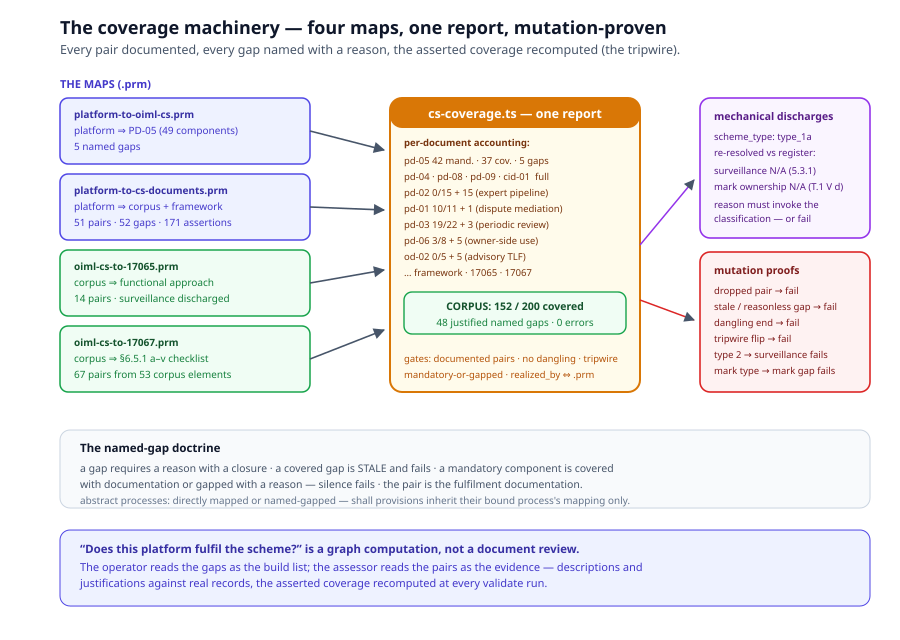

# Chapter 7 — The Coverage Machinery

> *In this chapter:* how the scheme answers "does this operation fulfil
> the corpus?" as a computation — the four `.prm` maps, the unified
> per-document coverage report, the named-gap doctrine, the mechanical
> type-conditioned discharges, and the mutation proofs that keep the
> gate a gate.

---

## 7.1 Why coverage

Chapters 3–6 made two kinds of claims: the corpus is *modelled* (every
document, every provision, every pipeline), and parts of it are
*executed* (the participant pipeline, the issuance gate, the operations
runtime). Between those claims sits the auditor's question: **how much
of the corpus does this platform actually fulfil?** Volume I, chapter 5
gives the answer's shape — a mapping A ⇒ B with description +
justification per pair, and a calculus that computes cover levels (full
/ minimal / partial / none), inherits them down process trees, and
aggregates them up. This chapter is that calculus pointed at the scheme
itself: the platform and the corpus as mapping clients, the report as
the audit view. The alternative — answering by document review — is the
chase the scheme package exists to end.

## 7.2 The four maps

Four standalone mapping profiles (`.prm`) carry the fulfilment
documentation:

| Map | Direction | What it binds | Size |
|---|---|---|---|
| `data/core/evaluation/platform-to-oiml-cs.prm` | platform ⇒ PD-05 | the concrete Core processes ⇒ the 8-step chain, off-sequence flows, the 34 provisions | 49 reference components; 5 named gaps |
| `data/core/evaluation/platform-to-cs-documents.prm` | platform ⇒ the corpus + framework | 18 Core sources (the participant-approval set, the cs-operations set) ⇒ the document pipelines, provisions, framework executive rules | 51 pairs; 52 named gaps; 171 coverage assertions |
| `data/oiml-cs/oiml-cs-to-17065.prm` | corpus ⇒ ISO/IEC 17065 | the scheme's processes ⇒ the clause-7 functional approach | 14 pairs; surveillance discharged |
| `data/oiml-cs/oiml-cs-to-17067.prm` | corpus ⇒ ISO/IEC 17067 | every `/req/cs/*` provision, abstract process and framework id ⇒ the §6.5.1 a)–v) checklist | 67 pairs from 53 corpus elements |

Two direction choices are worth reading twice. The platform maps *up*
to the scheme (implementation → reference — the only direction the
calculus allows); and the scheme maps *sideways* to its CASCO
foundations — the 17067 map is the scheme's own capstone: "is the
OIML-CS a complete product certification scheme?" answered against the
scheme-content checklist, with sources restricted to declared corpus
elements (computed, never hand-listed).

## 7.3 The unified report

`browser/build/cs-coverage.ts` (a `npm run validate` section) folds all
four maps into **one per-document mandatory/named-gap accounting**. The
spine: every document lists its *mandatory components* — sequence
processes plus `shall`-obligation provisions — the covered count, and
the named gaps. Five gates, mirroring the PD-05 gate's discipline:

1. every pair carries description + justification;
2. no dangling sources or targets;
3. **the tripwire** — the asserted coverage block equals the computed
   one (coverage claims are computed, never authored);
4. every mandatory component is covered at full|minimal **or** named-
   gapped with a reason — a gap that becomes covered is **stale and
   fails**, a reasonless gap fails;
5. the `realized_by` ⇔ `.prm` consistency check — the modules' declared
   realizations and the map's pairs may not drift apart.

One inheritance rule keeps the accounting honest: a `shall` provision
inherits its bound process's direct mapping (the provision↔process
binding is module-declared and linker-checked, so inheritance cannot
mask a dropped pair), but **every abstract process must be directly
mapped or named-gapped itself**.

The green baseline, as `npm run validate` prints it:

| Section | Mandatory | Covered | Named gaps | The gaps are |
|---|---|---|---|---|
| pd-05 | 42 | 37 | 5 | dispatch, TL-eligibility binding point, re-application linkage, the registration-fee lifecycle |
| pd-01 | 11 | 10 | 1 | dispute mediation (off-platform correspondence) |
| pd-02 | 15 | 0 | 15 | the expert pipeline — no expert case kind on `ParticipantApplication` |
| pd-03 | 22 | 19 | 3 | periodic review |
| pd-04 | 19 | 19 | 0 | — |
| pd-06 | 8 | 3 | 5 | owner-side use discipline |
| pd-07 | 7 | 4 | 3 | legacy import |
| pd-08 | 7 | 7 | 0 | — |
| pd-09 | 7 | 7 | 0 | — |
| cid-01 | 4 | 4 | 0 | — |
| od-01 | 11 | 6 | 5 | MC administration (the a–k census, scheme monitoring) |
| od-02 | 5 | 0 | 5 | the advisory TLF |
| framework | 9 | 6 | 3 | TLF, financing, legacy rules |
| iso-iec-17065 | 11 | 10 | 1 | surveillance — discharged (type 1a) |
| iso-iec-17067 | 22 | 20 | 2 | surveillance + mark ownership — discharged (type 1a) |

**Corpus total: 152 of 200 mandatory components covered, 48 justified
named gaps, zero errors.** Read the zeros right: pd-04, pd-08, pd-09 and
cid-01 at full mandatory cover are the admission pipelines and identity
pins the runtimes of chapters 5–6 execute; pd-02's 0/15 is not a
failure — it is the honest state of an expert pipeline the runtime
cannot yet hold (it needs an expert case kind), asserted as gaps with
the closure path in the reason, and pinned by a unit test so the
honesty itself cannot silently regress.

## 7.4 The named-gap doctrine

A named gap is not an admission of failure; it is the *form* honesty
takes in a coverage calculus. Four rules govern it:

- **a gap requires a reason** — root-caused and naming the closure
  (a task, a missing case kind, an off-platform channel);
- **a covered gap is stale** — the moment a realization lands, the gap
  entry must go; the gate fails on the stale entry, so the map cannot
  accumulate historical excuses;
- **a mandatory component needs one of the two** — coverage with
  documentation, or a gap with a reason; silence fails;
- **the pair is the documentation** — dropping a pair fails even when
  inheritance would keep the computed cover full: an undocumented
  fulfilment is an assertion, not evidence.

The doctrine is what lets the report serve two audiences at once: the
operator reads "what must we build?" (the gaps with their closures);
the assessor reads "what do you demonstrably do?" (the pairs with
their justifications against real records).

## 7.5 Mechanical discharges — the classification pays off

Two of the 17067 checklist items and one 17065 item are N/A — and the
gate does not take the map's word for it. The discharge is
**mechanically re-checked against the scheme's own classification**
(chapter 2): the gate resolves the oiml-cs layer's `scheme_type:
type_1a` against the 17067 register, and

- fails the **surveillance** gap the moment the declared type requires
  surveillance (ISO/IEC 17067, 5.3.1 — types 1a/1b require none);
- fails the **mark-ownership** gap the moment the declared type
  licenses marks (Table 1 V d — type 1a leaves it blank; licensing is
  the surveillance/batch-based attestation kinds);
- fails any such gap whose reason does **not invoke the
  classification** — "we don't do surveillance" is not a reason; "type
  1a requires none per 5.3.1" is.

The counterfactual proofs make it concrete: mapping against type 2
fails the surveillance discharge; a mark-licensing type fails the mark
discharge; type 1b fails only the mark one. The scheme's
self-classification is load-bearing data — change the declaration and
the audit changes with it, mechanically.

One documented interpretation rides the map: checklist item r)
(contracts) reads the intergovernmental scheme as binding its parties
by signed Declarations, endorsements and NDAs rather than private-law
contracts — argued explicitly in the pairs, one line away from becoming
a named gap if a reviewer reads the item differently.

## 7.6 Mutation proofs — a gate that cannot fail is not a gate

Every gate in this chapter ships with the proofs that it *can* fail —
seeded-mutation suites that break the map in each way the doctrine
forbids and watch the gate catch it:

- **the unified report** (`cs-coverage.test.ts`, 17 tests): dropped
  pairs, stale gaps, reasonless gaps, dangling sources and targets,
  tripwire flips (asserted ≠ computed), `realized_by` ⇔ `.prm` drift,
  the counterfactual surveillance-requiring scheme type, the pd-02
  expert-pipeline honesty pin;
- **the 17067 scheme gate** (`cs-scheme-coverage.test.ts`, 21 tests):
  the same mutation matrix plus the counterfactual-type adjudications
  of §7.5 and a classification-free gap reason;
- **the PD-05 gate** (`pd05-coverage.test.ts`, 13 tests): the census
  pin (42 mandatory / 37 covered / 5 gaps) and the per-mutation
  failures, including the inheritance-cannot-mask-a-dropped-pair proof.

This is the same discipline the lab-coverage gate and the PRL
round-trip kit use elsewhere in the platform: the gate's value is
exactly the set of mutations it is *proven* to detect.

## 7.7 Validation rules

- coverage claims are computed by the calculus, never authored — the
  asserted block equals the computed block or the tripwire fails;
- every pair: description + justification against real records; every
  gap: a reason with a closure; every mandatory component: one of the
  two;
- abstract processes are directly mapped or named-gapped — inheritance
  covers bound provisions only;
- type-conditioned discharges re-check the declared `scheme_type`
  against the register, and the reason must invoke the classification;
- the maps' sources are restricted to declared elements of their
  corpora — computed vocabularies, never hand-listed;
- the mutation suites stay green — a gate regression is a test failure,
  not a documentation drift.

## 7.8 Summary

- Four `.prm` maps carry the fulfilment documentation: platform ⇒
  PD-05, platform ⇒ the corpus + framework, corpus ⇒ 17065, corpus ⇒
  17067.
- One unified report renders the accounting per document: mandatory
  components, covered counts, named gaps — currently 152/200 covered
  with 48 justified gaps and zero errors.
- Named gaps are the calculus's honesty form: reasoned, closed-world,
  stale-proof; the zeros (pd-04/08/09, cid-01) and the honest zero
  (pd-02) both say something true.
- The type-1a classification discharges the surveillance and
  mark-ownership items — re-checked mechanically against the register,
  counterfactual-proven.
- Every gate ships mutation proofs: the report is trustworthy because
  its failure modes are enumerated and tested.

*Next: [Chapter 1 — The scheme architecture](01-scheme-architecture.md)
— or back to the [volume overview](README.md) for the chapter map.*
