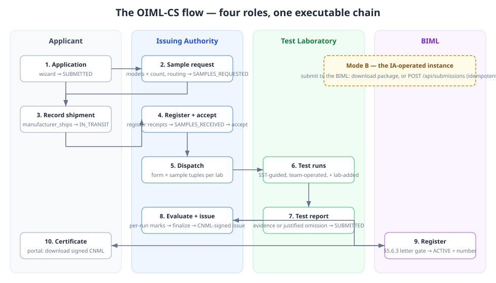
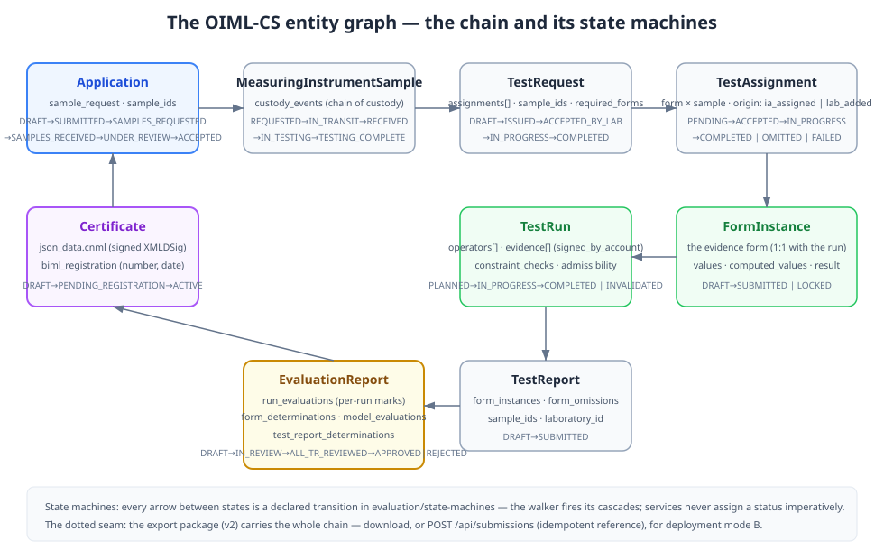

# Chapter 8 — The Flow, Executable

> *In this chapter:* the certification workflow of chapter 4 as a
> running system — every stage of the OIML-CS chain driven by its own
> role console against the real entities, the sample lifecycle with its
> custody chain, the per-run evaluation marks, the CNML-signed
> issuance, the BIML registration, and the two deployment modes.

---

Chapters 4–7 modelled the scheme: the abstract processes, the
provisions, the runtime organs. This chapter is the same flow
**running** — the applicant, the laboratory, the issuing authority,
and the BIML each at their own console, the chain drivable from the
wizard to the public register without a gap. The architecture chapter
of the app carries the implementation detail
(`docs/architecture/20-the-oiml-cs-flow.md`); this is the operator's
story.

## 8.1 The chain as the roles live it

**The applicant** submits in the portal wizard (the subject chain:
family, groups, models, the declared samples). Their next act is not
waiting — it is answering the sample request: the portal card shows
exactly what the IA asked (which models, how many, where to send
them, the particulars), and one action records the shipment. From
then on the timeline tells the truth: samples in transit, received,
testing, evaluation, decision — and finally the certificate,
downloadable with its signed CNML document.

**The issuing authority** works the review: issues the sample request
(the decision actions stay closed until the samples exist — the
scheme's own discipline, enforced by the state machine, not by
politeness), registers each received sample (the real serial, the
condition, the markings — a stub becomes a physical truth), accepts,
dispatches the test work as (form × sample) tuples to the eligible
laboratories, and evaluates: **every run** marked Evaluated
(approve/reject with the reason mandatory on reject), every report's
admissibility, every form's determination — the finalize gate opens
only when all three are complete. Issuance signs the certificate as
CNML with the officer's browser key.

**The test laboratory** accepts the request, registers the arriving
samples (whether they came from the applicant directly or via the
IA), and runs the tests — guided, if it chooses, by the simulated
instrument: the stepper walks the test's declared procedure, the
operator drives the chamber and the load and records the readings,
and the readings land as real evidence with their serve times in the
conditions log. A run may be worked by a team (every operator signs
their own entries), and the lab may add tests of its own initiative —
flagged `lab_added`, never silently merged with the assigned set. The
report accounts for every required form: evidence, or a justified
omission. Then issued.

**The BIML** sees the pending registration in its inbox, reviews the
certificate with its evidence chain (the evaluation, the reports, the
CNML signing state), and registers — the Scheme-A discipline holds:
without the IA's validation letter for discharged national-requirement
tests, registration blocks. The number derives, the certificate goes
ACTIVE, and the public register lists it.

## 8.2 The entity graph, briefly

One spine, every hop a declared transition: Application (with its
`sample_request` and `sample_ids`) → TestRequests → TestAssignments →
TestRuns (with their `operators` and signed evidence) → FormInstances →
TestReports → the EvaluationReport (run_evaluations,
form_determinations, model_evaluations) → the Certificate (its CNML
record) → the BIML registration. The state machines own the lifecycle;
services never assign a status by hand.

## 8.3 Two deployment modes

- **Mode A — the shared platform.** The BIML operates one instance;
  everyone works there. Everything above is in-process.
- **Mode B — the IA-operated instance.** The IA runs its own. "Submit
  to the BIML" delivers the finalized chain as a signed export package
  — by download (the email workflow) or by API
  (`POST /api/submissions`): schema, signature, and idempotency are
  validated, and a repeat submission returns the same registration
  reference — the chain can travel twice and register once, never
  twice.

## 8.4 What the e2e suite proves

Each leg of this chapter is a driven scenario in the app's e2e suite:
the wizard-to-shipment legs, the receipt registration and dispatch,
the operator team, the lab-added test, the SST-guided temperature
cycle against a live simulated instrument, the per-run marks, the
CNML-signed issuance, the BIML registration, and the idempotent
submission. The gates are the acceptance; this chapter is their
reading.

---

*Next:* chapter 9, the scheme's surveillance semantics — what happens
to a certificate after registration.
