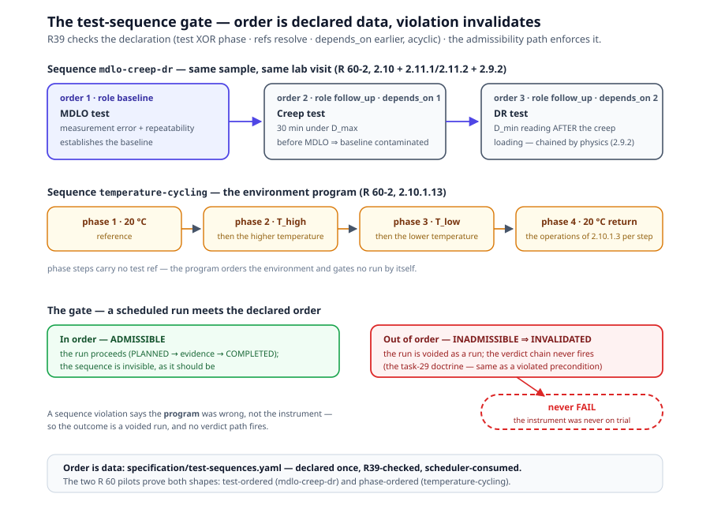

# Chapter 4 — Conformance Tests

> *In this chapter:* the conformance test — an operation on the subject —
> with its anatomy: targeted requirements, sourced variables, method
> steps, enforced conditions and run-validity preconditions, composite
> acceptance criteria, class inheritance, and the kinds/obligation/
> statistics axes v3 adds. Then the phase-9 layer the R 60 SSOT review
> bought: behavior coverage (R37), test sequences with the admissibility
> gate (R39), structured runs-per-class with prose congruence (R40), the
> evaluation-formula trace (R41), and the required-competence facet (R29).

---

## 4.1 What a conformance test is

A conformance test is an **operation on the subject**: it constrains the
*inputs* (stimuli), the *environmental context* (conditions to enforce),
and the *state* (run-validity preconditions), then *observes outcomes* as
typed observables. The asymmetry with chapter 3 is the law: **tests
observe outcomes; only requirements constrain them.** A test never
invents a limit — its parameters are derived from the requirements'
limits and the subject's parameters, and its acceptance criteria target
requirements. When you find yourself typing a threshold into a test, you
are authoring a requirement in the wrong file.

Tests live in `data/<rec>/specification/conformance/`, in scopes
`/conf/<area>`; the full id is scope + `identifier_fragment`
(`/conf/metrological-tests/creep`). The scope header declares its target
requirement scope and may declare `test_subject` — the entity and
classification space the tests operate over.

## 4.2 Anatomy

The anchor example is R 60's base metrological procedure (●
`data/r60/specification/conformance/metrological.yaml` —
`measurement-error-repeatability-mdlo`):

```yaml
    - name: Determination of measurement error, repeatability error and
            temperature effect on MDLO
      identifier_fragment: measurement-error-repeatability-mdlo
      reference: "urn:oiml:pub:r:60-2:2021#clause-2.10.1"
      targets:
      - /req/metrological/mpe
      - /req/metrological/repeatability
      - /req/metrological/temperature-effect-mdlo
      - /req/metrological/temperature-limits
      - /req/metrological/special-temperature-limits
      binds_to:
      - group.parameters.mpe
      - group.classification.accuracy_class
      - family.parameters.p_lc
      - group.parameters.v_min
      - family.parameters.t_min
      - family.parameters.t_max
      purpose: |
        Verify that load cell errors do not exceed the MPE values given in
        Table 4, …
      method: |
        Apply increasing and decreasing test loads at four temperatures …
      type: Testing
      instances:
        by: accuracy_class
        values:
          A: { n_runs: 5 }
          B: { n_runs: 5 }
          C: { n_runs: 3 }
          D: { n_runs: 3 }
      variables: [ … ]          # §4.3
      steps: [ … ]              # §4.4
      preconditions: [ … ]      # §4.5
      acceptance_criteria: [ … ] # §4.6
      result_forms: [load-cell-errors, repeatability, temperature-mdlo]
```

- **targets** — the requirements this test verifies. The link runs both
  ways: the requirement's `verification.method: testing` expects a test;
  capabilities reference the test id in `verified_by_tests`; behaviors
  reference it in `verified_by`. The linker resolves all three.
- **binds_to** — the subject items the test exercises or inspects
  (§2.12): the HAS-inventory paths in the requirement `binds_to`
  vocabulary (§3.3). An executed test binds the attributes/dimensions
  its variables measure against; an examination binds the aspects it
  inspects (`model.aspects.markings`, `model.aspects.software`, …).
  `targets` names the *requirements verified*; `binds_to` names the
  *subject touched* — linker rule R28 resolves every entry and requires
  ≥1 per test.
- **purpose / method** — the normative procedure prose (R 60-2 §2.10.1),
  provenance included. Prose for humans; the machine-readable procedure
  is `variables` + `steps` + `acceptance_criteria`.
- **method_ref** — the test's *executable* method (● smart ce10a43;
  kernel facet primmel-ts e5fd083): the id of the model-layer process
  (chapter 2's behavior anatomy — steps, gateways, preconditions) that
  runs the test. Additive beside the required narrative `method` — the
  prose stays, flat tests without the ref stay legal. Linker rule **R34
  test-method-link** errors on a dangling ref and emits one summarizing
  warning per test for the coverage delta — the process's signature I/O
  and registers should cover the test's declared variables, its
  invariants the test's precondition checks; a real delta (the R 60-3
  evaluation-level error quantities derived from the process's
  indication output; a lab-environment precondition) is documented by a
  linker-allowlist entry, never by silence. The R 60 pilot is
  `measurement-error-repeatability-mdlo → load_weight`.
- **design** — specimen rules: `count: 1`, `continuity: same_eut` — one
  equipment-under-test across the procedure's steps.
- **type** — ◐ today `Testing | Inspection` in the R 60 data; the
  metamodel's richer `kind` taxonomy is §4.8.
- **result_forms** — which report forms this test's evidence lands in
  (chapter 5). The declaration is the test's **evidence contract** — the
  one home of the test→form completeness relation (§5.5, task 55). A
  test with no form leaves no evidence; that is a coverage finding.

## 4.3 Variables and sources

Every quantity a test computes or records is a declared **variable** with
a **source**. The source taxonomy is the author's contract about where
the value comes from:

| source | meaning | R 60 example |
|---|---|---|
| `declared` | a subject parameter, read through the chain | `d_max` (maximum test load, 90–100 % of `e_max`) |
| `measured` | a run input — raw evidence | `initial_dmax_indication`, `creep_readings` (time series) |
| `derived` | computed by an OCL derivation over other variables | `e_r` = `(max(runs→collect(r \| r.indication)) − min(…)) / conversion_factor_f` |
| `computed` | produced by a table/profile lookup | `mpe` = `ocl{lookupMPE(test_load, accuracy_class, p_lc)}` |

Each derived/computed variable carries its `derivation` OCL and a
`description` naming the source clause's symbol (E_L, E_R, C_M). The
discipline that keeps tests honest: **variables are derived parameters
and observables — computed from the requirement's limits and the
subject's parameters, never restated by hand.** When the MPE appears in
a test it is *looked up* from `mpe_tiers`, not written as 0.5 v; when
`n` appears it is derived `(e_max − e_min) / v_min`, not redeclared.
This is the anchoring rule applied to operations, and it is what lets
evaluation re-execute a test's arithmetic against recorded evidence
without trusting the lab's arithmetic.

The observable ids a test produces (`e_l`, `e_r`, `c_c`, `c_m`, `c_p`,
`c_hmin`, `c_hmax`, `c_dr`) are registered in `symbols.yaml` — the same
ids requirements bind as `observable:<symbol>`. Test output and
requirement input meet at the symbol, by id.

## 4.4 Method, steps, and repetitions

The `steps` block is the ordered procedure. Each step carries `order`,
`action` (the normative instruction), and `input_variables` /
`output_variables` naming the variables it consumes and produces (● the
creep test's step 4: "Hold D_max for 30 minutes, recording at intervals"
outputs `creep_readings, c_c, creep_30min, creep_20min`). Inputs/outputs
make the dataflow checkable: a variable consumed before any step produces
it is a linker finding.

Repetitions are **explicit**, not implied by prose. The procedure-step
vocabulary carries them (`repeat_per_accuracy_class`,
`repeat_per_temperature`), and the per-class parameterization is data on
the test as an `instances:` declaration (● above): `by: accuracy_class`,
with `A/B → n_runs: 5`, `C/D → n_runs: 3` (R 60-2 §2.10.1.12). The
applicability engine expands the declaration per subject at runtime, so
one test definition serves all four classes and the class A/B forms
materialize five run rows while C/D materialize three. The same numbers
exist once more as the `test_runs` profile in `tables.yaml` — mirrored,
not duplicated: the profile serves expression lookup, the `instances:`
block serves runtime expansion. The structured map is scheduler-facing
data, and it is now checked both ways — §4.11's R40 coverage rule and
the prose≡data congruence leg.

## 4.5 Conditions, preconditions, and equipment

A test constrains the environmental context it enforces, the state it
requires, and the equipment it runs on — three different slots:

- **Enforced conditions** reference the designed tiers and the shared
  procedural conditions of `model/conditions.yaml`: reference conditions
  for performance tests (20 °C ± 2), plus `common_test_conditions`
  (calibrated traceable equipment, axial shock-free loading,
  stabilisation periods). Referenced, never restated per test.
- **Preconditions** are run-validity rules, evaluated *before* any limit
  (● `temperature-stability` on the MDLO and creep tests):

```yaml
      preconditions:
      - id: temperature-stability
        check: ocl{temperature_variation <= min(2, 0.2 * (family.parameters.t_max - family.parameters.t_min))}
        description: "… (R 60-2, 2.7.3.1). A run recorded under unstable
          temperature is INVALID — not a fail."
```

  A violated precondition voids the **run** — outcome `invalid`, never
  `fail` — because the instrument's goodness was never on trial; the
  setup's was. A check whose inputs are missing never fires. This is the
  constraint/requirement distinction of §3.4 made operational at
  execution time, following `inherits_from` chains so an inherited test
  keeps its parent's preconditions.

- **Equipment** is per run, not per test: the TestRun records
  `TestRunEquipment` entries — a lab-local id plus calibration
  certificate reference (`cal_cert`) — identity and traceability only
  (● `data/r60/entities/test-execution.yaml`). Equipment suitability
  itself is modelled as conditions, not as an entity hierarchy.

## 4.6 Acceptance criteria

The acceptance criteria are **composite**: a top-level `pass_if` over
named items, each item targeted at the requirement it serves (● the
MDLO test):

```yaml
      acceptance_criteria:
        type: composite
        pass_if: "ocl{mpe_criterion and repeatability_criterion and mdlo_criterion}"
        items:
        - name: mpe_criterion
          target: /req/metrological/mpe
          pass_if: "ocl{abs(e_l) <= abs(mpe)}"
        - name: repeatability_criterion
          target: /req/metrological/repeatability
          pass_if: "ocl{abs(e_r) <= abs(mpe)}"
        - name: mdlo_criterion
          target: /req/metrological/temperature-effect-mdlo
          accepts:
            verdict: mdlo_normalized
            op: lte
            limit: "ocl{p_lc}"
```

Three rules make this structure load-bearing. Every `target` resolves to
a requirement in the test's `targets` — the test judges nothing the
Recommendation did not require. Every `pass_if` expression reads only
declared variables and bound paths — the same closed-world `uses`
discipline as requirement limits. And where a quantity is shared with a
requirement's registered VerdictQuantity, the item *references* the
registry (`accepts:`, as the MDLO item does) rather than re-deriving it —
the `mdlo_normalized` lesson of §3.7 applies here with full force,
because form, test, and requirement must compute the *same* number.

## 4.7 Class inheritance

Generic procedures are defined once in the base scopes; per-class
aggregations **inherit and re-scope** (●
`data/r60/specification/conformance/class-specific.yaml`):

```yaml
    - name: Measurement error (Class A)
      identifier_fragment: measurement-error
      inherits_from: /conf/metrological-tests/measurement-error-repeatability-mdlo
      reference: "urn:oiml:pub:r:60-2:2021#clause-2.10.1"
      targets:
      - /req/class-a/mpe
      - /req/class-a/special-temperature-limits
```

The class scope (`/conf/class-a`) carries `applicability:
{ accuracy_class: [A] }` and the inherited test **restates only deltas**:
the class-scoped targets, the run count (5 for A/B vs 3 for C/D), the
MDLO temperature increment (2 °C for A vs 5 °C), and exclusions — class
A declares no span-stability aggregation while B/C/D add one inheriting
`/conf/electronic-tests/span-stability`. Everything else — variables,
steps, preconditions, acceptance structure — comes down the
`inherits_from` chain untouched. The authoring rule mirrors attribute
delegation: inherit by default, restate only what the class changes.
A delta that restates the parent's procedure is drift waiting to happen;
a delta that names the class's requirements is the taxonomy working.

## 4.8 Kinds, obligation, and statistics

Three axes complete the test model; mark them honestly:

- **kind** — the metamodel taxonomy is `ConformanceTestKind:
  [performance, influence, disturbance, durability, span-stability]`
  (● metamodel), mapping to the error model: influence factors within
  rated conditions are judged against MPE, disturbances outside them
  against fault limits, durability over use. ◐ The R 60 data still tags
  tests `type: Testing | Inspection` — for a new Recommendation, fill
  `kind` from the enumeration and expect to normalize R 60 the same way.
  The v3 kinds the R 91 audit surfaced are ◐ as well:
  `field` (in-situ verification) and `simulation` (executor is a
  simulator, not a lab) ship in the R 91 data
  (`/conf/field/stationary-field-test` and its moving/ego siblings;
  `dynamic-performance`, `acceleration-test` — §9.2.5), and the cc
  schema vocabulary already names all three; `software-examination` has
  no carrier yet — R 91's own software examination still ships
  `type: Inspection`, its D 31 item matrix as guidance prose.
- **obligation** ○ — `mandatory | optional | conditional`, with
  `conditional` carrying its applicability condition. R 60 approximates
  this today at the report layer (`required: always | conditional` on
  forms, chapter 5); v3 moves the declaration onto the test, where the
  Recommendation states it.
- **statistics** ● — landed in the R 91 data (gap G6 resolved,
  §9.2.5): `design.counts` carries the measurement-count rule with its
  `override: statistical_analysis` escape (R 91-2 §4.4), and
  `acceptance.statistics` declares the distribution-analysis method by
  which a sample of N stands for the type (§4.7 —
  `method: error_distribution`, engine primitives `stddev` /
  `m_sigma_coverage` behind it). R 60 needs no statistics block;
  Recommendations that accept statistical evidence declare it as data on
  the test, not as prose.

## 4.9 Behavior coverage — every stimulus-response test verifies a behavior ●

The methodology rule of §2.9 — *tests observe behaviors; a behavior joins
the coverage chain through `verified_by`* — was honestly unanchored on
the electronic side: the R 60-2 disturbance and influence tests
(2.10.5–2.10.7) probed the instrument's response to humidity, warm-up,
and electromagnetic events, but no model-side behavior declared what
they probe. Phase 9 closed that (task 56, ● smart f51c5a9):
`model/behaviors.prl` now carries **21 behaviors**, the phase-9 set
adding `dead-load-output-return` plus the nine electronic/influence
responses — `warm-up-drift`, `humidity-cyclic-response`,
`humidity-steady-response`, and the six `response-to-*` disturbance
responses (bursts, surges, ESD, RF EM fields, power-voltage variation,
short-time power reduction). Each is clause-anchored (R 60-2
2.10.7.4–2.10.7.9 with its applied IEC 61000-4-x / IEC 60068 method
standard) and links `verified_by` to its electronic test — the behavior
declares the stimulus–response law; the test verifies it.

Linker rule **R37 behavior-coverage** makes the expectation structural:
every **stimulus-response** conformance test — the five metamodel
`ConformanceTestKind` kinds (`performance`, `influence`, `disturbance`,
`durability`, `span-stability`) with `type: Testing` — must be the
`verified_by` target of ≥1 declared behavior. The scope is deliberate:

- **Examinations stay out by *type*** (`Inspection`), not by kind — the
  R 60 examination tests declare `kind: performance`, so `kind` is not
  the discriminator.
- **The extension kinds stay out** — `field`/`simulation` (R 91-2's
  in-situ and simulated regimes) and `software-examination` (D 31) are
  not stimulus-response probes.
- **Coverage inherits over `inherits_from`** — a class specialization
  shares its base test's anchor.
- A violation is a **warning** — a designed delta is
  allowlist-documented (the R34 discipline), and the rule is silent when
  the standard declares no behavior registry at all.

## 4.10 Test sequences and the admissibility gate ●

R 60-2 implies a required ordering on the same sample: the
increasing/decreasing-load, creep, repeatability and DR tests are
conducted per temperature (2.10), the per-temperature sequence of
figures 2/3 is *recommended* (2.11.1/2.11.2), and the DR measurement is
physically chained to the creep loading — DR is defined against the
D_min reading taken *after* the D_max application (2.9.2). Until phase
9 that ordering lived nowhere as data (task 60, ● smart a98039e);
`specification/test-sequences.yaml` declares it:



A sequence is an ordered step list; each step carries **`test` XOR
`phase`**. Test steps reference a declared conformance test and may
carry `role: baseline | follow_up` and `depends_on: <order of an earlier
step>`. Phase steps name an environment-program phase — legal only in
programs like temperature cycling. The two R 60 pilots:

- **`mdlo-creep-dr`** — the MDLO test (measurement error, repeatability)
  as `baseline`, creep `follow_up` on it, DR `follow_up` on creep
  (`sample_applicability: all`). Running creep before MDLO contaminates
  the baseline — the order is physics, not bureaucracy.
- **`temperature-cycling`** — the environment program of the MDLO test
  (20 °C reference → T_high → T_low → 20 °C return, R 60-2 2.10.1.13).
  Phase-shaped steps carry no test ref; the program *orders the
  environment* and gates no run by itself.

Two honest scopings (Response 3 §60). The declaration is checked by
linker rule **R39 test-sequence-integrity**: unique step orders, test
XOR phase, test refs resolve, `depends_on` references an *earlier* order
and the graph is acyclic, `role` in vocabulary. And runtime enforcement
rides the existing **admissibility path** of the test-run service: a run
scheduled out of order computes INADMISSIBLE → **INVALIDATED — never a
fail**. This is §4.5's precondition doctrine one level up: an
out-of-order run says the *program* was wrong, not the instrument — the
instrument's goodness was never on trial, so no verdict path fires.
(Authoring note: there is no PRL `test_sequence` construct yet — the
file is hand-authored app config outside the generated set, riding the
supplemental list so the from-packages build composes it identically;
the kernel construct is a kernel-lane follow-up.)

## 4.11 Runs per class — structured and congruent ●

§4.4's `instances:` declaration is the structured, scheduler-consumable
form of the per-class run counts — and phase 9.5 (Response 4 item 3, ●
smart 4a9b5db) pinned it from both sides:

- **R40 instance-coverage** — for any test declaring `instances { by D,
  values }`, every declared value of `D` the test is *applicable to*
  must be a key of `values`. The workflow scheduler dispatches a
  sample's run count by its dimension value; a missing key is an
  undispatchable sample. Applicability scopes the demand: span-stability
  applies to classes B/C/D and keys exactly those — class A is never
  dispatched to it, so it needs no key. (The by-dimension reference and
  the key set ⊆ declared values are R7's legs; R40 is silent for tests
  without `instances`.)
- **The prose≡data congruence test** — the repetition counts also live
  in the test's `method:` prose ("Classes C/D: 3 identical load
  applications. Classes A/B: 5 …", R 60-2 2.10.1.3), and the prose
  *stays* the normative text. A data-level leg
  (`src/__tests__/runs-per-accuracy-class.test.ts`) pins 5/5/3/3 both
  ways, so the structured map and the normative sentence cannot drift —
  drift being exactly what the structured form exists to prevent.

## 4.12 The evaluation-formula trace: `formulas_used` ●

Which registry formulas does a test's evaluation invoke? The answer was
implicit in the variables' derivations; phase 9.5 made it a first-class
trace (Response 4 item 4, ● smart 4a9b5db):
`specification/formulas-used.yaml` records per test the calculation and
formula ids its evaluation consumes — for the MDLO test,
`conversion_factor_f`, `e_l`, `e_r`, `c_m` (R 60-3, 2.1).

The placement is the semantic point: these are **evaluation-level**
quantities — computed *from* the indication output, never *by* the
instrument's signal chain. `load_weight` (the MDLO test's `method_ref`)
is the instrument's signal-level anatomy (R 60-1, 4 Figure 2); putting
evaluation formulas on it would falsely claim the instrument computes
them. The trace therefore hangs on the **test**, and it discharges part
of the R34 designed delta's documentation: the delta — the process's
signature covers the instrument vocabulary, the test's variables are the
derived error quantities — stops being allowlist prose and becomes
resolvable data. Linker rule **R41 formulas-used-resolve** binds every
entry to a declared test (one trace per test) and resolves every formula
id against the union of the calculations and formulas registries (entry
name or output name). Traceability is the payoff: a formula change now
propagates visibly to every test that uses it.

One entry closed honestly: `c_m` was a declared test variable with **no
named registry entry** — the task added the `mdloStepChange` calculation
(R 60-3, 2.1.4: the raw per-step temperature effect `C_M = (I_2 − I_1) /
f`, before the normalization that lives exactly once in the
`mdlo_normalized` VerdictQuantity) rather than letting the trace dangle
or documenting around it. (Same authoring posture as test sequences:
hand-authored app config pending a kernel `formulas_used` facet.)

## 4.13 Grammar sketch *(illustrative v3 syntax)*

```prl
conformance_test /conf/metrological-tests/creep {
  is {
    source "urn:oiml:pub:r:60-2:2021#clause-2.10.2"
    kind performance                     # ● metamodel taxonomy (◐ in R 60 data)
    obligation mandatory                 # ○
    design { specimens { count 1  continuity same_eut }
             schedule { duration PT30M } }
  }
  has {
    targets [ /req/metrological/creep, /req/metrological/creep-20-30 ]
    variables {
      d_max : mass  source declared      # subject parameter via the chain
      creep_readings : collection  source measured
      c_c : v  source derived
        derive ocl{ creep_readings->collect(r | r.change_v)->max() }
      mpe_at_dmax : v  source computed
        derive ocl{ lookupMPE(d_max, accuracy_class, 0.7) }
    }
    conditions { reference ref_conds  common common_test_conditions }
    preconditions {
      temperature-stability:
        check ocl{ temperature_variation
                   <= min(2, 0.2 * (family.parameters.t_max
                                    - family.parameters.t_min)) }
        on_violation invalid             # void run, never a fail
    }
  }
  does {
    steps {
      1 record initial indication at D_min
      2 apply D_max                     in  [d_max]
      3 record initial indication       out [initial_dmax_indication]
      4 hold 30 min, record at intervals out [creep_readings, c_c, …]
      5 remove load, return to D_min
    }
    acceptance {
      composite pass_if ocl{ creep_30min_criterion and creep_20_30_criterion }
      item creep_30min_criterion  target /req/metrological/creep
           pass_if ocl{ abs(c_c) <= 0.7 * abs(mpe_at_dmax) }
      item creep_20_30_criterion  target /req/metrological/creep-20-30
           pass_if ocl{ abs(creep_30min - creep_20min) <= 0.15 * abs(mpe_at_dmax) }
    }
    result_forms [ creep-dr ]
  }
}

conformance_test /conf/class-a/measurement-error {
  inherits_from /conf/metrological-tests/measurement-error-repeatability-mdlo
  applicability { accuracy_class: [A] }
  targets [ /req/class-a/mpe, /req/class-a/special-temperature-limits ]
  # restate only deltas — run count, temperature increment, exclusions
}
```

## 4.14 Validation rules

- every `targets` entry resolves to a declared requirement, and every
  acceptance item's `target` is among them; every requirement with
  `verification.method: testing` is targeted by at least one test
  (coverage); every `binds_to` entry resolves against the subject's HAS
  inventory, and every test binds ≥1 such home (R28);
- every stimulus-response test (the five metamodel kinds, `type:
  Testing`) is the `verified_by` target of ≥1 declared behavior (R37);
- every sequence step carries `test` XOR `phase`; test refs resolve to
  declared tests; `depends_on` references an earlier order, acyclically;
  `role ∈ {baseline, follow_up}` when present (R39); an out-of-order run
  computes INVALIDATED, never a fail;
- every `instances.by` names a declared dimension, `instances.values`
  keys every dimension value the test is applicable to (R40), and the
  counts stay congruent with the method prose;
- every `formulas_used` entry binds a declared test (one trace per
  test); every formula id resolves against the calculations ∪ formulas
  registries (R41);
- every variable declares a `source`; `derived`/`computed` variables
  carry OCL `derivation` reading only declared variables, bound paths,
  and resolvable lookups; step `input_variables`/`output_variables` name
  declared variables, produced before consumed;
- precondition `check` expressions read bound paths and declared
  variables; their violation yields `invalid`, never a verdict outcome;
- `inherits_from` resolves to a declared test; the child restates deltas
  only — a child redeclaring the parent's variables or steps verbatim is
  a drift finding;
- every `result_forms` entry resolves to a declared form (chapter 5), and
  every performance test lands its evidence in at least one form;
- every `method_ref` resolves to a declared model-layer process (R34);
  a coverage delta between the process anatomy and the test's declared
  variables/preconditions is documented in the linker allowlist, never
  left silent;
- quantities shared with a VerdictQuantity are referenced, not
  re-derived (`verdict-no-shadow`, `verdict-restatement`).

## 4.15 Summary

- A conformance test is an operation on the subject: it constrains
  inputs, environmental context, and state, then observes outcomes as
  typed observables. Tests observe; only requirements constrain.
- Variables carry a source (`declared | measured | derived | computed`)
  and OCL derivations — derived from requirement limits and subject
  parameters, never restated. Test outputs and requirement inputs meet at
  registered observable ids.
- Steps declare their input/output variables; repetitions are explicit
  and parameterized per class through `instances:`, expanded at runtime
  by the applicability engine.
- Preconditions are run-validity rules: a violation voids the run
  (`invalid`), it never fails the instrument. Equipment is recorded per
  run with calibration references.
- Acceptance criteria are composite with per-item `target` requirements;
  inheritance via `inherits_from` restates only class deltas.
- Kinds (● metamodel taxonomy; ◐ R 60 tagging and the new
  field/simulation kinds, software-examination pending), obligation
  levels (○), and statistics blocks (●, landed from the R 91 gap)
  complete the model.
- The phase-9 layer (●, the R 60 SSOT review): every stimulus-response
  test is a behavior's `verified_by` target (R37); required orderings
  are declared test sequences (R39) enforced through the admissibility
  path — out-of-order ⇒ INVALIDATED, never fail; runs-per-class is
  structured data keyed for every applicable class (R40) and pinned
  congruent with the normative prose; and each test traces the registry
  formulas its evaluation consumes (R41) — evaluation-level quantities
  on the test, never on the instrument's process.

*Next: [Chapter 5 — Forms and Reports](05-forms-and-reports.md): the
evidence views — bind paths, measurement methods, pass/fail blocks, the
test-report skeleton, checklists, and omissions.*
