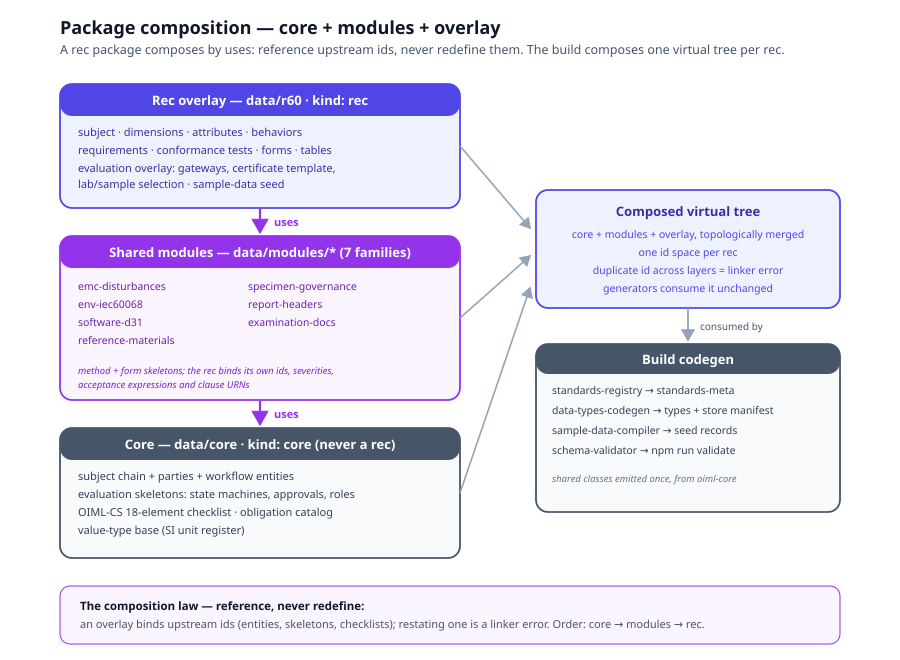

# Chapter 7 — Packaging

> *In this chapter:* the deliverable itself. A Recommendation is shipped
> as a package with a fixed directory contract: `standard.yaml` as the
> manifest, five content layers, root document files, a Layer-1 domain
> profile, JSON Schemas, a seeded sample flow, and a `primmel-packages`
> twin for the `.prl` round-trip. Then the composition question: how a
> rec package consumes core and shared modules by `uses` — reference,
> never redefine.

---

## 7.1 The package is the deliverable

Everything the previous five chapters authored — subject, requirements,
tests, forms, evaluation — must land somewhere a machine can find,
validate, and build. That somewhere is the **package**: one directory
per Recommendation, self-describing, registered, and complete. Two
rules from Chapter 1 govern its shape:

- **YAML is the single source of truth.** TypeScript in
  `browser/src/data/generated/` is derived at build time and never
  edited; services carry no domain content. A new Recommendation is a
  *data* addition, never a code change.
- **A new Recommendation is data, not schema.** The metamodel is schema
  only; the R 60 profile states the rule — "A new Recommendation = a new
  profile file; zero schema changes" (`oiml-r60-loadcell-profile.yaml`).

The contract below is the one R 60 ships today; R 91 and R 144 follow
the same layout, which is precisely what made the cross-standard
layering census (`analysis/cross-standard-layering.md`) measurable.

## 7.2 The `data/<rec>/` directory contract ●

```
data/<rec>/
  standard.yaml         identity + structure registry + source
  terminology.yaml      terms; vocab_ref → viml-2022 / vim-2012
  references.yaml  notes.yaml  obligation.yaml  value-types.yaml
  navigation.yaml  parts.yaml  redirects.yaml  sample-data.yaml
  model/        instrument.yaml attributes.yaml capabilities.yaml
                behaviors.yaml conditions.yaml
  entities/     instrument.yaml parties.yaml workflow.yaml test-execution.yaml
  specification/ requirements/ conformance/ tables.yaml symbols.yaml
                calculations.yaml formulas.yaml verdicts.yaml
  execution/    forms/ subforms/ test-report.yaml test-report-checklist.yaml
  evaluation/   workflow.yaml state-machines.yaml processes.yaml gateways.yaml
                approvals.yaml roles.yaml certificate-template.yaml
                evaluation-dimensions.yaml evaluation-profiles.yaml
                lab-selection-criteria.yaml sample-selection-rules.yaml
                calculation-context.yaml
```

Each directory answers to one tier of the frame: `model/` is the primary
tier (what the subject IS/HAS/DOES), `entities/` its storable subject
chain and workflow records, `specification/` the secondary tier
(constraints and operations), `execution/` the evidence views,
`evaluation/` the tertiary judgment and workflow config. The root files
are the document machinery (Layer 0 anchoring: terminology, obligation,
value types) plus app-facing concerns (navigation, redirects) and the
Layer-3 seed (`sample-data.yaml`, §7.6).

### 7.2.1 `standard.yaml` — the manifest ●

`data/r60/standard.yaml` is the package's self-description, in three
blocks:

1. **Identity** — `id`, `shortName`, `fullName`, `baseUrn`, `version`,
   `editions`, `description`, `publisher`, `docnumber`, `doctype`. The
   `baseUrn` (`urn:oiml:pub:r:60:2021`) is the namespace every
   provenance reference in the package resolves against.
2. **`structure:`** — the registry. Every file in the package is
   registered with `path` + `label` + `description`, grouped by layer
   (model / entities / specification / execution / evaluation /
   root-level). The rule is absolute: **a file not in `standard.yaml`
   does not exist as far as the build is concerned.** The generators
   discover content through the registry, never by walking the tree.
3. **`source:`** — where the authoritative text lives: the Metanorma
   collection (`sources/r060/collection.yml`), the part documents, and
   the package's Primmel twin (`primmel: primmel-packages/oiml-r60`).

The manifest is what turns "a directory of YAML files" into "a package":
identity, inventory, provenance.

## 7.3 The Layer-1 domain profile ●

The package's data instantiates a schema it does not own. Above
`data/<rec>/` sits the metamodel
(`ontology-remix/OIML Core Models/Ontology/oiml-core-ontology.yaml`,
schema only: classes, enumerations, INV-1..10), and beside it one
**domain profile per Recommendation**
(`ontology-remix/OIML Recommendation Models/Ontology/R 60/oiml-r60-loadcell-profile.yaml`)
— the Recommendation's ontology-level data: subject taxonomy,
attribute-definition semantics, formulas, constraints, the error model.
The profile is data, not schema: adding R 91 or R 144 changed zero lines
of the metamodel (the OCP claim the gap audit verified in practice).

In the tier language of Volume I: the metamodel + profile are the
Foundations-to-Primary bridge the rec package anchors to; the rec
package never redefines metamodel classes, it instantiates them.

## 7.4 JSON Schemas for new file kinds ●

Every file kind in the package validates against a JSON Schema in
`data/schemas/` (~40 schemas: `standard-meta.yaml`, `model.yaml`,
`entities.yaml`, `rc.yaml`, `cc.yaml`, `form.yaml`, `verdicts.yaml`,
`tables.yaml`, `symbols.yaml`, `evaluation-*.yaml`, …). The discipline
for a new file kind — say, the `reference-materials.yaml` R 144 added —
is three steps, in order:

1. author the schema in `data/schemas/`;
2. register the file in `standard.yaml`'s `structure:` (and the
   `standard-meta` schema, which enumerates the known structure keys);
3. only then author content.

Schema-first is what keeps "a new file kind" from becoming "a new
silent hole in validation". The gates (`npm run validate`) run schema
validation before semantic validation; a file with no schema fails
loudly, never passes vacuously.

## 7.5 `uses` composition: core + modules + overlay ○

One directory per Recommendation works — until the second and third
Recommendations exist and the census can measure what they share. The
measured facts (`analysis/cross-standard-layering.md` §0–1): 12 of
R 91's 34 files are *byte-identical* to R 60's; 8 of R 144's are
structurally identical; and the identical class splits in two —
genuinely shared skeletons (workflow entities, state machines,
approvals, roles, obligation) and **copy residue that is wrong for the
rec** (R 91 shipping R 60's certificate template, gateways, notes and
checklist — the deep-audit's R2 finding). The copy mechanism and the
bug mechanism are the same mechanism. Composition replaces both.



The design (layering census §5, ○ — planned for v3):

- **Core** (`data/core/`, `id: oiml-core`, `kind: core`) — the Tier-1
  verbatim content: subject-chain and workflow entities, parties,
  evaluation skeletons (state machines, approvals, roles, workflow,
  processes), the OIML-CS 18-element report checklist, obligation
  catalog, value-type base. Never a publishable rec; the registry
  excludes `kind: core` from rec listings.
- **Modules** (`data/modules/<name>/`, `kind: module`) — seven
  parameterized test/form families measured out of the census:
  `emc-disturbances`, `env-iec60068`, `software-d31`,
  `reference-materials`, `specimen-governance`, `report-headers`,
  `examination-docs`. Each carries a `module.yaml` manifest
  (`provides:` test patterns + form skeletons; `requires:` what the
  consumer must supply). The module freezes the *skeleton*; the rec
  binds its own attribute ids, severities, acceptance expressions and
  clause URNs. Parameterization is not new machinery: conformance-test
  `variables` and form `bind:` paths already do it — the module makes
  it a package boundary.
- **Rec overlay** (`data/<rec>/`) — normative content only: subject,
  dimensions, attributes, requirements, tests, forms, tables,
  terminology, plus the rec overlay of evaluation config.

The consumption declaration lives on the rec's manifest:

```yaml
# data/r144/standard.yaml (sketch — ○ planned)
id: oiml-r144
uses:
  - core
  - module: emc-disturbances
  - module: env-iec60068
  - module: reference-materials
    with: { subform: cgm-point }        # the rec binds its own subform id
  - module: report-headers
  - module: examination-docs
```

The composition law is the one rule that makes this safe:
**reference, never redefine.** An overlay may *reference* core and
module ids; it may never *redefine* them. The build composes a virtual
effective tree per rec (core → modules → rec, topologically ordered),
the linker rejects duplicate ids across layers as errors (today's
"silent skip + warning" heuristic in `data-types-codegen.ts` is exactly
what composition deletes), and the existing generators consume the
composed tree unchanged — so "generated app data identical" stays a
testable acceptance. Composition must also tolerate partial consumers:
R 91 has no test-execution entities and no sample data today, and that
is "not yet modelled", not an error.

Why not single inheritance? Because `extends` is a single string and a
rec is core + N modules — the primmel-side `extends oiml-core` that
every package declares today already dangles (no `oiml-core` package
exists in `primmel-packages/`; layering census §5.2). Multi-package
`uses` is the v3 answer.

## 7.6 Seed one full flow: `sample-data.yaml` ●

A package without instances is a claim; a package with a seeded flow is
a demonstration. The checklist (methodology §9.2, item 26) requires
**one full flow, end to end**:

```
family → group → model → sample → application → request
       → report → evaluation → certificate
```

R 60 ships thirteen such flows (`data/r60/sample-data.yaml`), compiled
from fifteen real certificate PDFs in `reference-docs/certificates/` —
one manufacturer, one family, one group per certificate classification
label (`C3`/`C4`/`C6`), one model per classification-row E_max, 1–2
samples, then the workflow chain to an ACTIVE certificate. The seed is
what makes every downstream claim checkable: the store manifest builds,
the verdict matrix has evidence to re-execute, the certificate template
has classifications to print. R 144 ships two flows — and proves the
chain tolerates missing levels (family → model → sample, no groups;
Chapter 9).

The seed is also a regression instrument: the sample-data compiler
normalizes flows into store records at build time, so a modelling edit
that breaks the seed breaks the build, not the demo.

## 7.7 `primmel-packages/` and the `.prl` round-trip ●◐

Every rec package has a native-language twin under `primmel-packages/`
(`primmel-packages/oiml-r60/`, 92 `.prl` files), mirroring the YAML
layout by convention (`docs/primmel-v2-plan.md` §3):

```
oiml-r60/
  package.primmel            # the only required file — manifest
  model/  entities/  specification/  execution/  evaluation/
  terminology.prl  references.prl
  examples/sample-data.prl
```

The manifest carries identity and composition intent:

```
package {
  id oiml-r60
  title "OIML R 60:2021 — R 60 package"
  version "2021"
  editions { 2021 2017 2000 1996 }
  baseUrn "urn:oiml:pub:r:60:2021"
  extends oiml-core
  source { collection "sources/r060/collection.yml" parts { 1 2 3 } }
}
```

Rules: merged by convention (directory names fixed, file names free);
cross-file references by stable ids only (`/req/...`, `/conf/...`,
attribute ids — never paths). The semantic round-trip YAML ⇔ native is
implemented and CI-tested (v2-plan W3–W5: `browser/build/yaml-to-primmel.ts`
and `primmel-to-yaml.ts`), and the runtime plug is proven: a full build
from `primmel-packages/oiml-r60` with zero validation errors
(`SMART_STANDARDS_SOURCE=primmel`, W6).

Honesty requires the ◐: the round-trip is faithful for scalar,
single-valued content and lossy exactly where a rec is *not* R
60-shaped — the R 91 and R 144 audits found table rows, acceptance
blocks, symbol formulas, multilingual descriptions and the
`multi_select` flag dropped in conversion (deep-audit findings R19 /
C2–C5). The migration phases stand: A — YAML authoritative, converter
proves round-trip (today); B — YAML becomes generated output of the
native package; C — new recs authored Primmel-native only. Phase B is
gated on closing the fidelity gaps, not on a date.

## 7.8 Registering the standard so the build sees it ●

Packaging ends in registration. The build's standards registry
discovers packages by scanning `data/*/` for `standard.yaml` and keying
on its `id` — no central list to edit. Two consequences the author must
know:

- **Id collisions shadow.** The registry resolves duplicate ids by sort
  order (later entry wins): `data/r144` shadows the legacy
  `data/oiml-r144`. Deliberate for migration, dangerous by accident —
  choose ids deliberately, and prefer deleting stale trees to
  out-sorting them.
- **Non-rec packages need a kind.** `kind: core` / `kind: module` keep
  core and modules out of rec listings, navigation and search (the
  layering census's registration rule).

Then the gates decide whether the package *is* a package:

```
cd browser && npm run validate   # JSON-Schema + semantic (x-refs, anchors) + sample-data
cd browser && npm run build      # full codegen; YAML errors fail here
cd browser && npx vitest run     # unit tests over the generated data
```

A package that passes all three is registered, generated, seeded and
executable. Anything less is a directory.

## 7.9 Grammar sketch *(illustrative v3 syntax)*

```prl
package oiml-r144 {
  kind     rec
  baseUrn  "urn:oiml:pub:r:144:2013"
  editions { 2013 }
  uses     [ oiml-smart-core,
             module emc-disturbances,
             module env-iec60068,
             module reference-materials with { subform cgm-point },
             module report-headers,
             module examination-docs ]
  source   { collection "sources/r144/collection.yml" parts { 1 2 3 } }
  structure { model/, entities/, specification/, execution/, evaluation/, root }
}

package oiml-smart-module-emc-disturbances {
  kind     module
  provides { test_patterns  [esd, bursts, surge, rf-emf, conducted-rf,
                             power-voltage-variation, short-time-power-reduction,
                             low-battery]
             form_skeletons [disturbance-test-form, influence-test-form] }
  requires { core [entities/instrument, entities/test-execution] }
  # the rec binds: observable ids, severities, acceptance expressions, clause URNs
}
```

## 7.10 Validation rules

Package-level checks the linker and gates enforce:

- every file in the tree is registered in `standard.yaml`
  `structure:`, and every registered path exists (no ghosts, no
  orphans);
- every file validates against its `data/schemas/` schema — a new file
  kind without a schema is an authoring error;
- every `uses:` entry resolves to a declared core/module package;
  `requires:` of every consumed module is satisfied by core + earlier
  modules + the rec itself;
- no id is defined twice across the composed tree — the overlay
  references upstream ids, never redefines them;
- every module `provides` is consumed by the rec or explicitly waived;
- `sample-data.yaml` seeds at least one complete flow: every workflow
  entity in the chain present, every FK resolving, `standard_id`
  consistent throughout;
- `source:` resolves: the declared parts exist under `sources/`, and
  the `primmel:` twin (when declared) loads with zero errors.

## 7.11 Summary

- One directory per Recommendation, self-describing via
  `standard.yaml`: identity block, `structure:` registry (unregistered
  files do not exist), `source:` provenance.
- The Layer-1 domain profile carries ontology-level data per rec; the
  metamodel never changes for a new Recommendation.
- New file kinds are schema-first; the gates fail loudly on the
  unregistered and the unvalidated.
- Composition is `uses: [core, modules…]` with one law — reference,
  never redefine — producing a virtual effective tree the existing
  generators consume unchanged (○ v3; the census measured why).
- `sample-data.yaml` seeds one full flow family → … → certificate; the
  `.prl` twin under `primmel-packages/` is round-tripped and
  runtime-pluggable today (◐ for non-R-60-shaped content).
- Registration is discovery by manifest id plus the three gates:
  validate, build, vitest.

*Next: [Chapter 8 — Walkthrough: OIML R 60](08-walkthrough-r60.md):
the worked example, end to end — from three source documents to a
running package.*
