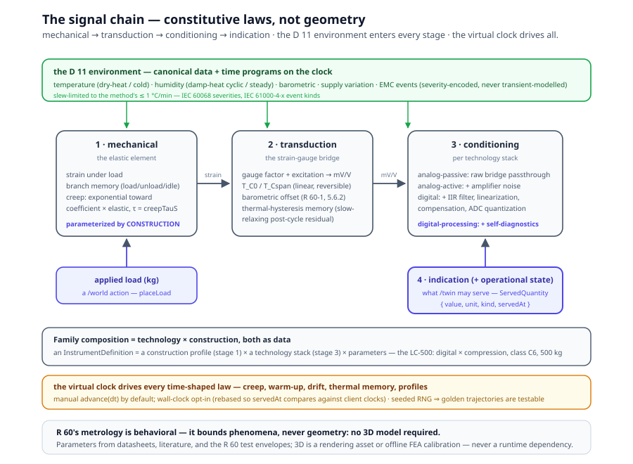
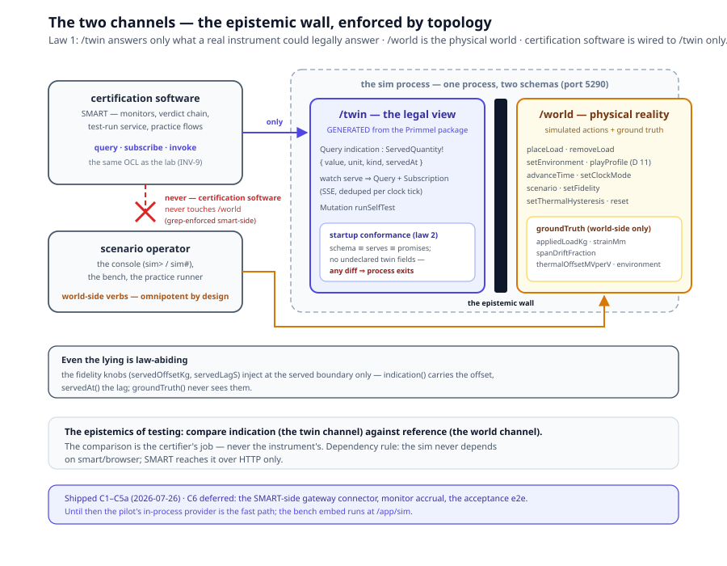

# Simulated Instruments — the Wind Tunnel

> *In this annex:* the simulated-instruments framework — a physics-core
> measuring-instrument simulator that lets certification software be
> exercised against an instrument that *behaves* like a real one while
> revealing its ground truth only through a backdoor the certification
> software may never use. The two laws (the epistemic wall; the
> generated twin interface), the signal-chain physics core, the D 11
> environment layer, the scenario registry, the two channels, the
> console and the bench, the standalone boot, thermal hysteresis, the
> SMART `/app/sim` practice flows, and the Digital Twin certification
> program the rig enables.
>
> The framework lives in the sibling `sim-instruments` repository
> (● shipped 2026-07-26, C1–C5a; CI green — the `ci` workflow's six
> jobs across the Node matrix: typecheck, test ×2, bench-build,
> standalone-boot, console-session, bake-freshness; 78 unit/integration
> tests). Paths below are relative to that repository; the authoritative
> design record is `docs/2026-07-26-simulated-instruments-design.md`
> there.

---

## 1. Why a simulated instrument

Every page of this site describes models that judge instruments — and
every engine that executes them had, until now, no instrument to judge.
Testing the certification loop meant seeded database fixtures: evidence
typed in by hand, verdicts computed against what the fixture author
imagined a load cell would say. The simulator closes that loop with
**behavioral truth**: an instrument whose indication emerges from
constitutive laws — elastic strain, thermal coefficients, creep,
quantization — so a test protocol run against it succeeds or fails for
physical reasons, and a certification pipeline is exercised the way it
will be in the field.

The framework ships one complete instrument: the **ACME LC-500** load
cell (digital × compression, class C6, 500 kg capacity, 0.05 kg scale
interval, n_lc 6000, rated −10…+40 °C) — the same fictional product
whose reference package anchors chapter 15's supply chain and the
live-twin pilot.

## 2. The two laws

The framework is governed by two laws that may never be violated; both
are enforced by topology, not convention.

**Law 1 — the epistemic wall.** `/twin` answers only what a real
instrument could legally answer: its indication, its state, its served
registers, its instrument-legal operations. `/world` is the physical
world: applied load, environment, time, ground truth. Nothing from
`/world` may leak into `/twin` — a real instrument cannot report ground
truth. **Certification software is wired to `/twin` only.** The
epistemics of testing is comparing *indication* (the twin channel)
against *reference* (the world channel) — the comparison is the
certifier's job, never the instrument's.

**Law 2 — the twin interface is generated, never hand-written.** The
`/twin` GraphQL schema is derived from the instrument's Primmel product
reference package — its `serve` declarations (chapter 14's twin
interface). The **startup conformance check** (schema ≡ serves ≡
promises) fails the process on any diff: the twin can never drift from
its declared contract.

## 3. The physics core — the signal chain

The instrument model is a **signal chain of stages**, each a lumped
constitutive law with parameters (`packages/core/src/physics/stages/`):



1. **Mechanical stage** — the elastic element: strain under load,
   branch memory (`loading | unloading | idle`), creep (exponential
   advance toward `creepCoefficient × elastic` with time constant
   `creepTauS`), resonance.
2. **Transduction stage** — the strain-gauge bridge: gauge factor and
   excitation, output in mV/V; the linear temperature coefficients
   `tcZeroPerDegC` / `tcSpanPerDegC`; the barometric offset
   `barometricPerKPa` (R 60-1, 5.6.2); and the thermal-hysteresis
   memory of §9.
3. **Conditioning stage** — per technology stack (below); `process()`
   returns the indication and any faults.
4. **Indication** (+ the operational state) — what `/twin` may serve.

**Family composition is technology × construction**, both as data. A
*construction profile* parameterizes stage 1 (`ConstructionProfile {
complianceKgPerMm, hysteresisClass, creepCoefficient, creepTauS,
resonantHz, offCenterSensitivity }`; v1 ships `COMPRESSION` — the
design names five profile kinds). A *technology stack* parameterizes
stage 3 (`analog-passive | analog-active | digital |
digital-processing`): passive is the raw bridge passthrough; active
adds amplifier noise; digital adds the IIR filter, linearization error,
compensation residual, and ADC quantization to the scale interval;
digital-processing adds self-diagnostics (an `overload` fault above
1.5× capacity). An `InstrumentDefinition` is construction × stack ×
parameters (capacity, scale interval, sensitivity, gauge factor,
excitation, the T_C pair, barometric, the thermal-hysteresis pair,
filter/linearization/compensation/noise, warm-up τ, span drift per
day) — plus optional fidelity knobs (§5).

**The virtual clock** (`VirtualClock`) drives everything time-shaped:
manual-step by default (`advance(seconds)`), wall-clock opt-in
(`setMode('wall')` — entering wall mode rebases the virtual epoch so
`servedAt` timestamps compare against clients' wall clocks). Every
`onAdvance` tick drives creep, warm-up, drift, thermal memory and the
environment profiles. Randomness is a seeded generator (mulberry32 +
Box–Muller) — golden trajectories are testable. And INV-1 holds inside
the simulator too: every physical value is a typed quantity
(`qty`, `add`, `UNITS`, …) — no bare numbers in the signal chain.

**Why no 3D model.** A realistic *behavioral* simulation does not need
the cell's geometry — it needs the constitutive laws and their
parameters. R 60's metrology is behavioral: it bounds phenomena and
never references geometry, and manufacturers characterize cells by
measurement, not by FEA. Each phenomenon is a lumped law whose
parameters come from datasheets, literature, and the R 60 test
envelopes themselves (compliance from rated deflection; creep from the
30-minute envelope with p_lc apportionment; T_C0/T_Cspan from
datasheets; barometric from R 60-1 5.6.2; ADC/firmware behaviour is
pure software). A 3D model earns its keep in exactly two places: as a
*rendering asset* for the bench visualization, and as the optional
*offline FEA-calibration* path (SimScale/CalculiX/FEniCS — a
methodology note, never a runtime dependency).

## 4. The D 11 environment layer

Environment enters the model two ways, per the design ("encoding first,
then some simulated behavior"):

- **As canonical data** — the `D11_CONDITIONS` vocabulary: `dry-heat`
  (IEC 60068-2-2, D 11 10.2; severities BB1/BB2/BB3), `cold` (60068-2-1,
  10.3; AA1–AA3), `damp-heat-cyclic` (60068-2-30 Db, 10.4),
  `damp-heat-steady` (60068-2-78 Cab, 10.5), `barometric` (60068-2-13,
  10.6; M1 86 kPa / M2 106 kPa). EMC and electrical events are
  **severity-encoded, never transient-modelled** (`voltage-dip`,
  `voltage-variation`, `burst`, `surge`, `esd`, `rf-field` — each
  mapped to its IEC 61000-4-x method standard).
- **As time programs** — `D11_PROFILES` replay temperature/humidity
  keyframes on the virtual clock (the cyclic damp-heat 24 h loop,
  25→55 °C), slew-limited to the method's ≤ 1 °C/min, looping where the
  method loops.

Physics consumes the environment at every stage: temperature
coefficients on zero and span, humidity effects on bridge and
electronics, the barometric effect on dead load, supply disturbances on
the conditioning stage, EMC events as indication disturbances and fault
triggers — the same phenomena the R 60-2 environmental test program
(2.10.5–2.10.7.10) verifies, and the same nine electronic behaviors
phase 9 anchored model-side (Volume III, §4.9).

## 5. Scenarios — data, not code

A scenario is an instrument definition plus a physics-preset name, in a
registry (`SCENARIOS`, `getScenario`, `validateScenario`). The shipped
set answers the two questions a certification rig must answer — *does
it pass a good instrument, and does it catch each bad one?*:

| Scenario | Physics preset | Outcome it exists to produce |
|---|---|---|
| `good-cell` | all coefficients inside R 60 limits | passes the test program |
| `creep-cell` | creep 0.004 / τ 120 s (vs good 0.0003 / 300) | fails the 30-minute creep test |
| `temp-cell` | T_C0 0.001, T_Cspan 0.002, residual 0.005/°C + strong thermal memory | fails the temperature tests |
| `drift-cell` | span drift 0.0005/day | fails span-stability over the endurance program |
| `lying-twin` | honest physics; served indication offset +0.25 kg | a twin-*fidelity* fault — the certification must catch it |
| `stale-twin` | honest physics; `servedAt` lagging 30 s | a twin-*freshness* fault |

The last two are the twin-certification instruments (§11). The
**fidelity knobs** (`servedOffsetKg`, `servedLagS`) are injected at the
*served boundary only*: `indication()` returns the true indication plus
the offset, `servedAt()` returns the clock minus the lag — and
`groundTruth()` never sees them. The wall holds even while lying.

## 6. The two channels

One process, two GraphQL schemas, each with its playground
(`createSimServer`; default port 5290 — `http://localhost:5290/twin`,
`/world`, the bench at `/`):



**`/twin` — generated from the package.** `generateTwinSchema` maps the
serve declarations of the product reference package: a query serve
becomes `Query.indication: ServedQuantity!` (`{ value, unit, kind,
servedAt }` — INV-1 with timestamps); a *watch-kind* serve answers
**both** a point query (monitors poll) and a subscription (the watch —
SSE: the current value at subscribe, then on every clock advance,
deduped); a command operation becomes a mutation (`runSelfTest`). The
startup conformance check (`checkTwinConformance`) then proves
schema ≡ serves ≡ promises: every serve has its schema member (query
*and* subscription for watch-kind), every command op its mutation, and
the schema carries **no undeclared twin fields** — any diff prints the
diff and exits the process. Fault injection is never on `/twin`:
`selfTest` reports only what self-diagnostics would legally say.

**`/world` — simulated physical actions.** The physical-world
backdoor: `placeLoad` / `removeLoad`, `setEnvironment`, `playProfile`,
`advanceTime`, `setClockMode`, `scenario`, `setFidelity`,
`setThermalHysteresis`, `reset` — and the ground-truth queries
(`appliedLoadKg`, `strainMm`, `spanDriftFraction`,
`thermalOffsetMVperV`, the environment, the clock). Certification
software never uses this channel; it is simulated reality, not an
instrument API. v1 ships it unauthenticated — a documented localhost
development posture (`/world` is omnipotent by design; a deployment
would gate it).

The dependency rule keeps the wall load-bearing: the sim depends only
on primmel-ts (build-time only), `graphql` and `graphql-yoga` — never
on `smart/browser`. SMART reaches the sim over HTTP only, forever.

## 7. The IOS console

The console is a teaching device modelled on network-gear shells:
user exec (`sim>`) for observation, `enable` into privileged (`sim#`)
for world mutation — a privilege *convention*, not a security boundary
(every command reaches `/world` anyway; the posture is documented).
Three layers, each testable alone: a pure **grammar** (text →
`ConsoleAction`), a runtime-agnostic **executor**, and the node
readline loop (piped stdin sessions execute sequentially — scripted
sessions complete).

The epistemic split is *grammatical*: `show indication` queries
`/twin` — the instrument's legal view — while `show ground-truth`
queries `/world`. One shell, two truths, and the learner feels the wall
in the command set: `place load 40`, `set temperature 55`,
`play profile damp-heat-cyclic-db`, `advance 30m`, `scenario
creep-cell`, `set fidelity offset 0.25`, `set thermal-hysteresis 0.0002
tau 1800`, `fidelity reset` — the privileged verbs are all world-side.

## 8. The bench SPA and the standalone boot

**The bench** (`@sim/bench`) is a dependency-light SPA (vanilla TS +
WebGL2) with three panes: the **terminal** (the §7 console in the
browser), the **virtual bench** (a WebGL2 scene fed *exclusively* by
`/world` ground truth — rendering, never a physics input: base plate,
cell column, the weight block appearing under load, strain exaggerated
×400, the chamber backdrop shifting with temperature), and **How it
works** (live signal-chain readouts, the current coefficients, and the
constitutive laws of §3 rendered as data rows). The channels are polled
separately on purpose: `/world` feeds bench and dials, `/twin` feeds
the indication display.

**Standalone, zero-SMART.** The instrument ships its `/twin` contract
as a *baked artifact* (`packages/lc500/twin/lc500.twin.json`, produced
by `npm run bake` from the ACME LC-500 package; primmel-ts is a
build-time-only dependency). So:

```text
git clone … && npm install && npm start
```

boots a simulated load cell with its console, both GraphQL channels
(with playgrounds), and the bench at `http://localhost:5290/` — **no
SMART checkout, no Primmel knowledge required**. The CLI (`sim-lc500
[--package <pkg.prl>] [--port 5290] [--scenario good-cell] [--console]
[--seed 42]`) loads the baked contract by default; `--package`
re-parses the live package (the development posture). Either way, boot
runs schema generation + the law-2 conformance check and exits on any
diff. The standalone boot is proven by process-level tests and the CI
`standalone-boot` job — the real user experience, proven in CI.

## 9. Thermal hysteresis — the post-cycle residual

Real bridges do not return to zero perfectly after a temperature
excursion; the zero carries a **slow-relaxing thermal memory** toward
`thermalHysteresisPerDegC × ΔT`, with its own time constant — distinct
from the instantaneous, fully-reversible T_C0/T_Cspan coefficients.
The framework models exactly that (● 3db210d): the transduction stage
relaxes its thermal offset on every clock tick; the residual is
**user-configurable** per scenario *and* live — the `/world`
`setThermalHysteresis` mutation and the console `set
thermal-hysteresis` command (0 = perfectly reversible). Three honesty
rules: the operation is `/world`-only, never reachable from `/twin`;
ground truth exposes the offset (`thermalOffsetMVperV`) so the
residual is measurable, not hidden; and the shared definition record is
never mutated (the instrument copies its parameters at construction).
Presets: `temp-cell` ships the strong memory (0.0002/°C, τ 1800 s);
`good-cell` a near-reversible one (0.00002/°C, τ 3600 s).

## 10. The SMART embed — `/app/sim` and the practice flows

The SMART app embeds the same bench at **`/app/sim`** (● smart
d02e350 — one bench codebase, two hosts: the sim serves it, SMART
iframes it). The app's certification logic never calls `/world` — a
grep-level test enforces the wall smart-side: no certification-logic
module references the world channel, and the verdict chain and test-run
service never consult it.

On top of the embed sit the **practice flows**
(`browser/src/sim-practice/`) — scripted sessions over the two
channels, with prompts for the learner, expectation checks (poll
`/twin` until a window holds), and record actions writing into the real
form machinery:

- **Free play** — the raw terminal and bench.
- **The R 60-2 walkthrough** (`r60-2-mdlo-walkthrough`) — the MDLO
  protocol for real: warm-up 400 s, three 500 kg load applications with
  `expectIndication` windows, evidence recorded per run, 60 s recovery
  between runs.
- **The four cells** (`scenario-cells-comparison`) — one mini-protocol
  against `good-cell` / `creep-cell` / `temp-cell` / `drift-cell`:
  same script, four different outcomes — the lesson of §5 taught
  hands-on.

An `auto` mode drives `/world` on the learner's behalf for scripted
exercises and tests. The remaining integration — the SMART-side
GraphQL gateway connector, the monitor accruing verdicts against
sim-served values, and the test-bench acceptance end-to-end (inject
creep via `/world` ⇒ verdict `fail`; kill the feed ⇒ `indeterminate`;
inject a fault ⇒ the service case) — is the deferred C6 stage; the
pilot's in-process provider stays the fast path meanwhile.

## 11. What the rig enables — Digital Twin certification (○)

The framework's reason to exist beyond teaching is a recorded future
program (smart `TODO.roadmap/63`, ○ recorded, not scheduled):
**twin-fidelity verification**. Metrological verification certifies the
*instrument*; nothing yet certifies the *twin* — that its served state
faithfully reflects the physical instrument's actual state, within
declared value bounds and freshness windows. The sim is the program's
enabling rig because it is the only environment where **both channels
are machine-readable by construction**: `/world` ground truth against
`/twin` served values makes fidelity a first-class query, and the
`lying-twin` / `stale-twin` scenarios prove the certification *catches*
infidelity — a rig that only ever passes faithful twins proves nothing.
The certification vantage is a third actor, neither the app nor the
instrument: it reads reference values and served values at scheduled
probe points and judges — per served register a quantity-typed value
bound plus a freshness bound; per state machine, transition fidelity.

## 12. Validation rules

- **law 1 (the epistemic wall)** — nothing from `/world` leaks into
  `/twin`; certification software is wired to `/twin` only (enforced by
  topology: two schemas, two endpoints; grep-enforced smart-side);
- **law 2 (the generated twin)** — the `/twin` schema is generated from
  the package's serve declarations; the startup conformance check
  (schema ≡ serves ≡ promises — every serve its member, every command
  its mutation, no undeclared fields) fails the process on any diff;
- **fidelity honesty** — the fidelity knobs inject at the served
  boundary only; `groundTruth()` never sees them; thermal-hysteresis
  mutation is `/world`-only and never mutates the shared definition;
- **quantities everywhere** — every value in the signal chain is a
  typed quantity (INV-1); randomness is seeded (golden trajectories);
- **gates** — `npm run typecheck` and `npm test` green at every commit
  boundary; the `ci` workflow (typecheck, test ×2 node versions,
  bench-build, standalone-boot, console-session, bake-freshness) green.

*Next: [Volume I, Chapter 14 — Live Twins](../primmel/14-live-twins.md):
the twin interface this simulator implements — and
[Chapter 15](../primmel/15-model-supply-chain.md): the ACME LC-500
product model its `/twin` contract is generated from.*
