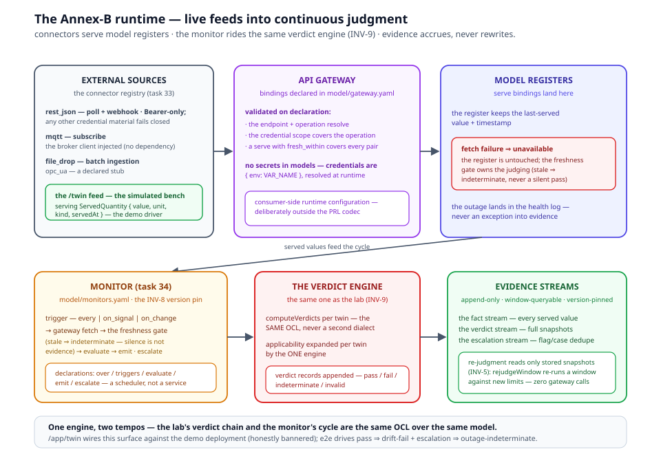

# The SMART Platform Runtime

> *In this volume:* the platform as the engine that executes the models —
> the Primmel packages as the single source of truth with the YAML trees
> and generated code derived from them, the build pipeline, the IndexedDB
> stores compiled from the store manifest, the engines (applicability,
> verdict, form-context, state-walk, dispatch), the role consoles and
> public register, the hybrid server-rendered shell, and the command
> gates that keep every claim in this tree honest.
>
> *The runtime chapters that postdate this overview:*
> [Simulated Instruments](02-simulated-instruments.md) (the SST wind
> tunnel) · [The Twin Lab](03-the-twin-lab.md) (the generic twin
> workbench) · [Multi-standard projection](04-multi-standard-projection.md)
> (the auditor lenses) · [The composite twin](05-the-composite-twin.md)
> (the weakest declared link) · [The CNML bridge](06-the-cnml-bridge.md)
> (sign + verify) · [The program config seam](07-the-program-config.md)
> (OIML SMART as instance #1) · [Primmel Studio](08-primmel-studio.md)
> (the authoring tool — canvas, mapper, diff, simulation).

Status markers: ● exists in the running system · ◐ partial · ○ planned
for v3. Paths are relative to the `oimlsmart/smart` repository.

---

## B.1 The engine, not the content

The platform's founding rule is design principle 1 of the language:
**the model is the source of truth; tooling is a pure engine.** All
Recommendation content — subject model, requirements, conformance tests,
forms, workflow, state machines — lives in the Primmel packages
(`primmel-packages/`, the single source of truth since the task-31b
flip, ● smart a549dab); the `data/<rec>/` YAML trees are downstream
generated artifacts, regenerated from the packages and proven byte-clean
in both directions by `npm run test:ssot`. Services and composables
contain no domain content: adding a requirement, attribute, form, or
state transition is a model edit, never a code edit, and adding a new
Recommendation means a new package with zero schema changes
(`docs/architecture.md` §4).

The browser app (`browser/`, a typed component-based rendering layer)
renders the Recommendation content and runs the entire certification
workflow from that data: application, dispatch, testing, evaluation,
certificate, register (Volume IV). What follows is how the engine is
built.

## B.2 Four layers, one direction

```text
Layer 0  Vocabularies   ../vocab/datasets/{viml-2022, vim-2012}  (glossarist registers)
Layer 1  Metamodel      ontology-remix/OIML Core Models/Ontology/oiml-core-ontology.yaml (v0.6.1)
                        + R 60 domain profile (ontology-remix/OIML Recommendation Models/)
Layer 2  Domain data    data/r60/ — model/ entities/ specification/ execution/ evaluation/
Layer 3  App instances  IndexedDB entities, seeded from data/r60/sample-data.yaml
```

Dependencies point only upward — the tier law, realized as a build.
Layer 2 instantiates layer 1 (the R 60 profile is data, not schema);
layer 3 is runtime instances of layer 2's storable classes. The subject
chain — `MeasuringInstrumentModelFamily → Group → Model → Sample`
(VIML 4.02 / 4.06 "type" / 4.09) — is the center: requirements bind to
the Model, tests run on Samples, evaluation aggregates back to the
Model (`docs/architecture.md` §2).

## B.3 The build pipeline

Everything under `browser/src/data/generated/` is generated at build
time and gitignored — **never edited by hand**; the YAML is changed and
the build regenerates. The pipeline (`browser/build/`, wired as vite
plugins + tsx scripts):

| Stage | Module | What it emits |
|---|---|---|
| discovery | `standards-registry.ts` | the standard set — every `data/*/standard.yaml` |
| generation | `standards-generator.ts` + `standards-plugin.ts` | per-standard generated TS from the YAML |
| vocabularies | `vocab-plugin.ts` | `vocab-registers.ts` from the glossarist registers (missing vocab dir → stub + warning; the build never fails) |
| types + stores | `data-types-codegen.ts` (`npm run codegen:types`) | canonical TS interfaces from `entities/*.yaml` + the **store manifest** (stores, indexes, FK edges) |
| seed | `sample-data-compiler.ts` | compiled entity flows from `data/r60/sample-data.yaml` (13 real-certificate flows) |
| validation | `schema-validator.ts` | AJV validation against `data/schemas/*.yaml` |

Since the Primmel v2 program (W6, ●), the same artifacts can be built
from a Primmel package: `SMART_STANDARDS_SOURCE=primmel` compiles
`primmel-packages/oiml-r60` into the identical generated output, with
zero validation errors — the runtime cannot tell which source fed it.
That is the runtime plug: packages in, running standard out.

## B.4 Stores: the manifest is the schema

Entity classes in `data/r60/entities/*.yaml` declare their own
persistence: `store`, `indexes`, and inlined reference fields
(`reference(Class)` + `required` + `on_delete: cascade | nullify |
restrict`). The store manifest compiles those declarations into the
IndexedDB schema; runtime modules are manifest-driven, not hand-rolled:

- `browser/src/composables/database.ts` — `STORE_SCHEMA` from the
  manifest; every `indexedDB.open` is bounded by a 10 s timeout with one
  fresh retry, so a navigation racing the first-boot open rejects
  instead of wedging every island on `getDb()`;
- `browser/src/data/entity-registry.ts` — the manifest-driven registry;
- `browser/src/composables/useSampleData.ts` — the single seeder
  (layer 3 bootstrap).

There is no separate relationships file and no hand-maintained type
layer: the FK graph and the TypeScript interfaces are two projections of
the same entity declarations.

## B.5 The engines

Five engines evaluate the models; all are data-driven.

- **The applicability engine** (`browser/src/data/applicability.ts`) —
  the ONE applicability engine, built per standard from its dimension
  registry (`model/instrument.yaml`). Every consumer — program.service
  form programs, the dimensions page, verdict filtering, report rows —
  evaluates through it. It handles dimension conditions (`any`/`all`,
  missing-value policy), category subsumption (`implies:` on dimension
  values — R 91 average-speed ⇒ fixed-distance), and runtime
  class-driven instantiation (`instances:` on conformance tests — R 60's
  `n_runs`: A/B = 5, C/D = 3). ●
- **The verdict service** (`browser/src/services/verdict.service.ts`) —
  re-executes each applicable requirement's limit against bound
  evidence: pass / fail / indeterminate per requirement × sample, with
  evaluator override. Acceptance quantities are declared once as
  VerdictQuantities (`data/r60/specification/verdicts.yaml`); the
  per-standard registry (`browser/src/data/verdict-registry.ts`) parses
  each derivation once at standard load and caches the ASTs. Input
  resolution follows one chain: entity attribute → observable form
  evidence (series-aware) → profile-bound symbol → formula symbol.
  Preconditions fire before limits (a violation voids the run —
  `invalid`, never `fail`); modality shades the outcome (a failed
  `should` is an observation, never a blocker). ●
- **The form-context binding engine** (`browser/src/data/form-context.ts`)
  — `resolveBind` / `writeBind` / `persistBindingContext`. Form fields
  with `bind:` paths (164 of them across the R 60-3 forms) prefill from
  the resolved subject chain and write through to the owning entity on
  submit; `FormInstance.values` keeps only unbound entries
  (`stripBoundFields`). The vocabulary: `model.parameters.e_max`,
  `sample.test_context.d_max`, `family.classification.accuracy_class`,
  plus read-only identity paths (`sample.serial_number`,
  `test_report.report_number`). Form-level verdict fields evaluate
  through the same cached registry (`data/form-calculation.ts`), so a
  form and a requirement can never diverge on the same quantity. ●
- **The state engines** (`browser/src/services/state-cascade.service.ts` + `browser/src/data/state-walk.ts`)
  — entity lifecycles declared in
  `data/r60/evaluation/state-machines.yaml`, with guarded transitions
  and declarative cascades (`set` / `where` / `create`, token resolution
  `now` / `user` / `${...}`); `integrity.service.ts` enforces
  cross-machine side-effects from the same declarations. ●
- **Dispatch derivation** (`browser/src/data/dispatch.ts`) — from an
  accepted application to per-lab `TestRequest`s with `TestAssignment`
  tuples at (form × sample × model × lab) granularity, assisted by
  capability-based lab selection (`lab-selection.service.ts` over
  `evaluation/lab-selection-criteria.yaml` — a generic evaluator reading
  `TestLaboratory.capabilities`). ●

### B.5.1 The monitor runtime and the API gateway (● — shipped, tasks 33/34)

The twin direction's two engine components are shipped and gated (●
smart 2ef8f4b + 90ff7c8; Volume I, chapter 14 is their doctrine). Both
are reuse, not new science — the verdict engine is the same one (INV-9:
never a second dialect):

- **The API gateway** (● task 33) — the connector layer. A deployment
  declares `integrations:` in `model/gateway.yaml` (consumer-side
  runtime configuration, deliberately outside the PRL codec): register
  bindings from external sources to model registers, validated on
  declaration — the endpoint resolves against the package's twin
  declaration, the operation is a declared query/subscribe operation,
  the credential scope covers the operation's access scope, a serve
  with `fresh_within` covers every bound pair, and **no secrets in
  models** (credentials are `{ env: VAR_NAME }` references, resolved at
  runtime). Connectors are a registry (`registerConnector`): shipped
  built-ins are `rest_json` (poll + webhook ingest, Bearer-only — any
  other credential material fails closed), `mqtt` (subscribe; the
  broker client injected, no mqtt dependency in the browser runtime),
  `file_drop` (batch ingestion, the 2021 plugin pattern), and `opc_ua`
  as a declared stub. Failure semantics are the honesty core: a fetch
  failure degrades to `unavailable`, the register keeps its last-served
  value and timestamp, the freshness gate owns the judging (stale ⇒
  `indeterminate` — silence is not evidence), and the outage lands in
  the health log — never an exception into evidence.
- **The monitor runtime** (● task 34) — a scheduler over the *same*
  verdict service. Declarations live in `model/monitors.yaml` (`over` /
  `triggers` (exactly one of `every` | `on_signal` | `on_change`) /
  `evaluate` / `emit` / `escalate`, with the INV-8 `version` pin). A
  cycle is: trigger → gateway fetch → the freshness gate →
  `computeVerdicts` per twin, applicability expanded per twin by the
  engine → verdict records appended. Evidence streams are append-only,
  window-queryable and version-pinned — the fact stream (every served
  value that landed, `delivery: cycle | push`), the verdict stream
  (full snapshots — the re-judgment basis), the escalation stream
  (flag/case dedupe while open). **Re-judgment reads only stored
  snapshots** (INV-5): `rejudgeWindow` re-runs a verdict-stream window
  against new limits in the same OCL dialect with zero gateway calls,
  appending marked re-judged verdicts — evidence accrues, never
  rewrites.

The twin console (`/app/twin`) wires the monitor surface, the
escalation records and connector health against a demo deployment
(honestly bannered; never the seeded flows), and the puppeteer suite
drives pass ⇒ drift-fail + escalation ⇒ outage-indeterminate end to
end.



## B.6 Consoles and the public register

The role model (`browser/src/auth/roles.ts`, session via
`useAuth.ts`, subject-chain edit matrix via `useAuthz.ts`) gives each
scheme actor a console (`docs/architecture.md` §12–13):

- **applicant portal** (`browser/src/vue-pages/portal/`) — declare the
  model family, submit, edit-and-resubmit under `CHANGES_REQUESTED`;
- **IA console** (`vue-pages/ia/`) — review → dispatch → evaluate →
  issue;
- **TL workbench** (`vue-pages/lab/`) — inbox, assignments, the run
  view (`/app/lab/run/:assignmentId`), report composer;
- **OIML-CS consoles** (`/app/cs/*`) — the scheme-side runtime:
  participant registry, the issuance gate, operations (Volume IV);
- **live-twin console** (`/app/twin`) — the monitor surface, escalation
  records and connector health over the demo deployment (§B.5.1);
- **simulated bench** (`/app/sim`) — the simulated-instrument embed
  with guided practice flows (Annex: [Simulated
  Instruments](02-simulated-instruments.md));
- **public BIML register** (`/app/register`) — `auth="public"`,
  whitelisted next to `/app/login` in the guard;
- **public product passport** (`/passport/:upi`) — no login: the
  model-native passport page over the passport resolver (Volume I,
  §12.5/§14.6).

The sidebar splits the standard's *reference* content (requirements,
conformance tests, terminology, symbols & formulae, forms) from the
*certification* runtime (applications, test requests, test reports,
evaluations, certificates) — `data/r60/navigation.yaml`.

## B.7 The server-rendered shell

The shell is a **server-rendered framework with selective client-side
hydration** (`browser/astro.config.mjs`); the legacy SPA entry is
gone. The load-bearing facts (`docs/architecture.md` §14):

- **Hybrid output** — `output: 'server'` with a standalone node
  adapter. Static shells carry `export const prerender = true`;
  dynamic entity routes are `prerender = false` and render on demand
  (ids are not build-time enumerable; islands read params from the
  URL, never from build-time props).
- **Generated routes** — `browser/src/pages/` contains only route
  shell files, all generated by
  `browser/scripts/generate-astro-routes.ts` (`npm run codegen:routes`:
  194 route files); never edit the shells by hand. Page components
  live in `browser/src/vue-pages/`.
- **Two generic page shells** — `src/astro/AppPage.vue` (Gate →
  AppShell → page) and `src/astro/PublicPage.vue` (PublicShell →
  page), lazy-loading the page from an `import.meta.glob` registry —
  one chunk per page.
- **The guard** — `src/astro/Gate.vue` runs `bootstrap()` + the
  session check per page: unauthenticated →
  `/app/login?redirect=…`, role mismatch → role home.
- **The router shim is permanent** — `src/astro/app-entrypoint.ts`
  installs a real vue-router per island from the generated
  `ROUTE_PATTERNS`, so the ~46 pages calling `useRoute()`/`useRouter()`
  behave as in the SPA; `push`/`replace` fall through to full page
  loads. De-routering pages is an unscheduled follow-up, not a plan.
- **PWA** — `@vite-pwa/astro` precaches every prerendered shell
  (~450 entries); `/api` is never cached; `404.html` is excluded from
  the precache (its 404 status would kill SW install);
  `src/layouts/Base.astro` references `/registerSW.js` explicitly
  (prod-only) because the plugin cannot inject registration markup.

## B.8 Command gates

Every claim above is kept true by gates that must stay green
(`docs/architecture.md` §15 and the repo's `AGENTS.md`; status as of
merges `8de8f4d` + `8ef2752`, 2026-07-26/27: vitest **3556/3556**,
validate **0 errors / 435 warnings**, e2e **55/55** — the ISO 24229
render-baseline leg (task 25) is the 55th — `test:ssot` **byte-clean**,
pilot **6/6**):

```text
cd browser && npx vue-tsc --noEmit     # type check (islands + vue-pages)
cd browser && npx astro check          # .astro route shells + layouts
cd browser && npx vitest run           # unit tests (vitest.config.ts)
cd browser && npm run build            # gen:data + astro production build (incl. codegen)
cd browser && npm run validate         # gen:data + schema + semantic validation
cd browser && npm run test:round-trip  # PRL build-equivalence + mutation gate
cd browser && npm run test:ssot        # SSOT drift guard — packages ≡ data trees ≡ app-config projections
cd browser && npm run test:from-packages  # the from-packages release proof
cd browser && npm run test:e2e         # puppeteer suite against npm run dev
cd browser && npm run pilot            # the live-twin pilot: ACME LC-500 → quarry, six steps asserted
bin/check                              # repo gate wrapper (vue-tsc + astro check + test:round-trip)
```

`npm run validate` (`browser/scripts/validate.ts`) is the model gate:
(1) YAML sources against the JSON Schemas in `data/schemas/`; (2)
semantic rules — the model linker (`browser/build/model-linker.ts`,
rules R1–R43) statically resolves every cross-reference in a package
(OCL identifiers, bind roots, applicability keys, symbol links, IRDI,
gateway and checklist refs); known-bad sites live in
`data/<id>/linker-allowlist.yaml` with clause-referenced reasons and go
STALE when they stop matching; the reconstruction congruence gate
(§1g — Volume I, chapter 9) proves coverage, order and text identity
over the `.prd` extracts; (3) compiled sample-data entities against the
entity schemas. Proof smokes against a running server: `npx tsx
scripts/astro-smoke.ts` (61 checks), `npx tsx
scripts/astro-pwa-smoke.ts` (15 checks).

## B.9 Grammar sketch *(the shipped contract)*

The platform consumes packages; it declares no language of its own. The
one contract between package and runtime is the manifest and the
runtime plug:

```prl
package {
  id oiml-r60
  kind rec
  title "OIML R 60:2021 — R 60 package"
  version "2021"
  editions { 2021 2017 2000 1996 }
  baseUrn "urn:oiml:pub:r:60:2021"
  uses { iso-iec-17000 iso-iec-17065 iso-iec-17025 iso-iec-17067
         oiml-cs oiml-smart-core oiml-smart-module-specimen-governance }
  status current
}
```

```yaml
# platform runtime configuration (the plug, ● as SMART_STANDARDS_SOURCE=primmel)
recommendations:
  - primmel: primmel-packages/oiml-r60   # compiled to the same generated artifacts
```

The package compiles to the identical store manifest, generated types,
and standard meta that the `data/r60/` tree produces — the runtime is
unchanged whichever source feeds it. The SSOT flip has **landed** (●
task 31b, smart a549dab): the Primmel packages are the single source of
truth, the YAML data trees are downstream generated artifacts
(regenerated by `npm run gen:data`, never hand-edited), and
`npm run test:ssot` proves both directions byte-clean — data trees ≡
regeneration from the packages, packages ≡ rebuild from the app config.
New Recommendations are authored Primmel-native from the start (the
R 129 package is the first, task 22).

## B.10 Validation rules

- **Never edit generated files** (`browser/src/data/generated/**`) —
  change the YAML and regenerate; a hand edit is overwritten by the next
  build and desynchronizes types from stores.
- **Encapsulation** — pages never touch Repository directly; services
  never touch IndexedDB directly; each layer calls only the layer below
  it (`docs/architecture.md` §12).
- **No domain content in code** — a service file referencing R 60
  domain concepts directly is a defect; the applicability engine is the
  single applicability evaluator, and a second one is a defect.
- **Quantities, not numbers** — every physical value is a
  `QuantityValue { value, unit }` (INV-1); attribute values live in the
  `parameters` / `test_context` maps, never in dedicated entity fields
  (INV-2); resolution is by delegation upward Sample → Model → Group →
  Family (INV-10).
- **Gates green before done** — a change is not complete while any
  command gate of §B.8 is red.

## B.11 Summary

- The platform is a pure engine: models in (Primmel packages — the
  single source of truth; the YAML trees generated from them),
  certification out (applications, reports, evaluations, certificates,
  the register, passports).
- One build pipeline compiles packages to generated types, the store
  manifest, vocabulary registers, and seed data; generated output is
  gitignored and never hand-edited.
- IndexedDB stores are the manifest; the FK graph and the TS interfaces
  are two projections of the same entity declarations.
- Five engines — applicability (the ONE engine), verdict, form-context,
  state cascade/walk, dispatch — evaluate the models, all data-driven;
  the monitor runtime and the API gateway (● tasks 33/34) extend the
  same verdict engine to live twins: connectors with fail-`unavailable`
  semantics, freshness-gated cycles, append-only version-pinned
  evidence streams, and re-judgment from stored snapshots (§B.5.1).
- The shell is a server-rendered framework with selective client
  hydration, generated routes, a permanent router shim, and a
  client-side guard; the gates (vue-tsc, astro check, vitest, build,
  validate, round-trip, ssot, from-packages, e2e, pilot) are the
  definition of done.

*Next: [Simulated Instruments](02-simulated-instruments.md) — the
wind tunnel: a physics-core load cell whose `/twin` channel lets the
certification loop run against behavioral truth; then
[The Twin Lab](03-the-twin-lab.md) — the generic twin workbench; then
[Shared — Glossary](../shared/glossary.md): every term of
the frame, one definition each.*
