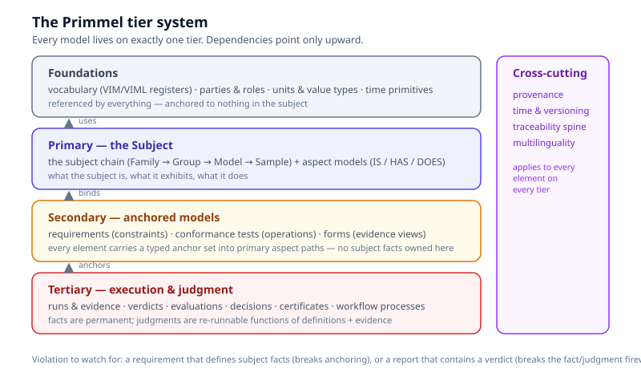
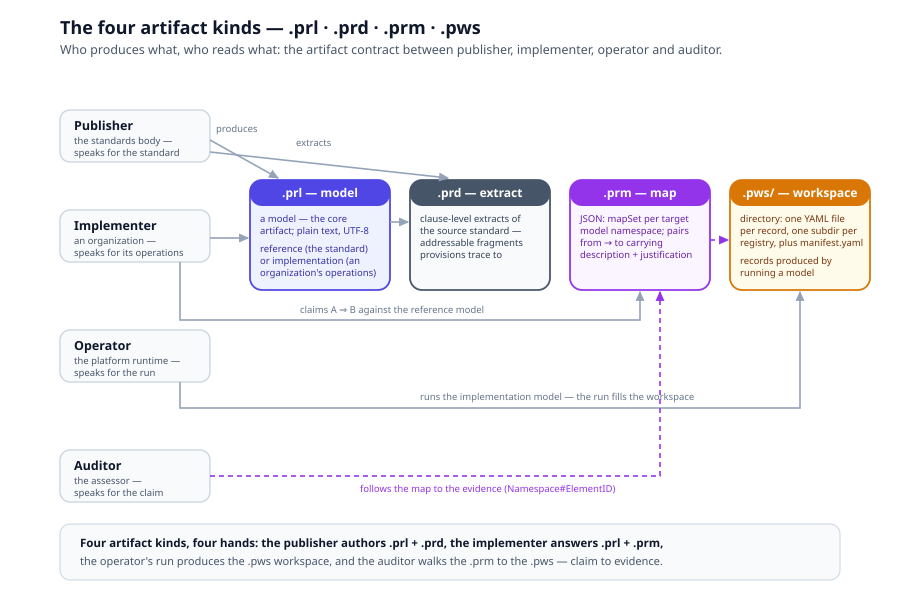

# Chapter 1, Philosophy and Tiers

> *In this chapter:* why Primmel exists, the design principles every
> language decision answers to, and the tier system, the single
> organizing fact about every model you will ever write.

---

## 1.1 The problem: standards are texts

A standard, as published, is prose. A conformance requirement like

> "The value of the largest load applied to a load cell during test […]
> shall not be greater than E_max.", OIML R 60-1:2021, clause 5.2

carries, in one English sentence, at least five machine-relevant facts:
a **subject** (a load cell), an **aspect** of it under test (the largest
applied load, `d_max`), another aspect (its maximum capacity, `E_max`),
a **constraint** (`d_max ≤ E_max`), and a **provenance** (clause 5.2).
In prose, all five are fused. Every reader, manufacturer, test lab,
certification body, regulator, must re-derive them, and every pair of
readers can disagree about what was derived.

The document-centric industry answers (tag the paragraph as a
"requirement" in a requirements database; classify it in an ontology)
stop at the first of the five facts. They make the *text* findable. They
do not make the *semantics* executable: you still cannot ask "does this
instrument pass?" and get a computed answer.

Primmel's claim: a standard can be modelled so that all five facts are
first-class, typed, and related, and then the standard **runs**.

## 1.2 What "executable" means

A Primmel-modelled standard admits four machine operations:

1. **Validate**, the model itself is checked: every reference resolves,
   every constraint's inputs are bound, every test's acceptance derives
   from a requirement, every form's fields bind into the subject graph.
2. **Query**, the model answers structural questions: which requirements
   apply to accuracy class C? Which tests verify this requirement? What
   evidence must this lab produce?
3. **Execute**, the model runs: applicability expands per subject,
   calculations evaluate, state machines transition, gateways route,
   verdicts are re-computed from evidence.
4. **Reason**, the model supports inference over its relations: mapping
   coverage (what of the standard is fulfilled?), traceability (why does
   this verdict exist?), coverage (which aspects are unconstrained?).

If a model cannot do all four, it is a document in a costume.

## 1.3 Design principles

Every construct in Primmel v3 answers to these principles. When two
designs compete, the one that better satisfies this list wins.

> **Formal grounding.** Each of these principles is grounded in , 
> and partially follows from, the IS–HAS–DOES modelling system
> proven in [Volume 0](../foundation/README.md). Where a principle
> is a direct consequence of one of Volume 0's theorems or closure
> rules, the grounding is noted inline. Where the principle is a
> pragmatic choice (not a theorem), it stands on its own.

1. **The model is the source of truth.** Domain content lives in models;
   tooling is a pure engine. Adding a requirement, attribute, or form is
   a model edit, never a code edit.
   *Grounded in [Volume 0 ch 10 §10.5](../foundation/10-executable-ground.md):
   specification equals implementation.*

2. **Executable semantics, or it isn't modelled.** Every construct has a
   defined meaning to a machine, a validation rule, an evaluation, a
   transition, not just a rendering.
   *Grounded in [Volume 0 ch 10](../foundation/10-executable-ground.md):
   the foundation has no escape hatch, behavior is inside the model
   all the way down.*

3. **MECE.** Every concept has exactly one canonical definition point.
   If two constructs overlap, one is deleted or one becomes a facet of
   the other.
   *Grounded in [Volume 0 ch 4 §4.3 Theorem 2](../foundation/04-proofs.md):
   completeness relative to the Claim-Form Axiom, every atomic claim
   falls into exactly one of IS/HAS/DOES.*

4. **OCP.** Layers and packages are open for extension, closed for
   modification: a new Recommendation, capability, or aspect kind is
   *added* without editing existing models.
   *Grounded in [Volume 0 ch 4 §4.4 Theorem 3](../foundation/04-proofs.md):
   extensibility, new content is absorbed without new primitives;
   extension is monotone.*

5. **Closed under reference.** Every identifier used anywhere resolves
   to a declared element. No dangling references, no undefined variables.
   *Grounded in [Volume 0 ch 3 §3.8 Closure Rule 2](../foundation/03-eight-terms-and-closure-rules.md):
   values hold references (ι : O ↪ V), every relation is a
   property-value pair whose value points at an object.*

6. **Traceability.** Every element carries provenance to the source
   document; every judgment carries its evidence chain.
   *Operational consequence of [Volume 0 ch 6 §6.4 Reification](../foundation/06-algorithms.md):
   every process instance is an object ρ(t) ∈ O, individuated by IS
   and queryable by HAS, the trace is the model at instance grain.*

7. **One rule language.** All computable statements, constraints,
   derivations, guards, conditions, are OCL. No second expression
   dialect anywhere.
   *Pragmatic choice (not a theorem): Primmel's surface picks OCL as
   the canonical transition-decomposition language. The algebra
   itself is neutral on which expression language fills the kernel's
   atomic transitions; see [Volume 0 ch 5 §5.2](../foundation/05-kernel-surface-architecture.md).*

## 1.4 The tier system

Every model element in Primmel lives on exactly one **tier**:

| Tier | What lives there | Examples |
|---|---|---|
| **Foundations** | what everything references and nothing in the subject anchors | vocabulary registers (VIM/VIML), parties & roles, units & value types, time primitives |
| **Primary** | the **subject** and its aspects | the instrument chain, attributes, behaviors, conditions, state |
| **Secondary** | models **anchored** to primary aspect paths | requirements (constraints), conformance tests (operations), forms (evidence views) |
| **Tertiary** | execution and judgment over secondary × primary instances | test runs, evidence records, verdicts, evaluations, decisions, certificates, workflow processes |
| **Cross-cutting** | properties of *every* element on every tier | provenance, time & versioning, traceability, multilinguality |

**The dependency law:** dependencies point only upward. Foundations
depend on nothing. The primary tier depends only on foundations. The
secondary tier depends on foundations and the primary tier. The tertiary
tier depends on all three. A downward reference is a modelling error , 
and the linter catches it.

Why does this matter? Because it is what makes models **recombinable**.
A requirement package can be re-targeted to a revised subject without
rewriting, because secondary models never *contain* subject facts, they
only *bind* them. An evaluation can be re-run against new limits without
re-testing, because tertiary judgments never *contain* evidence, they
only *consume* it.

The tertiary tier also has a *continuous* member ○: the **monitor**, a
process that re-runs the same evaluations against live subject instances
indefinitely, and judgment keeps pace with the product
(chapter 14).

### The two firewall rules

The tier law has two named consequences you will meet constantly:

- **The anchoring rule (secondary ⇏ facts).** A secondary model owns no
  subject facts. A requirement *binds* aspect paths (`model.parameters.e_max`);
  it never redefines them. If you find yourself typing a number that
  "belongs to the instrument" inside a requirement, stop, that number is
  a primary-tier value, or a limit in a table the requirement references.
- **The fact/judgment firewall (evidence ⇏ verdicts).** A test report
  contains no verdicts; a run contains no pass/fail. Facts are permanent;
  judgments are re-runnable functions over definitions and facts. If a
  report says "pass", the schema is broken.

## 1.5 Anchoring and the coverage theorem

Secondary models are not merely *allowed* to reference the primary tier , 
they are **defined by** their references:

- A **requirement** is a constraint *over* aspect paths.
- A **conformance test** is an operation *on* the subject: it constrains
  inputs, environmental context and state, and observes outcomes.
- A **form** is a view *projecting* the subject graph into a record.

Every secondary element therefore carries a typed **anchor set**, the
list of primary aspect paths it binds, operates on, or projects. This
has a profound consequence:

> **Coverage is mechanically checkable.** An aspect with no requirement
> is unconstrained. A requirement with no test is unverifiable. A test
> with no form leaves no evidence. A form with no evaluation leaves no
> judgment. The closure aspect ↔ requirement ↔ test ↔ form ↔ verdict is
> a graph property, computed by the linter, not a review opinion.

## 1.6 Model kinds

Primmel authors three kinds of models, and the kind of a model says *who
it speaks for*:

- **Reference model**, the semantic content of a standard document,
  published by the standards body. Faithful, machine-applicable,
  machine-readable, transferable. Speaks for the standard.
- **Product reference model** ●, a manufacturer's model
  of their own product: what it is and claims, mapped aspect-by-aspect
  to the standards-reference model. Speaks for the product. The
  instrument user consumes it in two modes, abstract import (static,
  version-pinned) or live integration (the twin of chapter 14 inside
  their own implementation model); chapter 15 develops the supply chain.
- **Implementation model**, the operations of an organization: its
  actual processes as a digital twin of reality. Speaks for the
  organization. (Chapter 5 develops the mapping relation between them.)
- **Workspace**, the records produced by running implementation models:
  one store per registry, one file per record. Speaks for the evidence.

A standards publisher publishes reference models. A manufacturer
publishes a product reference model ○ mapped to the standard's. A lab or
certification body publishes implementation models mapped to them. The
platform runs implementation models and fills workspaces.

## 1.7 Artifact kinds

Four artifact kinds carry these models on disk:

| Artifact | Kind | Contents |
|---|---|---|
| `.prl` | file | a **model**, the core artifact; plain text, UTF-8 |
| `.prd` | file | a **Primmel Document**, clause-level extracts of a source standard: the addressable fragments provisions trace to (chapter 9) |
| `.prm` | file | a **Primmel Map**, a JSON mapping between two models, with per-pair description and justification (chapter 5) |
| `.pws/` | directory | a **Primmel Workspace**, records produced by running a model: one YAML file per record, one subdirectory per registry, a `manifest.yaml` at the root |

## 1.8 What Primmel v3 is not

Patterns from adjacent approaches that were examined and deliberately
rejected (see `shared/alternatives-audit.md` for the full comparison):

- **Requirements-database rows.** Not a flat list of tagged paragraphs
  with cross-references (the ReqIF profile pattern). Requirements here
  are constraints bound to a subject model.
- **Narrative-fragment ontologies.** Not a classification of text spans
  (the content-ontology pattern). Provisions here are typed, bound, and
  evaluated, the text is a *rendering*, not the model.
- **Diagrams with semantics by convention.** Not boxes-and-arrows whose
  meaning lives in a style guide. Every construct has execution semantics.
- **A second expression language.** All computable statements are OCL.
- **BCP 47 language tags.** Multilingual content carries ISO 24229
  spelling codes instead (chapter 10), precise, registry-resolvable
  identifications of language, script and conversion system.

## 1.9 Summary

- A standard can be modelled so its semantics execute; anything less is
  a document in a costume.
- Every element lives on one tier; dependencies point only upward;
  secondary models anchor to the primary tier and own no facts; evidence
  and judgment are firewalled apart.
- Anchoring makes coverage a graph property: completeness of
  requirements, tests, forms and verdicts is computed, not opined.
- Three model kinds (reference, implementation, workspace) answer "who
  speaks"; four artifact kinds (`.prl`, `.prd`, `.prm`, `.pws`) answer
  "how it is stored".

*Next: [Chapter 2, Subjects](02-subjects.md): the center of the primary
tier and its IS/HAS/DOES anatomy.*
