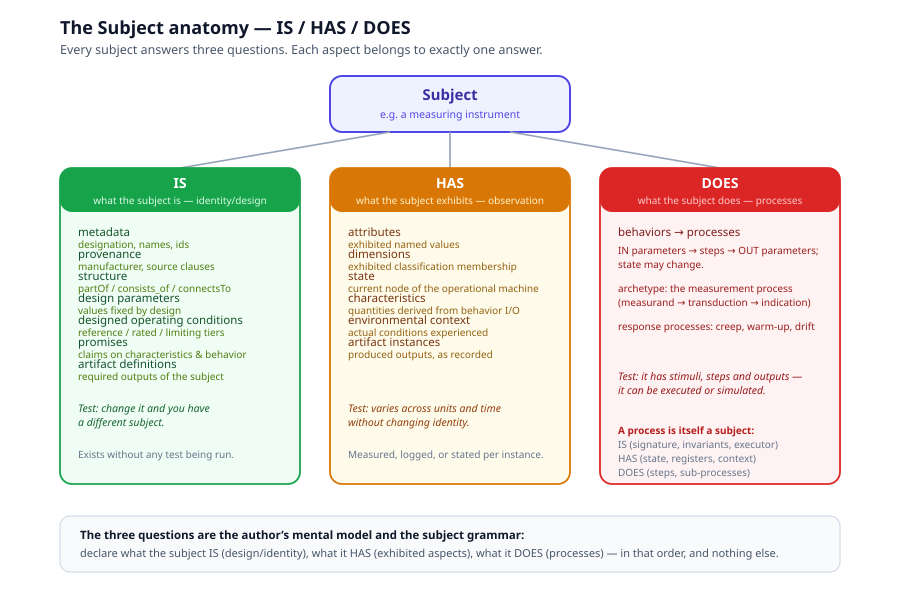

# Chapter 2, Subjects

> *In this chapter:* the Subject, the center of the primary tier, and
> its anatomy: the three questions IS / HAS / DOES, the complete aspect
> catalog, and the tests that tell you which family an aspect belongs to.

---

## 2.1 The Subject: center of the primary tier

Everything in a Primmel model is *about* something. That something is the
**Subject**: the entity the standard governs. In OIML SMART the subject
is the *measuring instrument* (VIML 0.10); in a management-system
standard it is the organization; in a product standard it is the product
family. The kernel does not care what the subject is, it cares that the
subject is modelled with a complete, disciplined anatomy.

The subject is **primary**: requirements constrain it, tests operate on
it, forms record its exhibition, verdicts judge it. Get the subject
right and the secondary models write themselves as derivations of it;
get it wrong and every downstream model compensates with duplication , 
which is exactly how untyped requirement databases rot.

## 2.2 The three questions

> **Formal grounding.** The IS / HAS / DOES trichotomy is not a
> convenience, it is provably exhaustive. See
> [Volume 0 ch 2 §2.2, the Claim-Form Axiom](../foundation/02-claims-and-falsifiability.md)
> for the philosophical commitment, and
> [Volume 0 ch 4, Proofs](../foundation/04-proofs.md) for the
> closure, completeness, and extensibility theorems. The eight terms
> and three closure rules of the underlying algebra are defined in
> [Volume 0 ch 3](../foundation/03-eight-terms-and-closure-rules.md).
> What follows is the *applied* form: how the three relations turn
> into a usable subject anatomy.



Every aspect of a subject answers exactly one of three questions:

| Question | Level | The discriminator |
|---|---|---|
| **IS**, what is it? | identity / design | Change it and you have a *different subject*. Exists without any test being run. |
| **HAS**, what does it exhibit? | observation / instance | Varies across units and time *without* changing identity. Measured, logged, or stated per instance. |
| **DOES**, what does it do? | function / process | It has inputs, steps and outputs, it can be executed or simulated. |

These are not three buckets for convenience; they are three **levels of
being** of the same subject. A designed operating envelope (IS) and the
actual temperature during a test (HAS) are the same *kind* of value at
different levels. The anatomy keeps the levels apart so that a test can
say "hold the environmental context (HAS) within the designed envelope
(IS)" without confusing which is which.

## 2.3 The IS catalog, what the subject is

Seven aspect kinds, plus one twin-era addition (○, chapter 14). Each is
intrinsic: modify it and you are describing a different subject.

| Aspect | Definition | Example (OIML R 60) |
|---|---|---|
| **metadata** | designation, names, ids, definition | `LoadCell`, model designation `ACME-LC-500` |
| **provenance** | pedigree: manufacturer, source clauses, supersedes, legally-relevant software | manufacturer record; `source: r:60-1:2021 §3.1.3` |
| **structure** | designed composition: partOf / consists_of / connectsTo | a moving speed meter consists of a target meter + an ego meter |
| **design parameters** | values fixed by design that define the type | `E_max = 500 kg`, `p_LC`, transducer material |
| **declared classification** | kind-membership: the declared dimension values, identity-defining (the exhibited reading is HAS, below) | the group presents as accuracy class `C`, the family as humidity class `CH` |
| **designed operating conditions** | the designed envelopes: reference / rated / limiting tiers | rated −10…+40 °C; reference 20 °C ± 2 |
| **promises** | manufacturer **claims on characteristics and behavior** | "holds class C6 over the rated range"; a durability claim |
| **artifact definitions** | outputs the subject must produce, with content contract + produced-when | the R 91 evidence file per enforcement measurement |
| **endpoint** ○ | the declared API surface: operations the subject serves (query / subscribe / invoke) with access scopes, part of the type definition, like a marking | `lc500_api` serving `get_indication`, `watch_state`, `run_self_test` |

Two of these are commonly confused away and must stay distinct:

- **Design parameters are not attributes.** A design parameter is part of
  the type definition, changing it makes a different model. An attribute
  (below) is an *exhibited* value. The same quantity may exist at both
  levels (§2.6), but the *roles* never merge.
- **Promises are not declared attributes.** A declared attribute is a
  claim stated as one parameter value ("t_min = −10 °C"). A promise is a
  claim about a *characteristic or a behavior*, possibly
  envelope-shaped, possibly conditional. A promise cites no regulator:
  the manufacturer binds itself, and evaluation will verify. The
  certificate prints promises-as-verified.

## 2.4 The HAS catalog, what the subject exhibits

Six aspect kinds. Each is observable: it can be measured, logged, or
stated per unit, and it may differ between two units of the same model
without them becoming different models.

| Aspect | Definition | Example (OIML R 60) |
|---|---|---|
| **attributes** | exhibited named property values | test-context values `d_min`, `d_max`; as-found readings |
| **dimensions** | exhibited classification *readings* (declared membership is IS) | this unit presents as class `C6`, humidity class `CH` |
| **state** | current node of the operational state machine | `off → warming → ready → measuring → fault` |
| **characteristics** | quantities **derived from behavior I/O** | error `e_l`, repeatability `e_r`, creep `c_c` |
| **environmental context** | actual conditions experienced | logged 23.4 °C during run 7; installation site |
| **artifact instances** | produced outputs, recorded as evidence | one emitted evidence file |

And the third classic confusion:

- **Environmental context is not designed operating conditions.** The
  designed tiers (IS) say where the instrument is *meant* to perform; the
  environmental context (HAS) is what it *actually experienced*. A test
  constrains the latter to lie within the former and records both.

In the twin direction (○, chapter 14) this catalog doubles as the
serving catalog: a live instance exposes its HAS aspects through `serve`
bindings, each bound to an endpoint operation with a freshness window , 
a stale value degrading the verdict to `indeterminate`, never a silent
pass.

## 2.5 The DOES catalog, what the subject does

One aspect kind, recursively defined: **behaviors**, and a behavior is a
**Process**, IN parameters, steps, OUT parameters; state may change.

The archetype is the **measurement process** itself: measurand IN →
transduction chain → indication OUT. Response processes (creep, warm-up,
drift) follow the same anatomy: constant load IN, drifting indication
OUT, over time.

Because a process is itself a subject, the anatomy recurs:

- **Process IS**, signature (IN/OUT parameters), invariants, designed
  envelope, actor/executor, obligation.
- **Process HAS**, current state, registers/variables, actual context,
  process characteristics (duration, rate).
- **Process DOES**, steps and sub-processes, bottoming out in atomic
  steps (a register write, a stimulus application, a wait).

Chapter 4 develops the process model in full. What matters here: DOES is
*processes*, not narrative, a behavior you cannot in principle execute
or simulate is a characteristic wearing a costume. And a process may
itself be reachable: in the twin direction (○, chapter 14) the subject's
endpoint can declare an `invoke` operation over a behavior, making it
remotely invocable, "run your self-test" from across the wire.

## 2.6 The IS/HAS duality

Designed vs exhibited is a **duality relation between levels**, not an
overlap: one value structure (a quantity with unit and tolerance), two
aspect roles. The designed operating envelope and the actual conditions
are duals; a design parameter and its exhibited realization are duals.

The duality is what makes verification statable in one sentence: *the
exhibited value must satisfy the designed claim.* Tests exist to put the
two levels on record side by side.

## 2.7 Characteristics: the quantitative interface

Characteristics deserve their own note because everything downstream
hangs off them:

```text
behavior (DOES)  ──produces──▶  I/O values  ──derived──▶  characteristic (HAS)
                                                              │      │      │
                                                        promises   requirements
                                                          claim     constrain
                                                              │      │
                                                              └── tests compute, verdicts judge
```

- error = OUT − reference IN
- repeatability = dispersion of OUT under repeated identical IN
- creep = ΔOUT/Δt under constant IN

A characteristic is defined once (symbol, derivation from behavior I/O),
claimed by promises, limited by requirements, computed by tests, and
judged by verdicts. **Defined in the primary model; referenced everywhere
else**, the one-home rule for quantities.

## 2.8 The universal anatomy

The triad is not specific to instruments. Every first-class model kind
answers the same three questions:

| Model | IS | HAS | DOES |
|---|---|---|---|
| Subject (instrument) | metadata, provenance, structure, design parameters, designed conditions, promises, artifact definitions | attributes, dimensions, state, characteristics, environmental context, artifact instances | behaviors |
| Process | signature, invariants, executor | state, registers, context, process characteristics | steps, sub-processes |
| Requirement | statement, provenance, modality | bindings, limit expression | its evaluation (→ verdict) |
| ConformanceTest | id, kind, provenance | variables, preconditions, enforced conditions | its method |
| Form | id, provenance | fields (bound + evidence slots) | bind/write-through, derivations |
| Workflow | phases, role model | lifecycle state per object | dispatch/evaluate/issue processes |
| Verdict | requirement × sample identity | outcome, fact, limit snapshot | its re-execution |
| Evidence/Run | which test, sample, operator | values, conditions log, timestamps |, (terminal record) |

This is why the anatomy is the *subject grammar*: the author answers
three questions per model, and the linter asks the same three questions
back (did you declare its IS? its HAS? its DOES?).

## 2.9 Grammar sketch *(illustrative v3 syntax)*

*Status ◐: the `subject` construct is implemented in the language
toolchain (primmel-ts: `is:`/`has:`/`does:` blocks, `extends` merge
rules, anatomy checks C6–C9, `TODO.roadmap/01`). The sketch below is
normative for the concepts; small surface details (e.g. `extends` sits
inside the block) follow the implementation.*

```prl
subject LoadCell {
  is {
    metadata   { name "Load cell" source "urn:oiml:pub:r:60-1:2021#clause-3.1.3" }
    provenance { manufacturer ACME }
    design_parameters {
      e_max : mass by design   # origin: design-fixed
    }
    designed_conditions { reference ref-conds  rated rated-conds }
    promises   { accuracy_class C6 over rated }
    structure  { }
    artifacts  { }
  }
  has {
    attributes    { d_min : mass test_dependent }
    dimensions    { accuracy_class ∈ {A,B,C,D} }
    state         OperationalStates
    characteristics { creep c_c = ΔOUT/Δt under constant load }
    environmental_context { logged conditions }
  }
  does {
    behavior measure { in force -> out indication }
    behavior creep   { in force, time -> out indication }
  }
}
```

## 2.10 Validation rules

The linter enforces, per aspect family:

- every aspect belongs to exactly one family (IS, HAS, or DOES), a
  declaration in the wrong family is an error, not a warning;
- every IS aspect is instance-independent (no test-context values among
  design parameters);
- every HAS characteristic names its derivation from behavior I/O;
- every DOES behavior declares its IN/OUT signature (abstract form is
  allowed; unsigned narrative is not);
- duality pairs share one value structure (unit coherence between the
  designed tier and the actual log).

## 2.11 Terminology traps

The four confusions this chapter exists to prevent:

1. *attributes = characteristics = design parameters*, no: exhibited
   values (HAS) vs behavior-derived quantities (HAS) vs type-defining
   values (IS).
2. *environmental context = operating conditions*, no: actual (HAS) vs
   designed (IS).
3. *promises = declared attributes*, no: claims on characteristics and
   behavior (IS) vs single parameter values (HAS, or IS when declared).
4. *behavior = a paragraph about response*, no: a process (DOES) with
   signature and steps, or a characteristic derived from one.

## 2.12 Summary

- The subject is primary; everything else is derivation, evidence, or
  judgment about it.
- IS = identity/design (change it → different subject); HAS = exhibition
  (varies without identity change); DOES = processes (executable or
  simulatable).
- Seven IS aspects, six HAS aspects, one recursive DOES aspect.
- The IS/HAS duality (designed vs exhibited) is a relation between
  levels, never an overlap.
- Characteristics, quantities derived from behavior I/O, are the
  interface that requirements constrain, tests compute, and verdicts
  judge.

*Next: [Chapter 3, Instantiation](03-instantiation.md): definition and
instance, the subject chain, and Sample as instance of Model.*
