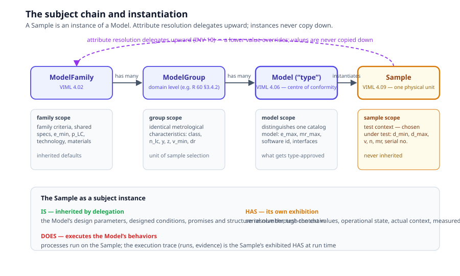

# Chapter 3 — Instantiation

> *In this chapter:* the definition/instance split — why a Sample is an
> instance of a Model, how attribute resolution delegates through the
> subject chain, and how the same duality recurs for every model kind in
> the language.

---

## 3.1 Definition and instance

A Primmel model has two planes:

- the **definition plane** — what kinds of things exist and what is true
  of them by design: subject types, attribute definitions, processes,
  requirements, forms;
- the **instance plane** — the individual things that exist and what they
  exhibited: this sample, this run, this filled form, this verdict.

The split is not bookkeeping hygiene; it is what makes evaluation
**re-executable**. A verdict is a function of (definitions, evidence). If
definitions and instances were fused — if the requirement restated the
instrument's values, if the report carried its own pass/fail — then
re-judging against a new limit would require reconstructing the past.
With the planes apart, re-evaluation needs no re-testing: pin the
definition versions, keep the evidence, recompute the judgment.

## 3.2 The subject chain

The primary subject is not one class but a **chain** of definition
levels, anchored in the vocabulary of legal metrology:

```
ModelFamily (VIML 4.02) ──has many──▶ ModelGroup ──has many──▶ Model (VIML 4.06, "type")
                                                                      │ instantiates
                                                                      ▼
                                                                   Sample (VIML 4.09)
```



- **ModelFamily** — instruments of one manufactured type sharing design
  features and metrological principles, possibly differing in some
  performance characteristics, as defined in the Recommendation. Carries
  inherited defaults.
- **ModelGroup** — *not* a VIML level: the Recommendation's own
  intermediate grouping (R 60's "load cell group", §3.4.2) — models with
  identical metrological characteristics; the unit of sample selection.
  Omit it when the Recommendation defines no such level.
- **Model** — the "type": the definitive model of which all elements
  affecting metrological properties are suitably defined. **The centre of
  conformity**: Recommendations target it, samples instantiate it, type
  approval certifies it — never an individual unit.
- **Sample** — one physical unit, a specimen of an identified Model.
  Tests run on it, verdicts judge it, and type conformity is established
  *across* samples.

Each definition level has a **scope discipline**: every attribute is
declared with the level at which its value is stated (family / group /
model / sample), and the linter rejects a value stated at the wrong level
(a sample value for a model-scope attribute, or inheritance of a
test-dependent attribute).

## 3.3 Sample: the canonical instance

A Sample is an instance of a Model — and because a Sample is itself a
subject, the anatomy answers what instantiation *means* per question:

- **IS — inherited by delegation.** The Sample carries its Model's
  identity aspects — design parameters, designed conditions, promises,
  structure — resolved through the chain, not copied. Ask a sample for
  its `E_max` and you get the model's design value, unless the sample's
  own record overrides it (rare, and visible).
- **HAS — its own exhibition.** Serial number, test-context values
  (sample-scope attributes such as `d_min`, `d_max`, `v`, `n`), its
  operational state, its actual environmental context, its measured
  characteristics. This is the plane tests write into.
- **DOES — the Model's behaviors, executed on it.** A test process runs
  *on* the Sample; the execution trace (the run, the evidence records) is
  the Sample's exhibited HAS at run time.

One line to remember: **the Model is what is certified; the Sample is
what is tested; the chain is what makes the two commensurable.**

One last instance shape belongs here: the **live twin** ○ — a Sample
whose anatomy is *served*, instantiation extended from a record into a
service (chapter 14). The delegation rules above are untouched; only the
answering moves online.

## 3.4 Delegation (INV-10)

Attribute resolution along the chain:

```
resolve(sample, attr):
    if attr is sample-scoped:       return sample.test_context[attr]   # never inherited
    if attr has value on sample:    return sample.parameters[attr]
    if attr has value on model:     return model.parameters[attr]
    if attr has value on group:     return group.parameters[attr]
    if attr has value on family:    return family.parameters[attr]
    else:                           undefined → error (closed under reference)
```

Three laws:

1. **Upward resolution** — a value not set locally resolves to the
   nearest enclosing level that sets it.
2. **Lower override** — a value set at a lower level shadows the
   inherited one (deliberate, visible in the data).
3. **Never copied down** — values live at one level only; copying a
   family value onto every model is the classic data-rot move and is
   forbidden.

## 3.5 The uniform duality

Instantiation is not specific to subjects. The same definition ⇒
instance duality recurs across every model kind:

| Definition plane | Instance plane | Instance is… |
|---|---|---|
| Model | Sample | a physical unit of the type |
| process definition | process execution (TestRun) | one run of the process on one sample |
| Form | FormInstance | one filled record of the schema |
| artifact definition | artifact instance | one produced output |
| AttributeDefinition | Parameter (valued attribute) | the value of the attribute on one subject level |
| requirement | Verdict | the judgment of that requirement for one sample — *not* an instance, but a re-executable function of the requirement + evidence |
| certificate template | Certificate | one issued artifact |
| product reference model ○ | live twin ○ | one served instance of the manufacturer's product model, imported abstractly or integrated live (chapter 15) |

Two discipline rules follow:

- **Definitions and instances never mix in one element.** A model file
  declares definitions; instances live in the workspace (`.pws/`) or in
  `examples/` seed data. (The single sanctioned exception: seed instances
  shipped for testing, clearly segregated.)
- **Every instance is version-pinned to its definitions** (INV-8): a run
  records which method version it executed; a report records which
  requirement editions it answers.

## 3.6 Where instances live

Definitions are authored in `.prl` packages. Instances are produced by
execution and stored in the **workspace** (`.pws/`): one store per
registry, one YAML file per record, a manifest at the root. The store
schema is compiled from the entity classes (registries are *places*;
chapter 6), so the workspace is always exactly as structured as the model
demands — no more, no less.

## 3.7 Grammar sketch *(illustrative v3 syntax)*

```prl
subject LoadCellModel extends MeasuringInstrumentModel {
  is { design_parameters { e_max : mass scope model } }
  has { attributes { d_min : mass scope sample } }
}

instance LC-500-001 of LoadCellModel {
  has {
    attributes { serial_number "001" }
    test_context { d_min 0.02 kg, d_max 400 kg }
  }
}
```

## 3.8 Validation rules

- every instance's `of` reference resolves to a definition in scope;
- every value on an instance is declared at the correct scope;
- a sample-scoped attribute is never resolved by inheritance;
- every instance carries its definition version pins;
- chain integrity: sample → model → (group →) family references resolve
  and are acyclic.

## 3.9 Summary

- Definition and instance are two planes; keeping them apart is what
  makes judgments re-executable.
- The subject chain (Family → Group → Model → Sample) is the primary
  definition ladder; the Model is the centre of conformity, the Sample
  the canonical instance.
- Delegation (INV-10): resolve upward, override downward, never copy.
- The duality is uniform: process → run, form → instance, artifact
  definition → instance, attribute definition → valued parameter.

*Next: [Chapter 4 — Processes](04-processes.md): abstract and executable
processes, the step vocabulary, executors, state, and evidence.*
