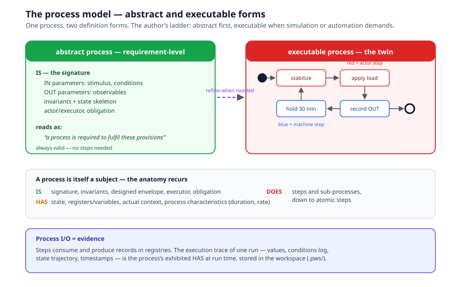
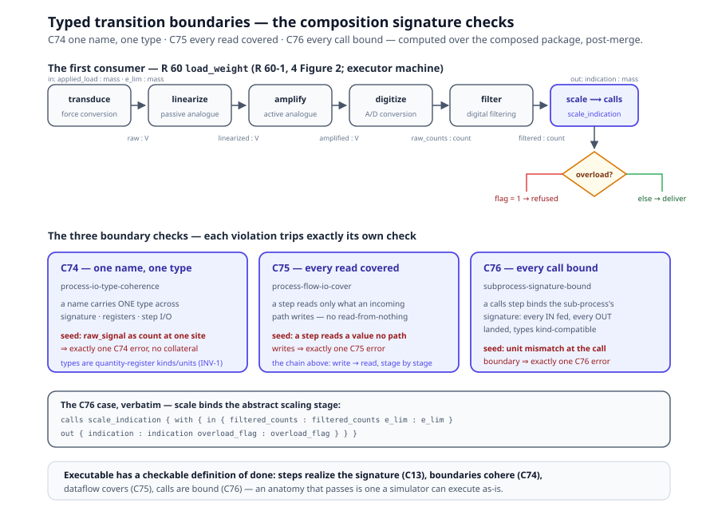

# Chapter 4 — Processes

> *In this chapter:* the process model — the DOES of every subject.
> Abstract and executable forms, the classification facets
> (`activity_kind`, `segregation:`), the step vocabulary, executors,
> state, the typed transition boundaries that make an executable anatomy
> sound (C74–C76), and how process I/O becomes evidence.

---

## 4.1 A process is a subject

Chapter 2 established the recursion: a behavior is a Process, and a
Process answers the same three questions as any subject:

- **Process IS** — its signature (IN/OUT parameters), invariants,
  designed envelope, actor/executor, obligation.
- **Process HAS** — its current state, registers/variables, actual
  context, and *process characteristics* (duration, rate, drift of the
  process itself).
- **Process DOES** — its steps and sub-processes, bottoming out in
  **atomic steps**: a register write, a stimulus application, a wait.

The recursion is what keeps the language small: there is no separate
"step metamodel". A step that needs detail is refined into a sub-process
with its own anatomy; a step that doesn't stays atomic.

## 4.2 Two definition forms — the author's ladder



Every process is authored in one of two forms:

- **Abstract process** — the signature plus invariants, nothing more.
  It says *what* the process is and what must hold, not how it proceeds.
  In a **reference model**, an abstract process reads as *"a process is
  required to fulfil these provisions"* — it is requirement-level.
  **An abstract process is always valid.** Most processes in a standard
  need no more.
- **Executable process** — the signature plus concrete steps,
  transitions, and register operations: the executable digital twin of
  how the process actually proceeds. Required when the process must be
  simulated (R 91's traffic-simulator tests), automated (workflow
  dispatch), or state-gated (warm-up enforcement).

The ladder rule: **author abstract; refine to executable only when
simulation or automation demands it.** Executable steps are additive —
an abstract process refined later is an extension, not a modification
(OCP). The two forms live *within one model*; do not confuse this form
axis with the model-kind axis of chapter 5 (reference vs implementation
— related by mapping, never by refinement).

## 4.3 The classification facets: `activity_kind` and `segregation:`

Two optional facets enrich an abstract process beyond its signature.
Both are **classification, never inheritance**: the process holds a
*reference* into a register (or to its sibling processes), checked at
link time, silent when the register is not in scope.

**`activity_kind: [<kind-id>, …]` — what kind of activity is this?**
Conformity-assessment vocabularies (ISO/IEC 17000:2020's functional
approach is the canonical case) classify every activity under functions
like selection, determination, review, decision, attestation. When such
a vocabulary is modelled as an *activity-archetype register* (chapter 8
— a package of classifiable kinds, each clause-anchored), an abstract
process may tag itself with one or more kind ids. Multi-kind is
deliberate: the vocabulary itself defines composite kinds (ISO/IEC
17065 3.3's *evaluation* = selection + determination), and forcing a
single tag would falsify it. The register records a kind's `parent`
only where the source standard states a type-of relationship — a
grouping title is not a taxonomy. Resolution: every tag must resolve
against a register composed into the same tree (linker-checked; an
unknown kind is an error); with no register in scope the facet is
inert documentation. Volume IV, chapter 2 shows the OIML-CS process
model tagged end to end — `application` as `[selection]`, `testing` as
`[testing]`, `issue` as `[certification]`.

**`segregation: [{ id, kind, clause, pair?, … }]` — whose hands must
stay off this case?** Certification standards carry non-involvement
norms: the reviewer shall not have been involved in the evaluation
(ISO/IEC 17065 7.5.1), nor the decider (7.6.2); complaint resolution
shall be independent of the case (7.13.5); consultancy creates a barred
relation, temporal where the standard fixes a period (7.13.6). These
are **cross-process relations over personnel sets, relative to one
case** — and they are first-class structured declarations, not
`invariants:` strings, for three disqualifying reasons: invariant
strings are never parsed by the toolchain (a rule that cannot fail is
not a rule); the constraint quantifies over several processes'
personnel, not one process's own signature records; and the members
cannot be *roles* — a scheme may legitimately bind one role to
evaluation, review and decision (the OIML-CS binds `issuing_authority`
to all three), so the norms quantify over process *involvement*. Pair
members are therefore **abstract-process ids**; the reserved token
`case_personnel` names the case-relative personnel set. Two kinds cover
the shapes: `case_personnel_disjoint` (exactly two distinct pair
members) and `consultancy_bar` (barred relations, `period` only where
the standard fixes one). Declaration well-formedness is linker-checked;
per-assignment enforcement is the runtime's (Volume IV, chapter 5).

**`source { doc "…" clause "…" }` — which clause demands this process?**
A third facet sits beside the classification pair, provenance rather than
classification (● primmel-ts 490bacc): the same `source` shape
requirement, table and calculation carry (chapter 9), now on processes.
One block names a doc + clause (plus an optional fragment); repeated
blocks collect into `sourceRefs`, with the scalar `source` keeping the
first entry (first-wins), so single-source processes read unchanged.
A process of a reference model can thereby answer "R 60-2, 2.10.1" the
way a requirement answers "R 60-1, 5.2" — clause-URN provenance for the
DOES, not just the IS.

## 4.4 The step vocabulary

Eight step kinds cover the standard's process content:

| Step kind | Meaning | Executor |
|---|---|---|
| **action** | do work: apply, record, compute, notify | machine or actor |
| **approval** | a role signs off; binds an approver role + an approval registry | actor |
| **gateway** | conditional branch; conditions on outgoing edges, in OCL | machine |
| **parallel gateway** | unordered conjunction — all branches required, no order | machine |
| **start event** | the one entry point of a process | — |
| **end event** | terminates a path; *required* on an empty gateway path to say "no requirement here" | — |
| **timer event** | a period or deadline; with a self-loop = recurrence (re-verification every N months) | machine |
| **signal event** | an external trigger starts/resumes the process | — |

Connection semantics, three rules only:

1. **Serial** — `A → B`: do A, then B.
2. **Parallel** — two unconditioned paths: both, in any order.
3. **Self-loop + timer** — repeat with a period.

Gateway semantics: if edges carry OCL conditions, the satisfied path is
taken (first match in document order; an explicit default edge catches
the rest). If no edge is conditioned, the gateway is fulfilled when *any*
outgoing path is fulfilled (the "implement at least one option" reading).

## 4.5 Executors

Every step declares its **executor** as an IS-level property:

- **machine** — the engine runs it: OCL evaluation, gateway resolution,
  calculations, applicability expansion, state transitions, verdict
  re-execution.
- **actor** — a role performs it: the lab technician applies the load,
  the IA reviewer signs. Actor steps are *recorded*, not run: their
  outputs are captured through forms into evidence.

Executor typing is what makes "an executable suite of workflow programs"
precise rather than rhetorical: the engine executes machine steps
directly, drives actor steps by presenting their input forms, and treats
the process as blocked until the actor's record lands in the registry.

## 4.6 State and registers

A process's HAS is where its memory lives:

- **state** — the process's state machine: named states and guarded
  transitions. Instrument-side example: `off → warming → ready →
  measuring → fault`. Workflow-side example: `draft → submitted →
  under_review → dispatched → …`. Transitions are fired by steps and by
  cascades (a transition in one machine may set states in another, with
  `where` guards and `create` effects).
- **registers** — typed variables the process reads and writes:
  measurement variables with source typing (chapter 6). A step's I/O is
  declared in terms of registers. A register may also declare an
  **initial value** — its starting content, set at definition (●
  primmel-ts 490bacc; proof: the kernel's `process-register-initials`
  suite):

  ```prl
  registers { capacity : mass = 50 kg   remark : string = "unloaded" }
  ```

  The literal contract is the instance-value contract of chapter 6: one
  value token plus an optional unit (quote multi-word values, so the
  unit position stays unambiguous), or the `{ value … unit … }`
  QuantityValue block form for the full structure. Initials are a
  registers facet *only* — signature parameters and call bindings take
  their values at the call, and an `=` there is a hard parse error, not
  a silently mis-parsed parameter.
- **context** — the actual conditions under which the process executes,
  logged per run.

Preconditions are OCL guards on entry: a violated run-validity
precondition voids the run *as a run* (its verdicts become `invalid`,
never `fail`) — the state gate that keeps an unwarmed instrument from
producing misleading evidence.

## 4.7 Composition signature checks — typed transition boundaries (task 38) ●

An executable process composes steps over typed registers: one step
writes, the next reads, a `calls` step binds a sub-process's signature.
That composition is sound only if every **transition boundary**
type-checks — and "sound" is a computed fact, not a review opinion.
Three kernel checks (● primmel-ts, TODO.roadmap/38; chapter 11's
C-catalog) police the boundaries over the composed package post-merge:



- **C74 process-io-type-coherence — one name, one type.** A name
  declared at several sites (signature parameters, registers, step I/O)
  carries ONE type across all of them; `raw_signal : voltage` in the
  registers and `raw_signal : count` at a step boundary is an
  incoherent declaration, not a style deviation.
- **C75 process-flow-io-cover — every read has a writer.** The
  step-chain dataflow covers every read: a step may read only what some
  incoming path writes. A read with no upstream producer is a gap in
  the chain — the step would execute against nothing.
- **C76 subprocess-signature-bound — every call bound.** A `calls`
  step binds the sub-process's signature **completely** and
  **kind-compatibly** (`with { in … out … }`): every IN parameter fed,
  every OUT parameter landed, and the bound types compatible — a
  unit mismatch at the call boundary is an error at the boundary, not a
  surprise inside the callee.

The checks are **surgical**: each seeded boundary violation (one name
with two kind-incompatible declaration sites; a read no path writes; a
unit-mismatched call binding) trips exactly its own check with no
collateral findings — pinned in `prl-check-all.test.ts` over the
shipped packages.

**The first real consumer is R 60's `load_weight`** (task 50 — the
executable anatomy of the behavior with the same id, R30's id-equality
link). The instrument's own signal chain, calibrated against R 60-1, 4
Figure 2: `transduce → linearize → amplify → digitize → filter →
scale`, then the `overload_check` gateway against `e_lim` (R 60-1,
3.5.16) — `executor machine` throughout: the instrument runs its own
measurement, the first machine-executed process in the packages
(distinct from the actor-typed workflow processes of chapter 8 in
Volume II). Its signature (`in { applied_load : mass, e_lim : mass }`,
`out { indication, last_indication : mass, load_count : count }`),
registers with honest initials (`raw_signal : voltage = 0 V` — the
ENGINEERING-DEFAULT pattern where the Recommendation gives no value),
and the `scale` step's `calls scale_indication { with { in {
filtered_counts … } out { indication … overload_flag … } } }` binding
the abstract, signature-only scaling stage — C76's live case. Type
tokens come from the package's quantity register (mass / voltage /
count / dimensionless), so INV-1 holds across the chain: no bare
numbers at any boundary.

The authoring consequence: refining an abstract process to executable
(§4.2) now has a *checkable* definition of done — the steps realize the
signature (C13), the boundaries cohere (C74), the dataflow covers
(C75), and every call is bound (C76). An anatomy that passes is one a
simulator can execute as-is (the platform annex's simulated instruments
interpret exactly this anatomy).

## 4.8 Process I/O = evidence

Steps consume and produce **records in registries** (chapter 6): a test
step reads the subject's parameters, enforces conditions, and writes
measurements; a workflow step reads an application and writes a dispatch.

The **execution trace** of one run — the filled registers, the
conditions log, the state trajectory, timestamps, the operator — is the
process's exhibited HAS at run time. That trace is exactly what the
Evidence model stores, and it lives in the workspace (`.pws/`): one
record per filled slot, typed by the process output it satisfies. Facts
only: no verdicts in a trace (the firewall, chapter 1).

## 4.9 Repetition and instances

Two parameterizations keep one process definition serving many runs:

- **per-classification instances** — the process declares instance
  parameters keyed by a subject dimension (R 60: `n_runs` = 5 for
  accuracy classes A/B, 3 for C/D). The applicability engine expands the
  concrete run plan per subject at execution time.
- **timer-driven recurrence** — the process re-fires on a period
  (initial verification, then re-verification at legislated intervals;
  a tyre change on an ego meter re-triggers out of cycle via a signal
  event).

**The continuous limit case: the monitor ○.** Recurrence taken to its
limit is a process that never ends: the **monitor** — triggered by
schedule, signal, or a watched value's change, looping fetch → freshness
→ evaluate → verdict → evidence (the loop is chapter 14, §14.5).
Monitors evaluate against *served* instances, and the same endpoint
machinery makes a subject's own processes remotely callable: an `invoke`
operation triggers a behavior over the wire (chapter 14, §14.4).

## 4.10 Processes across model kinds

The same process concept, three voices:

- in a **reference model**: "a process is required" (abstract form) —
  R 60-2's creep test method is a requirement for a process, specified
  to step level but still normative, not actual;
- in an **implementation model**: "this is how we actually do it"
  (usually executable) — the lab's SOP, the platform's dispatch
  workflow — mapped to the reference process (chapter 5);
- in the **workspace**: "this is what happened" — the execution traces.

## 4.11 Grammar sketch *(illustrative v3 syntax)*

```prl
process creep_test {
  is {
    signature {
      in  applied_load : mass, duration : time
      out indication_series : mass[]
    }
    preconditions { ocl{ self.state = #ready and self.warmed_up } }
    executor lab
    activity_kind [testing]              # classification, not inheritance
    source { doc "urn:oiml:pub:r:60-2:2021" clause "2.10.1" }
  }
  has {
    registers { applied_load : mass = 50 kg   stabilized : string = "pending" }
  }
  does {
    start_event s
    action stabilize   { executor actor  write conditions_log }
    action apply_load  { executor actor  set applied_load }
    action hold        { executor machine wait duration }
    action record      { executor machine capture indication_series }
    end_event e
    flow { s -> stabilize -> apply_load -> hold -> record -> e }
  }
}

process review {
  is { activity_kind [review] }
  segregation [{
    kind case_personnel_disjoint         # cross-process, per case,
    pair [review, evaluation]            # members are process ids
    clause "iso-iec-17065:7.5.1"         # — never roles, never prose
  }]
}
```

## 4.12 Validation rules

- exactly one start event per process; end events on every terminal path
  (mandatory on empty gateway branches);
- every gateway edge's condition is OCL over declared registers;
- every step's I/O names declared registers; every register is written
  by exactly one step kind (no competing writers);
- every precondition is an OCL Boolean over signature and state;
- an executable process's steps realize its own signature (the OUT
  parameters are written; the IN parameters are read);
- the transition boundaries compose: one name carries one type across
  signature/register/step-I/O sites (C74), every step read is covered by
  an upstream write (C75), and every `calls` binding is complete and
  kind-compatible (C76);
- a timer event's period is a time primitive; a self-loop contains a
  timer (no unguarded infinite loops);
- every `activity_kind` id resolves against an activity-archetype
  register composed into the same tree (silent when none is in scope);
- every `segregation:` entry is well-formed: a known kind, exactly two
  distinct pair members for `case_personnel_disjoint`, pair members
  resolving to abstract-process ids, `period` only where the source
  standard fixes one;
- an initial value appears only on a register, in the literal contract
  (one value token + optional unit, or the `{…}` QuantityValue block) —
  an `=` in a signature parameter or call binding is a parse error;
- every `source` block names doc + clause; repeated blocks collect into
  `sourceRefs`, the scalar `source` holding the first.

## 4.13 Summary

- A process is a subject: IS the signature, HAS the state and registers,
  DOES the steps.
- Abstract is always valid; executable is added when simulation or
  automation demands it.
- `activity_kind` classifies a process against a register (multi-kind
  deliberate); `segregation:` declares cross-process non-involvement
  over personnel sets — both classification, never inheritance; `source`
  carries requirement-shape clause provenance.
- Eight step kinds, three connection rules, two executor kinds.
- The composition signature checks (● task 38) make an executable
  anatomy's soundness computed: C74 one-name-one-type, C75
  every-read-covered, C76 every-call-bound — the R 60 `load_weight`
  signal chain is their first consumer.
- Registers may declare initial values — a registers-only literal
  contract; signature parameters and call bindings reject `=` outright.
- Preconditions void runs, never instruments; traces are facts, never
  verdicts.
- Per-classification instances and timer recurrence let one definition
  serve every run.

*Next: [Chapter 5 — Mappings](05-mappings.md): reference and
implementation models, and the coverage calculus.*
