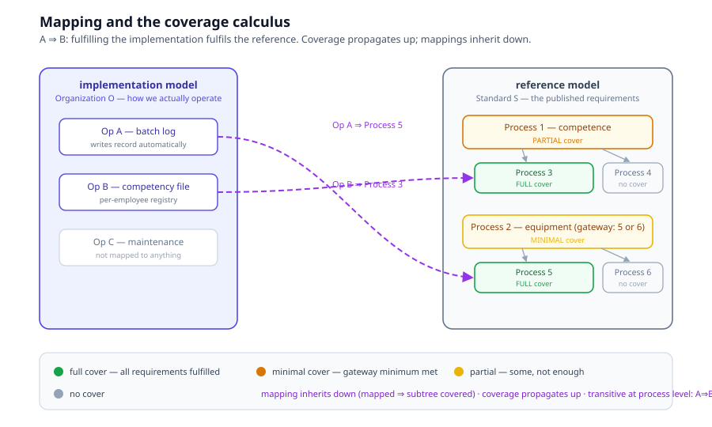

# Chapter 5 — Mappings

> *In this chapter:* the two model kinds (reference and implementation),
> the mapping relation between them, and the coverage calculus that
> turns "are we compliant?" into graph computation.

---

## 5.1 Who speaks?

Chapter 1 introduced the model kinds; this chapter makes them precise.

A **reference model** speaks for the standard: its processes read as
"a process is required", its provisions are the normative statements,
its registries are the evidence the standard demands. A reference model
is *faithful* (reviewed by professionals), *machine-applicable*,
*machine-readable*, *transferable*.

An **implementation model** speaks for an organization: its processes
are the organization's actual operations — a digital twin of reality.
It is not a "special case" of the reference model. It is a different
model, of a different thing (the organization, not the standard),
authored by different people, evolving on a different clock.

Because the two models are different things, their relation cannot be
inheritance or refinement. It is **mapping**.

## 5.2 The mapping relation

A mapping links one implementation-model component to one
reference-model component with implication semantics:

> **A ⇒ B — fulfilling A fulfils B.**

Two properties to internalize:

- **Not equivalence.** A ⇒ B does not give you B ⇒ A. The implementation
  may be stricter than the standard requires (an inventory list fulfils
  "equipment maintenance", but maintenance is achievable without one).
- **Not refinement.** A mapping crosses models; nothing is inherited.
  The implementation process keeps its own anatomy; the mapping is a
  *claim about* it, with:
  - **description** — how the fulfillment works;
  - **justification** — why the claim holds (optional per pair, demanded
    by auditors).

Mappings attach at process granularity by default, but any typed
component can be mapped: a registry to a required-evidence registry,
an approval step to a required approval, a measurement test to a
provision.

## 5.3 The coverage calculus



Coverage answers, per reference-model component: *how much of this is
fulfilled by mapped implementations?* Four levels:

| Level | Meaning |
|---|---|
| **full cover** | all requirements of the component are fulfilled |
| **minimal cover** | the gateway minimum is met (e.g. "at least one of these options"), but not all branches |
| **partial cover** | something is mapped, not enough to claim the minimum |
| **no cover** | nothing mapped |

Three propagation rules make coverage a computation, not an opinion:

1. **Inheritance (downward).** A mapped process covers its entire
   subprocess tree: mapping to the parent is a claim that the whole
   subtree is fulfilled.
2. **Aggregation (upward).** A parent is covered when its children are:
   all children full ⇒ parent full; gateway children with the minimum
   met ⇒ parent minimal; otherwise partial or none.
3. **Transitivity (process level).** A ⇒ B and B ⇒ C ⊢ A ⇒ C. At *model*
   level transitivity does not hold in general (two mappings with no
   common component carry no logical information).

A fourth rule, **closure** — all children mapped ⇒ parent covered
*without* a direct mapping — is the standard discovery heuristic and is
computed by tooling, flagged for confirmation rather than asserted.

## 5.4 Discovery

Given existing mappings, the engine proposes new ones by transitivity
and inheritance (the "auto-mapper"): seed the obvious pairs, then let
the calculus enumerate candidates across a repository of models, and
have a human confirm with justification. Discovery scales the audit
question — *which organizations have mapped to clause 4.4, and which
haven't?* — from a document chase to a query.

## 5.5 Serialization

Two equivalent forms; pick per maintenance style:

**In-model** (`map_profile` in the `.prl` file):

```prl
map_profile ToStandardS {
  mapping { from OpA to StdS#Process5 }
  mapping { from OpB to StdS#Process3 }
}
```

**Standalone** `.prm` file (JSON) — richer per-pair metadata, versioned
independently of the models:

```json
{
  "@type": "Primmel_MAP",
  "id": "OrgO-to-StandardS",
  "mapSet": {
    "StdS": {
      "id": "StdS",
      "mappings": {
        "OpA": { "StdS#Process5": {
          "description": "Automatic batch logging fulfils the record requirement.",
          "justification": "The roaster writes the batch record on batch completion."
        } }
      }
    }
  }
}
```

Cross-model references use the **`Namespace#ElementID`** aliasing
pattern: the implementation model declares local copies of the reference
elements it maps to (e.g. `StdS#Process5`), and provisions/references
resolve to the same clause in the source `.prd` extract.

## 5.6 Why the OIML-CS case matters

The running OIML SMART system already contains the pattern, unnamed:
the platform's certification workflow (`evaluation/`) is an
implementation model of the OIML-CS process (PD-05), and the PD-05
clause references in its approvals are embryonic mappings. Naming it
gives the ecosystem a plan:

- **PD-05 published as its own reference package** (the certification
  scheme's requirements);
- **the platform workflow re-homed as an implementation package**,
  mapped to PD-05 — its coverage calculus then answers "how much of
  PD-05 does this platform fulfil?";
- **per-lab implementation models** of R 60-2 test methods — each lab's
  SOP mapped to the Recommendation's required methods, its coverage
  answering "is this lab's procedure a fulfilment of R 60-2?";

— all in one relation, one calculus, one audit view.

## 5.7 Validation rules

- both ends of a mapping resolve (implementation component and
  `Namespace#ElementID` reference element);
- no mapping from a reference component to an implementation component
  (direction is fixed);
- coverage claims are computed, not authored — an authored coverage
  assertion that disagrees with the calculus is an error;
- a mapping without description is a warning at audit strictness.

## 5.8 Summary

- Reference speaks for the standard; implementation speaks for the
  organization; workspace speaks for the evidence.
- Mapping is implication (A ⇒ B), with description and justification —
  never equivalence, never refinement.
- Coverage is a calculus: inherit down, aggregate up, transitive at
  process level, closure by discovery.
- One relation serves publishers, implementers, operators and auditors
  alike.

*Next: [Chapter 6 — Data and values](06-data-and-values.md): registries,
variables, quantities, tables and time.*
