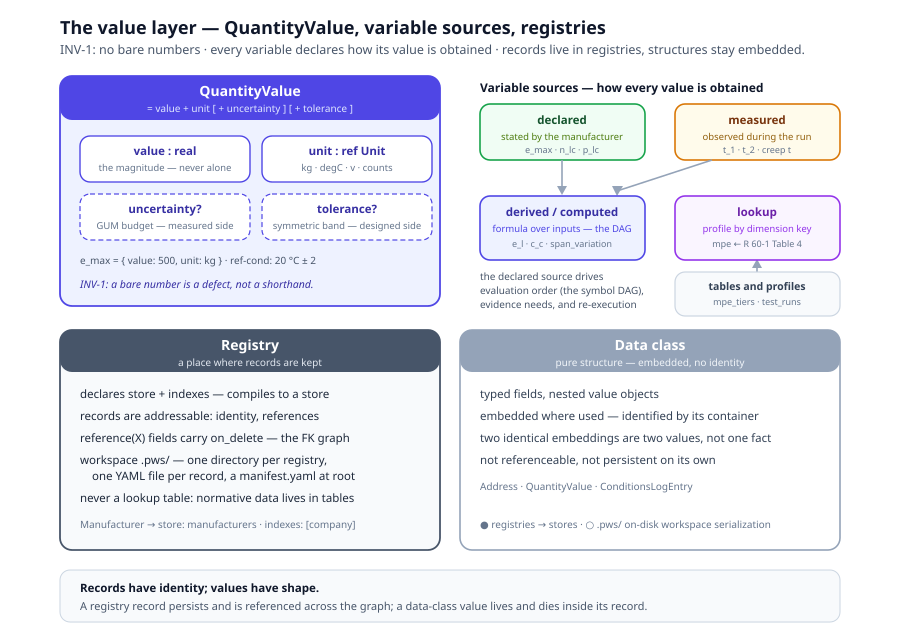

# Chapter 6, Data and values

> *In this chapter:* the value layer beneath every tier, where records
> live (registries) versus how values are shaped (data classes), the
> five ways a variable obtains its value, the QuantityValue contract
> that makes INV-1 enforceable, tables and dimension-keyed profiles,
> and the time primitives every lifecycle depends on.

---

The previous chapters modelled *things*: subjects, processes, mappings.
This chapter models *what they carry*, values: the 500 kg of `e_max`,
the 20 ± 2 °C of a reference condition, the 0.5 × p_LC of an MPE tier.
If values are untyped, un-homed, or baked into prose, everything built
on them, constraints, derivations, verdicts, inherits the rot. Every
value concept has one canonical definition point; every use references it.

## 6.1 Registries and data classes

Primmel separates two data constructs that untyped modellers conflate:

- A **data class** is a *pure structure*, a record shape with typed
  fields, nested value objects, no independent existence. An `Address`,
  a `ConditionsLogEntry`, a `QuantityValue`: embedded where used,
  meaningless apart from their container.
- A **registry** is *a place where records are kept*. It declares a
  record class, a store, and the indexes records are found by. A
  registry's records are addressable: they have identity, other records
  reference them, and they persist across sessions.

The running system encodes this directly. The entity classes of
`data/r60/entities/` declare their persistence inline:

```yaml
- name: Manufacturer
  store: manufacturers
  indexes: [company]
```

At build time each such class compiles to one IndexedDB store with the
declared indexes (`browser/build/data-types-codegen.ts` → the store
manifest). Classes may *share* a store behind a discriminator , 
`IssuingAuthority` and `TestLaboratory` extend `Organization` and live
together in the `organizations` store, indexed by `kind`. Records link
by typed references: a `reference(X)` field carries an `on_delete`
edge, the FK graph is declared on the class, not reconstructed.

The workspace is where registry records live on disk. A **`.pws/`
directory** (Primmel Workspace) holds one subdirectory per registry,
one YAML file per record, and a `manifest.yaml` pinning the model
version (○, the running system keeps records in IndexedDB; `.pws/`
is the v3 on-disk packaging). It is the third model kind of chapter 1:
it *speaks for the evidence*.

The discipline that falls out of the distinction:

- **Identity lives in registries only.** A data-class instance is
  identified by its containing record; two identical embeddings in two
  records are two values, not one shared fact.
- **References target registries only.** `reference(Manufacturer)`
  resolves into the `manufacturers` store; nothing references "an
  address somewhere inside some record".
- **A registry is never a lookup table.** Records are runtime facts;
  lookup data (MPE tiers, run counts) is model content and lives in
  tables (§6.5).

## 6.2 Measurement variables and their sources

Every quantity that flows through testing and evaluation is a declared
**variable**, and every variable states *how its value is obtained* , 
its **source**. The taxonomy is closed; five values cover every case:

| Source | The value comes from… | R 60 example |
|---|---|---|
| `declared` | a statement by the manufacturer or applicant, a rating, not an observation | `e_max`, `n_lc`, `p_lc` |
| `measured` | direct observation by the test operator during a run | `t_1`, `t_2` (test temperatures), creep-test `t` |
| `derived` | a formula over other variables, evaluated bottom-up | `e_l` = (avg indication − reference) / `conversion_factor_f` |
| `computed` | evaluated by the engine in the run's calculation context | `v_min` = (`e_max` − `e_min`) / (`n_lc` × `f`); `mpc` = `lookupMPE(d_max, accuracy_class, p_lc)` |
| `lookup` | a table or profile keyed by classification dimensions | `mpe` from the R 60-1 Table 4 tiers |

● The source taxonomy is live in both places variables are declared:
the symbol registry (`data/r60/specification/symbols.yaml`, four of
the five) and conformance-test variables (`data/schemas/cc.yaml`, all
five, with `derivation:` declared for `derived`/`computed`).

Source typing is not documentation; it drives the machinery:

- **Evaluation order.** Derived and computed variables form a
  dependency DAG (chapter 7): the engine evaluates
  `conversion_factor_f` before `e_l`; declared and measured values are
  the leaves.
- **Evidence requirements.** A `measured` variable demands a recorded
  observation; a `declared` one a subject-graph value
  (`model.parameters.e_max`, `sample.test_context.d_max`); a `lookup`
  one its table and key dimensions.
- **Re-execution.** Verdict re-evaluation (INV-5) replays derivations
  over stored leaves only, a source that cannot be replayed or
  re-read is a modelling error.

## 6.3 QuantityValue: the INV-1 contract

**INV-1: no bare numbers.** Every physical quantity in a Primmel model
is a `QuantityValue`:

```text
QuantityValue = value + unit [ + uncertainty ] [ + tolerance ]
```

- **value + unit** are inseparable. `500 kg` is a value; `500` is a
  defect. The attribute registry values parameters exclusively through
  QuantityValue maps, `model.parameters.e_max` is `{ value: 500,
  unit: kg }`, never a raw number.
- **tolerance** marks the symmetric band of a *specified* value, the
  designed side of the duality: the reference-condition entry
  `{ value: 20, unit: degC, tolerance: 2 }` of
  `data/r60/model/conditions.yaml`. Tolerance belongs to conditions
  and ratings, not to measurement results.
- **uncertainty** marks the dispersion of a *measured* value (§6.4) , 
  the observed side. The two never merge: a tolerance states what the
  design promises, an uncertainty what the measurement supports.

The **unit register** (● `data/r60/value-types.yaml`) is layered:
SI base (`kg`, `m`, `s`, `K`, `A`), SI derived (`N` = kg⋅m/s²),
non-SI accepted (`degC`, `min`, `g`, `t`, `kPa`, `%RH`), and **domain
units**, R 60's `v` (verification interval), `counts`,
`dimensionless`. A rec package extends the register by *adding*
domain units; it never redefines SI entries.

Above units sit **quantity kinds** (●
`data/schemas/quantity-kinds.yaml`): the closed registry mapping every
unit to its kind, `mass` (kg, g, t), `verification_interval` (v),
`temperature` (degC), `dimensionless`, `ratio` (%), and committed
domain kinds (`voltage-ratio` for mV/V, `volume-fraction` for ppm).
The kind, not the unit string, is what coherence checking compares:
`quantity-coherence` rejects a `verification_interval` observable
against a `mass` limit outright (the R 60 "F2" defect class), while a
dimensionless literal adopts the other side's kind. Units tell you how
to print; kinds tell you what may be compared.

## 6.4 Measurement uncertainty and traceability

A measured QuantityValue may carry a **MeasurementUncertainty** budget,
GUM-shaped: Type A components (statistical analysis of repeated
observations), Type B components (other means, certificates,
specifications), combined into a standard uncertainty with its
coverage factor (◐, the form layer declares uncertainty budgets on
equipment and measurement fields, e.g. the weights form at `k = 2`).

Uncertainty is data, not prose, because it participates in validity:

- **Reference-equipment budgets** are ceilings a run must respect.
  R 91-2 (4.5, 5.2) caps the reference speedometer's expanded
  uncertainty at 0.6 km/h below 100 km/h and 0.6 % above, piecewise
  tiers with exactly the MPE-tier shape, encoded as tier-mode profiles
  (`{ min, max?, factor, mode: absolute|relative }`) and evaluated
  through the same lookup machinery (`engine-context.ts`
  `uncertaintyBudgetAt`). ●
- **Certified reference materials** (R 144's certified gas mixtures)
  carry certified value + uncertainty; constraints bound to the
  evidence (`U:MPE ≤ 1:3`) are machine-checked before the limit, and a
  violation invalidates the run. ● (`specification/reference-materials.yaml`)

Uncertainty links every measured value to its **traceability chain**:
the unbroken sequence of calibrations from the working instrument up
to a reference standard, the weights' OIML R 111 class, the CGM's
certificate. The chain is modelled as records, each carrying its
validity window (§6.6), so "traceable" is a queryable graph property
(◐, equipment and calibration records are modelled; the chain as a
first-class vocabulary class lands with the core measurement module,
Volume II).

## 6.5 Tables and profiles

Normative lookup data, R 60-1 Table 4's MPE tiers, the per-class run
counts, the IEC 61000-4 EMC severities, is **modelled as data, never
baked into OCL**. Two complementary shapes live in
`data/r60/specification/tables.yaml`:

- A **table** is a class schema plus rows: typed, named columns with
  units, and row data. `mpe_tiers` declares columns
  `accuracy_class | load_min (v) | load_max (v) | limit_factor` and
  twelve rows; `test_runs` four. A table answers "the row where …".
- A **profile** is a dimension-keyed binding: `profiles.mpe_tiers` has
  `dimension: accuracy_class`, `unit: v`, and a `binding:` mapping
  each dimension value to its tier list, `C: [{min: 0, max: 500,
  factor: 0.5}, …, {min: 2000, factor: 1.5}]`. A profile answers "for
  this classification, the bound value is …".

Lookup semantics are defined, not conventional: the first tier with
`min ≤ load < max` wins (missing `max` unbounded), and the MPE value
is `factor × p_lc`. The same mechanism instantiates per-class
repetition, R 60's `test_runs` profile is why class A/B cells get 5
load applications and C/D 3.

The anchoring rule applies to numbers inside expressions (§1.4):
typing `0.5 * p_lc` into a requirement limit is the tell, the 0.5 is
a table cell, and the requirement must *reference* the lookup
(`lookupMPE(load, accuracy_class, p_lc)`), so a corrected row
re-judges every dependent verdict without an expression edit.
Chapter 7 returns to the lookup functions.

## 6.6 Time primitives

Time is Foundations-layer content: nothing in the subject anchors it,
everything references it. Three primitive value types (●
`value-types.yaml`: `date`, `datetime`, `duration`) plus the
structures built on them:

- **Periods**, an interval with start and end; the process
  vocabulary's timer events (chapter 4) fire on durations and
  deadlines (◐, recurrence for re-verification cycles is planned).
- **Validity windows**, the period for which a record holds:
  certificates, calibration records, accreditations. "Currently valid"
  is a computed predicate, not a status flag that drifts (◐).
- **Edition pinning**, every definition executed in a run is
  version-pinned in the test report (● INV-8), so a later edition
  re-judges history explicitly instead of silently. Chapter 8 treats
  editions as lifecycle; chapter 13 the diff machinery.
- **Served values and freshness windows**, a live twin serves its HAS
  values *with timestamps*: a value without a time is not evidence, and
  every `serve` binding declares its `fresh_within` window, how old a
  value may be before it stops meaning anything. Past the window the
  value is stale, and stale degrades the verdict to `indeterminate`,
  never a silent pass (○, the monitor's freshness step, chapter 14,
  §14.5).



## 6.7 Grammar sketch *(illustrative v3 syntax)*

```prl
# ── a registry: a place where records are kept ──────────────
registry Manufacturer {
  store   manufacturers
  indexes [company]
  fields {
    id       : string            shall
    company  : string            shall
    address  : reference(Address) shall on_delete restrict
    created  : datetime          shall
  }
}

# ── a data class: pure structure, embedded ──────────────────
data_class QuantityValue {
  value       : real
  unit        : ref Unit
  uncertainty : MeasurementUncertainty?   # GUM budget, measured side
  tolerance   : real?                     # symmetric band, specified side
}

# ── measurement variables with source typing ────────────────
variable e_l {
  notation "E_L"   unit v   kind observable
  source derived
  derive { inputs [conversion_factor_f]
           ocl{ (avg_indication - reference_indication) / conversion_factor_f } }
}
variable mpe { notation "MPE"  unit v  source lookup  calculation mpe }

# ── a table and its dimension-keyed profile ─────────────────
table mpe_tiers {
  columns { accuracy_class : string
            load_min : number unit v
            load_max : number unit v
            limit_factor : number }
  rows [ ["C", 0, 500, 0.5], ["C", 500, 2000, 1.0], ["C", 2000, null, 1.5] ]
}
profile mpe_tiers {
  dimension accuracy_class   unit v
  binding { C: tiers(mpe_tiers, "C") }
}
```

## 6.8 Validation rules

- every stored class declares its `store`; shared stores declare the
  discriminator; `reference(X)` targets a registered class (●);
- every QuantityValue carries `value` + `unit`; the unit resolves in
  the unit register, a bare number is an INV-1 error, not a coercion;
- every unit maps to exactly one quantity kind; comparisons are
  kind-coherent (`quantity-coherence`, ●); unmapped units are
  warnings; extending the kind registry is a metamodel decision;
- a `derived`/`computed` variable declares its derivation; a `lookup`
  variable declares its table and key dimensions (◐, links resolved);
- profile bindings key only on declared dimension values; a binding
  key outside its `dimension`'s values is an error (●);
- time values match their ISO 8601 patterns; a validity window's end
  is not before its start.

## 6.9 Summary

- A registry is a place where records are kept (store + indexes,
  referenceable); a data class is pure structure, identified by its
  container. The workspace `.pws/` is registries on disk.
- Every variable declares its source, declared, measured, derived,
  computed, lookup, and the source drives evaluation order, evidence
  requirements, and re-execution.
- INV-1: no bare numbers. QuantityValue = value + unit, plus tolerance
  on the designed side and GUM uncertainty on the measured side.
- Normative numbers live in tables and dimension-keyed profiles;
  expressions reference lookups, never restate constants.
- Time is first-class: date/datetime/duration, periods, validity
  windows, and edition pinning (INV-8).

*Next: [Chapter 7, Expressions](07-expressions.md): OCL as the one
rule language, stereotypes, binding, and the table functions.*
