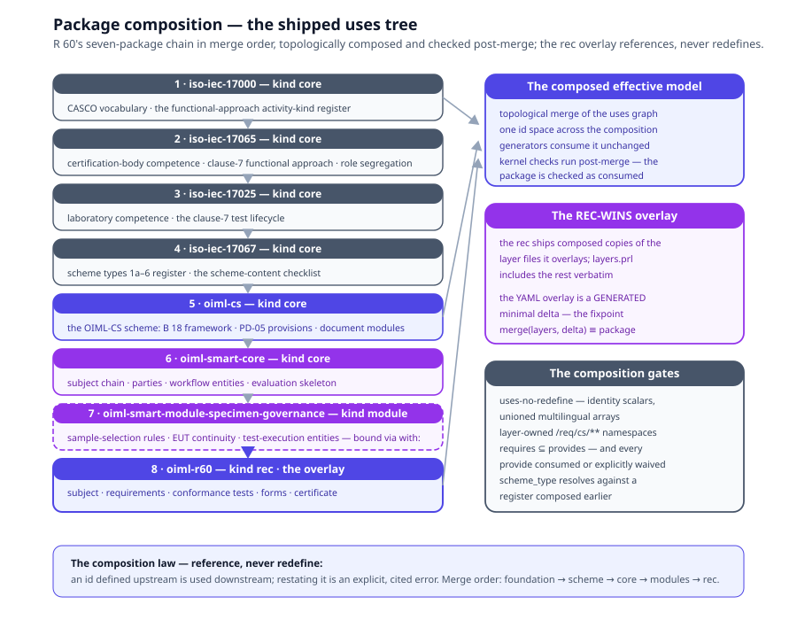

# Chapter 8 — Packages

> *In this chapter:* how models are published, composed, and versioned —
> the package manifest, the directory convention, `uses` composition
> across packages, the layering rules that keep overlays honest,
> modules, editions, and the native ⇔ YAML round-trip.

---

Chapters 1–7 modelled content. This chapter models *containment*: how
a body of content becomes a distributable, composable, versioned unit —
where a model begins and ends, how one model builds on another without
copying it, how two editions coexist. The running system's answer is
on disk: `primmel-packages/oiml-r60/` is the full R 60 Recommendation
as `.prl` files, and it runs the application end to end (●).

## 8.1 The manifest

A package is a directory whose root carries `package.primmel` — the
only required file; everything else is merged by convention. The
manifest of the shipped R 60 package
(`primmel-packages/oiml-r60/package.primmel`), verbatim:

```prl
package {
  id oiml-r60
  kind rec
  title "OIML R 60:2021 — R 60 package"
  version "2021"
  editions { 2021 2017 2000 1996 }
  baseUrn "urn:oiml:pub:r:60:2021"
  uses { iso-iec-17000 iso-iec-17065 iso-iec-17025 iso-iec-17067 oiml-cs oiml-smart-core oiml-smart-module-specimen-governance }
  requires { core subject-chain-entities party-entities workflow-entities evaluation-skeleton iso-iec-17000 ca-terminology-17000 iso-iec-17025 lab-requirements-17025 ca-terminology-17025 iso-iec-17065 cb-requirements-17065 ca-terminology-17065 iso-iec-17067 scheme-content-requirements-17067 ca-terminology-17067 oiml-cs cs-process-requirements cs-certificate-requirements sample-selection-rules eut-continuity-contract test-execution-entities }
  supersedes { urn:oiml:pub:r:60:2017 }
  validity { from 2021-01-01 }
  status current
  description "Metrological regulation for load cells — requirements, test procedures, and test report forms."
  source { collection "sources/r060/collection.yml" parts { 1 2 3 } }
}
```

The fields, each doing one job:

- **id** — the package's name in the global id-space; all cross-package
  references (`Namespace#ElementID`) key on it.
- **kind** — the package's place in the layer stack: `core` (a shared
  layer), `module` (a parameterized skeleton family), `rec` (a
  Recommendation), or `product_reference` (a manufacturer's product
  model — chapter 15). §8.4 develops the stack.
- **title / description** — the human face; multilingual in v3
  (chapter 10).
- **version** — the package's own version, the coordinate edition
  pinning (INV-8) records against.
- **editions** — the document editions this package's lifecycle covers
  (§8.5).
- **baseUrn** — the provenance root: clause URNs
  (`urn:oiml:pub:r:60-1:2021#clause-5.2`) resolve against it (chapter 9).
- **uses** — the composition declaration: the packages this package
  builds on, in merge order. §8.3 is its semantics.
- **requires** — the capability tokens the composition must supply:
  each names a `provides` token of an upstream package, so a
  half-composed package fails loudly instead of silently missing its
  foundations.
- **supersedes / validity / status** — the lifecycle facets: which
  document edition this package replaces, the window it is valid in,
  and where it stands (`current`, `preview`, `superseded`,
  `withdrawn`). §8.5 develops the lifecycle.
- **source** — the authoritative document collection the package models,
  down to its parts; the anchor for the text-coverage and
  reconstruction audits (chapters 9, 11).

The v2 manifest's single-string `extends oiml-core` is retired — §8.3
shows what replaced it and why.

## 8.2 The directory convention

Inside the package, content is split by layer — the same five-layer
split the YAML tree uses (`data/r60/`), so the round-trip is
structurally obvious. The shipped R 60 package:

```text
oiml-r60/
  package.primmel          # the manifest — the only required file
  model/                   # the subject: instrument, attributes, capabilities,
                           # behaviors, conditions, state, twin  (primary tier)
  entities/                # storable classes: subject chain, parties, workflow
                           # (registries: store/indexes/FK graph)
  specification/           # requirements, conformance, constraints, tables,
                           # symbols, calculations, formulas  (secondary tier)
  execution/               # forms, subforms, test-report skeleton (evidence views)
  evaluation/              # workflow, processes, state machines, gateways,
                           # certificate, selection (tertiary tier)
  terminology.prl          # terms with vocab_ref into the registers
  references.prl           # document references
  value-types.prl          # the value-type register (SI units)
  layers.prl               # GENERATED include list — layer files consumed
                           # verbatim (§8.3); do not edit
  payload/                 # codec exclusions shipped inside the package
                           # (pair_list blocks, formula engine variants, …)
  sources-prd/             # .prd extracts + coverage/congruence payloads (ch. 9)
```

Directory names are fixed; file names within them are free; the loader
merges all files into one effective model. References cross files **by
stable id only** — `/req/metrological/mpe`, `load-cell-errors`,
`e_max`, `Manufacturer` — never by path. One id space per package: the
same identifier defined twice anywhere is a duplicate-id error at load
(● W2 loader, cross-file duplicate detection). An author reorganizes
files freely; nothing that referenced the content can tell.

The convention is the tier system made visible on disk: `model/`
primary, `specification/` secondary, `evaluation/` tertiary,
`entities/` the registries. A new Recommendation adds a package
directory and changes zero existing files (OCP).

## 8.3 Composition: `uses`

No Recommendation stands alone. R 60 needs the metamodel's subject
chain, the OIML-CS workflow skeletons, the EMC test family, the IEC
60068 methods. The v2 manifest expressed this with a single-string
`extends: oiml-core` — and that is precisely where v2 ran out:

- **Single inheritance cannot express the real shape.** A rec package
  is *foundation + scheme + core + N modules*, not *one parent*. The v2
  tree made the gap visible: recs declared `extends oiml-core` while no
  such package existed — the reference dangled. The shipped tree closed
  it: `oiml-smart-core` is a real package (● smart e80b349, tasks
  13–17), and every rec composes it through `uses`.
- **Copy-residue is the failure mode composition must kill.** The
  cross-standard census found 12 R 91 files byte-identical to R 60 and
  8 R 144 structurally identical — including copies *wrong* for the
  copying rec (R 91 shipping R 60's gateways and certificate
  template). Between "copy" and "restate from scratch" there was no
  mechanism. `uses` is that mechanism.

v3 composition is **shipped** (● — smart e80b349 for the layers,
424a46a for the v3-native recs, a549dab for the SSOT flip). The R 60
manifest's composition line, verbatim:

```prl
uses { iso-iec-17000 iso-iec-17065 iso-iec-17025 iso-iec-17067 oiml-cs oiml-smart-core oiml-smart-module-specimen-governance }
```

Seven upstream packages, in merge order: the CASCO vocabulary, the
certification-body and laboratory competence models, the scheme
taxonomy, the OIML-CS scheme package, the SMART core, and the
specimen-governance module. The semantics:

- **Topological merge.** Dependencies order themselves — the
  foundation packages, then the scheme, then core, then modules, then
  the rec overlay — and the effective model is the merge, fed to the
  generators unchanged. primmel-ts composes the `uses` graph
  topologically with no-redefine semantics (the kernel's package
  resolver); the kernel's post-merge checks (C74–C76 among them,
  chapter 4) run over the composed package, so a module's skeleton is
  checked *as consumed*, not as authored.
- **An overlay may reference, never redefine.** Any id defined
  upstream is *used* downstream, and redefining it is an error —
  enforced twice over: the standards registry's uses-no-redefine leg
  fails the build when a rec overlay restates a layer's identity
  scalar or unions an owned multilingual array, and the layer-owned
  requirement namespaces (`/req/cs/**` and its per-document
  sub-namespaces) are pinned so a rec cannot even *declare* scope
  there. Conflict detection moved from "silent skip + build warning"
  (the v2 codegen heuristic, which sorted R 60 first so its shapes
  won) to explicit, cited errors.
- **The app build rides a generated include transport.** Post-SSOT-flip,
  a rec package ships composed copies of the layer files it overlays
  and consumes the rest verbatim through `layers.prl` `include`
  directives (generated, never edited); the YAML-side overlay files
  are themselves generated as the *minimal delta* over the layers-only
  composition, with the fixpoint `merge(layers, delta) ≡ package
  content` asserted per file. Composition is proven
  semantics-preserving by the layering snapshot tests, and the REC-WINS
  merge keeps the rec's own values authoritative where it genuinely
  overlays.
- **Requirements are checked.** Each package's `requires` names
  capability tokens an upstream package's `provides` must supply; the
  composition fails when a token is unmet, and a provided capability
  that no consumer uses must be explicitly waived — partial consumers
  compose cleanly, silent gaps do not.
- **An implementation package maps, it does not extend.** A lab's SOP
  package declares `uses` for vocabulary, then *maps* its processes to
  the reference package (chapter 5). Composition is for structure;
  mapping is for compliance.
- **A package classifies itself in its own manifest.** The OIML-CS
  layer declares `scheme_type: type_1a` (B 18:2025 §1.3) against the
  ISO/IEC 17067 scheme-type register — the taxonomy package (types
  1a–6, chapter 4's classification doctrine hoisted to package level)
  composed *earlier* in its `uses` chain, so the id resolves at
  composition time and downstream gates read the classification
  mechanically (the OIML-CS coverage gate discharges type-conditioned
  checklist items against it — Volume IV, chapter 7). The declaration
  never lives in the taxonomy package: a foundation package naming its
  consumer would invert the composition.



## 8.4 The layer stack

Packages arrange into the layer stack the concept frame fixes:

| Layer | Package kind | Contents | Status |
|---|---|---|---|
| 0 | vocabulary registers | glossarist VIML/VIM term registers (sibling repo) | ● |
| 1 | Primmel kernel | the language itself — this volume | ● (this documentation) |
| 2 | OIML core + CASCO foundation + scheme | the `oiml-smart-core` package (subject chain, parties, workflow entities, the evaluation skeleton, the certificate lifecycle); the four ISO/IEC CASCO packages (`iso-iec-17000`/`17065`/`17025`/`17067`); the `oiml-cs` scheme package — composed into every rec's effective tree in `uses` order | ● (all six ship; composition, linker and coverage gates green — Volume IV) |
| 2b | shared modules | the seven `oiml-smart-module-*` packages: parameterized test/form families with `with:`/`each:` binding slots | ● (all seven ship; R 144 and R 129 the proving consumers) |
| 3 | rec packages | normative content only: subject, dimensions, attributes, requirements, tests, forms, tables, terminology | ● (R 60, R 91, R 129, R 144) |

The seven shared modules the census isolated — each a family that at
least two Recommendations replicate with only parameters differing, now
shipping as `kind module` packages (● smart e80b349):

- `oiml-smart-module-emc-disturbances` — the IEC 61000-4-x immunity
  family (esd, bursts, surge, rf-emf, conducted-rf,
  power-voltage-variation, short-time-power-reduction, low-battery):
  stabilize-baseline → apply disturbance at severity → record
  observable → fault verdict.
- `oiml-smart-module-env-iec60068` — climatic/mechanical methods
  (dry-heat, cold, damp-heat cyclic/steady, vibration, shock,
  ambient-pressure).
- `oiml-smart-module-software-d31` — the OIML D 31 software-examination
  checklist.
- `oiml-smart-module-reference-materials` — certified reference records
  (certified value + uncertainty), the test-point subform, and the
  U:MPE validity hook.
- `oiml-smart-module-specimen-governance` — sample-selection rules, the
  EUT-continuity contract, and the test-execution entity layer.
- `oiml-smart-module-report-headers` — bind-driven TRF
  identification/conditions blocks and the PD-05 18-element checklist
  binding rules.
- `oiml-smart-module-examination-docs` — documentation/marking
  examination skeletons.

A **module** is a shared, parameterized package: it freezes a skeleton
(variables with source typing, steps, verdict pattern, form skeleton)
and declares what consumers must bind — `provides` (the capability
tokens), `requires` (what core and the consumer supply), and the
consumer's `with:` bindings (its attribute ids, severities, acceptance
expressions, clause URNs). A slot declared `each: true` binds a *list*
of binding maps and the skeleton materializes once per entry, so a
whole test family instantiates from one with-map. The proving
consumers, all shipped: R 60 binds `specimen-governance` (its
sample-selection clauses and unit-continuity rules); R 144 binds
`specimen-governance` and `reference-materials` with
`with: { subform: cgm-point }` — its `cgm-point` subform a thin
overlay; R 129 binds `emc-disturbances` and `env-iec60068` through
`each:` slots — the 8-disturbance-form family and the environmental
forms instantiate from one with-map each, binding severities, clause
URNs, labels and enum values (● smart e80b349 + the R 129 migration,
task 22). One skeleton, three bindings, zero copies.

The supply chain of chapter 15 adds one package kind beside the stack:
**`product_reference`** (● smart c24a644, task 36) — the manufacturer's
product model, mapped aspect-by-aspect to the Recommendation. The ACME
LC-500 package ships as the reference instance. A user consumes it as
an **abstract import** — static reference content under the same
version-pinning discipline `uses` enforces (`uses { acme-lc500@2021 }`,
no unpinned consumption) — or as a **live integration** of the deployed
instance's twin; the shipped quarry belt-scale package demonstrates
both modes at once. Chapter 15 is the authority for both modes; the
package layer treats the kind as one more composable unit.

## 8.5 Editions and lifecycle

The manifest's `editions { 2021 2017 2000 1996 }` is not decoration.
Editions are **arbitrary packagings used for provenance and lifecycle
management** — orthogonal to the kernel, and implemented as such (●
smart cb5eab6, task 28):

- **Edition pinning.** Every definition executed in a run is
  version-pinned in the test report (● INV-8), so a re-evaluation
  under a new edition is an explicit act; kernel check C80 proves an
  instance's `definition_versions` pins resolve against the manifest's
  edition register.
- **Versioning relations live on the package, not in subject models.**
  `supersedes`/`replaces` chains, `validity { from … to … }` windows,
  and `status current|preview|superseded|withdrawn` are manifest
  content — the R 60 manifest above carries all three — validated by
  kernel checks C77–C80. A 2000-edition load cell and a 2021 one
  differ by package reference, not by a version field smeared through
  the subject graph.
- **Model diff** is the kernel capability editions owe: structural
  diff between two package versions (elements added/removed/changed/
  moved, including mapping diff and the clause-drift table), powering
  edition comparison, change audit, and clause-drift detection —
  shipped, with the R 60 2017→2021 renumbering corpus as its
  acceptance fixture. Chapter 13 develops this in full (●).

## 8.6 Round-trip: Primmel-native ⇔ Primmel-YAML

A package has two serializations with a **semantic round-trip** between
them (● — implemented and tested): Primmel-native `.prl` (the
authoring form) and Primmel-YAML (the runtime form, `data/r60/`).
The contract:

- **YAML → native**: one `.prl` file per YAML file, per the §8.2
  convention; every YAML construct has a native counterpart.
- **Native → YAML**: parse the package, emit the exact runtime shapes
  (snake_case keys, structure-map paths); output passes the JSON
  Schemas and `npm run validate`.
- **Round-trip fidelity**: `native → yaml → native` deep-equal after
  normalization; `yaml → native → yaml` deep-equal modulo unordered-
  map ordering — property-tested over the entire R 60 tree, not
  samples. Comments become `note:` fields; meaningful order (steps,
  transitions, table rows) is preserved; unknown constructs fail
  loudly, never silently drop.
- **The runtime plug**: a Primmel package drops into the SMART build
  (`SMART_STANDARDS_SOURCE=primmel`) and compiles to the same
  generated artifacts — the app runs identically from either
  serialization (● W6: zero validation errors).

The point is not format sympathy but that *the model is the source of
truth in both directions*: authoring and runtime forms are projections
of one semantics, so neither drifts from the other without the test
kit failing.

## 8.7 Grammar sketch *(shipped v3 syntax)*

```prl
# ── a rec package manifest ─────────────────────────────────
package {
  id oiml-r60
  kind rec
  title "OIML R 60:2021 — Metrological regulation for load cells"
  version "2021"
  editions { 2021 2017 2000 1996 }
  baseUrn "urn:oiml:pub:r:60:2021"
  source { collection "sources/r060/collection.yml" parts { 1 2 3 } }
  uses { iso-iec-17000 iso-iec-17065 iso-iec-17025 iso-iec-17067
         oiml-cs oiml-smart-core oiml-smart-module-specimen-governance }
  supersedes { urn:oiml:pub:r:60:2017 }
  validity { from 2021-01-01 }
  status current
}

# ── a module manifest ──────────────────────────────────────
package {
  id oiml-smart-module-emc-disturbances
  kind module
  uses { oiml-smart-core }
  requires { oiml-smart-core }
  provides { disturbance-test-skeletons disturbance-form-skeletons
             disturbance-verdict-variants }
}

# ── the consumer binds, never redefines ────────────────────
# (layer-manifest form; the skeleton's ${slot} placeholders
#  materialize at the target path — an `each:` slot binds a
#  list and instantiates once per entry)
uses:
  - module: module-emc-disturbances
    with:
      forms:                          # an each: slot — one with-map,
        - test_id: /conf/disturbance-tests/esd   # eight R 129 forms
          form_id: esd
          requirement_clause: urn:oiml:pub:r:129-1:2020#clause-4.3.1
          # … severities, labels, enum values, verdict variant
```

## 8.8 Validation rules

- `package.primmel` is present and complete: id, kind, title, version,
  baseUrn; the id is unique across the composed set (●);
- one id space per merged package: a duplicate id across any two files
  is an error within a package, and restating an upstream id at all is
  a uses-no-redefine error across the composition (● both legs);
- overlay discipline: no id defined upstream is redefined downstream;
  every `requires` token is satisfied by an earlier package's
  `provides`; every provided capability is consumed or explicitly
  waived (●);
- layer-owned requirement namespaces (`/req/cs/**` and its
  per-document sub-namespaces) reject rec-side declarations at
  composition (●);
- `uses` is acyclic and topologically mergeable; a cycle is an error (●);
- a manifest classification facet (`scheme_type:`) resolves its id
  against a register package composed earlier in the `uses` list;
  the classification record never lives inside the taxonomy package (●);
- every cross-file and cross-package reference resolves by id
  (`Namespace#ElementID` across packages); path references are
  rejected (● within packages; ● across — the linker runs over the
  composed tree);
- editions are a descending, duplicate-free list; `supersedes`/
  `validity`/`status` are well-formed; the pinned edition of any
  executed definition exists in the list (● C77–C80; the diff checks
  of chapter 13 ●);
- round-trip: the package converts both directions with zero loss
  warnings; a hand-introduced semantic edit fails the kit (●).

## 8.9 Summary

- A package is a directory with one manifest (`package.primmel`: id,
  kind, title, version, editions, baseUrn, uses/requires, the
  supersedes/validity/status lifecycle facets, source) and a fixed
  directory convention mirroring the tier system.
- References cross files by stable id, never by path; one id space per
  package makes reorganization free.
- `uses { foundation… scheme core modules… }` replaced single-string
  `extends` — topological merge, overlay-may-reference-never-redefine,
  shipped for all four recs. Composition is for structure;
  implementation packages map, they do not extend; a scheme package
  classifies itself (`scheme_type:`) against a register composed
  earlier.
- Packages stack: vocabulary registers, kernel, the CASCO foundation
  and OIML-CS scheme packages, `oiml-smart-core`, the seven shipped
  `oiml-smart-module-*` packages (● — R 60, R 144, R 129 the proving
  consumers), rec overlays; `product_reference` packages compose
  beside the stack (● — ACME LC-500, consumed abstract-pinned and
  live).
- Editions are lifecycle packaging: pinning (INV-8), the C77–C80
  manifest checks, and the shipped model diff of chapter 13.
- The native ⇔ YAML semantic round-trip is implemented and
  property-tested; the app runs from either serialization.

*Next: [Chapter 9 — Provenance](09-provenance.md): clause and fragment
provenance, `.prd` extracts, and document reconstruction.*
