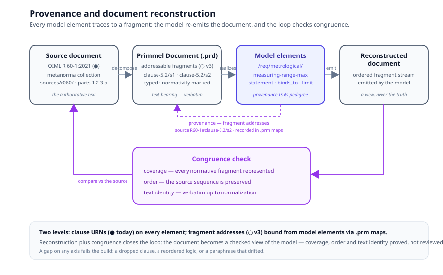

# Chapter 9 — Provenance and Documents

> *In this chapter:* the two-level provenance system — clause references
> that exist today and fragment addresses that v3 adds — the `.prd`
> document artifact, model↔document maps, and the reconstruction loop
> that proves a model still says what its source says.

---

## 9.1 Why provenance is cross-cutting

Every element of a Primmel model is an *interpretation* of something a
standards body published. That claim is only as strong as the ability to
answer, for any element, instantly and mechanically: **which clause of
which document does this come from?** Provenance therefore lives on the
cross-cutting tier — it is a property of every element on every tier,
not an aspect of any one model (chapter 2's IS catalog lists it as an
identity aspect of the subject precisely because a model of the wrong
source is a different model).

Provenance serves three consumers:

- **the author**, who must defend every modelling decision against the
  text during review;
- **the auditor**, who must trace a verdict back through requirement,
  test, and evidence to the clause that demands it;
- **the machine**, which checks coverage (chapter 11) and reconstructs
  the document (§9.5) — both are graph operations over provenance edges.

The running system already enforces the discipline: the OIML R 60
package declares its source collection in `data/r60/standard.yaml`
(`source: { collection: sources/r060/collection.yml, primmel:
primmel-packages/oiml-r60 }`), and every requirement carries its clause
reference. What v3 adds is the second, finer level.

## 9.2 Level 1 — clause provenance (● today)

The coarse level is a **clause URN** on every content element. The R 60
package's canonical example — the requirement quoted in chapter 1:

```yaml
- name: Maximum load of the measuring range
  identifier_fragment: measuring-range-max
  reference: "urn:oiml:pub:r:60-1:2021#clause-5.2"
  statement: |
    The value of the largest load applied to a load cell during test
    which is expressed in units of mass shall not be greater than E_max.
  binds_to: [sample.test_context.d_max, model.parameters.e_max]
```

(from `data/r60/specification/requirements/metrological.yaml`). The URN
pattern is `urn:oiml:pub:{doctype}:{number}:{part}:{year}#clause-{n}` —
one string that names the document, the edition, and the exact clause.

Three supporting constructs make clause provenance first-class rather
than decorative:

- **The references registry** (● `data/r60/references.yaml`) — every
  clause the package depends on is declared once (`id: r60-1-5.2`,
  `document: "OIML R 60-1:2021"`, `clause: "5.2"`, `title: "Measuring
  range"`). Elements cite clause ids; the linker (chapter 11) rejects a
  reference that resolves to no declared clause.
- **Source-discrepancy records** (●) — when the source contradicts
  itself, the model says so instead of silently picking a side. R 60
  records that the R 60-3 form criterion for the max-load humidity
  effect (`C_Hmax ≤ MPE`, `urn:oiml:pub:r:60-3:2021#clause-2.1.7`)
  contradicts the R 60-1 requirement text (`C_Hmax ≤ 1 v`,
  `urn:oiml:pub:r:60-1:2021#clause-5.6.3.1`), with an explicit
  `resolution:` field. The linker's `source-discrepancy` rule keeps the
  record honest.
- **The source collection** (● `sources/r060/`) — the authoritative text
  itself, as a metanorma collection (`collection.yml`, parts `1 2 3 a`),
  with the compiled presentation of each part under
  `data/r60/documents/`. The package manifest pins the model to this
  collection; nothing provenance-related is allowed to float free of it.

Clause provenance is necessary and insufficient. It tells you *which
clause* — not *which sentence* — and it cannot support reconstruction,
because a clause is not addressable at the granularity a model element
actually interprets.

## 9.3 Level 2 — fragments and the `.prd` artifact (○ v3)

The fine level decomposes each source document into **addressable
fragments**, published as a **`.prd` file** — the Primmel Document, the
v2 artifact kind carried into v3 as the successor of the Demo `.sdc`
seed. A fragment is:

- **addressable** — it has a stable address composed from the document
  URN plus a fragment path: `urn:oiml:pub:r:60-1:2021#clause-5.2/s2`
  names the second sentence of clause 5.2;
- **typed** — provision, definition, table, figure, note, example,
  front-matter (the typed-supplement taxonomy of §9.6);
- **normativity-marked** — normative or informative, so coverage metrics
  know what must be modelled and what may be skipped;
- **text-bearing** — it carries the source text verbatim, because text
  identity is what the congruence check compares.

Model elements then bind **fragment addresses**, not just clause URNs.
The clause URN remains as the coarse, human-legible citation; the
fragment address is the machine-checkable one. A requirement's
provenance answers "R 60-1, 5.2, second sentence" — and a reviewer no
longer has to guess which of the clause's five sentences the `limit`
expression interprets.

## 9.4 Model↔document maps

The relation between a model and its source document is recorded as a
**`.prm` map** (chapter 5) — the same artifact kind that maps
implementation models to reference models, applied to a second purpose.
Where a compliance mapping reads "fulfilling A fulfils B", a provenance
mapping reads "**element A realizes fragment B**". Each pair carries the
same two fields:

- **description** — how the element realizes the fragment ("the
  measuring-range upper bound, expressed as a constraint on
  `sample.test_context.d_max` against `model.parameters.e_max`");
- **justification** — why the interpretation is faithful ("E_max is a
  design parameter of the Model; the test load is exhibited per Sample;
  the clause's 'shall not be greater' is the `<=` limit").

Keeping this in a `.prm` rather than inline has the same payoff as in
chapter 5: the map is versioned independently of both endpoints, so an
edition change of the source document (chapter 13) invalidates the map
without touching the model.

## 9.5 Document reconstruction and the congruence check

Provenance is complete only when it runs in both directions. The forward
direction is authoring (text → model). The backward direction is
**reconstruction**: the model emits an **ordered fragment stream** —
each element renders its statement in canonical order, carrying its
fragment address — and a **congruence check** compares that stream
against the authoritative source on three axes:

| Axis | Question | Failure means |
|---|---|---|
| **coverage** | does every normative fragment appear in the stream? | the model silently dropped a clause |
| **order** | is the stream's fragment sequence the source's sequence? | the model reordered the logic of the document |
| **text identity** | does the fragment text in the model match the source verbatim (up to normalization)? | the model paraphrased and the paraphrase drifted |



A package that reconstructs its source with full congruence has a
remarkable property: **the document is a view of the model, and the view
is provably complete.** This is the precise sense in which "the model is
the source of truth" (design principle 1) stops being a slogan — the
published document can be regenerated, and the regeneration is checked.
Reconstruction is ○ in v3; the congruence axes are already the shape of
the text-coverage audit the linter performs structurally today
(chapter 11).

## 9.6 References, links, notes, figures

Four document-machinery constructs round out the picture:

- **References** (●) — the normative-references registry of §9.2;
  first-class, id-keyed, linker-checked.
- **Links** (●) — cross-references between elements (a form referencing
  its test, a gateway referencing a state). The rule is chapter 1's
  *closed under reference*: every identifier resolves, and the linker
  is the enforcement. A link that resolves to nothing is a build error,
  not a dead hyperlink.
- **Notes and examples** (●) — typed supplements, declared in
  `data/r60/notes.yaml` with `type: NOTE | EXAMPLE` and linker-checked
  attachment points (`note_runs_ab_vs_cd`: "Classes A and B require 5
  identical load applications per test point…"). This is the running
  form of the IEC-ISO `ProvisionSupplement` taxonomy.
- **Figures** (◐/○) — figures live with the source parts today
  (`sources/r060/1/images/`) and ride along in the compiled
  presentation; v3 makes them typed fragments so a figure, like a table,
  is addressable and covered. Tables are modelled as data (chapter 6),
  never as text — so "the table" and "the requirement citing the table"
  have separate, checkable provenance.

## 9.7 Grammar sketch *(illustrative v3 syntax)*

```prl
document R60-1 {
  urn "urn:oiml:pub:r:60-1:2021"
  extract of "sources/r060/1"

  fragment clause-5.2 {
    kind provision
    normative true
    title "Measuring range"
    sentence s1 "The value of the smallest load applied to a load cell
                 during test … shall not be less than E_min."
    sentence s2 "The value of the largest load applied to a load cell
                 during test … shall not be greater than E_max."
  }
}

requirement /req/metrological/measuring-range-max {
  statement text/…                          # chapter 10 content set
  provenance { source R60-1#clause-5.2/s2 } # fragment address
  binds_to [sample.test_context.d_max, model.parameters.e_max]
  limit ocl{ sample.test_context.d_max <= model.parameters.e_max }
}

map r60-model-to-r60-1 (provenance) {
  mapping {
    from /req/metrological/measuring-range-max
    to   R60-1#clause-5.2/s2
    description   "Upper bound of the measuring range as a constraint on exhibited test load vs design capacity."
    justification "E_max is design-fixed on the Model; d_max is exhibited per Sample; 'shall not be greater' is <=."
  }
}

reconstruct R60-1 from oiml-r60 {
  order   by fragment address
  check   { coverage, order, text_identity }
}
```

## 9.8 Validation rules

- every content element carries a clause reference; every clause
  reference resolves against the references registry (● linker);
- every fragment address resolves to a declared fragment in the cited
  `.prd` document; fragment addresses are unique per document;
- a `.prm` provenance map's endpoints both resolve — the model element
  and the fragment — and its direction is model → document, never the
  reverse;
- the reconstruction stream covers every normative fragment of the
  source; a coverage gap, an order inversion, or a text mismatch fails
  the congruence check;
- a `source_discrepancy` record names at least two conflicting sources
  and an explicit resolution; the linker's `source-discrepancy` rule
  verifies both citations resolve.

## 9.9 Summary

- Provenance is cross-cutting: every element answers "which clause of
  which document" — for author, auditor, and machine alike.
- Level 1 (● today): clause URNs on every element, a references
  registry, source-discrepancy records, a pinned source collection.
- Level 2 (○ v3): `.prd` fragments — addressable, typed,
  normativity-marked, text-bearing — bound from model elements.
- Model↔document relations are `.prm` maps: description + justification,
  versioned independently of both endpoints.
- Reconstruction emits the ordered fragment stream; congruence =
  coverage + order + text identity. A congruent package regenerates its
  document as a checked view.

*Next: [Chapter 10 — Multilinguality](10-multilingual.md): ISO 24229
spelling codes on every human-readable string.*
