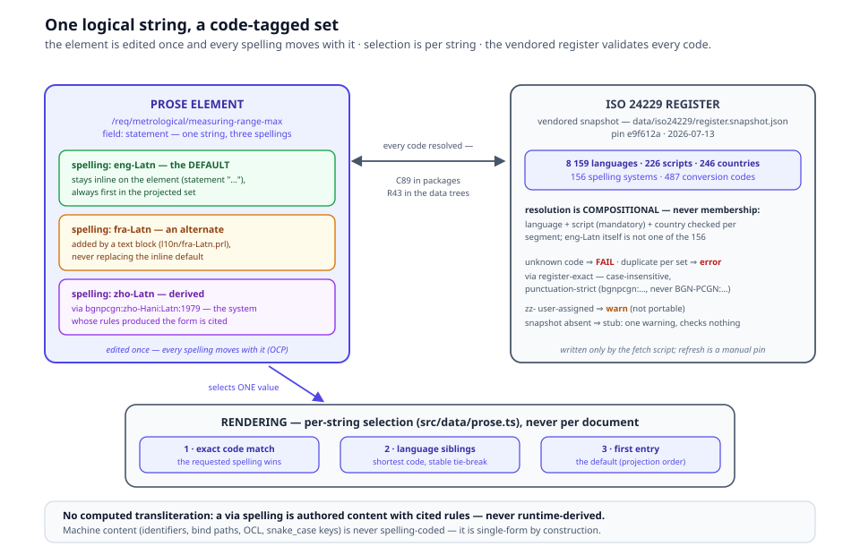

# Chapter 10 — Multilinguality

> *In this chapter:* why Primmel tags human-readable content with ISO
> 24229 spelling codes rather than BCP 47 language tags, what a spelling
> code is made of, and the machinery as shipped — the kernel `text`
> construct and rule C89, the vendored register snapshot and linker rule
> R43, the English-first migration of every tree, per-string rendering
> selection, and the translation workflow — closed by the acceptance
> proof that nothing the reader sees has changed.

---

## 10.1 The problem: a language tag is not a writing system

Standards are multilingual artifacts. OIML publishes in English and
French; members translate; manufacturers romanize names; certificates
travel across scripts. The industry's default answer — a BCP 47 tag like
`zh-Hans` or `sr-Latn` — classifies the string: *this is Chinese,
simplified script*. It cannot say the thing a standards pipeline
actually needs: **which system produced this written form, and which
rules reproduce it.** "Romanized" is not a system; Wade-Giles and Pinyin
both are, and they disagree.

Primmel adopts **ISO 24229** instead. BCP 47 is explicitly a non-goal
(chapter 1's rejected patterns); the concepts document states it
flatly: all human-readable strings are *spelling-coded per ISO 24229*,
and BCP 47 is *not* used.

## 10.2 ISO 24229 in five minutes

Three standards answer three orthogonal questions:

| Standard | Question | Examples |
|---|---|---|
| ISO 639 | what **language**? | `eng`, `fra`, `zho`, `ara` |
| ISO 15924 | what **script**? | `Latn`, `Cyrl`, `Hani`, `Arab` |
| ISO 24229 | which **conversion system**? | `un:ara-Arab:Latn:2017`, `iso:cyrl:latn:9-1995` |

A **spelling system** is the combination of the first two — a language
in a script: `ara-Arab`, `bel-Cyrl`, `fra-Latn`. It may carry an
optional country code (`uzb-Arab-AF` — Uzbek in Arabic script as used in
Afghanistan) and an optional extension (`ind-Latn-pre1972` — the
pre-1972 orthography). The script element is **mandatory**: a bare
`ara` is not a spelling system, because Arabic is written in more than
one script.

A **conversion system code** names a registered system that converts one
spelling into another, in four colon-separated segments:

```text
bgnpcgn : zho-Hani : Latn : 1979
 titular    source    target  identifying
(authority) (spelling) (spelling) (version/year)
```

The titular segment names the managing authority (`un`, `icao`,
`alalc`, `din`, `iso`; `var` when none is identifiable; a `zz-` prefix
for user-assigned codes). The register is authoritative, maintained
under ISO 19135 procedures: entries have a lifecycle (proposed, stable,
deprecated, withdrawn), and an assigned code is reserved forever — never
reused. Two comparison rules matter to every author, because the linker
enforces them (§10.5): codes compare **case-insensitively**
(`iso:cyrl:latn:9-1995` ≡ `ISO:Cyrl:Latn:9-1995`) but
**punctuation-exactly** — the register-normal form strips the titular's
punctuation, so `bgnpcgn:zho-Hani:Latn:1979` resolves and the
display-form `BGN-PCGN:…` does not.

The property Primmel buys: a code is **resolvable to concrete rules**.
`iso:cyrl:latn:9-1995` does not describe the output — it names the
system whose published rules produce the output, for any Cyrillic text,
auditably.

## 10.3 Every human-readable string is a content set (● — shipped, task 25)

The rule of the chapter, shipped: **every human-readable string in a
model is spelling-coded.** That means names, definitions, statements,
notes, and certificate text — everything a human reads — never OCL,
never identifiers, never `snake_case` attribute ids (those are machine
keys, chapter 11's naming discipline, and stay single-spelling by
design).

A model carries **one logical string** with **per-spelling values** —
a *content set*. In the data trees the set is the long-standing
localized pair-list, now with full codes (the 18 AJV schemas of
§10.5 union every prose field as `oneOf [string, localizedString]`, the
plain string surviving as transitional shorthand for the default
spelling):

```yaml
statement:
  - spelling: eng-Latn          # the package default — always first
    value: "The value of the largest load applied to a load cell
            during test … shall not be greater than E_max."
  - spelling: fra-Latn
    value: "La valeur de la plus grande charge … ne doit pas excéder E_max."
  - spelling: zho-Latn
    via: bgnpcgn:zho-Hani:Latn:1979   # a derived spelling cites its system
    value: "…"
```

Two values, one string — or three, or one. The statement is one model
element; the spellings are facets of it, not copies of it. This is the
same definition/instance discipline as everywhere else in the kernel:
edit the element once, and every spelling of it moves together; add a
spelling and no consumer of the others is disturbed (OCP). A `via` code
enters when a spelling was *derived* rather than authored — the Latin
rendering of a `zho-Hani` name cites the rules that produced it,
exactly the passport-catalogue problem ISO 24229 exists to solve.

The Primmel package is the source of truth for every set: the default
spelling's value stays **inline** on the element (`statement "…"`), and
alternate spellings are authored in `text` blocks (§10.5) — the
projection emits the set, default first (§10.10).

This extends a practice the terminology layer already runs. The
glossarist registers (`viml-2022`, `vim-2012` in the sibling
`../vocab/datasets/` repo) store each concept as per-language
**localized concepts** keyed by language code (`language_code: eng` /
`fra`), one writing system per entry. That keying *is* a spelling
discipline in embryo — the registers never needed to name the script,
because every entry happens to be Latin-script. Task 25 (● smart
`94c8751`, merged `8de8f4d`) generalized the *model's* key from that
bare language code to the full ISO 24229 spelling code and — the actual
content of this chapter — extended the practice **from names to all
prose**: a definition, a note, a certificate sentence gets exactly the
same treatment as a designation. The upstream registers themselves keep
their bare-language keys; the model's codes are the superset keying.

## 10.4 The register, vendored and pinned (●)

Validation needs the register, and the build cannot depend on a live
external service. The platform therefore vendors a **pinned snapshot**
of the public ISO 24229 register at
`data/iso24229/register.snapshot.json` (smart `94c8751` — the same
pattern A as the OpenCDD snapshot of §12.4):

| key | count (pin `e9f612a`, 2026-07-13) | source in the mirror |
|---|---|---|
| `languages` | 8 159 (ISO 639 alpha-3) | `src/data/code-names.json` |
| `scripts` | 226 (ISO 15924) | `src/data/code-names.json` |
| `countries` | 246 (ISO 3166-1 alpha-2) | `src/data/countries.ts` |
| `spelling_systems` | 156 registered spellings | `dist/data/register.jsonld` |
| `conversion_systems` | 487 conversion codes | `dist/data/register.jsonld` |

The snapshot is written only by the fetch script
(`browser/scripts/fetch-iso24229-snapshot.ts`, `npm run
snapshot:iso24229`), which records the mirror's git HEAD, commit date
and retrieval date in the `_snapshot` header; refreshing the pin is a
manual, auditable act. It is **not a standard tree** — no
`standard.yaml`, no part in the SSOT byte contract.

One shape fact decides the validation design: spelling codes validate
**compositionally**, never by membership. `eng-Latn` — the platform's
own default — is *not* one of the 156 registered spelling systems; a
membership check would reject the platform's every string. Resolution
therefore decomposes the code and checks each segment against the
pinned lists: the language against ISO 639, the (mandatory) script
against ISO 15924, the country against ISO 3166-1 when present.
Conversion codes resolve against the 487-entry register list,
case-insensitively but punctuation-exactly.

**Stub discipline:** when the snapshot is absent, the linker emits ONE
warning and checks nothing — never a failure. The mirror is a
refresh-time dependency only; the vendored file is what the gates read.

## 10.5 The machinery: C89, R43, and the projection fixpoint (●)

Three layers make the content set real, each with its own gate:

- **The kernel `text` construct + C89** (● primmel-ts `14cf10d`,
  912/912). Alternate spellings of one prose field are authored as

  ```prl
  text /req/metrological/measuring-range-max.statement {
    spell fra-Latn "La valeur de la plus grande charge …"
    spell zho-Latn via bgnpcgn:zho-Hani:Latn:1979 "…"
  ```

  addressed `<element-id>.<field>`; the default spelling's value stays
  inline on the element — a `text` block never replaces it, it adds
  spellings. Kernel rule **C89 `spelling-code-wellformed`** is the
  syntax layer: the manifest's `default_spelling` and declared
  `spellings` parse (script mandatory), every `text` block addresses an
  existing element's *prose* field, every `spell` code parses with no
  duplicate per set, the default's value is never re-stated in a block,
  and every `via` parses (`zz-` user-assigned codes warn). The kernel
  stays register-free by design — it validates shape; register
  resolution is the consumer's vendored-snapshot discipline.
- **Linker rule R43 `spelling-code-resolve`** (● smart `94c8751`,
  renumbered `3b7b467`). The number is a merge artifact worth
  recording: the rule was built as R42, but task 61's
  `state-machine-integrity` had landed as R42 first, and the collision
  surfaced at merge — the spelling rule shipped as **R43**. R43 walks
  every YAML file of every tree collecting `{spelling, value}` sites
  and resolves each code **compositionally** against the snapshot:
  **unknown codes fail** (a bogus `qqq-Latn`, `eng-Qqqq` or
  `eng-Latn-QQ` is an error, not a warning); two values for one code in
  one set are a **duplicate-per-set error** (keyed `setPath + code` —
  the same code across *different* sets is fine); a `via` must resolve
  register-exact (case-insensitive, punctuation-strict — `alalc:…`
  fails against `ala-lc:…`); `zz-` codes **warn** (user-assigned, not
  portable); and an absent snapshot degrades to the one-warning stub of
  §10.4.
- **The projection, both directions.** `prl-to-yaml` emits the content
  set at 112 prose sites (`proseSet` / `prose` / `proseList` + text-block
  alternates), default first; the inverse `yaml-to-prl` unwraps the
  default back inline and re-emits alternates as `text` blocks — and
  **fails loudly** on alternates at a nested, non-addressable address,
  never silently dropping a spelling. The **alternates fixpoint**
  (`spelling-round-trip.test.ts`, 5/5) proves a `text` block survives
  PRL → YAML → PRL byte-clean, and `npm run test:ssot` holds the whole
  contract byte-clean in both directions on every build.

## 10.6 The migration: English first, every tree (●)

Task 25 shipped the machinery, not translations — pass 1 tagged every
prose family in the four recs and their composed layers, English source
content → `eng-Latn` sets:

- **all 19 package manifests** declare `default_spelling eng-Latn` (the
  only manifest diff: one line each);
- **978 legacy bare-`eng` sites recoded** to `eng-Latn`, values
  byte-preserved: 548 in `data/oiml-r129.legacy/` (28 files) + 401 in
  `data/oiml-r144/` (26 files) + 29 in the module skeletons (6 files) —
  60 files exactly;
- **certificate text and identity slots** tagged: R 60's 14 promise
  statements + 14 certificate labels, the certificate-template labels
  (R 91 12 / R 129 7 / R 144 9), and R 60's identity slots (5 labels +
  5 definitions);
- **zero bare `spelling: eng` remains** in `data/**` — 8 338 `eng-Latn`
  sites across 291 files.

Sets per tree (generated + hand-authored), from the migration census
(`docs/spelling-codes.md`):

| tree | sets | top fields |
|---|---|---|
| r60 | 2 955 | label 993, description 634, definition 336, name 280, true/false_label 194, term 85, title 76, statement 74, purpose 62 |
| r91 | 1 142 | description 318, name 246, definition 129, term 70, purpose 64, method 64, statement 57 |
| r129 | 836 | label 212, description 165, name 139, definition 57, statement 45, title 43, term 39 |
| r144 | 1 171 | description 498, name 186, definition 80, title 70, action 52, note 51, label 43 |
| core | 422 | description 371, label 22, statement 10 |
| oiml-cs | 212 | description 135, name 35, statement 34 |
| iso-iec-17000 | 85 | term 36, definition 36, note 13 |
| iso-iec-17025 | 198 | description 99, name 35, statement 33 |
| iso-iec-17065 | 199 | description 93, name 33, statement 31 |
| iso-iec-17067 | 108 | description 52, name 23, statement 22 |

Deliberately **not** tagged in pass 1, each with its reason on record:
the element-level `source_discrepancy` facet's summary/rationale
(provenance-conflict metadata, not element prose — the corpus-level
discrepancy *records* are tagged), term-level `language "en"` (a term
metadata tag consumed by the RDF export, not a string's spelling — its
retirement is follow-up), alternate designations (`alt:` /
`abbreviations:` — cross-reference lookup keys), and template-hard-coded
chrome (print-component boilerplate, app UI labels — code, not data;
the identical-English baseline of §10.9 pins them).

## 10.7 Rendering: selection by code (●)

Rendering never prints a language; it selects **by spelling code**, per
string, at model load (`browser/src/data/prose.ts`):

1. an **exact** match on the requested code wins;
2. otherwise the **language siblings** — any entry whose language
   segment matches, shortest code first with a stable tie-break (this is
   what lets legacy bare-`eng` data render identically under the
   `eng-Latn` default);
3. otherwise the **first entry** — the projection's ordering law makes
   that the package's default spelling;
4. selection is **per string, never per document** — a certificate may
   print the instrument designation in `zho-Hani`, its romanization in
   `zho-Latn` with the conversion code cited, and the legal text in
   `eng-Latn`, from one content set.

Two honesty notes on the chain. It ends at step 3 — there is **no
computed transliteration**: a converted spelling is *authored content*
whose `via` cites the rules that produced it, never a rendering the
runtime derives. And per-string selection is what makes multilingual
rendering auditable: every printed string traces to (element, spelling
code[, system code]) — the same provenance reflex as chapter 9, one
axis over.

The app wiring around the selector is small and total
(`useLanguage.ts`, `model-cache.ts`, `AppHeader.vue`,
`certificate.service.ts`): the user's spelling persists in localStorage
(`oiml-smart-language`, default `eng-Latn`); the model cache is keyed
`(standardId, language)` — no cross-language poisoning — and clears on
language change; the header switcher offers the codes present in the
loaded data (the default first); and the certificate service resolves
promises, labels and rows through the *same* selector, so a certificate
and a page can never diverge on a string. The selector carries 26
specs, including the four-recs `eng-Latn ≡ eng` property.



## 10.8 The translation workflow

Pass 1 shipped no translations; the workflow below is how they arrive
(the full operator version lives in `docs/spelling-codes.md`). What may
be translated, and what stays source-language:

- **Names, notes, descriptions, guidance, titles, labels** — freely
  translatable. Add the translation as another entry of the content set.
- **Definitions** — translatable, with provenance kept: a translated
  definition of a normatively-defined term carries the source's wording
  beside it (the default spelling stays first; the translation is an
  additional `spell` entry).
- **Normative statements** (requirement `statement`, conformance
  `purpose` / `method`) — the ORIGINAL language text is normative and
  **always stays in the set** as the default-spelling entry; any
  translation is added *alongside* it, never instead of it. Rendering in
  another language is a per-string selection (§10.7), so the normative
  text remains one selection away.
- **Never spelling-coded** (machine content): identifiers, `bind:`
  paths, OCL expressions, `snake_case` attribute/field ids, enum values,
  procedure-step ids, footnote markers, acceptance-criterion ids, table
  column keys, the `via` codes themselves.

Authoring a translation is six steps, all gated:

1. **Do not edit the normative files.** Translations ship in their own
   `.prl` file(s) — the package convention is `l10n/<spelling>.prl`
   (e.g. `l10n/fra-Latn.prl`). A translation never touches the file
   carrying the default-spelling source.
2. Address the string: `text <element-id>.<field>` — C89 errors on an
   unresolvable address or a non-prose field.
3. One `spell` per code per set — two values for one code are a
   duplicate (C89/R43); use an extension code for genuine variants
   (`ind-Latn-pre1972`).
4. Declare the spelling on the manifest: extend the package's
   `spellings { … }` set (the default stays `default_spelling
   eng-Latn`). The switcher's options come from the codes present in
   the loaded data.
5. Converted spellings cite their system register-exact:
   `spell zho-Latn via bgnpcgn:zho-Hani:Latn:1979 "…"`.
6. Regenerate (`npm run gen:data`), then the gates: `npm run validate`
   (R43 resolves the new codes), `npm run test:ssot` (the inverse
   projection emits your `text` blocks back).

## 10.9 The acceptance: byte-identical English (●)

The migration's contract was: *the reader notices nothing.* It is proven
mechanically, twice over:

- **all 44 pages byte-identical English** post-migration — the render
  baseline recorded pre-change, then compared on **two independent
  servers** (the reviewer's own instance and the main repo's already-
  running one); the only DOM excluded before capture is the language
  switcher itself, and normalization masks only ISO timestamps and
  whitespace. The property now rides the e2e suite as the
  render-baseline leg (the suite's 55th test).
- **certificates byte-equal 5/5** (`certificate-promises-snapshot.test.ts`)
  — the seeded real-certificate flows print exactly what they printed
  before the recode, and the coverage summary is identical modulo
  timestamp.

That is the OCP claim of §10.3 made measurable: every string became a
set, and not one rendered byte moved.

## 10.10 Grammar sketch *(the shipped contract)*

```prl
package oiml-r60 {
  id oiml-r60
  kind rec
  …
  default_spelling eng-Latn            # every shipped manifest declares it (19/19)
}

# the default spelling stays inline on the element:
requirement /req/metrological/measuring-range-max {
  statement "The value of the largest load applied to a load cell
             during test … shall not be greater than E_max."
}

# alternates arrive in their own file (l10n/fra-Latn.prl) and never
# replace the inline default:
text /req/metrological/measuring-range-max.statement {
  spell fra-Latn "La valeur de la plus grande charge appliquée à une
                  cellule de pesée … ne doit pas excéder E_max."
  spell zho-Latn via bgnpcgn:zho-Hani:Latn:1979 "…"   # derived, system cited
}
```

and the YAML projection the platform consumes (a plain string stays
legal shorthand for the default spelling):

```yaml
statement:
  - spelling: eng-Latn          # the default — always first
    value: "The value of the largest load applied to a load cell
            during test … shall not be greater than E_max."
  - spelling: fra-Latn
    value: "La valeur de la plus grande charge … ne doit pas excéder E_max."
  - spelling: zho-Latn
    via: bgnpcgn:zho-Hani:Latn:1979
    value: "…"
```

## 10.11 Validation rules

- every spelling code parses: ISO 639-3 alpha-3 (terminological)
  language code + ISO 15924 script (**mandatory**) + optional
  ISO 3166-1 country + optional extension — a bare language code is an
  error (C89 in packages; R43 fails it in the data trees);
- every code resolves **compositionally** against the vendored snapshot
  — language, script and country each in the pinned lists; membership
  in the 156 registered spelling systems is NOT required (`eng-Latn`
  itself is unregistered);
- every `via` resolves **register-exact** — case-insensitive,
  punctuation-strict (`bgnpcgn:…`, never `BGN-PCGN:…`); `zz-`
  user-assigned codes validate with a warning and are not portable;
- one value per code per set — two `eng-Latn` values for one string is
  a duplicate error (keyed `setPath + code`), not a variant; use an
  extension code to distinguish;
- the default spelling's value stays inline on the element; a `text`
  block that re-states it, addresses a dangling element, or names a
  non-prose field is a C89 error;
- the projection emits every set default-first; the alternates
  fixpoint (PRL → YAML → PRL byte-clean) is test-pinned, and nested
  non-addressable alternates fail loudly;
- snapshot absent ⇒ stub: ONE warning, nothing checked, never a
  failure;
- machine content is never spelling-coded: identifiers, bind paths,
  OCL, and `snake_case` keys are single-form by construction.

## 10.12 Summary

- Language tags classify; ISO 24229 codes resolve to concrete writing
  and conversion rules. Primmel uses the latter, never BCP 47 (●
  shipped, task 25 — smart `94c8751` / kernel `14cf10d`).
- A spelling system = ISO 639 language + ISO 15924 script (+ country, + extension);
  script is mandatory. A conversion system code = titular : source
  spelling : target spelling : identifying segment, compared
  case-insensitively but punctuation-exactly.
- Every human-readable string is a content set — one logical string,
  per-spelling values, conversion codes cited where a spelling was
  derived; the default stays inline, alternates arrive in `text`
  blocks, and 18 schemas union every prose field.
- The register is vendored and pinned (`e9f612a`, 2026-07-13 — 8 159
  languages / 226 scripts / 246 countries / 156 spelling systems / 487
  conversion codes); C89 checks syntax in packages, R43 resolves
  compositionally in the trees — unknown codes fail, duplicates fail,
  `zz-` warns, absent snapshot stubs.
- The migration recoded every tree English-first (19 manifests, 978
  legacy sites byte-preserved, zero bare `eng`), and the acceptance
  proved it invisible: 44/44 pages byte-identical on two servers,
  certificates byte-equal 5/5.
- Rendering selects by code, per string — exact → language siblings →
  the default first entry — with no computed transliteration; the
  translation workflow keeps normative originals in the set, always.

*Next: [Chapter 11 — Validation](11-validation.md): schemas, the model
linker, `primmel check`, coverage audits, and the authoring pitfalls
catalog.*
