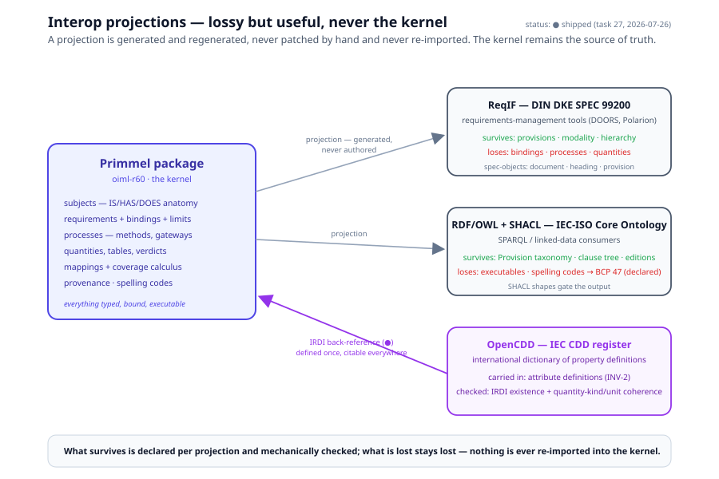

# Chapter 12 — Interop

> *In this chapter:* the export projections — ReqIF for
> requirements-management tools, RDF/OWL for linked-data consumers,
> OpenCDD back-references for attribute definitions — what survives each
> projection, what is lost, and why none of them is ever the kernel.

---

## 12.1 Projections, never the kernel

The Primmel model is a strict superset of the document-centric
alternatives: they represent a standard's *text*; Primmel represents its
*semantics* (chapter 1's comparison). The interop rule follows:

> **Exports are lossy-but-useful projections, never the kernel.**

A projection is generated, never authored; it is regenerated on every
build, never patched by hand; and it is consumed by ecosystems that
cannot — today — run a Primmel engine. The test for every projection is
honest bookkeeping: say exactly what survives and what is lost, and
check mechanically that the "survives" list is faithful. Round-trip is
explicitly *not* a goal: information lost on the way out cannot come
back, so nothing is ever re-imported into the kernel.



## 12.2 ReqIF export — the DIN DKE SPEC 99200 profile

**ReqIF** (OMG Requirements Interchange Format) is the wire format of
the requirements-management ecosystem — DOORS, Polarion, the tools
manufacturers and test laboratories already run. **DIN DKE SPEC 99200**
is the ReqIF interpretation for public standards: it models a standard
as database rows — three spec-object-types (`document`, `heading`,
`provision`), one relation (`cross-reference`), XHTML text carrying a
modality tag. The specification ships with the digital material needed
to import, manage and re-export in target software (its clause 11), and
tooling such as Schematron rules and exchange examples (`.reqifz`)
exists to keep exchanges conformant.

That is a *good* target for a projection, because a Primmel reference
package contains exactly the ReqIF profile's content as a subset:

| Survives the projection | Is lost |
|---|---|
| provision statements (the requirement `statement` texts) | **bindings** — `binds_to` anchor paths; a ReqIF row cannot say *what* is constrained |
| modality (shall / should / may → the provision's bindingness) | **limits** — the OCL in `limit.expression`; the row has text, not a computable constraint |
| the document hierarchy (parts, clauses, headings) | **processes** — test methods, steps, gateways, executors |
| provenance (clause URNs as attributes on the row) | **quantities** — QuantityValue, units, tables/profiles |
| cross-references between provisions | **applicability, verdicts, forms, mappings** — the entire executable tier |

The projection's value: a manufacturer consumes the standard inside its
own RM tool, links its design documents to the provision rows, and
answers "which clauses does our product file address?" — while the
authoritative, executable form remains the Primmel package. The moment a
consumer needs to know whether the instrument *passes*, the projection
has nothing to say and the kernel must run.

## 12.3 RDF/OWL + SHACL — the IEC-ISO Core Ontology projection

The second target is linked data. The **IEC-ISO Core Ontology**
(descended from the IEC SG12 Standard Information Model) defines an OWL
model for *fragments* of standards in RDF, with a scope it states
precisely: concepts from ISO/IEC Directives Part 2 (sections 3, 6, 7),
narrative content only — **not** figures, equations or tables; **not**
document metadata (number, edition, publisher); **not** presentation
(NISO STS owns that). Its center is the **Provision hierarchy**, one
class per directive verb-force: `Requirement`, `Recommendation`,
`Permission`, `Possibility`, `Capability`, `Instruction`, `Statement`,
`ExternalConstraint` — with `hasBindingnessType`, typed
`ProvisionSupplement`s (notes, examples), `Clause` with
`hasSectionNumber`, and `PublicationDocument` carrying
`dcterms:hasVersion` / `dcterms:replaces` / `dcterms:issued`. SHACL
node shapes (a `ProvisionShape` constraining `isPartOf`,
`hasBindingnessType`, `hasStatement`, `hasSupplement`) validate
instances, and the consumption pattern is SPARQL: competency questions
like "list every Requirement of this document with its bindingness and
supplements".

The Primmel→RDF projection maps the package onto that vocabulary:
requirements become `smart:Requirement` instances, notes and examples
become typed supplements, clause structure becomes `Clause`/`isPartOf`,
the package's edition relations (chapter 13) become `dcterms:replaces`.
What survives is wider than ReqIF in one respect (the Provision
taxonomy's verb-force classification) and identical in the one that
matters: **no bindings, no processes, no quantities** — the ontology's
own scope statement excludes them. Two projection notes are worth
recording:

- **Language tags collapse.** RDF mandates BCP 47 for language-tagged
  strings, so ISO 24229 spelling codes (chapter 10) map *down* to BCP 47
  on export — a lossy step the projection declares, not hides.
- **SHACL is the check.** A projection that emits RDF the
  `ProvisionShape` rejects is a projection bug; SHACL validation is part
  of the export gate, symmetric to chapter 11's own gates.

## 12.4 OpenCDD integration — the IRDI back-reference

The third relation runs the other way. **OpenCDD** (the open form of the
IEC Common Data Dictionary, IEC 61360) is an international register of
*property definitions*: every entry has an **IRDI** (International
Registration Data Identifier), a quantity kind, and a unit. Primmel does
not re-invent shared attributes per package; an attribute definition
carries its CDD citation. This is already the metamodel's law — INV-2:
an attribute is **defined once** as an AttributeDefinition (symbol,
clause, IRDI) and **valued** per subject level. The R 60 attribute
registry (`data/r60/model/attributes.yaml`) carries the slot today,
with a format example (`0112/2///61987#ABA000#000`) pending registered
entries — ◐, and honest about it.

Integration means validation, not export:

1. **existence** — the IRDI resolves to a live CDD entry;
2. **coherence** — the definition's declared quantity kind and unit
   match the CDD entry's (an attribute claiming mass in `kg` against a
   CDD entry for a length quantity is a modelling error, caught before
   it propagates into every requirement that binds the attribute).

The payoff is the chapter's thesis in miniature: an attribute with a
checked IRDI is citable in an international dictionary rather than
invented per package — the same "defined once, referenced everywhere"
discipline the kernel applies internally, extended across organizations.

## 12.5 Grammar sketch *(illustrative v3 syntax)*

```prl
projection reqif-din-99200 of oiml-r60 {
  spec_objects { document, heading, provision }
  carry   { statement, modality, clause_hierarchy, provenance_ref, cross_references }
  drop    { bindings, limits, processes, quantities, applicability, verdicts, forms, mappings }
  note    "generated artifact; regenerate on build; never patch, never re-import"
}

projection rdf-core-ontology of oiml-r60 {
  vocabulary smart   # IEC-ISO Core Ontology
  map requirement -> smart:Requirement
  map note/example -> smart:ProvisionSupplement (typed)
  map clause tree  -> smart:Clause + dcterms:isPartOf
  map editions     -> dcterms:replaces
  languages spelling -> bcp47 (lossy, declared)
  gate shacl { ProvisionShape, ClauseShape, PublicationDocumentShape }
}

attribute e_max {
  kind mass ; unit kg
  irdi "0112/2///61987#ABA000#000"     # IEC CDD
  check cdd { exists, quantity_kind_coherent, unit_coherent }
}
```

## 12.6 Validation rules

- a projection declares its `carry` and `drop` lists; everything in
  `carry` is mechanically verified present and faithful in the output
  (a statement whose exported text differs from the content set fails
  the export gate);
- a projection's output passes the *target's own* validator — ReqIF
  schema/Schematron for the ReqIF projection, SHACL shapes for the RDF
  projection;
- no import path: the kernel accepts no artifact generated from a
  projection; provenance of every kernel element traces to a `.prd`
  fragment or an authored model file, never to an export;
- every IRDI on an attribute definition resolves (existence) and agrees
  with the definition on quantity kind and unit (coherence); a
  placeholder IRDI is flagged, never silent;
- the BCP 47 downgrade of spelling codes is declared in the RDF
  projection's `languages` clause — an undeclared silent mapping is an
  error.

## 12.7 Summary

- Exports are lossy-but-useful projections: generated, regenerated,
  never authored, never re-imported — the kernel stays the source of
  truth.
- ReqIF (DIN DKE SPEC 99200): provisions + modality + hierarchy survive;
  bindings, processes, quantities, verdicts are lost; the value is the
  RM-tool ecosystem manufacturers and labs already run.
- RDF/OWL (IEC-ISO Core Ontology): the Provision taxonomy, supplements,
  clause tree and edition relations survive; the same executable content
  is lost — by the ontology's own scope; SHACL gates the output, and
  spelling codes downgrade to BCP 47, declared.
- OpenCDD runs the other way: attribute definitions carry IEC CDD
  IRDIs, validated for existence and quantity-kind/unit coherence —
  defined once, citable everywhere.

*Next: [Chapter 13 — Model diff and lifecycle](13-diff-and-lifecycle.md):
editions as packaging, structural diff, and change audit.*
