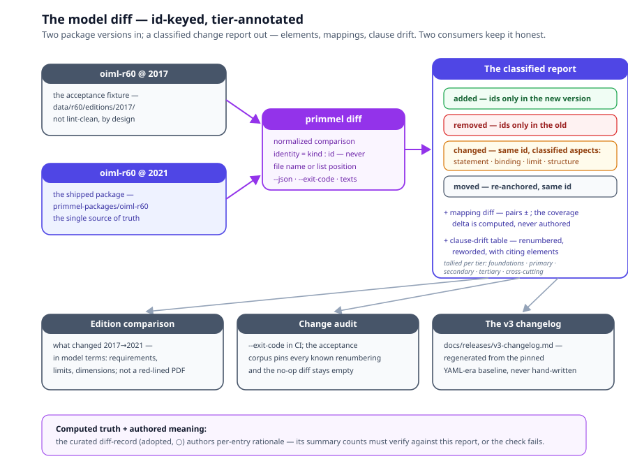

# Chapter 13 — Model Diff and Lifecycle

> *In this chapter:* editions as lifecycle packaging — orthogonal to the
> kernel by design — the structural model diff the core owes them, what
> that diff powers, where versioning relations live, and how INV-8 pins
> execution to definitions.

---

## 13.1 Editions are packagings, not model features

A standard outlives its editions. R 60 exists as 1996, 2000, 2017 and
2021 editions; the subject — the load cell — did not change its nature
in those years, only the document did. The kernel takes the consequence
seriously:

> **An 'edition' package is an arbitrary packaging used for provenance
> and lifecycle management — orthogonal to the core, and to be
> implemented as such.**

Two design facts follow. First, the *subject models stay timeless*: a
Model of a load cell is what it is; it carries no "deprecated" flag, no
"valid from" date, no edition number in its identity. Second, the
*package carries the lifecycle*: the manifest declares `version: '2021'`
and the `editions: [2021, 2017, 2000, 1996]` line
(`data/r60/standard.yaml`, and identically in
`primmel-packages/oiml-r60/package.primmel`), and every versioning
relation hangs off that manifest (§13.4).

This orthogonality is what keeps editions cheap. Because an edition is
*packaging*, producing one is a shipped, gated operation (● task 28):
pin the content, run the diff, declare the relations — never a rewrite
of subject models. And because the content itself is tier-structured
(chapter 1), an edition diff reports in the vocabulary the tiers
already provide.

## 13.2 The model diff (● — shipped, task 28)

The one capability the core owes lifecycle management is **model diff**:
a structural diff between two package versions, shipped as **`primmel
diff <a> <b>`** (● smart cb5eab6 — kernel `model-diff.ts` /
`package-diff.ts`, with `--json`, `--exit-code` for the change-audit CI
gate, and `--compare-texts` for the sentence payloads). Not a text diff
of YAML files — a diff of *model elements*, keyed by id, classified by
tier:

| Change kind | Meaning | Example (an R 60-style revision) |
|---|---|---|
| **added** | an element id present only in the new version | a new conformance test for a disturbance kind |
| **removed** | an id present only in the old version | a withdrawn form |
| **changed** | same id, different content — classified by *what* changed: statement / binding / limit / structure | `limit` on `/req/metrological/mpe-table` re-scoped |
| **moved** | same id, different anchor or location | a requirement re-anchored to a corrected aspect path |

And, because mappings are first-class (chapter 5), the diff includes a
**mapping diff**: mapping pairs added or removed between the two
versions, and the resulting **coverage delta** — a reference component
that drops from full to partial cover because the implementation deleted
a mapped process is a *computed* finding, not a discovered one. A
**clause-drift table** joins the report: renumbered clauses, changed
limits, moved provisions, with their citing elements.

Two properties make the diff trustworthy:

- **id-keyed, not position-keyed.** Renaming a file or reordering a
  YAML list is not a model change; the diff sees elements, not lines —
  the same model in a different file layout diffs empty, and a no-op
  diff of the real package is test-pinned empty. (The cost of this
  property is the snake_case naming discipline of chapter 11 — ids are
  the diff's primary key.)
- **tier-annotated.** Every change reports its tier
  (`TIER_BY_FIELD`: foundations, primary, secondary, tertiary —
  processes, entities, registries, state machines, approvals, monitors
  *and passports* — cross-cutting), so an edition review reads
  "secondary: 3 requirements changed limits; tertiary: 1 state machine
  extended" instead of "47 files touched".

The diff has two shipped consumers that keep it honest:

- **The v3 changelog is generated, not written.**
  `docs/releases/v3-changelog.md` in the platform repo is the output of
  `primmel diff` re-run over every package against the pinned YAML-era
  baseline — the narrative one-liners are the only curated content;
  every other line regenerates (task 31).
- **The R 60 2017→2021 corpus is the acceptance fixture.** The 2017
  edition ships as a diff fixture (`data/r60/editions/2017/`), and the
  test kit proves the diff finds every known 2017→2021 renumbering with
  zero false additions/removals on a no-op diff; the regenerated table
  is `analysis/clause-drift-r60-2017-2021.txt`.

One doctrine rides above the computed diff (adopted from the phase-9
reviewer correspondence, item 4 — ○ not yet landed): the **curated
diff-record**. The computed diff is truth without meaning; an authored
record — per-entry rationale for an edition's changes — is meaning
without proof. The adopted shape welds them: a `model_diff` record
whose *summary counts are machine-verified against the computed diff*
for the pinned pair (a check fails when the authored
`summary { added … removed … modified … }` disagrees with `primmel
diff`), and whose per-entry `rationale` is the authored layer. Computed
truth + authored meaning; neither can drift from the other. The R 60
2017→2021 instance is the designated pilot record.

## 13.3 What diff powers

Three consumers, one computation:

1. **Edition comparison.** "What changed between R 60:2017 and
   R 60:2021?" is a diff query answered in model terms: these
   requirements added, these limits changed, this dimension enum
   extended. A National Member Body reviewing an adoption reads *that*,
   not a red-lined PDF.
2. **Change audit.** Between two validation runs of one package, the
   diff is the audit trail: every added element, every changed binding,
   every allowlist entry that went STALE (chapter 11) — a review
   artifact generated, not assembled.
3. **Clause-drift detection.** The cross-edition case of chapter 9's
   provenance: the source document renumbers or rewords clauses, and
   every provenance edge pointing at a moved fragment lights up. The
   running system carries the scar — a form reference
   (`form_contains('sample-selection')`) predating the R 60-3 form
   renumbering, recorded in the linker allowlist. Fragment-level
   provenance (§9.3) plus diff makes that class of breakage a build-time
   report ("3 fragments renumbered, 1 reworded — these 5 elements cite
   them") instead of a linker surprise — shipped as the diff's
   clause-drift table over the 2017→2021 corpus (●).



## 13.4 Versioning relations live on the package

Lifecycle relations — **supersedes / replaces**, **validity windows**,
**status** — are declared on the package manifest, never inside subject
models. The shipped R 60 manifest carries all three:

```prl
package {
  id oiml-r60
  kind rec
  version   "2021"
  editions  { 2021 2017 2000 1996 }
  supersedes { urn:oiml:pub:r:60:2017 }
  validity  { from 2021-01-01 }        # window opens; closes when superseded
  status current                       # | preview | superseded | withdrawn
}
```

Kernel checks **C77–C80** validate the facets (●): status vocabulary
(C77), well-formed validity windows (C78), supersedes/replaces
resolution and acyclicity (C79), and the INV-8 execution-side pin
resolving against the manifest's edition register (C80). The vocabulary
layer already runs exactly this discipline (●): register entries carry
`related: - type: supersedes ref: { source:
urn:oiml:pub:v:1:2013, id: '0.01' }` — a relation *between editions of a
thing*, recorded outside the thing's definition. The kernel generalizes
it to packages. The reasons are the tier law's:

- a subject model that knew its edition would make every `uses`
  composition edition-coupled — importing a subject would import a
  lifecycle;
- a verdict that cites "R 60" means "R 60 as packaged at version X" —
  the pin belongs to the *evidence record*, which is where INV-8 puts it
  (§13.5), not to the Model;
- a validity window is a fact about the *package's force* (a
  certificate's validity window, a calibration's), which is time
  primitive machinery on Foundations (chapter 6), applied at the
  manifest.

## 13.5 INV-8 — version pinning at execution

Lifecycle would be archaeology without the execution-side pin. **INV-8:
every definition executed in test execution is version-pinned in the
TestReport** — a run records which method version it executed; a report
records which requirement editions it answers. Together with the
definition/instance split (chapter 3) this yields the re-execution
guarantee:

- **INV-5** says re-evaluation requires no re-testing — judgments are
  functions of (definitions, evidence);
- **INV-8** says the evidence *names* the definitions it answers — so
  after an edition change, the engine knows exactly which reports can be
  re-judged against the new limits and which cannot.

The pin is of definitions, not values: a Sample still resolves its
attributes by delegation through Family ← Group ← Model ← Sample
(INV-10), and the report records *which version of the definitions*
those resolutions drew on. Copying the values into the report would be
the data-rot move INV-10 forbids; pinning the versions is the
auditable alternative. The twin era inherits the pin unchanged:
monitor-emitted evidence (chapter 14) is a time series of verdicts,
every entry carries the same definition pins (`definition: { monitor,
version, standard_id }`), and window **re-judgment** re-runs a stored
verdict-stream window against new limits — from the snapshots alone,
the twin never re-queried, re-judged verdicts appended marked, never
rewritten (● task 34, smart 90ff7c8) — so a fleet's year of continuous
verdicts re-judges against a new edition exactly as a lab report does.

## 13.6 Grammar sketch *(illustrative v3 syntax)*

```prl
diff oiml-r60@2017 -> oiml-r60@2021 {
  added   [ /cc/electronic/emc-susceptibility (secondary, test) ]
  removed [ /form/legacy-annex-c (secondary, form) ]
  changed [ /req/metrological/mpe-table : limit ]
  moved   [ /req/technical/software : re-anchored model.parameters -> model.software ]
  mappings {
    added   [ lab-sop-7 -> /cc/metrological/repeatability ]
    removed [ lab-sop-3 -> /cc/legacy ]
    coverage_delta { /req/metrological : full -> full ; /req/legacy : partial -> no cover }
  }
  clause_drift [ R60-3#2.1.7 reworded — cited by 2 elements ]
}

edition oiml-r60@2021 of oiml-r60 {
  pin   content@2021                  # arbitrary packaging over unchanged subjects
  diff  oiml-r60@2017 -> oiml-r60@2021
  declare { supersedes urn:oiml:pub:r:60:2017 ; validity { from 2021-01-01 } }
}
```

## 13.7 Validation rules

- `supersedes` / `replaces` targets resolve to published package
  versions; the supersedes graph is acyclic — a package cannot
  supersede itself through a chain (● C79);
- a `validity` window is well-formed time (Foundations primitives) and
  windows of a superseding chain do not contradict (● C78); the
  `status` facet stays in its vocabulary (● C77);
- a diff report's `added`/`removed`/`changed`/`moved` sets partition the
  element space of the two versions — nothing both added and removed,
  nothing changed without a classified aspect (● — the partition holds
  by construction: an id is added, removed, or shared, and a shared id
  is unchanged, moved, or changed with the aspects listed);
- coverage deltas in a mapping diff are *computed* (chapter 5's
  calculus), never authored — an authored delta that disagrees is an
  error (●; the curated diff-record doctrine extends the same law to
  authored summaries: machine-verified against the computed diff — ○
  not yet landed);
- every executed definition in a workspace record carries a version pin
  resolving to a package version (● INV-8 — kernel check C80); an
  unpinned run fails admissibility at the report gate.

## 13.8 Summary

- Editions are arbitrary packagings for provenance and lifecycle —
  orthogonal to the core; subject models stay timeless.
- Model diff is structural: id-keyed, tier-annotated, classified
  (added/removed/changed/moved), including the mapping diff with its
  coverage delta and the clause-drift table — shipped as `primmel diff`
  (● task 28), with the v3 changelog and the R 60 2017→2021 corpus as
  its two keeping-honest consumers.
- One diff computation powers edition comparison, change audit
  (`--exit-code`), and clause-drift detection across editions; the
  curated diff-record doctrine (computed counts + authored rationale)
  is the adopted ○ next step.
- Versioning relations (supersedes/replaces, validity windows, status)
  live on the package manifest, validated by C77–C80 — the vocabulary
  registers already run the pattern; the kernel generalizes it.
- INV-8 pins executed definition versions in the evidence, which with
  INV-5 makes re-evaluation after an edition change exact — no
  re-testing, no archaeology; the monitor era's window re-judgment
  rides the same pins (● task 34).

*Next: [Volume II — The OIML Metamodel](../oiml-core/README.md): the
kernel specialized for legal metrology — the measurement vocabulary, the
subject chain, the six modules.*
