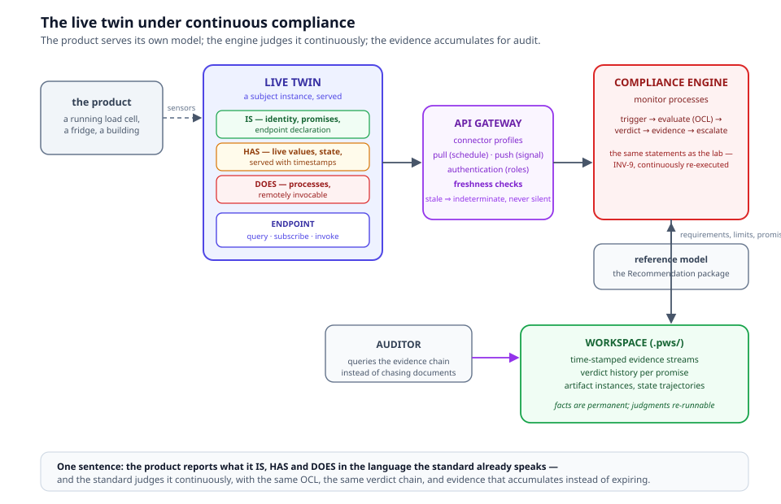
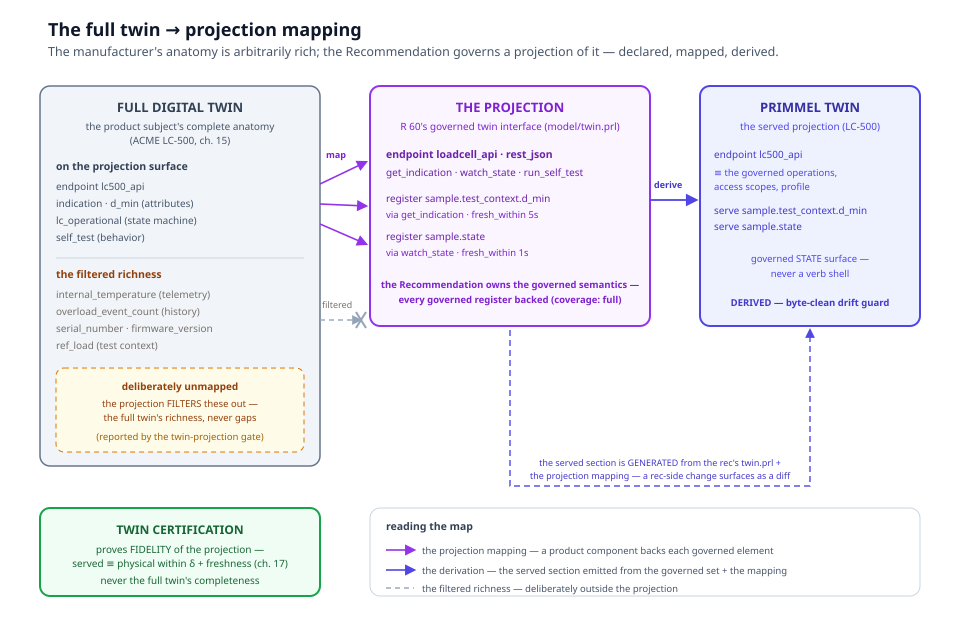
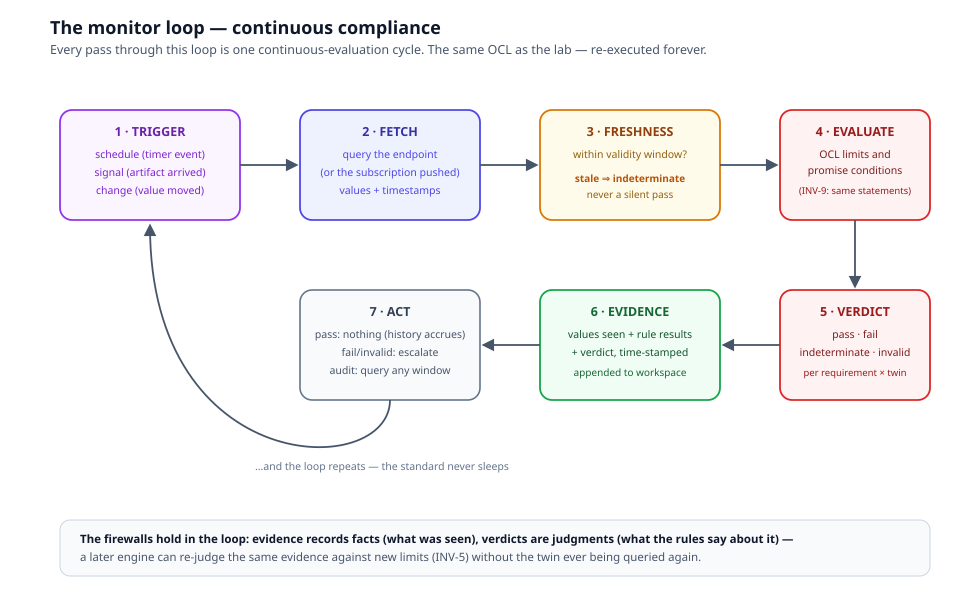
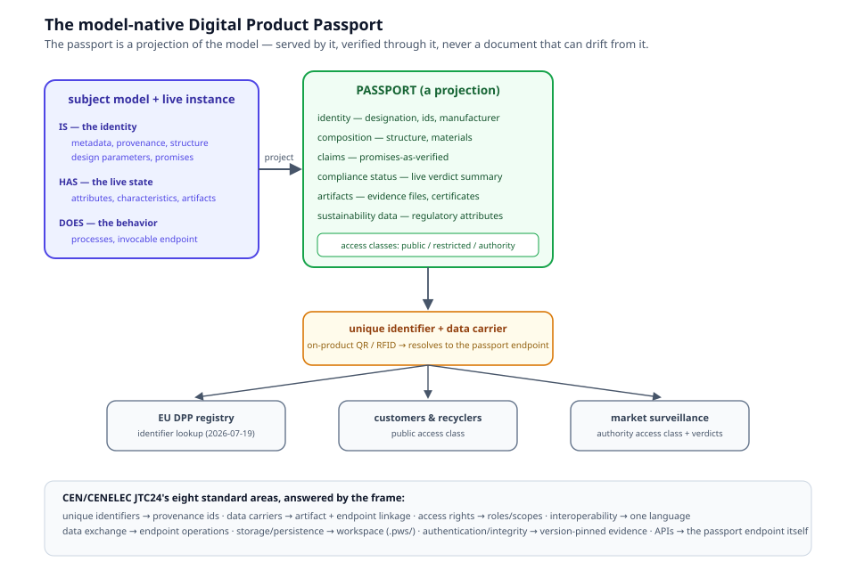

# Chapter 14 — Live Twins and Continuous Compliance

> *In this chapter:* why a certificate that freezes time is not enough,
> what a **live twin** is, how a product's model becomes its passport,
> and how the Compliance Engine runs the standard *next to* the product
> — forever. This is the chapter where the whole frame starts breathing.

---

## 14.1 The problem: certificates freeze time

Think about what a certificate actually says. A load cell gets type
approval: on a Tuesday, in a laboratory, five samples of one model
behaved within tolerance. The certificate is true — about that Tuesday,
those samples, that lab. Then the product ships ten thousand units.

Over the next ten years: firmware updates change the indication
pipeline. Production drifts. A unit is installed next to a furnace.
Another is dropped. The certificate knows none of this. The market's
trust in the product rests on a photograph of the past.

Everyone in the chain feels the gap:

- the **manufacturer** can't prove their product stayed good — only
  that it once was;
- the **user** (the factory that bought the cell) can't show their
  measurements are trustworthy *today*;
- the **regulator** checks compliance by raids and paperwork, years
  apart;
- the **auditor** reconstructs history from PDFs and emails.

The gap is not anyone's fault. It is structural: the standard was
*checked once* because checking was expensive, manual, and offline.

## 14.2 The idea in one paragraph

> The product reports what it IS, HAS and DOES — in the same language
> the standard is written in. The standard judges it continuously, with
> the same OCL, the same verdict chain, and evidence that accumulates
> instead of expiring.

Three capabilities make it real, and each will get its turn below:

1. the **live twin** — the product, serving its own model and state;
2. the **model-native passport** — the product's model *is* its
   passport (the EU's Digital Product Passport, answered natively);
3. the **Compliance Engine** — the standard, executed continuously
   against the live twin, producing evidence for audit.



## 14.3 The live twin

Chapter 3 defined instantiation: a Sample is an instance of a Model,
inheriting by delegation, exhibiting its own values. A **live twin** is
what happens when that instance is *switched on*:

> **A live twin is a subject instance whose anatomy is served.**
> Its provider runs it; the world can query it.

Anatomy of the twin, in the frame's own terms — no new anatomy needed,
only plumbing to serve it:

- **IS — the twin's identity, and it is the passport.** Metadata,
  provenance, structure, design parameters, designed conditions,
  promises. Ask the twin "what are you?" and it answers from its model.
  One IS-level addition: the **endpoint declaration** — "this product
  offers this interface" is part of the type definition, like a marking
  or a software identification.
- **HAS — the twin's exhibition, served live.** Attributes, dimensions,
  operational state, characteristics, environmental context, artifact
  instances — bound to endpoint operations and served **with
  timestamps**. A value without a time is not evidence; the freshness
  semantics of §14.5 turn that into a rule.
- **DOES — the twin's processes, invocable.** "Run your self-test."
  "Report your warm-up state transition." Process characteristics
  (drift, response times) stream as live telemetry.

The twin is served by its **provider** — the manufacturer, or the
owner-operator of the deployed unit. And here is the ecosystem point
that makes it more than a gadget: *the twin is a served instance of a
model that someone else can integrate into theirs.* Chapter 15
develops the full supply chain; the one-line version is that the
manufacturer's product model — the twin's type — is itself mapped to
the Recommendation, so conformance composes.

**The full twin and the governed projection.** A manufacturer's digital
twin of their own product can be arbitrarily rich — physics simulation,
diagnostics telemetry, event history, production data. That is the
*full twin*, and nothing a Recommendation says constrains it. But what
the Recommendation *governs* is a projection of it — and the projection
is itself declared, mapped, and derived:



- **What the device IS** — the full twin: the manufacturer's complete
  representation, any shape. The LC-500's subject anatomy (chapter 15)
  carries internal-temperature telemetry, an overload event history,
  and production data alongside the metrological attributes.
- **What the standard GOVERNS** — the projection: the Recommendation
  declares the governed twin interface (the endpoint, the served
  registers, the freshness windows — R 60 does, `model/twin.prl`), and
  the product's projection mapping proves every governed register is
  backed by a product component (the coverage calculus, chapter 5).
  The richer anatomy is *deliberately unmapped* — the filtered richness
  the projection leaves behind, never a gap.
- **What certification PROVES** — fidelity of the projection: the
  served values are true within the declared tolerance and freshness
  (chapter 17), *never* the full twin's completeness. Completeness
  against what?

So the Primmel twin is a governed **state projection**, not a command
interface — you read what the standard governs from it. And because the
governed semantics belong to the Recommendation, the product's served
twin section is *derived* from the Recommendation's declaration plus
the projection mapping — never hand-mirrored: a change to the governed
set surfaces as a diff in the product package, where a mirrored copy
would have drifted silently (the twin-projection drift guard,
TODO.v2/16).

## 14.4 The integration language: endpoint, serve, connectors

A twin that can't be queried is a photo. The integration language is
three small primitives:

**`endpoint`** (IS-level) — the subject's declared API surface:

```prl
endpoint lc500_api {
  operation get_indication   { kind query     serves indication }
  operation watch_state      { kind subscribe serves state }
  operation run_self_test    { kind invoke    does self_test }
  access { public: [get_indication]  registered: [watch_state]  authority: [run_self_test] }
  profile rest_json
}
```

Operations have a **kind** — `query` (pull a current value),
`subscribe` (push on change), `invoke` (trigger a process) — and a
payload schema (QuantityValue, per INV-1, always with unit and
timestamp). **Access scopes** name who may call what.

**`serve`** (HAS-level) — the binding from an aspect to an operation:

```prl
serve sample.test_context.d_min via get_indication { fresh_within 5s }
```

Freshness is part of the binding: the engine must know how old a value
may be before it stops meaning anything.

**Declaration vs binding.** A Recommendation ships the twin
DECLARATION — the endpoint, the served aspects, the operational state
machine, and the serve capabilities with their `fresh_within` windows
(what CAN be served and how fresh it must be; R 60 does,
`model/twin.prl`). The live BINDING — the gateway integration that
actually serves values — is deployment content (`model/gateway.yaml` in
the consuming package). A declared-but-unbound serve gates nothing: an
offered capability is not an outage, verdicts stay untouched until a
deployment binds the operation (AGENTS.d/12, TODO.roadmap/49).

**Connector profiles** — protocol bindings declared per endpoint:
`rest_json`, `mqtt`, `opc_ua`, `file_drop` (for batch/plugin sources).
The model is protocol-neutral; profiles bind protocols. This is what
keeps "a live twin" from meaning "a REST API and nothing else".

## 14.5 The monitor: continuous compliance

The **Compliance Engine** is the tertiary tier plus the gateway and the
monitors, run as a service. A **monitor** is a continuous process:



Walk the loop once, slowly — every step exists for a reason:

1. **Trigger.** Something says *check now*: a timer (every hour), a
   signal (an artifact arrived), a change (a watched value moved).
   Without triggers, "continuous" has no clock.
2. **Fetch.** The engine queries the endpoint — or receives the push
   from a subscription. Values arrive with timestamps.
3. **Freshness.** Every value is checked against its validity window.
   A stale value does **not** fail the product — it degrades the
   verdict to `indeterminate`. Why not fail? Because a network outage
   is not a metrological event. And why not pass? Because silence is
   not evidence. *Stale ⇒ indeterminate, never a silent pass.*
4. **Evaluate.** The requirement's OCL limit and the promise's
   conditions run over the fresh values — the *same statements* the lab
   used (INV-9). No second dialect for "online mode".
5. **Verdict.** `pass · fail · indeterminate · invalid`, per
   requirement × twin. Invalid still means "the setup was wrong"
   (preconditions), fail means "the product was wrong".
6. **Evidence.** Values seen, rule results, verdict, timestamps —
   appended to the workspace. Facts only; permanent.
7. **Act.** Pass: nothing happens — history accrues, and *that* is the
   deliverable. Fail/invalid: escalation (notify, flag the certificate,
   open a case). Audit: query any time window.

The firewalls hold inside the loop: evidence is fact, verdict is
judgment, and a later engine can re-judge the same evidence against new
limits (INV-5) without asking the twin anything.

## 14.6 The model-native Digital Product Passport

The EU is mandating, regulation by regulation, that products carry a
**Digital Product Passport**: a structured digital record of identity,
composition, compliance and sustainability data, reachable through a
data carrier on the product, with a unique identifier, access control,
persistence, and APIs — the ESPR (EU 2024/1781) and CEN/CENELEC JTC24's
eight standard areas.

Most industries will answer with a *document*: a database row per
product, PDFs attached, compliance typed in by hand. A document can
drift from the product. It can be filled optimistically. It knows
nothing the claimant didn't type.

The Primmel answer is **model-native**:



> The passport is a **projection** of the product's subject model plus
> its live instance state — generated from the model, served by the
> endpoint, verified through the engine. It cannot drift from the model
> because it *is* the model.

Map the JTC24 areas and the frame answers each: unique identifiers →
provenance ids; data carriers → artifact/endpoint linkage; access
rights → roles and access scopes; interoperability → one language; data
exchange → endpoint operations; storage/persistence → the workspace;
authentication/integrity → version-pinned evidence; APIs → the
passport endpoint itself.

Two modes, matching chapter 15's supply chain: the **abstract
passport** — point-in-time, as-certified, for a buyer doing design-time
integration — and the **live passport** — continuously verified, for a
regulator watching the fleet.

**Shipped (task 35, ● smart 244ea47).** The passport is no longer a
design sketch. The kernel's `passport` construct declares it on the
product model — `upi { pattern … level … }` (the ESPR model/batch/item
levels), the `carrier` facet (the QR payload resolves to the passport
endpoint URL), and per-class content classes — linted by the catalog
trio **C86** content-resolves, **C87** access-leak, **C88** upi-scheme
(chapter 11). The projection engine (`browser/src/data/passport.ts`)
builds both modes — abstract pins a version; live *requires* the
computed verdict-stream read, never a fabricated status — and projects
per access class **fail-closed**: public output carries only public
entries (C87 is the lint, the engine is the enforcement). Serving:
`GET /passport/<upi>.json?class=public|restricted|authority` plus the
public rendered view; the registry feed `GET /passport/registry.json`
is the one-way outward projection, deliberately a stub (no auth, no
push — §12.5). The ACME LC-500 pilot declares
`public { identity composition promises_as_verified }` and
`authority { live_compliance_status }` — `artifacts` and
`sustainability` deliberately absent, nothing honest behind them yet —
and its passport serves at `/passport/upi:acme:lc500` (the pilot,
§14.9). And the JTC24 alignment above is not prose alone: the
machine-checkable half is authored data — `data/r60/evaluation/
r60-to-dpp.prm`, the R 60 → JTC24 mapping on the `.prm` primitive with
the coverage gate (an area neither mapped nor named is a silent gap and
fails) — with `docs/dpp-jtc24-alignment.md` in the platform repo as the
human-readable record, kept current as JTC24 publishes.

## 14.7 The API gateway for implementation models

The oldest piece of this story is 2021: the PAS 2060 plugin. An
organization's implementation model (their carbon-neutrality operations)
needed data from *outside* — a building model in IFC, meters, reports.
The plugin mechanism fed external data into the model's measurement
variables, and `validate_measurement` ran over it — the guide's own
words: *"use a plugin to collect measurement data and run measurement
validation tests continuously."*

The v3 gateway generalizes that pattern into the connector layer of
§14.4: **external sources bind to the implementation model's registers**
— domain models (IFC and friends), APIs, file drops, streams — with
authentication by role, freshness windows on every binding, and
stale⇒indeterminate semantics. Continuous compliance for management
standards (a QMS watching its own KPIs) uses exactly the same machinery
as a metrology engine watching a load cell. One gateway, both families.

## 14.8 Who runs what

- **Twin provider** (manufacturer, or the unit's owner-operator): runs
  the live twin and its endpoint. Speaks for the product.
- **Engine operator** (issuing authority, regulator, market
  surveillance — or the manufacturer for self-monitoring under
  third-party audit): runs the Compliance Engine against the reference
  model. Speaks for the standard.
- **Auditor**: queries evidence chains instead of chasing documents.
  Speaks for the record.

Separation of speakers is what keeps the loop honest: the product's
claims come from the twin, the judgment comes from the engine, and the
record stands between them.

## 14.9 Worked example A — a live load cell under R 60

ACME ships LC-500 units with a `lc500_api` endpoint. A quarry's belt
scale integrates one. The IA's engine subscribes to `watch_state` and
runs an hourly monitor:

- Fetch: indication 402.4 kg at 14:00:03 (fresh).
- Evaluate: the running-sample requirement
  `indication within MPE(load, class)` against the live classification
  `C3` — the same `lookupMPE` the lab used.
- Verdict: pass. Evidence appended.
- 14:37: the unit reports `fault` state → verdicts `invalid` (not
  fail) and a service case opens; the state trajectory is in the trace.
- Quarterly: the engine re-runs the creep characteristic derivation
  over streamed indication series — the same OCL as the type test —
  and the drift verdict history is the audit's answer to "show me the
  fleet."

**Made real (TODO.roadmap/37).** This worked example runs in the smart
repo as the live-twin pilot: `primmel-packages/acme-lc500` (the product
reference model with the declared `lc500_api` endpoint and the aspect-
by-aspect R 60 mapping) and `primmel-packages/quarry-belt-scale` (the
quarry's implementation package, consuming in both modes) are the
shipped packages; the pilot executes the type evaluation against the
R 60 program for real (three samples, the certificate issued with
promises-as-verified), serves ONE simulated twin from a demo provider,
runs the hourly + `on change state` monitor loop over a simulated
quarter (an injected drift ⇒ `fail` + the certificate flag, a feed
outage ⇒ `indeterminate`, a `fault` push ⇒ the service case), serves
the passport (§14.6's minimal view) at `/passport/upi:acme:lc500` with
the QR payload resolving to its JSON, and answers the audit-chain query
clause → promise → verdict history → batch records. One command:
`cd browser && npm run pilot`; the six step assertions live in
`browser/e2e/pilot.e2e.ts` (service-level, the twin machinery's own
acceptance precedent).

## 14.10 Worked example B — a fridge under ESPR

No metrology anywhere — deliberately. A fridge maker authors
`FridgeModel X200` as a subject: IS (design parameters: rated energy
class, refrigerant type; promises: "EER ≥ 3.2 across rated ambient",
"R-600a charge ≤ 60 g"), HAS (per-unit attributes: serial, measured
energy consumption, compartment temperatures), DOES (cooling process,
defrost cycles).

- The **abstract passport** serves a retailer at purchase: the model's
  identity, composition, as-tested claims — point-in-time.
- The **live passport** serves market surveillance: sampled units in
  the field stream energy consumption; the engine verifies the EER
  promise continuously; failures flag the series.
- The manufacturer's product model was mapped to the (future) ESPR
  delegated-act reference model — coverage computed, not asserted.

Same anatomy, same engine, different science. That is the point of a
universal subject language.

## 14.11 Grammar sketch *(illustrative v3 syntax)*

```prl
subject LoadCellModel {
  is {
    endpoint lc500_api { … }          # §14.4
    promises { mpe_within(class, rated) }
  }
  has {
    serve sample.indication   via get_indication { fresh_within 5s }
    serve sample.state        via watch_state
    characteristics { creep c_c = ΔOUT/Δt under constant load }
  }
  does { behavior self_test { in () -> out diagnostic_report } }
}

monitor fleet_watch over LoadCellModel {
  triggers { every 1h ; on signal artifact_arrived ; on change state }
  evaluate { requirements applicable_to(this.classification) ; promises all }
  emit     { evidence -> workspace ; verdicts -> verdict_log }
  escalate { on fail: flag_certificate ; on invalid: open_service_case }
}
```

## 14.12 Validation rules

- every `serve` names a declared aspect and a declared operation; unit
  coherence between aspect and payload is checked;
- every endpoint operation has an access scope and a payload schema
  (QuantityValue with timestamp);
- every monitor's `evaluate` refs resolve to requirements/promises
  applicable to the monitored subjects;
- a monitor without an escalation path for `fail` is a warning;
- a live binding without `fresh_within` is an error (no stale
  semantics, no live binding);
- evidence emitted by monitors carries definition version pins (INV-8).

## 14.13 Summary

- Certificates freeze time; live twins let the standard run next to the
  product, forever.
- A live twin is a subject instance whose anatomy is served: IS (the
  passport), HAS (live values with timestamps), DOES (invocable
  processes).
- The twin is a projection: the full twin is the manufacturer's and
  arbitrarily rich; the Recommendation governs the projection —
  declared, mapped (every governed register backed), and derived, never
  hand-mirrored. Certification proves the projection's fidelity, never
  the full twin's completeness.
- Three small primitives integrate it: `endpoint`, `serve`, connector
  profiles. One process consumes it: the `monitor`.
- The passport is a projection of the model — abstract
  (point-in-time) or live (continuous) — answering the EU DPP system
  natively.
- The API gateway generalizes the 2021 plugin: external data feeds any
  implementation model's registers, with freshness semantics.
- Stale data degrades to `indeterminate`; silence is not evidence; the
  firewalls hold inside the loop.

*Next: [Chapter 15 — The Model Supply Chain](15-model-supply-chain.md):
who publishes which model, and how the manufacturer's product model is
consumed — as an abstract reference or as a live twin.*
