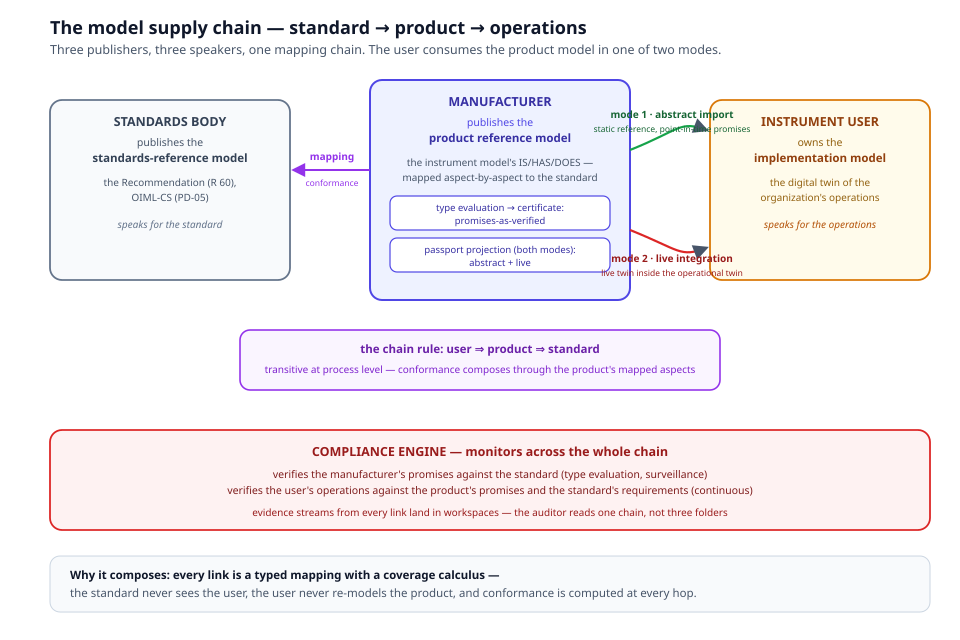

# Chapter 15 — The Model Supply Chain

> *In this chapter:* who publishes which model — the standards body, the
> manufacturer, the instrument user — and how a manufacturer's **product
> reference model**, mapped to the Recommendation, is consumed by users
> in two modes: as an abstract reference or as a live twin. This is the
> ecosystem chapter: the one where conformance starts to compose.

---

## 15.1 Three publishers, three speakers

Chapter 5 taught two model kinds: reference and implementation. The
twin direction asks a sharper question — *who does this model speak
for?* — and the answer is three roles:

| Publisher | Model | Speaks for |
|---|---|---|
| **Standards body** | standards-reference model (R 60, OIML-CS) | the standard |
| **Manufacturer** | **product reference model** (their instrument model) | the product |
| **Instrument user** | implementation model (their operations) | the operations |

The manufacturer's model is the new citizen. It is a *reference* model —
it states what the product is and claims — and it is *not* derived from
the Recommendation: ACME's LC-500 exists as a product whether or not
R 60 exists. What links the two is the mapping discipline of chapter 5.

## 15.2 The product reference model

A manufacturer of an OIML SMART-compliant instrument authors their
product model exactly as any subject model — the full IS/HAS/DOES
anatomy:

- **IS**: design parameters (E_max = 500 kg), designed conditions,
  promises ("holds class C6 over the rated range"), structure,
  metadata, provenance;
- **HAS**: exhibited attributes per unit, dimensions (the classification
  the unit presents), characteristics (the error/creep quantities the
  standard's tests will compute), state;
- **DOES**: the measurement process, the response behaviors, the
  self-tests.

And then the decisive act: **every aspect, entity, relation and promise
is mapped to the Recommendation's** — aspect-by-aspect, node to node,
constraint to constraint, promise to requirement. The mapping is the
manufacturer's *conformance claim, made computable*: "our E_max is your
E_max; our creep characteristic answers your creep requirement; our
rated range satisfies your condition tiers."

Why does the mapping matter so much? Because it converts marketing into
machinery. An unmapped product model is a brochure. A mapped product
model lets an engine answer: *against which clause is this claim made,
and does the evidence support it?*

Type evaluation then does its job (chapter 7 of the core volume):
samples of the model are tested, verdicts are computed, and the
certificate is issued with the **promises-as-verified**. At that point
the product model carries two strata of promise: the claims as declared
and the claims as verified — distinguishable in the model, and both
citable by downstream consumers.

## 15.3 The two consumption modes

The instrument user — the integrator building a weighing system, the
quarry running the belt scale, the factory whose QMS depends on the
measurements — owns an implementation model: the digital twin of their
organization's operations. They consume the product model in one of
**two modes**, and serving both is the manufacturer's job:



**Mode 1 — abstract import.** The product model enters the user's
implementation model as *static reference content*: designation,
design parameters, designed conditions, and the promises as general or
**point-in-time** claims (as-certified, at a pinned version). This is
design-time integration: the integrator's model reasons about the
instrument as-specified ("the scale's capacity is within the cell's
E_max"), cites the certificate, and pins the version. Nothing is live;
nothing needs to be. The import is a mapping too — the user's model
maps its usage to the product's promised aspects — so coverage applies:
*how much of the product's promised envelope does this installation
actually use?*

**Mode 2 — live integration.** The deployed instance serves a live twin
(chapter 14), and the user's implementation model integrates it
*directly*: the instrument becomes a live component of the operational
twin. Its served aspects feed the user's registers (the quarry's
throughput calculation reads the cell's indication from the endpoint),
its operational state gates the user's processes (no batch while the
cell reports `fault`), and its promises are monitored by the Compliance
Engine inside the user's own compliance story. The user's evidence now
contains the instrument's evidence — by reference, with timestamps and
version pins, never by copy.

The choice is per deployment, per organization, per aspect: a buyer may
import abstractly today and go live next year. Both modes read from the
same product model; the manufacturer authors once.

## 15.4 The chain rule: user ⇒ product ⇒ standard

Stand back and the topology is a chain of typed mappings:

```
user's implementation ──maps──▶ product reference model ──maps──▶ Recommendation
```

The calculus of chapter 5 gives it teeth:

- **Transitivity at process level**: user ⇒ product and product ⇒
  standard yield user ⇒ standard *through the mapped aspects*. The
  quarry can answer "is our weighing operation compliant with R 60?"
  partly by computation — the part that flows through the cell's mapped
  promises.
- **Model-level non-transitivity** is the guardrail: the chain only
  works through *shared components*. If the user's process never
  touches the cell's mapped aspects, no compliance flows — and the
  coverage report says so, visibly.

This is what "conformance composes" means in practice: nobody re-models
anybody. The standard never sees the user; the user never re-derives
the product; each link is a typed, justified, coverage-computed
mapping.

## 15.5 The Compliance Engine across the chain

The engine of chapter 14 operates at every link:

- **Manufacturer ↔ standard**: type evaluation first (samples tested,
  certificate issued), then surveillance — the engine monitors the
  product fleet against the promises it certified.
- **User ↔ product**: the user's monitors watch the integrated twins
  against the product's promised envelope (is this cell still within
  class? did its state gate trip?).
- **User ↔ standard**: where the standard reaches into operations
  (installation conditions, usage requirements), the same engine
  evaluates the user's evidence directly.

Every link emits into workspaces, so the auditor reads *one evidence
chain* — standard clause → product promise → live verdict → operational
record — instead of three folders in three organizations.

## 15.6 The passport, both modes

Chapter 14's model-native passport is the product model's public
projection, and it too serves both modes:

- the **abstract passport** — point-in-time: identity, composition,
  as-certified claims. What a buyer integrates at purchase; what the
  EU DPP registry looks up by unique identifier;
- the **live passport** — continuous: the same identity and composition,
  plus live compliance status computed by the engine. What market
  surveillance actually wants when it scans the QR code on the product.

## 15.7 Worked example — ACME LC-500 into the quarry's belt scale

1. **ACME authors** `LoadCellModel LC-500`: 38 attributes, promises per
   accuracy class, the creep behavior, endpoint `lc500_api` declared.
   Every promise mapped to R 60 clauses; the mapping published with the
   model.
2. **Type evaluation**: three samples, the full R 60 program; verdicts
   computed; certificate `R60/2021-…` issued with promises-as-verified
   (class C6 over −10…+40 °C).
3. **The quarry's integrator** imports the product model abstractly:
   designs the belt scale against `E_max`, `v_min`, rated conditions;
   cites the certificate; pins edition 2021.
4. **Go-live**: one cell serves its endpoint; the quarry's
   implementation model subscribes to `watch_state`, reads
   `get_indication` per batch, and the IA's engine monitors the
   mapped promises hourly. The quarry's QMS dashboard shows the cell's
   live compliance as one component of its own.
5. **Audit day**: the auditor follows one chain — R 60 clause → ACME
   promise → last quarter's verdict history → this morning's batch
   records. No emails.

## 15.8 Grammar sketch *(illustrative v3 syntax)*

```prl
package acme-lc500 {
  kind product_reference
  uses [oiml-core]

  subject LC500 extends LoadCellModel { … }

  map_profile to_r60 {
    mapping { from e_max        to R60#attr_e_max
              justification "same quantity, same clause definition" }
    mapping { from creep        to R60#behavior_creep }
    mapping { from mpe_within   to R60#/req/metrological/mpe
              description "class-limited error promise answers the MPE requirement" }
  }

  passport lc500_passport {
    identifier upi:acme:lc500
    public   { identity, composition, promises_as_verified }
    authority { live_compliance_status }
  }
}
```

## 15.9 Validation rules

- a `product_reference` package declares the standards-reference
  packages it maps to; unmapped IS promises are flagged at authoring;
- mapping targets resolve into the Recommendation (no dangling clause
  refs); conformance-critical aspects (characteristics under test)
  unmapped ⇒ coverage warning;
- abstract imports pin a version (no unpinned reference consumption);
- live integrations declare the endpoint and the `serve` bindings they
  consume (chapter 14's rules apply);
- the passport projection contains only aspects that resolve — public
  classes contain nothing marked restricted.

## 15.10 Summary

- Three publishers: the standard (reference), the manufacturer (product
  reference), the user (implementation). Each speaks for something
  different; mapping is the only relation between them.
- The product reference model is the manufacturer's conformance claim
  made computable — every aspect mapped to the Recommendation; the
  certificate carries promises-as-verified.
- Users consume it as an abstract import (point-in-time) or as a live
  twin (continuous). Both read one model.
- The chain rule — user ⇒ product ⇒ standard — makes conformance
  compose through mapped aspects, with the coverage calculus as the
  guardrail.
- The auditor reads one evidence chain end to end.

*Next: [Chapter 6 — Data and values](06-data-and-values.md) continues
the kernel tour; the roadmap to make this chapter run is in
`shared/roadmap.md`.*
