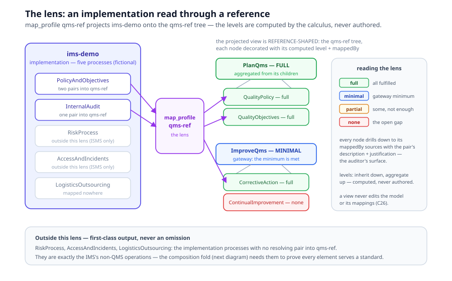
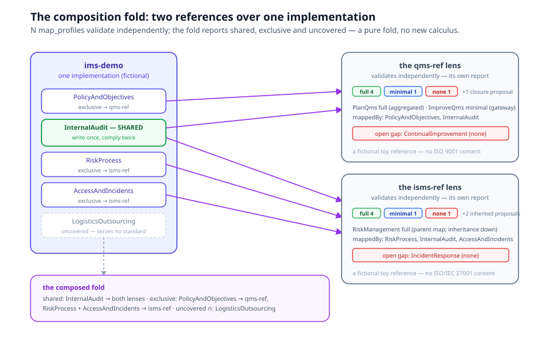

# Chapter 16, Views and Lenses

> *In this chapter:* what a view *is*, a reference-shaped projection,
> read-only by construction; the CoverageReport as a lens; the coverage
> levels on a worked (fictional) integrated management system; the
> multi-reference composition fold; and the platform's `/app/lenses`
> surface that renders all of it. Chapter 5 defined the mapping
> relation; this chapter is about *reading* models through it.

---

## 16.1 What a view is

Chapter 5 (§5.6 d) stated the intuition: a complex model can be read
*through* a shallower one, "the QMS view of an integrated management
system" shows the QMS-relevant processes with their coverage against
the QMS reference, while the model stays whole. This chapter makes the
view precise.

**The projected view is reference-shaped.** A lens over an
implementation model and one of its `map_profile` namespaces is:

1. the **reference model's process tree**, each node decorated with its
   computed coverage level and the implementation elements that fulfil
   it (`mappedBy`); plus, on the side,
2. the **partition of the implementation's elements** into "in this
   lens", the elements with at least one *resolving* mapping pair into
   the namespace, and "outside this lens" (everything else).

It is *not* the implementation's tree filtered through the reference's
shape. That alternative was considered and rejected: coverage levels
like `minimal` and `partial` exist only as roll-ups over the
reference-tree parents (aggregation up, inheritance down, §5.3), so
the reference tree is the only shape the calculus can decorate. The
implementation enters the lens as mapping *sources*, never as the
skeleton.

Two consequences worth internalizing:

- **"Outside this lens" is first-class output, not an omission.** Those
  are exactly the organization's operations that make no claim against
  this reference, and the composition fold (§16.5) needs them to prove
  that every element serves *some* declared standard.
- **A view never mutates anything (C26).** The discipline holds at
  three layers: the linter rejects a view that names an undeclared
  element or an `against` namespace with no declared `map_profile`; the
  kernel's projection is deeply frozen (the input report is provably
  untouched); the platform's lens service only reads packages and
  writes a generated artifact, it never writes back to a model.

## 16.2 The CoverageReport as lens

The lens's content is one kernel computation: `computeCoverage` over
the implementation's mappings filtered to one target namespace, walked
across the reference forest. The report carries, per reference
component (in tree order):

| Field | Meaning |
|---|---|
| `coverage` | the level: **full** / **minimal** / **partial** / **none** (§5.3) |
| `directlyMapped` | a pair names this component itself |
| `mappedBy` | the implementation sources mapped directly to it |
| `inheritedFrom` | the nearest mapped ancestor, when the cover is inherited |

,  plus the implementation-side lists: `unmappedImplementation` (the
"outside this lens" set), `unresolvedMappings` (dangling pairs , 
reported, never silently dropped) and `proposals` (discovery
candidates: transitive, inherited, closure, *flagged for confirmation,
never asserted*: a human confirms with justification).

One report, two honest renderings ●:

- **the auditor's rendering (primary):** the reference tree with
  coverage badges; each node drills down to its fulfilling sources with
  the pair `description` and `justification`, the fulfilment
  documentation demanded at audit strictness;
- **the operator's rendering (secondary):** the inverse index, per
  implementation element, the reference targets it fulfils and the
  levels they compute to. A fold over the same report, never computed
  afresh.

A **`view_profile`** is a second, optional filter on top of the report:
it narrows *which implementation voices are audible* in the lens
(`visible { … }` against one namespace) without changing the lens's
reference shape. An empty `visible` means "all", so the plain
per-reference lens needs no authored profile; profiles are for
role-scoped sub-lenses. Their `roles` are display metadata, rendered,
never gated: a lens is a reading convenience, not an access boundary.

## 16.3 The worked example: a fictional IMS

> **These models are FICTIONAL.** `qms-ref`, `isms-ref` and `ims-demo`
> are tiny invented teaching models shipped under `primmel-packages/`.
> They are *flavored* like ISO 9001 / ISO/IEC 27001 and an integrated
> management system, but they contain **no real ISO content**, the
> calculus mechanics are what is being demonstrated, and licensing is
> avoided by construction. Every number below is computed by the kernel
> from these toy models and pinned in the platform's test suite.

The toy IMS runs five operating processes and maps them to two toy
references, one `map_profile` per reference:

| IMS process | maps to | the rule it exercises |
|---|---|---|
| `PolicyAndObjectives` | `qms-ref#QualityPolicy` **and** `qms-ref#QualityObjectives` | multi-target pair list |
| `InternalAudit` | `qms-ref#CorrectiveAction` **and** `isms-ref#RiskTreatment` | one process serving **both** standards |
| `RiskProcess` | `isms-ref#RiskManagement` (the *parent*) | inheritance down the subtree |
| `AccessAndIncidents` | `isms-ref#AccessControl` | one branch of a gateway |
| `LogisticsOutsourcing` | *nothing* | the deliberately uncovered element |



The two computed tables, small enough to print, rich enough to fire
every rule:

| qms-ref component | level | why |
|---|---|---|
| `PlanQms` | **full** | aggregated, both children full |
| `QualityPolicy` | **full** | direct pair |
| `QualityObjectives` | **full** | direct pair |
| `ImproveQms` | **minimal** | gateway minimum met by one branch |
| `CorrectiveAction` | **full** | direct pair (the shared `InternalAudit`) |
| `ContinualImprovement` | **none** | the open QMS gap |

Summary: full 4 · minimal 1 · none 1, plus one **closure** proposal
(both children mapped ⇒ a pair to the parent is *proposed*, never
asserted).

| isms-ref component | level | why |
|---|---|---|
| `RiskManagement` | **full** | direct pair at the parent |
| `RiskAssessment` | **full** | inherited from the parent |
| `RiskTreatment` | **full** | its *own* direct pair (the shared `InternalAudit`) wins over the inherited cover |
| `IsmsOperation` | **minimal** | gateway minimum met by one branch |
| `AccessControl` | **full** | direct pair |
| `IncidentResponse` | **none** | the open ISMS gap |

Summary: full 4 · minimal 1 · none 1, plus two **inherited** proposals
(one per descendant of the mapped parent).

Each `map_profile` also carries a `coverage` block of authored
assertions, tripwires, not content: coverage is *computed*; the block
only asserts what the calculus already proves, and the linter errors
when the two disagree.

## 16.4 N map_profiles validate independently

One implementation declaring several `map_profile`s needs no new
validation machinery, independence is the calculus's semantics ●:

- `computeCoverage` filters the mappings to **one** target namespace;
  namespaces never leak into each other's reports;
- the linter checks each profile's coverage tripwires against **its
  own** namespace's reference (references are keyed by namespace; an
  absent reference falls back to the implementation's own
  `Namespace#…` alias forest, the declared local copies, C21).

The platform pins this over the real packages: each of ims-demo's two
profiles, *computed from its own pairs alone*, reproduces exactly the
report computed from the full mapping set, in either computation
order, and the per-namespace levels, `mappedBy` sets and open gaps are
distinct and correct per the tables above. The **only** overlap between
the two lenses' fulfilling sources is `InternalAudit`, and that is not
pollution, it is the authored shared pair: the "write once, comply
twice" economy the next section reports on. Each namespace even carries
its *own* description and justification for that shared pair.

## 16.5 The composition fold

The multi-reference report is a **pure fold** over the N per-namespace
lenses, no new calculus, no kernel change:

```text
ComposedCoverage {
  implementation: string
  references: CoverageReport[]                # the N reports, as-is
  sharedSources: Record<string, string[]>     # source → the ≥2 namespaces it serves
  exclusiveSources: Record<string, string>    # source → its single namespace
  uncoveredImplementation: string[]           # sources in NO namespace
  uncoveredReferenceComponents: Record<string, string[]>  # ns → components at none
}
```

The derivation is mechanical: group each lens's resolved sources by
source; the intersections fall out. Each field is an audit answer:

- `sharedSources`, the "write once, comply twice" witness: for the toy
  IMS, `InternalAudit → [isms-ref, qms-ref]`;
- `exclusiveSources`, `PolicyAndObjectives → qms-ref`;
  `RiskProcess, AccessAndIncidents → isms-ref`;
- `uncoveredImplementation`, the ∩ of the per-lens unmapped lists:
  `LogisticsOutsourcing`, *this operation serves no declared
  standard*;
- `uncoveredReferenceComponents`, each reference's own open gap list:
  `qms-ref → [ContinualImprovement]`, `isms-ref → [IncidentResponse]`.



Layered chains (reference ⇒ reference ⇒ implementation, any number of
layers, §5.6 a) compose hop by hop; the supply-chain gate of chapter
15 remains their home. The fold here is about *one* implementation read
against *several* references at once.

## 16.6 The platform surface: `/app/lenses`

The platform renders all of this from a generated projection ●, the
coverage-surface discipline of the coverage pages, applied to lenses:
a build-side module discovers every `map_profile` pair over
`primmel-packages/`, computes each lens with the kernel (plus one
filtered lens per `view_profile`, and the fold per implementation), and
serializes a typed artifact; the page renders the artifact with no
runtime recomputation.

The walkthrough:

1. **The selector**, implementation → map namespace → optional
   sub-lens (a `view_profile`, its roles shown as badges). The default
   is always the full, unfiltered lens.
2. **The projected tree**, the reference-shaped rendering with level
   badges, "inherited from X" markers, and the per-node drill-down to
   the fulfilling sources' descriptions and justifications. A toggle
   switches to the inverse index (the operator's rendering).
3. **Warnings and proposals**, unresolved mappings in red when
   non-empty; discovery proposals in their own block, explicitly
   *flagged for confirmation, never asserted*.
4. **Outside this lens**, the unmapped implementation elements, with
   one honesty footnote: the C21 `Namespace#…` alias declarations ride
   the kernel's unmapped list (they are implementation-side processes,
   never mapping sources), so the page filters them out and *counts*
   them in the footnote, reported, never hidden.
5. **The union report** (implementations mapping ≥2 namespaces), the
   per-reference lenses side by side; the shared elements with *both*
   fulfilments visible (each namespace's own pair documentation); the
   exclusive elements with their targets; the per-reference open gaps
   with their drill-down paths; and the uncovered ∩ with the same
   alias-count footnote.

## 16.7 Validation rules

The mapping-family rules (C21–C26, chapter 11) as the lens relies on
them:

- mapping targets resolve, as `Namespace#ElementID` aliases declared
  locally in the implementation (C21), never content-merged;
- the direction is fixed: implementation ⇒ reference, never the
  reverse (C22);
- authored coverage assertions match the calculus for their namespace
  (C23), the tripwire semantics of §16.3, checked per profile against
  its own reference;
- an import is never expressed as a mapping, nor a mapping as an
  import (C24), a `map_profile` namespace is not a `uses`;
- pairs carry a `description` at audit strictness (C25), the auditor's
  surface is authored, not optional;
- a view never adds, removes, or edits the mappings of the model it
  reads (C26), §16.1's three-layer discipline.

## 16.8 Summary

- A lens is **reference-shaped**: the reference tree decorated with
  computed coverage and the fulfilling sources, plus the honest
  partition of the implementation into in-lens and outside.
- One CoverageReport, two renderings: the auditor's tree and the
  operator's inverse index. A `view_profile` filters which voices are
  audible; roles are displayed, never gated.
- The worked IMS is **fictional**, toy references, no ISO content , 
  and every number it produces is kernel-computed and test-pinned.
- N `map_profile`s over one implementation validate independently; the
  composition fold (shared / exclusive / uncovered / per-reference
  gaps) is a pure fold over their reports, "write once, comply twice"
  made visible, and "serves no declared standard" made findable.
- The platform computes it all build-side and renders it read-only at
  `/app/lenses`.

*Next: [OIML Core](https://www.oimlsmart.org/docs/oiml-core/), on the OIML SMART site:
the measurement vocabulary and the subject chain the OIML models are built from.*
