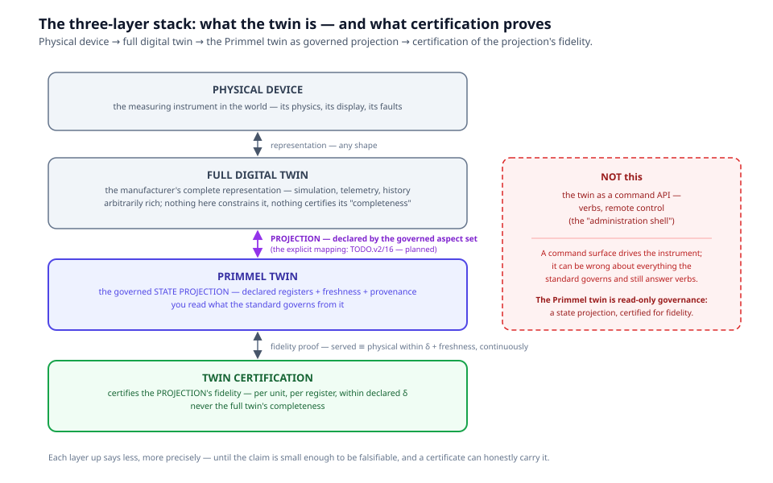
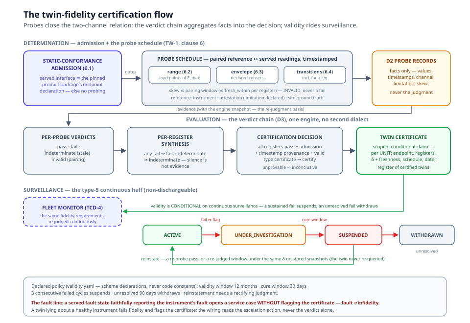

# Chapter 17 — Twin Certification

> *In this chapter:* the certification program that answers the question
> chapter 14 left open — a live twin *serves* its state, but who
> certifies that the served state is *true*? The three-layer framing
> (physical device → full digital twin → the Primmel twin as governed
> projection), the fidelity requirement model, the probe channel that
> closes the two-channel relation, the verdict chain and the twin
> certificate's scoped claim, and the surveillance regime that keeps
> the certificate honest. This chapter teaches the shipped program —
> the `oiml-twin-cert` package, its services and its gates.

---

## 17.1 The three-layer stack: what the twin *is*

Start from the device and stack upward:

- **The physical device.** A measuring instrument in the world — a load
  cell bolted into a belt weigher, with its own physics, its own
  display, its own faults.
- **The full digital twin** — the manufacturer's complete
  representation of that device, *arbitrarily rich*: physics
  simulation, telemetry, history, documentation. Any shape. Nothing in
  this program constrains it, and nothing in this program could certify
  its "completeness" — completeness against what?
- **The Primmel twin** — the tailored *projection* of what Primmel
  governs: the declared registers the Recommendation names, served with
  declared freshness and declared provenance (chapter 14 §14.3–14.4:
  the endpoint declaration, the serve bindings, `fresh_within`). The
  decisive contrast: the Primmel twin is **not a command API**. The
  industrial "administration shell" pattern (a digital twin as a set of
  verbs — *configure*, *calibrate*, *command*) exposes remote control;
  the Primmel twin is a governed **state projection**. You do not drive
  the instrument through it. You read what the standard governs from
  it.
- **Twin certification** — certifies the **projection's fidelity**:
  that the served value equals the physical state, within declared
  bounds and freshness, continuously. Never the full twin's
  completeness.

The stack reads as a narrowing of claims. Each layer up says *less*,
more precisely, until the claim is small enough to be falsifiable —
and a falsifiable claim is the only kind a certificate can honestly
carry (Volume 0, claims and falsifiability).

**Where the projection comes from.** The governed aspect set is
declared in the Recommendation packages (the serve/twin-interface
vocabulary of §14.4), and the projection layer is explicit
(TODO.v2/16): the manufacturer's full twin is related to the governed
register set by a *declared* mapping (the `map_profile` machinery of
chapters 5 and 16), the coverage report proves the projection covers
everything governed (C23 — computed, never authored), and the
product's served twin section is *derived* from the governed aspect
set plus the mapping — never hand-authored, with a byte-clean drift
guard where a mirrored copy would drift silently. The full twin's
richer anatomy shows as deliberately unmapped: the filtered richness,
never gaps. Chapter 14 §14.3 carries the worked framing on the LC-500;
the certification program of this chapter then evaluates the
projection's *fidelity* — coverage first, fidelity second.

## 17.2 The program package: a fourth publisher

The twin certification program is a Primmel package,
`primmel-packages/oiml-twin-cert/`, of a package kind introduced for
it: `kind certification_program` ●. The shape follows the
product-reference precedent of chapter 15 — a publisher related to
everything by mapping and pinned imports, composed into nothing:

- **related to the Recommendations by mapping only** —
  `maps_to { oiml-r60 }`: the metrological definitions of the served
  aspects live in the Recommendation; the program never restates them
  (kernel rule C97 checks the mapping resolves);
- **related to the product it certifies by a pinned abstract import** —
  `uses { acme-lc500@2021 }`, C83's edition-pin discipline: the
  program certifies *this* product package's twin declarations at a
  pinned edition;
- **built on the CASCO foundations by ordinary composition** —
  `requires { iso-iec-17000, iso-iec-17065, iso-iec-17025,
  iso-iec-17067 }`: the conformity-assessment vocabulary, the
  certification-body and laboratory competence requirements, and the
  scheme taxonomy;
- **composed into nothing** — no Recommendation `uses` the program;
  its requirement vocabulary never leaks into rec trees.

**Scheme type 5 — the surveillance teeth.** Against the ISO/IEC 17067
register the program self-classifies `scheme_type: type_5` ●: per-unit
certification *with surveillance*. The contrast matters: the OIML-CS's
own type 1a certifies a type sample with no surveillance and
structurally cannot say "continuously" — the register's
`surveillance.required` facet makes this program's surveillance
provisions non-dischargeable at the scheme level.

**A standalone certificate, a hard prerequisite.** The twin
certificate does not ride the instrument's type-evaluation
certificate: the type certificate certifies the *type*; the twin
certificate certifies one *unit's* serving layer (serial-scoped). But
fidelity to a broken instrument is faithful and useless, so admission
requires a **valid type certificate** for the instrument's model,
cited as provenance ● — the decision refuses otherwise.

**The governing document, TW-1.** The program publishes its own
governing document, *TW-1 — Digital-Twin Fidelity Certification
Program* (`urn:oiml:pub:cs:twin-1:2027`), as the package's
`documents/tw-1/` module ● — the same documents-`<doc>` pattern the
OIML-CS package uses for its document corpus (Volume IV, ch. 3). Every
requirement, test, register, symbol, term and form of the package
cites TW-1 by clause anchor, and a cite-integrity leg pins the
contract both ways ● (`twin-1-cite-integrity.test.ts`): every cited
anchor — exactly 3.1, 4.1–4.4, 5.1–5.5, 6.1–6.4 — exists in the
document, and every leaf section of the document is cited. TW-1's 3.1
also records the naming decision: VIML names no twin-verification kind
(2.09 and 2.12–2.14 verify the *instrument*), so the new kind is named
**twin-fidelity evaluation** — a determination activity per ISO/IEC
17000 A.3.2 with attestation per A.4.3. The OIML-CS is the program's
recorded long-term home — a category scheme inside the B 18 framework
when the OIML-CS adopts it; nothing of that migration is modelled yet.

## 17.3 The fidelity requirement model

A twin-fidelity requirement is, per served register, the conjunction
of four claims — each landing on machinery that already exists; no new
requirement kind was needed (chapter 11's validation family is
unchanged):

| TW-1 | requirement | the claim |
|---|---|---|
| 5.1 | `static-conformance` | the twin serves *exactly* the interface its certified product package declares — endpoint id, operations, payload schemas and quantity kinds, access scopes (admission; a mis-serving twin never reaches value probes) |
| 5.2 | `indication-band` | value fidelity: \|served − reference\| ≤ δ_indication at every probe point, paired within the pairing window |
| 5.3 | `freshness-declaration` | every fidelity register is served under a declared `fresh_within`; a stale value degrades the verdict to **indeterminate** — never a fail, never a silent pass; the window is inherited from the serve, never re-declared |
| 5.4 | `timestamp-provenance` | a parseable served timestamp on every register, `timestamp_fields` declared per operation (freshness is judged against the twin's *own* clock), the endpoint id bound to the certified unit's serial, every fact stamped with provenance and the definition version pin |
| 5.5 | `state-fidelity` | the served operational state *equals* the physical state at every transition — fault annunciation included |

The deviation itself is derived **once**, as the characteristic
`twin_deviation_indication` (`ocl{abs(indication - reference_indication)}`),
and the band requirement consumes it through the canonical
`accepts { verdict … op lte limit … }` shape — the same one-home
discipline as the R 60 MDLO criterion (chapter 6; INV-7's
values/facts/judgments separation). Freshness and provenance are not
re-invented either: they are the serve's `fresh_within`, the gateway's
`timestamp_fields`, and the evidence stream's provenance record,
surfaced as declaration requirements enforced by the freshness gate.

Note the normative line 5.5 draws: **a served fault state faithfully
reporting the instrument's fault is not infidelity** — it passes
fidelity and triggers service. A twin serving "healthy" over a faulted
instrument fails; a twin truthfully serving "fault" passes. The
certificate's surveillance regime (§17.6) depends on that line.

## 17.4 The probe channel: closing the two-channel relation

Fidelity is a *two-channel* relation — served channel versus
physical-side reference channel — and the continuous monitor of
chapter 14 cannot close it: the monitor's epistemic wall is deliberate
(the verdict only ever reads the served value; the
[simulated-instruments annex](../platform/02-simulated-instruments.md)
keeps the two channels apart by construction). Only a **probe** — a
paired reading of both channels at one moment — closes the relation.
That is why the program's determination half is a conformance-test
schedule, not a monitor:

- **Static-conformance admission** (TW-1 6.1) ● — the served interface
  read and compared against the pinned product package's endpoint
  declaration; every probe test depends on it.
- **The measuring-range probe** (6.2) ● — paired readings at minimum
  load and ≈25 %, 50 %, 75 %, 100 % of E_max, increasing and where the
  physics demands decreasing — the load-point discipline of the
  Recommendation's MPE test.
- **The operational-envelope probe** (6.3) ● — paired readings at the
  certified product's declared envelope corners (the rated temperature
  corners; the humidity corner only where the product declares a
  humidity class — the corner is the scheme's declaration, never an
  assumption), and return to reference conditions.
- **The operational-transitions probe** (6.4) ● — off→warming→ready,
  ready→measuring, and the fault-annunciation leg and clear, judging
  state fidelity per 5.5.

**The three reference sources, honestly declared.** The physical side
of a pair arrives by exactly one of three channels, recorded on the
evidence with its register citation (the variable `provenance` facet
●, kernel rule C99):

1. **`reference_instrument`** — PREFERRED: a traceable reference,
   cited by equipment-register id with its calibration trace.
2. **`observer_attestation`** — a verification officer reads the
   instrument's own display into the probe form (attestation per
   ISO/IEC 17000 A.4.3), admitted **with the declared traceability
   limitation**: attestation-only evidence proves *twin ≡ display*,
   not *twin ≡ mass* — the reference IS the EUT's own indication,
   never an independent physical standard. The limitation is declared
   data, carried on the evidence and printed on the certificate —
   never silently upgraded. And the officer is not self-certifying:
   attestation evidence from an officer without the citing lab's
   ISO/IEC 17025 6.2.6 `verification_attestation` authorization is
   **inadmissible** at decision time — it grounds no certification
   decision, and it is never a fidelity fail of the twin ●.
3. **`sim_ground_truth`** — the acceptance environment's ground truth,
   never a production channel.

**The pairing window.** Each pair is timestamped on both sides — the
twin's *own* served timestamp and the reference observation timestamp —
and the pairing skew is derived once at evidence capture. A pair whose
skew exceeds the declared window (at most the register's
`fresh_within`, declared per register — never a platform constant) is
**INVALID**: the probe's setup was wrong, never a fail of the twin ●.

Each probe execution lands in the D2 probe form — served value and
timestamp, reference value and observation timestamp, channel,
register citation, carried limitation, pairing skew. **Facts only**:
the fidelity judgment is the verdict chain's, never the form's.

> **The pilot values are declared examples.** The pilot campaign
> certifies the fictional ACME LC-500 load cell (chapter 15): δ = 0.1
> kg — the scheme's declared pilot parameter (25× the good cell's
> noise σ, so the faithful twin passes cleanly and the sim's 0.25 kg
> lying-twin offset is unmistakable), pairing windows 5 s (indication)
> and 1 s (state) from the certified product's serves, the `mtl_f_001`
> deadweight force standard and officer `p_weber` as declared register
> citations. These are the scheme's *declarations*, pinned in test —
> not measured fact about any real device.

## 17.5 The verdict chain and the twin certificate

Facts become judgments through a four-level chain on the existing
verdict engine — INV-9's one dialect, the same cached-AST OCL the lab
and the monitor run ●:

1. **Facts (D2)** — the probe pairs: reference value, served value,
   both timestamps, the pairing skew, the channel provenance.
2. **Per-probe verdicts (D3)** — pass / fail / indeterminate (stale) /
   invalid (pairing violated), computed at probe time and stored with
   the full engine snapshot.
3. **Per-register synthesis (D3)** — any fail ⇒ fail; no fail but any
   indeterminate ⇒ indeterminate (*silence is not evidence*); every
   scheduled point judged pass ⇒ pass; otherwise **incomplete** — an
   invalid run voids the point; missing and void points ground
   nothing.
4. **The certification decision (D3)** — all registers pass, plus the
   static-conformance admission, the timestamp-provenance declaration,
   and the hard type-certificate prerequisite ⇒ **certify**. Any
   register fail ⇒ **refuse**. Anything unprovable ⇒ **inconclusive**
   — never a silent certify.

Re-judgment follows INV-5 ●: a stored probe verdict is re-judged
against a tightened δ from its *own* snapshot — zero re-probing,
evidence appends, never rewrites.

**The certificate's claim** is scoped tight enough to be falsifiable —
each clause citing its evidence ● (`twin-certificate.service.ts`
renders it from the declared template):

> For instrument ⟨model/serial⟩, the twin served at endpoint
> ⟨endpoint-id⟩ via operations ⟨op-list⟩ reflects the physical state
> of registers ⟨aspect-list⟩ within tolerance ⟨δ per register⟩ and
> freshness ⟨fresh_within per register⟩, verified by probe schedule
> ⟨schedule-id⟩ on ⟨date⟩ (report ⟨id⟩), with served-timestamp
> provenance declared. Validity is CONDITIONAL: continuous
> surveillance per the declared monitor; a sustained fail suspends;
> an unresolved fail withdraws.

The certificate is per-UNIT (the serial is on the claim), numbered
`TW-1/{edition}-T5-{authority}-{year2}.{seq}` — TW-1 the governing
document, T5 the scheme type — and its print rows resolve by name from
the decision's claim context: the endpoint identity, the certified
operations and registers, δ and freshness per register, the schedule,
the verification date, the fidelity report, the surveillance monitor,
the type-certificate prerequisite, the probe channels used — plus the
traceability limitation, printed only when attestation evidence was
used. The decision also flips the product passport's
`live_compliance_status` (chapter 14 §14.6) ●, and the unit enters
the **register of certified twins** maintained by the program ●.

## 17.6 Surveillance and suspension: the type-5 teeth

A probe schedule certifies a point in time; the program's claim is
*continuously*. The duality is forced, not chosen: scheduled probes
close the two-channel relation at certification (and re-close it on
the validity calculus's re-probe triggers), and continuous
surveillance watches the served channel between probes — the same
fidelity requirements re-judged by the compliance-engine monitor of
chapter 14 §14.5, the type-5 scheme's non-dischargeable half.

Post-certification infidelity walks the **core certificate machine** —
one machine, no second dialect ● — and the wiring reads the declared
policy (`evaluation/validity.yaml`), never code constants:

| trigger | action | state |
|---|---|---|
| monitor fail on a fidelity requirement | `flag_certificate` + `open_service_case` (deduped while open) ⇒ `investigate` | UNDER_INVESTIGATION |
| case unresolved past the **cure window** (declared: 30 days), or **3 consecutive** failed cycles | `suspend` | SUSPENDED — decertified in fact; the passport's `live_compliance_status` flips |
| rectified — a re-probe pass, or a re-judged window under the *same* δ returning pass on stored snapshots | `reinstate` | ACTIVE |
| unresolved past the withdrawal threshold (declared: 90 days) | `withdraw` | WITHDRAWN — the register drops the unit |

The fault leg is the degraded-mode special case, wired by escalation
*action*, never by verdict alone: a served `fault` state opens a
service case **without flagging the certificate** — the twin
truthfully reported the instrument's fault (§17.3's normative line) —
while a lie about a healthy instrument flags it. The declared policy
records exactly that (`fault_service_case_only: true`).

## 17.7 Status: shipped now, and the TBD backlog

Shipped and gate-proven ●:

- the `oiml-twin-cert` package — the first `certification_program`
  package, `primmel check` clean at all four strictness levels, the
  layer↔manifest projection pinned (`twin-cert-package.test.ts`);
- the TW-1 governing document with the cite-integrity leg
  (`twin-1-cite-integrity.test.ts`);
- the probe flow, service-level against the live sim — real gateway,
  real pairing, the committed requirement layer judged end-to-end
  (`twin-fidelity-probe.test.ts`);
- the verdict chain and the D2 twin-fidelity test report
  (`twin-fidelity-chain.test.ts`), the certificate issuance and the
  full suspension state-walk (`twin-certificate.test.ts`).

**Landed ● (2026-07-28):**

- **TCD-4 — the surveillance monitor binding ●.** The fleet monitor
  declaration (`primmel-packages/oiml-twin-cert/model/monitors.prl` —
  triggers `every 1h` + `on signal certificate_registered` +
  `on change sample.test_context.op_state`, the `applicable` fidelity
  selector, the emit sinks, the escalation set) with the codec loop into
  `data/oiml-twin-cert/model/monitors.yaml`; the register-driven
  deployment binding (`browser/src/monitor/twin-cert-deployment.ts`) —
  the certified-twins register drives the watch set (ACTIVE ∪
  UNDER_INVESTIGATION; SUSPENDED/WITHDRAWN drop); the tightened-δ fleet
  re-judgment SOP (`rejudgeFleetWindow`) on stored snapshots with ZERO
  gateway calls, and the stale-original pin (null-valued facts rejudge
  indeterminate, never flip). The fault-state rule rides the binding
  (the grammar admits verdict outcomes only — `on: 'always', when
  op_state = fault ⇒ open_service_case`, no flag), with the pin at the
  declaration site, the deployment header, `layer.yaml`, and
  AGENTS.d/12. `monitor_id` is bound: parsed from `validity.yaml` and
  cross-checked at issuance. (`twin-cert-surveillance.test.ts`,
  8 legs.)
- **TCD-5 — the four-scenario acceptance ●.** The teeth, service-level
  against the live sim (`twin-cert-acceptance.test.ts`, 5 legs,
  skip-guarded without it): faithful ⇒ the full chain — admission,
  probes (deviation ≤ δ with pair-skew evidence), aggregation,
  issuance, register entry, passport `IN TOLERANCE`; lying (the 0.25 kg
  knob, 2.5× δ) ⇒ per-probe fail with the deviation evidence on record
  (admission correctly passes — a value-lie is not a contract
  violation; the probe is the teeth) ⇒ decision refuse, no certificate;
  stale (30 s served lag vs the 5 s window, via `timestamp_fields` —
  served time, never receipt) ⇒ indeterminate at every point,
  inconclusive decision, no issuance — never a fail, never a silent
  pass; post-certification ⇒ the fault leg opens service cases with
  ZERO certificate flags (the twin truthfully reported the fault) while
  the lie leg drives flag ⇒ investigate ⇒ three consecutive fails ⇒
  suspend ⇒ cure via same-δ rejudge (zero gateway calls) ⇒ reinstate,
  and recurrence ⇒ cure-window suspend ⇒ withdraw, register empty.
  The sizing pin checks δ = 0.1 kg against the knob (2.5×) and the
  window (6×) against the sim's own declarations.

## 17.8 Summary

- The stack: physical device → full digital twin (any shape) → the
  Primmel twin as a **governed state projection** — declared registers,
  freshness, provenance; never a command API — → twin certification of
  the **projection's fidelity**, never the full twin's completeness.
- The program is a fourth publisher (`kind certification_program`),
  mapped to R 60, pinned to the product it certifies, type-5 against
  ISO/IEC 17067 — surveillance is constitutive, not optional.
- A fidelity requirement per register: value band (the one-home
  deviation characteristic), freshness (inherited, never re-declared),
  provenance (the twin's own clock, declared), state fidelity (a true
  fault is not infidelity).
- The probe channel closes the two-channel relation the monitor
  cannot: three declared sources, the attestation limitation carried
  as data, the pairing window with INVALID-never-fail semantics.
- The verdict chain aggregates per-probe → per-register → decision on
  the existing engine; the certificate claims a scoped, conditional
  relation; post-certification infidelity walks the core certificate
  machine on declared policy.

*Next: [Volume II — OIML Core](../oiml-core/README.md): the measurement
vocabulary and the subject chain the OIML models are built from.*
